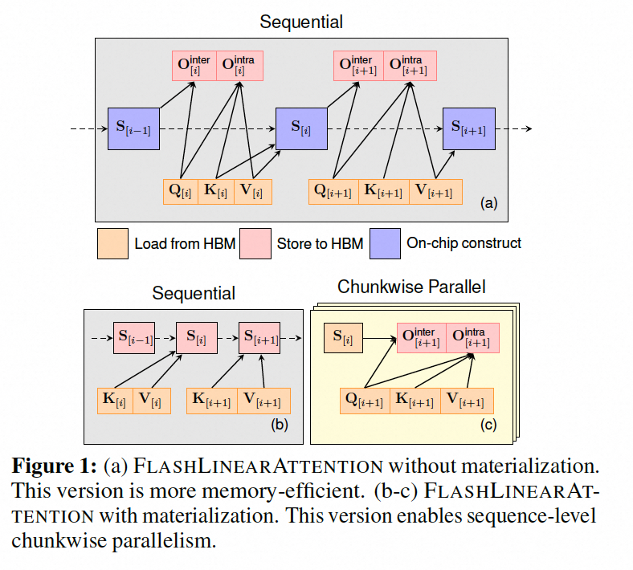
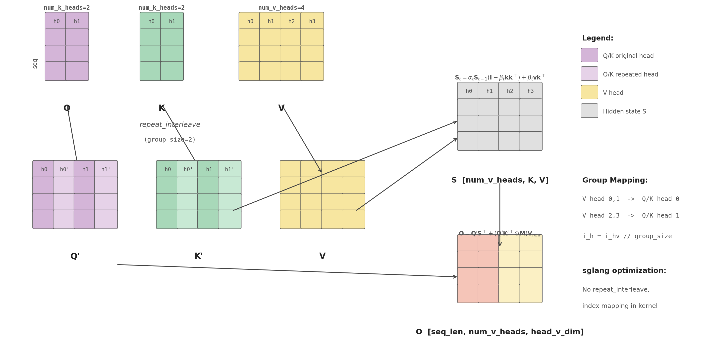

# Qwen3.5 GDN(Gated Delta Networks) 原理与代码分析

> 论文: [Gated Delta Networks: Improving Mamba2 with Delta Rule](https://arxiv.org/abs/2412.06464)
>
> 代码: [flash-linear-attention](https://github.com/sustcsonglin/flash-linear-attention)
>
> 推荐阅读: [Songlin Yang 的 DeltaNet 系列博客](https://sustcsonglin.github.io/blog/2024/deltanet-2/) | [苏剑林：线性注意力简史——从模仿、创新到反哺](https://kexue.fm/archives/11033)

Qwen3.5 系列模型采用了 GDN 结构(Gated Delta Networks)，笔者在其中从事 GDN Kernel 的训推优化工作。本文将结合 flash-linear-attention 中的 GDN 代码实现以及工作中的优化经验，从算法原理和代码层面详细分析 GDN 的实现细节。

文章前半部分介绍 GDN 的数学原理和公式推导，后半部分结合代码逐步解析实现。如果对原理已有了解或只关注代码实现，可以直接从[第 4 节](#4-模型调用方式以-qwen35-gateddeltanet-为例)开始阅读(ps: 直接看代码更容易理解)。

## 目录

- [1. 概述](#1-概述)
  - [从标准 Attention 到 Linear Attention](#从标准-attention-到-linear-attention)
  - [GDN: Gated Delta Networks](#gdn-gated-delta-networks)
- [2. 前置知识](#2-前置知识)
  - [2.1 线性注意力与 Mamba2](#21-线性注意力与-mamba2)
  - [2.2 DeltaNet: 带 Delta 规则的线性注意力](#22-deltanet-带-delta-规则的线性注意力)
- [3. Gated Delta Rule](#3-gated-delta-rule)
  - [3.1 公式定义](#31-公式定义)
  - [3.2 直觉理解](#32-直觉理解)
  - [3.3 硬件高效的分块并行训练算法](#33-硬件高效的分块并行训练算法)
- [4. 模型调用方式：以 Qwen3.5 GatedDeltaNet 为例](#4-模型调用方式以-qwen35-gateddeltanet-为例)
  - [4.1 整体架构](#41-整体架构)
  - [4.2 初始化与参数定义](#42-初始化与参数定义)
  - [4.3 前向传播流程](#43-前向传播流程)
- [5. Chunk-wise 算法代码解析](#5-chunk-wise-算法代码解析)
  - [5.1 前向传播总流程](#51-前向传播总流程)
  - [5.2 累积门控求和 chunk_local_cumsum](#52-累积门控求和-chunk_local_cumsum)
  - [5.3 计算缩放点积 chunk_scaled_dot_kkt_fwd](#53-计算缩放点积-chunk_scaled_dot_kkt_fwd)
  - [5.4 求解下三角系统 solve_tril](#54-求解下三角系统-solve_tril)
  - [5.5 计算 W 和 U (recompute_w_u_fwd)](#55-计算-w-和-u-recompute_w_u_fwd)
  - [5.6 隐状态递推 chunk_gated_delta_rule_fwd_h](#56-隐状态递推-chunk_gated_delta_rule_fwd_h)
  - [5.7 计算输出 chunk_fwd_o](#57-计算输出-chunk_fwd_o)
  - [5.8 反向传播](#58-反向传播)
- [6. Recurrent 算法代码解析](#6-recurrent-算法代码解析)
  - [6.1 Fused Recurrent 前向](#61-fused-recurrent-前向)
  - [6.2 Kernel 实现](#62-kernel-实现)
- [7. 总结](#7-总结)

## 1. 概述

### 从标准 Attention 到 Linear Attention

标准 Attention 的计算复杂度为 $O(L^2 d)$ ，IO 复杂度为 $O(L^2 + Ld)$ 。Flash Attention 通过 tiling 将 IO 复杂度优化为 $O(L^2 d^2 M^{-1})$ （ $M$ 为 SRAM 大小），但计算复杂度仍为 $O(L^2 d)$ 。当序列长度增大时，算术强度（ops/bytes）超过硬件的计算-带宽比，kernel 从 memory-bound 转为 compute-bound。以 H100 SXM bf16 dense 为例， $\frac{BW_{compute}}{BW_{memory}} = \frac{989 \times 10^{12}}{3.35 \times 10^{12}} \approx 295$ flops/byte，序列长度超过约 1024-2048 后 Flash Attention 逐渐进入 compute-bound。

Linear Attention 将标准 Attention 的 softmax 替换为近似核函数，并改变 Q/K/V 的计算顺序（先算 $K^T V$ 再乘 $Q$ ），将复杂度从 $O(L^2 d)$ 降为 $O(L d^2)$ 。在自回归场景下，Linear Attention 可以转化为 RNN 递推形式，每步维护一个固定大小的隐状态矩阵（详见 2.1 节）。递推形式每步串行且无法利用 tensor core，因此训练时采用 chunkwise 分块并行算法兼顾效率（详见 2.1 节 分块并行训练）。随着序列长度增加，Flash Attention 的 $O(L^2 d)$ 计算量导致 kernel 逐渐进入 compute-bound，而 Linear Attention 的 $O(L d^2)$ 复杂度优势开始显现。根据 FlashLinearAttention 的实验，GLA 在序列长度 1K 时已经比 FlashAttention-2 更快，序列越长优势越明显。不过具体的性能交叉点取决于模型配置（head_dim、head 数量）、算法复杂度（如 GDN 的 WY 分解比 GLA 多几步计算）和硬件型号。

### GDN: Gated Delta Networks

原始 Linear Attention 在模型效果上远弱于标准 Transformer，根本原因是固定大小的隐状态容量有限，导致"记忆碰撞"，且缺乏遗忘机制（详见 2.1 节中的分析）。为解决这个问题，有以下两种改进方向：

- **Mamba2/GLA**：引入标量门控衰减 $\alpha_t$ ，可以快速擦除全局记忆，但不能选择性更新单个键值对。
- **DeltaNet**：使用 delta 规则精确替换特定键值对，但缺乏全局记忆的快速清除机制。

**Gated Delta Networks (GDN)** 将两者结合，在线性递推的基础上同时引入门控衰减 $\alpha$ 和 delta 更新强度 $\beta$ ，兼具全局遗忘和定向更新能力。代价是 chunkwise 算法涉及 WY 分解、下三角求解等额外步骤，实现复杂度较高。各方法的数学推导见第 2 节和第 3 节。

## 2. 前置知识

### 2.1 线性注意力与 Mamba2

给定长度为 $L$ 的输入序列，每个时间步 $t$ 通过线性投影产生三个列向量：query $\boldsymbol{q}_t \in \mathbb{R}^{d_k}$ 、key $\boldsymbol{k}_t \in \mathbb{R}^{d_k}$ 、value $\boldsymbol{v}_t \in \mathbb{R}^{d_v}$ ，其中 $d_k$ 和 $d_v$ 是**单个注意力头**的 dim 维度，即 `head_dim`。为简洁起见，以下公式均针对单个注意力头推导。本文中小写粗体字母均表示列向量， $\boldsymbol{k}_t^{\top}$ 表示转置后的行向量。**线性注意力**将标准 attention 的 softmax 替换为线性核函数后，可以表述为如下递推公式：

$$
\mathbf{S}_t = \mathbf{S}_{t-1} + \boldsymbol{v}_t \boldsymbol{k}_t^{\top} \in \mathbb{R}^{d_v \times d_k}, \quad \boldsymbol{o}_t = \mathbf{S}_t \boldsymbol{q}_t \in \mathbb{R}^{d_v}

$$

其中 $\mathbf{S}_t$ 是隐状态矩阵，累积了前 $t$ 步的键值对信息。补充下关于向量乘法的两种形式：

- **外积**（列向量 $\times$ 行向量）： $\boldsymbol{v}_t \boldsymbol{k}_t^{\top}$ 是 $(d_v \times 1) \times (1 \times d_k) = d_v \times d_k$ 的矩阵。
- **内积**（行向量 $\times$ 列向量）： $\boldsymbol{k}_j^{\top} \boldsymbol{q}_t$ 是 $(1 \times d_k) \times (d_k \times 1) = 1 \times 1$ 的标量，即向量点积 $\sum_{i} k_{j,i} \cdot q_{t,i}$ 。

上面的递推形式适合逐 token 推理，但训练时需要处理整个序列。为了理解 linear attention 与标准 attention 的关系，以及后续为什么需要 chunkwise 算法，先将递推公式展开为矩阵并行形式。将 $\mathbf{S}_t = \sum_{j=1}^{t} \boldsymbol{v}_j \boldsymbol{k}_j^{\top}$ 代入输出公式：

$$
\boldsymbol{o}_t = \mathbf{S}_t \boldsymbol{q}_t = \left(\sum_{j=1}^{t} \boldsymbol{v}_j \boldsymbol{k}_j^{\top}\right) \boldsymbol{q}_t = \sum_{j=1}^{t} \boldsymbol{v}_j (\boldsymbol{k}_j^{\top} \boldsymbol{q}_t) = \sum_{j=1}^{t} (\boldsymbol{q}_t^{\top} \boldsymbol{k}_j) \boldsymbol{v}_j

$$

逐步解释：

- 代入 $\mathbf{S}_t$ 展开式后， $(\sum \boldsymbol{v}_j \boldsymbol{k}_j^{\top}) \boldsymbol{q}_t$ 可以将 $\boldsymbol{q}_t$ 分配到求和内部的每一项，即 $\sum (\boldsymbol{v}_j \boldsymbol{k}_j^{\top}) \boldsymbol{q}_t$ 。这类似于实数的 $(a + b) \times c = ac + bc$ ，对矩阵乘法同样成立。
- $\boldsymbol{k}_j^{\top} \boldsymbol{q}_t$ 是标量（如上文内积定义），标量与向量相乘可交换位置： $\boldsymbol{v}_j \cdot s = s \cdot \boldsymbol{v}_j$ 。同时内积满足交换律 $\boldsymbol{k}_j^{\top} \boldsymbol{q}_t = \boldsymbol{q}_t^{\top} \boldsymbol{k}_j$ （因为 $\sum_i k_i q_i = \sum_i q_i k_i$ ）。因此 $\boldsymbol{v}_j (\boldsymbol{k}_j^{\top} \boldsymbol{q}_t) = (\boldsymbol{q}_t^{\top} \boldsymbol{k}_j) \boldsymbol{v}_j$ 。

最终形式 $\sum (\boldsymbol{q}_t^{\top} \boldsymbol{k}_j) \boldsymbol{v}_j$ 在结构上与标准 attention 的加权求和一致，由此可将所有时间步写成矩阵并行形式：

$$
\mathbf{O} = (\mathbf{Q} \mathbf{K}^{\top} \odot \mathbf{M}) \mathbf{V} \in \mathbb{R}^{L \times d_v}

$$

其中 $\mathbf{M}$ 是因果掩码（ $\mathbf{M}_{ij} = 1$ 当 $i \geq j$ ，否则为 $0$ ）。可以看出 Linear attention 与标准 attention 的区别在于注意力权重的计算方式：标准 attention 使用 $\text{softmax}(\mathbf{Q}\mathbf{K}^{\top})$ ，而 linear attention 直接使用 $\mathbf{Q}\mathbf{K}^{\top}$ （或通过核函数 $\phi(\boldsymbol{q})^{\top} \phi(\boldsymbol{k})$ 近似）。正是因为去掉了非线性的 softmax，linear attention 才能等价地写成上面的递推形式 $\mathbf{S}_t = \mathbf{S}_{t-1} + \boldsymbol{v}_t \boldsymbol{k}_t^{\top}$ ，而标准 attention 无法做到这一点。

但这个并行形式的复杂度仍是 $O(L^2 d)$ ，因为因果掩码 $\mathbf{M}$ 通过 element-wise 乘法作用于 $\mathbf{Q}\mathbf{K}^{\top}$ ，无法利用矩阵乘法结合律先算 $\mathbf{K}^{\top} \mathbf{V}$ （ $\mathbf{Q}(\mathbf{K}^{\top} \mathbf{V})$ 是 $O(Ld^2)$ 但不含因果掩码）。而递推形式虽然是 $O(Ld^2)$ ，但每步依赖上一步结果，无法跨时间步并行，GPU 利用率低。因此需要后文介绍的 chunkwise 形式来兼顾训练效率和线性复杂度。

回到模型效果上，原始线性注意力在语言建模任务上显著弱于标准 Transformer。主要原因是隐状态 $\mathbf{S}_t \in \mathbb{R}^{d_v \times d_k}$ 的容量有限：所有历史 token 的信息被压缩到一个固定大小的矩阵中，当序列长度远超 $d_k \times d_v$ 时，不同 token 的键值对开始相互干扰，即"记忆碰撞"（memory collision）。同时，缺乏遗忘机制意味着早期的噪声信息永远不会被清除，进一步降低了检索精度。为此，**Mamba2/GLA** 引入了数据相关的衰减项来选择性遗忘历史信息：

$$
\mathbf{S}_t = \alpha_t \mathbf{S}_{t-1} + \boldsymbol{v}_t \boldsymbol{k}_t^{\top}, \quad \boldsymbol{o}_t = \mathbf{S}_t \boldsymbol{q}_t

$$

其中 $\alpha_t \in (0, 1)$ 是数据相关的标量衰减。下面继续展开递推形式，先展开 $\mathbf{S}_t$ ，反复代入递推公式：

$$
\mathbf{S}_t = \alpha_t \mathbf{S}_{t-1} + \boldsymbol{v}_t \boldsymbol{k}_t^{\top} = \alpha_t(\alpha_{t-1} \mathbf{S}_{t-2} + \boldsymbol{v}_{t-1} \boldsymbol{k}_{t-1}^{\top}) + \boldsymbol{v}_t \boldsymbol{k}_t^{\top} = \cdots = \sum_{j=1}^{t} \left(\prod_{\tau=j+1}^{t} \alpha_\tau\right) \boldsymbol{v}_j \boldsymbol{k}_j^{\top}

$$

定义累积衰减乘积 $\gamma_j = \prod_{i=1}^{j} \alpha_i$ ，则从位置 $j$ 到位置 $t$ 的衰减系数为：

$$
\prod_{\tau=j+1}^{t} \alpha_\tau = \frac{\gamma_t}{\gamma_j}

$$

这是因为 $\gamma_t = \alpha_1 \cdot \alpha_2 \cdots \alpha_j \cdot \alpha_{j+1} \cdots \alpha_t = \gamma_j \cdot \prod_{\tau=j+1}^{t} \alpha_\tau$ ，两边除以 $\gamma_j$ 即得。代入后：

$$
\mathbf{S}_t = \sum_{j=1}^{t} \frac{\gamma_t}{\gamma_j} \boldsymbol{v}_j \boldsymbol{k}_j^{\top}

$$

再代入 $\boldsymbol{o}_t = \mathbf{S}_t \boldsymbol{q}_t$ （与前文无衰减版本的推导相同，将 $\boldsymbol{q}_t$ 分配进求和并交换标量位置）：

$$
\boldsymbol{o}_t = \sum_{j=1}^{t} \frac{\gamma_t}{\gamma_j} (\boldsymbol{q}_t^{\top} \boldsymbol{k}_j) \boldsymbol{v}_j

$$

写成矩阵形式， $\mathbf{O}$ 的第 $t$ 行就是上式对所有 $j \leq t$ 的求和，即：

$$
\mathbf{O} = ((\mathbf{Q} \mathbf{K}^{\top}) \odot \Gamma) \mathbf{V}

$$

其中 $\Gamma_{ij} = \frac{\gamma_i}{\gamma_j}$ （当 $i \geq j$ ，否则为 0）是衰减感知的因果掩码。与无衰减的 linear attention 对比，区别仅在于因果掩码从 $\mathbf{M}$ （0/1 掩码）变成了 $\Gamma$ （带衰减权重的掩码）。

**递推形式的局限**

递推形式有两个主要问题使其不适合直接用于训练：

1. **显存问题**：如果使用 Pytorch 的 autograd，每个时间步的 $\mathbf{S}_t$ 都需要保存用于反向传播， $L$ 个 $d \times d$ 的矩阵会消耗大量显存。即使手写反向传播（在 recurrent 反向循环中重计算 $\mathbf{S}_t$ ），也面临第二个问题。
2. **并行度和 tensor core 利用率**：recurrent update $\mathbf{S}_t = \mathbf{S}_{t-1} + \boldsymbol{v}_t \boldsymbol{k}_t^{\top}$ 的核心操作是**外积**加上 element-wise 加法。外积 $\boldsymbol{v}_t \boldsymbol{k}_t^{\top}$ （其中 $\boldsymbol{v}_t \in \mathbb{R}^{d_v}$ , $\boldsymbol{k}_t \in \mathbb{R}^{d_k}$ ）严格来说是 $(d_v, 1) \times (1, d_k)$ 的矩阵乘法，结果是一个 rank-1 的 $d_v \times d_k$ 矩阵，即 $[\boldsymbol{v}_t \boldsymbol{k}_t^{\top}]_{ij} = v_{t,i} \cdot k_{t,j}$ 。虽然形式上是"矩乘"，但因为其中一个维度为 1，实际等价于广播逐元素乘法，无法有效利用 tensor core（tensor core 要求参与运算的矩阵块为 $m \times k \times n$ 形式，如 16x16x16，rank-1 的退化情况无法饱和 tensor core 的计算单元）。后面的 $\mathbf{S}_{t-1} + \ldots$ 也是 element-wise 加法。因此 recurrent 循环中的所有操作本质上都是逐元素的，只能使用 CUDA core。以 A100 为例，tensor core 半精度矩阵乘法的峰值吞吐是 CUDA core element-wise 操作的 16 倍。因此纯 recurrent 训练的 GPU 利用率很低。
3. **串行依赖**： $\mathbf{S}_t$ 依赖 $\mathbf{S}_{t-1}$ ，序列方向完全串行，无法利用序列维度的并行性。

**分块并行训练**

为解决上述问题，使用了分块并行形式，即 **chunkwise 算法**。将输入和输出分为大小为 $C$ 的 chunk，每个 chunk 的输出基于前一个 chunk 的最终状态和当前 chunk 的 Q/K/V 块。chunkwise 算法是**精确算法（exact algorithm）**，chunk size 不影响输出的数值结果：当 $C=1$ 时等价于 recurrent form，当 $C=L$ 时等价于 parallel form。整体复杂度为 $O(L d^2 + L C d)$ ，在 $C$ 固定时对序列长度 $L$ 是线性的。通常 $C$ 取 64、128 或 256，以此在 chunk 间递推的串行开销和 chunk 内并行的 tensor core 利用率之间取得平衡。


图片来源: [FlashLinearAttention](https://arxiv.org/abs/2312.06635)。

下面推导分块公式。记号约定：下标 $[t]$ 表示第 $t$ 个 chunk，上标 $r$ 表示 chunk 内的第 $r$ 个位置（ $r = 1, \ldots, C$ ）， $\mathbf{S}_{[t]}$ 是第 $t$ 个 chunk 开始时的隐状态， $\gamma^r = \prod_{i=1}^{r} \alpha^i$ 是 chunk 内从位置 1 到位置 $r$ 的累积衰减（为简洁，省略 chunk 下标 $[t]$ 和全局偏移）。

**隐状态 S 递推**：从单步递推公式 $\mathbf{S}_r = \alpha_r \mathbf{S}_{r-1} + \boldsymbol{v}_r \boldsymbol{k}_r^{\top}$ 出发，将 chunk 内所有位置展开：

$$
\mathbf{S}_{[t+1]} = \mathbf{S}_C = \alpha_C \mathbf{S}_{C-1} + \boldsymbol{v}_C \boldsymbol{k}_C^{\top} = \cdots = \left(\prod_{i=1}^{C} \alpha_i\right) \mathbf{S}_{[t]} + \sum_{r=1}^{C} \left(\prod_{i=r+1}^{C} \alpha_i\right) \boldsymbol{v}_r \boldsymbol{k}_r^{\top}

$$

利用 $\gamma^C = \prod_{i=1}^{C} \alpha_i$ 和 $\prod_{i=r+1}^{C} \alpha_i = \gamma^C / \gamma^r$ ：

$$
\mathbf{S}_{[t+1]} = \gamma^C \mathbf{S}_{[t]} + \sum_{r=1}^{C} \frac{\gamma^C}{\gamma^r} \boldsymbol{v}_r \boldsymbol{k}_r^{\top}

$$

将 $\gamma^C / \gamma^r$ 吸收到 $\boldsymbol{k}_r$ 中得到 $\overrightarrow{\boldsymbol{k}_r} = (\gamma^C / \gamma^r) \boldsymbol{k}_r$ ，写成矩阵形式：

$$
\mathbf{S}_{[t+1]} = \overrightarrow{\mathbf{S}_{[t]}} + \mathbf{V}_{[t]}^{\top} \overrightarrow{\mathbf{K}_{[t]}}

$$

其中 $\overrightarrow{\mathbf{S}_{[t]}} = \gamma^C \mathbf{S}_{[t]}$ 。这里 $\mathbf{V}_{[t]}^{\top} \overrightarrow{\mathbf{K}_{[t]}}$ 就是 chunk 内所有位置的外积之和（ $\sum_r \boldsymbol{v}_r \overrightarrow{\boldsymbol{k}_r}^{\top}$ ），其中 $\mathbf{V}_{[t]} \in \mathbb{R}^{C \times d_v}$ ， $\overrightarrow{\mathbf{K}_{[t]}} \in \mathbb{R}^{C \times d_k}$ 。

**输出 O 计算**：类似地，chunk 内位置 $r$ 的输出 $\boldsymbol{o}_r = \mathbf{S}_r \boldsymbol{q}_r$ ，将 $\mathbf{S}_r$ 展开后拆为两部分：

$$
\boldsymbol{o}_r = \gamma^r \mathbf{S}_{[t]} \boldsymbol{q}_r + \sum_{j=1}^{r} \frac{\gamma^r}{\gamma^j} (\boldsymbol{q}_r^{\top} \boldsymbol{k}_j) \boldsymbol{v}_j

$$

前半部分是 inter-chunk，后半部分是 intra-chunk。

- **inter-chunk**：将 $\gamma^r$ 吸收到 $\boldsymbol{q}_r$ 中得到 $\overleftarrow{\boldsymbol{q}_r} = \gamma^r \boldsymbol{q}_r$ ，矩阵形式为 $\overleftarrow{\mathbf{Q}_{[t]}} \mathbf{S}_{[t]}^{\top}$
- **intra-chunk**： $\gamma^r / \gamma^j$ 正好是 $\Gamma_{[t]}$ 矩阵的第 $(r, j)$ 个元素，矩阵形式为 $(\mathbf{Q}_{[t]} \mathbf{K}_{[t]}^{\top} \odot \Gamma_{[t]}) \mathbf{V}_{[t]}$

合并：

$$
\mathbf{O}_{[t]} = \overleftarrow{\mathbf{Q}_{[t]}} \mathbf{S}_{[t]}^{\top} + (\mathbf{Q}_{[t]} \mathbf{K}_{[t]}^{\top} \odot \Gamma_{[t]}) \mathbf{V}_{[t]}

$$

以上就是 chunkwise 算法的两个核心公式：**隐状态 S 递推**和**输出 O 计算**。整个算法按 chunk 顺序（ $t = 0, 1, 2, \ldots$ ）执行，每个 chunk 做两件事：

1. **隐状态 S 递推**： $\mathbf{S}_{[t+1]} = \overrightarrow{\mathbf{S}_{[t]}} + \mathbf{V}_{[t]}^{\top} \overrightarrow{\mathbf{K}_{[t]}}$ 。chunk 间串行（ $\mathbf{S}_{[t+1]}$ 依赖 $\mathbf{S}_{[t]}$ ），但串行步数只有 $L/C$ 步而非 $L$ 步。涉及 $d_v \times d_k$ 的矩阵运算，单步复杂度 $O(Cd^2)$ 。
2. **输出 O 计算**： $\mathbf{O}_{[t]} = \overleftarrow{\mathbf{Q}_{[t]}} \mathbf{S}_{[t]}^{\top} + (\mathbf{Q}_{[t]} \mathbf{K}_{[t]}^{\top} \odot \Gamma_{[t]}) \mathbf{V}_{[t]}$ 。chunk 内完全并行。inter-chunk 部分（ $\overleftarrow{\mathbf{Q}} \mathbf{S}^{\top}$ ）是矩阵乘法 $O(Cd^2)$ ；intra-chunk 部分（ $(\mathbf{Q}\mathbf{K}^{\top} \odot \Gamma) \mathbf{V}$ ）是 $C \times C$ 的注意力矩阵乘法 $O(C^2 d)$ ，可以充分利用 tensor core。

因此 chunkwise 算法在训练效率和线性复杂度之间取得了平衡。后文第 5 节的代码解析就是对这两个公式（以及 GDN 扩展后的版本）的逐步实现。

上面的推导中出现了箭头符号，这里展开解释。箭头表示将衰减系数"吸收"到向量中，方向代表衰减的参考点：

- **左箭头** $\overleftarrow{\cdot}$ **（向 chunk 首位衰减）**：位置 $r$ 的向量乘以从 chunk 开头到位置 $r$ 的累积衰减 $\gamma_{[t]}^r$ 。位置越靠后（ $r$ 越大）， $\gamma_{[t]}^r$ 越小（因为每多乘一个 $\alpha < 1$ ），即越远离 chunk 开头的位置衰减越多。一般用于 q，因为 q 需要与 chunk 之前的历史状态 $\mathbf{S}_{[t]}$ 交互，距离越远衰减越大，即 $\overleftarrow{\boldsymbol{q}_{[t]}^r} = \gamma_{[t]}^r \boldsymbol{q}_{[t]}^r$ 。
- **右箭头** $\overrightarrow{\cdot}$ **（向 chunk 末位衰减）**：位置 $r$ 的向量乘以从位置 $r$ 到 chunk 末尾的累积衰减 $\gamma_{[t]}^C / \gamma_{[t]}^r$ 。位置越靠前（ $r$ 越小），衰减越多，因为它距离 chunk 末尾越远。一般用于 k，因为 k 的贡献要传递到 chunk 末尾的隐状态 $\mathbf{S}_{[t+1]}$ ，越早的 k 经历越多衰减，即 $\overrightarrow{\boldsymbol{k}_{[t]}^r} = \frac{\gamma_{[t]}^C}{\gamma_{[t]}^r} \boldsymbol{k}_{[t]}^r, \quad \overrightarrow{\mathbf{S}_{[t]}} = \gamma_{[t]}^C \mathbf{S}_{[t]}$。其中 $\overrightarrow{\mathbf{S}_{[t]}}$ 是将上一个 chunk 末尾的隐状态乘以当前 chunk 的整体衰减 $\gamma_{[t]}^C = \prod_{i=1}^{C} \alpha_{[t]}^i$ ，表示经过整个 chunk 后历史信息的衰减。

下面从直觉上来理解，假设 chunk 有 4 个位置，衰减率均为 $\alpha = 0.9$ ：

- 位置 1：累积衰减 0.9。q 的衰减 x0.9，k 的衰减 x0.729
- 位置 2：累积衰减 0.81。q 的衰减 x0.81，k 的衰减 x0.81
- 位置 3：累积衰减 0.729。q 的衰减 x0.729，k 的衰减 x0.9
- 位置 4：累积衰减 0.6561。q 的衰减 x0.6561，k 的衰减 x1.0

可以看到： $\overleftarrow{q}$ 的位置 4 衰减最多（距 chunk 开头最远）， $\overrightarrow{k}$ 的位置 1 衰减最多（距 chunk 末尾最远）。

### 2.2 DeltaNet: 带 Delta 规则的线性注意力

上一节的 Mamba2/GLA 用标量 $\alpha_t$ 对整个隐状态做**全局衰减**： $\mathbf{S}_t = \alpha_t \mathbf{S}_{t-1} + \ldots$ ，所有记忆被均匀缩放，无法选择性地保留某些键值对，以及遗忘另一些键值对。DeltaNet 提供了一种不同的遗忘方式——**定向擦除**，只擦除与当前 key 相关的那一条记忆，其余记忆不受影响。

具体来说，Delta 更新规则动态地用 $\boldsymbol{k}_t$ 擦除旧值并写入新值：

$$
\mathbf{S}_t = \mathbf{S}_{t-1} (\mathbf{I} - \beta_t \boldsymbol{k}_t \boldsymbol{k}_t^{\top}) + \beta_t \boldsymbol{v}_t \boldsymbol{k}_t^{\top}

$$

可以把隐状态 $\mathbf{S}_t$ 想象成一个键值对字典。当新 token 到来时， $\mathbf{S}_{t-1} \boldsymbol{k}_t$ 以 $\boldsymbol{k}_t$ 为"查询键"，从字典中检索出旧值； $- \beta_t (\mathbf{S}_{t-1} \boldsymbol{k}_t) \boldsymbol{k}_t^{\top}$ 把这个旧条目擦除； $+ \beta_t \boldsymbol{v}_t \boldsymbol{k}_t^{\top}$ 再写入新的键值关联。与 Mamba2/GLA 的 $\alpha_t$ 对比： $\alpha_t$ 是对 $\mathbf{S}$ 的所有元素做等比缩放（全局遗忘），而 $(\mathbf{I} - \beta_t \boldsymbol{k}_t \boldsymbol{k}_t^{\top})$ 只修改 $\mathbf{S}$ 在 $\boldsymbol{k}_t$ 方向上的分量（定向擦除），正交方向的记忆完全保留。

从优化的角度看，这等价于对损失 $\mathcal{L}(\mathbf{S}) = \frac{1}{2} \|\mathbf{S} \boldsymbol{k}_t - \boldsymbol{v}_t\|^2$ 做一步梯度下降（ $\beta_t$ 就是学习率），具体推导见 3.2 节。

举个直觉上的例子帮助理解两者的区别。假设隐状态字典中目前有三条记忆：猫->在窗台上、狗->在院子里、鸟->在树上。当前 token 带来的新信息是 $\boldsymbol{k}_t$ = "猫"、 $\boldsymbol{v}_t$ = "坐在垫子上"。

**Gate（alpha_t = 0.9）的效果——全局衰减**：


| 条目 | 更新前   | 更新后                      |
| ------ | ---------- | ----------------------------- |
| 猫   | 在窗台上 | 0.9 x 在窗台上 + 坐在垫子上 |
| 狗   | 在院子里 | 0.9 x 在院子里              |
| 鸟   | 在树上   | 0.9 x 在树上                |

所有条目都被乘以 0.9 均匀缩小，猫的旧值没有被清除，只是变小了，将新的值叠加上去。

**Delta Rule（beta_t = 1）的效果——定向擦除**：


| 条目 | 更新前   | 更新后                             |
| ------ | ---------- | ------------------------------------ |
| 猫   | 在窗台上 | 坐在垫子上（旧值被擦除，写入新值） |
| 狗   | 在院子里 | 在院子里（不受影响）               |
| 鸟   | 在树上   | 在树上（不受影响）                 |

只有猫这一条被精确替换，狗和鸟的记忆完全保留。 $\beta_t$ 控制替换力度： $\beta_t = 1$ 完全替换， $\beta_t = 0.5$ 半替换（新旧各占一半）。

**DeltaNet 的 WY 表示**

DeltaNet 的分块并行算法需要计算 chunk 内转移矩阵的累积乘积 $\prod_{i=1}^{r} (\mathbf{I} - \beta_i \boldsymbol{k}_i \boldsymbol{k}_i^{\top})$ ，每个 $(\mathbf{I} - \beta_i \boldsymbol{k}_i \boldsymbol{k}_i^{\top})$ 是广义 Householder 矩阵（当 $\beta_t = 2$ 时就是标准 Householder 反射矩阵），数值线性代数中有一个经典结论：Householder 矩阵乘积可以紧凑表示为 $\mathbf{I} - \mathbf{W} \mathbf{K}^{\top}$ 的形式，这就是 **WY 表示** (Bischof & Van Loan, 1985)。

**WY 表示的数学归纳证明**（参考 [Songlin Yang 博客](https://sustcsonglin.github.io/blog/2024/deltanet-2/)）：

定义 $\mathbf{P}_n = \prod_{t=1}^n(\mathbf{I} - \beta_t \boldsymbol{k}_t \boldsymbol{k}_t^{\top})$ ，要证明 $\mathbf{P}_n = \mathbf{I} - \sum_{i=1}^n \boldsymbol{w}_i \boldsymbol{k}_i^{\top}$ 。

**基础情况** $n=1$ ： $\mathbf{P}_1 = \mathbf{I} - \beta_1 \boldsymbol{k}_1 \boldsymbol{k}_1^{\top}$ ，令 $\boldsymbol{w}_1 = \beta_1 \boldsymbol{k}_1$ 即满足。

**归纳步骤**：假设 $n-1$ 时成立，则对 $n$ ：

$$
\mathbf{P}_n = \mathbf{P}_{n-1} (\mathbf{I} - \beta_n \boldsymbol{k}_n \boldsymbol{k}_n^{\top})

$$

$$
= \left(\mathbf{I} - \sum_{t=1}^{n-1} \boldsymbol{w}_t \boldsymbol{k}_t^{\top}\right)(\mathbf{I} - \beta_n \boldsymbol{k}_n \boldsymbol{k}_n^{\top})

$$

$$
= \mathbf{I} - \sum_{t=1}^{n-1} \boldsymbol{w}_t \boldsymbol{k}_t^{\top} - \beta_n \boldsymbol{k}_n \boldsymbol{k}_n^{\top} + \left(\sum_{t=1}^{n-1} \boldsymbol{w}_t \boldsymbol{k}_t^{\top}\right) \beta_n \boldsymbol{k}_n \boldsymbol{k}_n^{\top}

$$

$$
= \mathbf{I} - \sum_{t=1}^{n-1} \boldsymbol{w}_t \boldsymbol{k}_t^{\top} - \boldsymbol{w}_n \boldsymbol{k}_n^{\top} = \mathbf{I} - \sum_{t=1}^n \boldsymbol{w}_t\boldsymbol{k}_t^{\top}

$$

其中 $\boldsymbol{w}_n = \beta_n \boldsymbol{k}_n - \beta_n \sum_{t=1}^{n-1} \boldsymbol{w}_t (\boldsymbol{k}_t^{\top} \boldsymbol{k}_n)$ 。

从第三步到第四步的关键在于： $\sum_{t=1}^{n-1} \boldsymbol{w}_t (\boldsymbol{k}_t^{\top} \boldsymbol{k}_n)$ 是标量乘向量的求和，可以合并到 $\boldsymbol{w}_n$ 中。这个证明不仅确认了表示的正确性，还给出了 $\boldsymbol{w}_n$ 的递推计算公式。

类似地，隐状态也有 WY 表示 $\mathbf{S}_n = \sum_{t=1}^{n} \boldsymbol{u}_t \boldsymbol{k}_t^{\top}$ ，其中 $\boldsymbol{u}$ 的递推与 $\boldsymbol{w}$ 结构相同，只是初始值从 $\beta_n \boldsymbol{k}_n$ 换成了 $\beta_n \boldsymbol{v}_n$ ：

$$
\boldsymbol{u}_n = \beta_n \left(\boldsymbol{v}_n - \sum_{t=1}^{n-1} \boldsymbol{u}_t (\boldsymbol{k}_t^{\top} \boldsymbol{k}_n)\right)

$$

这两个递推的共同结构意味着它们可以共享同一个求解过程，即下文的 UT 变换。

写成矩阵形式：

$$
\mathbf{T}_{[t]} = \left[\mathbf{I} + \text{strictLower}\left(\text{diag}(\beta_{[t]}) \mathbf{K}_{[t]} \mathbf{K}_{[t]}^{\top}\right)\right]^{-1} \text{diag}(\beta_{[t]})

$$

$$
\mathbf{W}_{[t]} = \mathbf{T}_{[t]} \mathbf{K}_{[t]}, \quad \mathbf{U}_{[t]} = \mathbf{T}_{[t]} \mathbf{V}_{[t]}

$$

> **UT 变换的图论视角**（参考 [DeltaNet 博客](https://sustcsonglin.github.io/blog/2024/deltanet-2/)）： $\boldsymbol{w}$ 和 $\boldsymbol{u}$ 的递推可以建模为有向加权图：节点是序列位置，从位置 $i$ 到位置 $r$ （ $i < r$ ）的边权为 $-\beta_r \boldsymbol{k}_i^{\top} \boldsymbol{k}_r$ 。这个图的邻接矩阵正是 $\text{strictLower}(\text{diag}(\beta) \mathbf{K} \mathbf{K}^{\top})$ ，而 $(\mathbf{I} - \mathbf{A})^{-1}$ 等价于求所有路径权重之和。由于邻接矩阵是严格下三角的， $(\mathbf{I} - \mathbf{A})$ 也是下三角且对角线为 1，可以通过前代法（forward substitution）高效求逆，避免通用矩阵求逆的 $O(C^3)$ 复杂度。

最终 DeltaNet 的分块算法为：

**隐状态 S 递推**：

$$
\mathbf{S}_{[t+1]} = \mathbf{S}_{[t]} + (\mathbf{U}_{[t]} - \mathbf{W}_{[t]} \mathbf{S}_{[t]}^{\top})^{\top} \mathbf{K}_{[t]}

$$

**输出 O 计算**：

$$
\mathbf{O}_{[t]} = \mathbf{Q}_{[t]} \mathbf{S}_{[t]}^{\top} + (\mathbf{Q}_{[t]} \mathbf{K}_{[t]}^{\top} \odot \mathbf{M})(\mathbf{U}_{[t]} - \mathbf{W}_{[t]} \mathbf{S}_{[t]}^{\top})

$$

## 3. Gated Delta Rule

### 3.1 公式定义

Gated Delta Rule 将门控衰减和 delta 更新都放在一个公式里：

$$
\mathbf{S}_t = \mathbf{S}_{t-1} \left( \alpha_t (\mathbf{I} - \beta_t \boldsymbol{k}_t \boldsymbol{k}_t^{\top}) \right) + \beta_t \boldsymbol{v}_t \boldsymbol{k}_t^{\top}

$$

展开后可以分解为三个操作：

$$
\mathbf{S}_t = \alpha_t \mathbf{S}_{t-1} - \alpha_t \beta_t (\mathbf{S}_{t-1} \boldsymbol{k}_t) \boldsymbol{k}_t^{\top} + \beta_t \boldsymbol{v}_t \boldsymbol{k}_t^{\top}

$$

即：全局衰减、擦除旧值、写入新值。

用一个具体的数值例子来展示三个操作各自的效果。假设 $d_v = 2, d_k = 2$ ，隐状态是一个 $d_v \times d_k = 2 \times 2$ 矩阵：

$$
\mathbf{S}_{t-1} = \begin{bmatrix} 1.0 & 0.0 \\ 0.0 & 1.0 \end{bmatrix}

$$

回顾前面的定义： $\mathbf{S}_t \in \mathbb{R}^{d_v \times d_k}$ 由外积 $\boldsymbol{v}_t \boldsymbol{k}_t^{\top}$ 累积而成。矩阵的**列**对应 key 空间的维度（ $d_k$ ），**行**对应 value 空间的维度（ $d_v$ ）。可以把 $\mathbf{S}$ 的第 $j$ 列理解为"key 空间第 $j$ 个基方向上存储的 value 向量"。

当前时间步的参数： $\boldsymbol{k}_t = [1, 0]^{\top}$ ， $\boldsymbol{v}_t = [0.7, 0.3]^{\top}$ ， $\alpha_t = 0.9$ ， $\beta_t = 1.0$ （完全替换）。其中 $[1, 0]^{\top}$ 是列向量的简写。

$\boldsymbol{k}_t$ 可以理解为一个"地址"，指定在隐状态矩阵中读写的位置。具体来说：

- **读取**（ $\mathbf{S} \boldsymbol{k}_t$ ）：注意这是**矩阵乘法**，不是逐元素广播，即 $\mathbf{S}$ 的每一行分别与 $\boldsymbol{k}_t$ 做内积，得到一个标量。
- **写回**（ $\cdots \boldsymbol{k}_t^{\top}$ ）：此处是外积，即列向量乘行向量， $\boldsymbol{k}_t^{\top} = [1, 0]$ 使得结果矩阵的第二列全为 0，即只写入第一列。

这两步合起来就是"从 $\mathbf{S}$ 中按 $\boldsymbol{k}_t$ 方向读出旧值，擦除后再按 $\boldsymbol{k}_t$ 方向写入新值"。逐步计算：

**第一步：全局衰减** $\alpha_t \mathbf{S}_{t-1}$

$$
0.9 \times \begin{bmatrix} 1 & 0 \\ 0 & 1 \end{bmatrix} = \begin{bmatrix} 0.9 & 0 \\ 0 & 0.9 \end{bmatrix}

$$

**第二步：擦除旧值** $-\alpha_t \beta_t (\mathbf{S}_{t-1} \boldsymbol{k}_t) \boldsymbol{k}_t^{\top}$

$$
-0.9 \times 1.0 \times \begin{bmatrix} 1 \\ 0 \end{bmatrix} [1 \; 0] = -\begin{bmatrix} 0.9 & 0 \\ 0 & 0 \end{bmatrix}

$$

**第三步：写入新值** $\beta_t \boldsymbol{v}_t \boldsymbol{k}_t^{\top}$

$$
1.0 \times \begin{bmatrix} 0.7 \\ 0.3 \end{bmatrix} [1 \; 0] = \begin{bmatrix} 0.7 & 0 \\ 0.3 & 0 \end{bmatrix}

$$

**最终结果**：三者相加

$$
\mathbf{S}_t = \begin{bmatrix} 0.9 & 0 \\ 0 & 0.9 \end{bmatrix} - \begin{bmatrix} 0.9 & 0 \\ 0 & 0 \end{bmatrix} + \begin{bmatrix} 0.7 & 0 \\ 0.3 & 0 \end{bmatrix} = \begin{bmatrix} 0.7 & 0 \\ 0.3 & 0.9 \end{bmatrix}

$$

可以看到：第一列（ $\boldsymbol{k}_t$ 指向的 key 维度）从 $[1, 0]^{\top}$ 被精确替换为 $[0.7, 0.3]^{\top}$ （先擦除再写入新 value），第二列从 $[0, 1]^{\top}$ 仅衰减为 $[0, 0.9]^{\top}$ （全局衰减，未被擦除写入）。如果没有 $\alpha$ （即 $\alpha=1$ ），第二列就完全不变；如果没有 $\beta$ （即 $\beta=0$ ），则只有全局衰减、没有定向替换。

### 3.2 直觉理解

**在线学习视角**

线性 RNN 的隐状态更新可以用在线优化的思路来理解。在线学习（online learning）是机器学习的一个分支，研究的是**数据逐个到来时如何增量更新模型**。与离线学习（一次性看完所有数据再训练）不同，在线学习每收到一个新样本就立刻更新一次模型参数。

将这个视角应用到线性 RNN：把隐状态 $\mathbf{S}_t$ 看作一个 "模型"，每个新 token 提供一对 $(k_t, v_t)$ 作为一个新样本，更新规则是最小化一个目标函数关于 $\mathbf{S}_t$ 的 closed-form 解。具体来说，每种模型对应不同的目标函数和更新规则：

**线性注意力**

- 目标： $\|\mathbf{S}_t - \mathbf{S}_{t-1}\|_F^2 - 2\langle \mathbf{S}_t \boldsymbol{k}_t, \boldsymbol{v}_t \rangle$
- 更新： $\mathbf{S}_t = \mathbf{S}_{t-1} + \boldsymbol{v}_t \boldsymbol{k}_t^{\top}$

**Mamba2**

- 目标： $\|\mathbf{S}_t - \alpha_t \mathbf{S}_{t-1}\|_F^2 - 2\langle \mathbf{S}_t \boldsymbol{k}_t, \boldsymbol{v}_t \rangle$
- 更新： $\mathbf{S}_t = \alpha_t \mathbf{S}_{t-1} + \boldsymbol{v}_t \boldsymbol{k}_t^{\top}$

**DeltaNet**

- 目标： $\|\mathbf{S}_t - \mathbf{S}_{t-1}\|_F^2 - 2\langle \mathbf{S}_t \boldsymbol{k}_t, \beta_t(\boldsymbol{v}_t - \mathbf{S}_{t-1} \boldsymbol{k}_t) \rangle$
- 更新： $\mathbf{S}_t = \mathbf{S}_{t-1}(\mathbf{I} - \beta_t \boldsymbol{k}_t \boldsymbol{k}_t^{\top}) + \beta_t \boldsymbol{v}_t \boldsymbol{k}_t^{\top}$

**Gated DeltaNet**

- 目标： $\|\mathbf{S}_t - \alpha_t \mathbf{S}_{t-1}\|_F^2 - 2\langle \mathbf{S}_t \boldsymbol{k}_t, \beta_t(\boldsymbol{v}_t - \alpha_t \mathbf{S}_{t-1} \boldsymbol{k}_t) \rangle$
- 更新： $\mathbf{S}_t = \mathbf{S}_{t-1}(\alpha_t(\mathbf{I} - \beta_t \boldsymbol{k}_t \boldsymbol{k}_t^{\top})) + \beta_t \boldsymbol{v}_t \boldsymbol{k}_t^{\top}$

目标函数的第一项 $\|\mathbf{S}_t - \cdot\|_F^2$ 是正则项，约束新状态不要偏离"参考点"太远（线性注意力的参考点是 $\mathbf{S}_{t-1}$ ，Mamba2/GDN 的参考点是 $\alpha_t \mathbf{S}_{t-1}$ ）。第二项是关联项，鼓励 $\mathbf{S}_t$ 在 $\boldsymbol{k}_t$ 方向上编码新信息 $\boldsymbol{v}_t$ 。

**TTT (Test-Time Training) 视角**

TTT 的核心思想是**推理时也在学习**，即模型在处理每个 token 时，内部维护的隐状态相当于一个"小模型"的参数，每个 token 都触发一次梯度下降更新。

Delta 规则恰好可以从这个角度理解：隐状态 $\mathbf{S}_t$ 是模型参数，目标是让 $\mathbf{S}_t \boldsymbol{k}_t \approx \boldsymbol{v}_t$ （即用 key 查询时能检索到对应的 value）。对损失 $\mathcal{L} = \frac{1}{2}\|\mathbf{S}_t \boldsymbol{k}_t - \boldsymbol{v}_t\|^2$ 求关于 $\mathbf{S}$ 的梯度，做一步梯度下降：

$$
\mathbf{S}_t = \mathbf{S}_{t-1} - \beta_t \nabla_{\mathbf{S}} \mathcal{L} = \mathbf{S}_{t-1} - \beta_t (\mathbf{S}_{t-1} \boldsymbol{k}_t - \boldsymbol{v}_t) \boldsymbol{k}_t^{\top}

$$

这正是 DeltaNet 的更新规则， $\beta_t$ 就是学习率。Gated DeltaNet 进一步引入了 $\alpha_t$ ，相当于在 SGD 之前对参数做了**自适应权重衰减**，类似于 AdamW 中的 weight decay。

两个视角的区别在于：在线学习视角关注的是"每种更新规则对应最优化什么目标"，TTT 视角关注的是"更新过程本身可以理解为梯度下降"。两者并不矛盾，是从不同角度描述同一件事。

### 3.3 硬件高效的分块并行训练算法

**展开递推**

对 chunk $[t]$ 内的递推进行部分展开：

$$
\mathbf{S}_{[t]}^r = \mathbf{S}_{[t]} \mathbf{F}_{[t]}^r + \mathbf{G}_{[t]}^r

$$

其中 $\mathbf{F}_{[t]}^r = \prod_{i=1}^{r} \alpha_{[t]}^i (\mathbf{I} - \beta_{[t]}^i \boldsymbol{k}_{[t]}^i \boldsymbol{k}_{[t]}^{i\top})$ ， $\mathbf{G}_{[t]}^r = \sum_{i=1}^{r} \left(\beta_{[t]}^i \boldsymbol{v}_{[t]}^i \boldsymbol{k}_{[t]}^{i\top} \prod_{j=i+1}^{r} \alpha_{[t]}^j (\mathbf{I} - \beta_{[t]}^j \boldsymbol{k}_{[t]}^j \boldsymbol{k}_{[t]}^{j\top})\right)$ 。

$\mathbf{F}_{[t]}^r = \gamma_{[t]}^r \mathbf{P}_{[t]}^r = \overleftarrow{\mathbf{P}_{[t]}^r}$ （衰减后的 Householder 累积乘积）。

**扩展的 WY 表示**

对 $\mathbf{G}_{[t]}^r$ ，通过引入衰减修改 DeltaNet 的 WY 表示（详细证明见论文附录 A）：

$$
\mathbf{G}_{[t]}^r = \sum_{i=1}^{r} \frac{\gamma_{[t]}^r}{\gamma_{[t]}^i} \tilde{\boldsymbol{u}}_{[t]}^i \boldsymbol{k}_{[t]}^{i\top} \in \mathbb{R}^{d_v \times d_k}

$$

$$
\tilde{\boldsymbol{u}}_{[t]}^r = \beta_{[t]}^r \left(\boldsymbol{v}_{[t]}^r - \sum_{i=1}^{r-1} \left(\tilde{\boldsymbol{u}}_{[t]}^i (\frac{\gamma_{[t]}^r}{\gamma_{[t]}^i} \boldsymbol{k}_{[t]}^{i\top} \boldsymbol{k}_{[t]}^r)\right)\right) \in \mathbb{R}^{d_v}

$$

通过 UT 变换写成矩阵形式：

$$
\widetilde{\mathbf{U}}_{[t]} = \left[\mathbf{I} + \text{strictLower}\left(\text{diag}(\beta_{[t]}) (\Gamma_{[t]} \odot \mathbf{K}_{[t]} \mathbf{K}_{[t]}^{\top})\right)\right]^{-1} \text{diag}(\beta_{[t]}) \mathbf{V}_{[t]} \in \mathbb{R}^{C \times d_v}

$$

与原始 DeltaNet 的唯一区别在于： $\mathbf{K}_{[t]} \mathbf{K}_{[t]}^{\top}$ 被替换为 $\Gamma_{[t]} \odot \mathbf{K}_{[t]} \mathbf{K}_{[t]}^{\top}$ ，即引入了衰减感知的 Gram 矩阵。代码中的实现也正对应这一点：在 `chunk_scaled_dot_kkt_fwd` kernel 里，先计算 $\mathbf{K} \mathbf{K}^{\top}$ ，再逐元素乘以 $\exp(g_i - g_j)$ 构成衰减矩阵。

**最终的分块算法**

类似于上面扩展线性注意力的方式，将 DeltaNet 的分块算法扩展为 Gated DeltaNet：

$$
\mathbf{S}_{[t+1]} = \overrightarrow{\mathbf{S}_{[t]}} + \left(\widetilde{\mathbf{U}}_{[t]} - \overleftarrow{\mathbf{W}_{[t]}} \mathbf{S}_{[t]}^{\top}\right)^{\top} \overrightarrow{\mathbf{K}_{[t]}} \in \mathbb{R}^{d_v \times d_k}

$$

$$
\mathbf{O}_{[t]} = \overleftarrow{\mathbf{Q}_{[t]}} \mathbf{S}_{[t]}^{\top} + (\mathbf{Q}_{[t]} \mathbf{K}_{[t]}^{\top} \odot \mathbf{M}) \left(\widetilde{\mathbf{U}}_{[t]} - \overleftarrow{\mathbf{W}_{[t]}} \mathbf{S}_{[t]}^{\top}\right) \in \mathbb{R}^{C \times d_v}

$$

其中：

$$
\overleftarrow{\boldsymbol{q}_{[t]}^r} = \gamma_{[t]}^r \boldsymbol{q}_{[t]}^r, \quad \overleftarrow{\boldsymbol{w}_{[t]}^r} = \gamma_{[t]}^r \boldsymbol{w}_{[t]}^r, \quad \overrightarrow{\boldsymbol{k}_{[t]}^r} = \frac{\gamma_{[t]}^C}{\gamma_{[t]}^r} \boldsymbol{k}_{[t]}^r, \quad \overrightarrow{\mathbf{S}_{[t]}} = \gamma_{[t]}^C \mathbf{S}_{[t]}

$$

可以看出整个算法包含了大量的矩阵乘法操作，由此便可以充分利用 GPU 上的 Tensor Core 进行加速。

## 4. 模型调用方式：以 Qwen3.5 GatedDeltaNet 为例

最近发布的 Qwen3.5 是目前公开采用 GDN 结构的代表模型。下面以 HuggingFace transformers 中的实现为例说明 GDN 在实际模型中的集成方式。
代码来源: `transformers/models/qwen3_5_moe/modeling_qwen3_5_moe.py`

### 4.1 整体架构

Qwen3.5 采用混合架构，包含 GDN（Gated DeltaNet）和 Gated Attention（带门控稀疏的标准注意力）。GDN 层提供线性复杂度的长序列处理能力，Gated Attention 层则提供精确的全局注意力以补偿线性注意力在检索任务上的不足。下面以 GDN 层的代码为例说明。

### 4.2 初始化与参数定义

```python
class Qwen3_5MoeGatedDeltaNet(nn.Module):
    def __init__(self, config, layer_idx):
        # 维度配置
        self.num_v_heads = config.linear_num_value_heads   # value head count
        self.num_k_heads = config.linear_num_key_heads     # key head count（可以 < num_v_heads，即 GVA）
        self.head_k_dim = config.linear_key_head_dim       # per key head dim
        self.head_v_dim = config.linear_value_head_dim     # per value head dim
        self.key_dim = self.head_k_dim * self.num_k_heads  # K 总维度
        self.value_dim = self.head_v_dim * self.num_v_heads  # V 总维度

        # QKV 投影（单个线性层， 得到 mixed_qkv）
        self.in_proj_qkv = nn.Linear(hidden_size, key_dim * 2 + value_dim, bias=False)

        # Z 门控投影, 用于输出门控 RMSNorm，对应 forward 中的 z = sigmoid(in_proj_z(x))
        # 最终输出 o = o * rms_norm(z)，类似 GLU 的门控机制
        self.in_proj_z = nn.Linear(hidden_size, value_dim, bias=False)

        # beta 投影, in_proj_b -> sigmoid -> beta_t，用于控制新 key-value 对的写入幅度
        self.in_proj_b = nn.Linear(hidden_size, num_v_heads, bias=False)

        # alpha 投影, in_proj_a -> 与 下面 A_log/dt_bias 结合 -> g_t 全局衰减/遗忘门
        self.in_proj_a = nn.Linear(hidden_size, num_v_heads, bias=False)

        # g_t = -exp(A_log) * softplus(in_proj_a(x) + dt_bias)
        # A_log 控制衰减的基础速率, dt_bias 提供初始偏置
        A = torch.empty(num_v_heads).uniform_(0, 16)
        self.A_log = nn.Parameter(torch.log(A))
        self.dt_bias = nn.Parameter(torch.ones(num_v_heads))

        # causal conv1d（depthwise，对 QKV 联合做）
        self.conv1d = nn.Conv1d(
            in_channels=key_dim * 2 + value_dim,
            out_channels=key_dim * 2 + value_dim,
            kernel_size=conv_kernel_size,
            groups=key_dim * 2 + value_dim,   # depthwise
            ...
        )
```

### 4.3 前向传播流程

```python
def forward(self, hidden_states, ...):
    batch_size, seq_len, _ = hidden_states.shape

    # (1) 投影 + causal conv1d + SiLU 激活
    mixed_qkv = self.in_proj_qkv(hidden_states)    # [B, T, key_dim*2 + value_dim]
    mixed_qkv = causal_conv1d_fn(mixed_qkv, ...)   # depthwise causal conv（kernel_size=4）+ SiLU
    query, key, value = torch.split(mixed_qkv, [key_dim, key_dim, value_dim], dim=-1)

    # (2) reshape 为多头形式
    query = query.reshape(B, T, num_k_heads, head_k_dim)
    key = key.reshape(B, T, num_k_heads, head_k_dim)
    value = value.reshape(B, T, num_v_heads, head_v_dim)

    # (3) 计算 beta 和 gate
    beta = self.in_proj_b(hidden_states).sigmoid()
    g = -self.A_log.float().exp() * F.softplus(self.in_proj_a(hidden_states).float() + self.dt_bias)

    # (4) GVA：num_k_heads < num_v_heads 时，repeat Q/K head 使其与 V 对齐
    if self.num_v_heads // self.num_k_heads > 1:
        query = query.repeat_interleave(self.num_v_heads // self.num_k_heads, dim=2)
        key = key.repeat_interleave(self.num_v_heads // self.num_k_heads, dim=2)

    # (5) 调用 chunk 或 recurrent 算法
    core_attn_out, last_state = self.chunk_gated_delta_rule(
        query, key, value, g=g, beta=beta,
        use_qk_l2norm_in_kernel=True,   # L2 归一化在 kernel 内完成
    )

    # (6) 输出门控 RMSNorm + 输出投影
    z = self.in_proj_z(hidden_states)
    core_attn_out = self.norm(core_attn_out, z)     # FusedRMSNormGated
    output = self.out_proj(core_attn_out)
    return output
```

**Alpha（衰减率）的参数化**：代码对应公式为

$$
g = -\exp(\text{A\_log}) \cdot \text{softplus}(a(x) + \text{dt\_bias})

$$

，其中 $g$ 是 log-space 的门控值（负值），即 $g = \log \alpha$ 。所谓 "log-space" 是指不直接存储和计算衰减率 $\alpha$ 本身，而是存储其对数 $g = \log \alpha$ 。这样做的好处是：(1) 多个时间步的累积衰减 $\prod \alpha_i$ 在 log-space 下变成求和 $\sum g_i$ ，避免了连乘导致的数值下溢；(2) 区间衰减比 $\gamma_i / \gamma_j$ 在 log-space 下变成减法 $g_i - g_j$ ，再取 exp 即可。后续在 kernel 内通过 `exp(g)` 得到衰减率 $\alpha \in (0, 1)$ 。

初始 $\alpha$ 的大小由 $|g|$ 决定（ $\alpha = e^g$ ，$g$ 恒负）。Qwen3.5（HuggingFace transformers）中 `A_log` 初始化为 `log(uniform(0, 16))`，`dt_bias` 初始化为 1。初始时 `in_proj_a` 的权重接近零均值（PyTorch 默认 Kaiming uniform），因此 $a(x) \approx 0$ ，以 $A = 8$（均值）为例，代入公式得 $g \approx -1.313 \times 8 = -10.5$ ，$\alpha = e^{-10.5} \approx 0.00003$ 。模型从"近乎无记忆"的状态出发，在训练中逐步学习。

**Short Conv**：代码中 `causal_conv1d_fn` 对 QKV 投影后的向量做 depthwise causal convolution（`kernel_size=4`），这在 DeltaNet、GDN 等线性注意力模型中几乎是标配。其作用可以从 TTT（Test-Time Training）视角理解：线性注意力的隐状态更新等价于用 (K, V) 对在线训练一个小模型（3.2 节），但当 K 和 V 来自同一个输入（"键值同源"），在线训练的目标退化为自预测，训练信号不足。Short Conv 通过对 K 做局部混合，使其变成类似 n-gram 的特征，从而将训练目标从"预测自己"转化为"预测下一个 token"，提供更有效的学习信号。实验表明，给 K 加 Short Conv 的收益最大，给 Q/V 加也有辅助效果（详见苏神的[为什么线性注意力要加Short Conv？](https://kexue.fm/archives/11320)）。

**GVA (Grouped Value Attention)**：当 `num_k_heads < num_v_heads` 时，多个 value head 共享同一组 Q/K head，`group_size = num_v_heads // num_k_heads`。以 `num_k_heads=2, num_v_heads=4`（`group_size=2`）为例：



Q/K 原始只有 2 个 head，V 有 4 个 head。HuggingFace 实现通过 `repeat_interleave` 将 Q/K head 复制为 4 个（h0, h0', h1, h1'），使得每 2 个 value head 共享一组 Q/K head。这种方式逻辑简单但会产生额外的显存开销和计算冗余。

**GVA kernel 优化**：笔者借鉴 flash-attention 的思路，在 kernel 内通过索引映射避免 repeat 操作，相关代码已开源到 sglang/vllm 的 GDN 实现中。kernel 以 `num_v_heads`（代码中的 `H`）为并行维度，通过 `i_h // group_size` 将 value head index 映射到对应的 Q/K head：

```python
# sglang chunk_o.py
B, T, Hg, K, V = *q.shape, v.shape[-1]  # Hg: num_k_heads (Q/K head count)
H = v.shape[-2]                          # H:  num_v_heads (H > Hg)

# kernel 内的地址计算
i_v, i_t, i_bh = tl.program_id(0), tl.program_id(1), tl.program_id(2)
i_b, i_h = i_bh // H, i_bh % H          # i_h: value head index

# Q/K 只有 Hg 个 head，通过整除映射
q += (bos * Hg + i_h // (H // Hg)) * K   # i_h // group_size -> Q/K head index
k += (bos * Hg + i_h // (H // Hg)) * K
v += (bos * H + i_h) * V                  # V 直接使用全部 H 个 head
o += (bos * H + i_h) * V
```

每 `group_size = H // Hg` 个 value head 共享同一组 Q/K 数据，省去了 repeat 操作。以 `chunk_fwd_o` 为例，在 block pointer 的 stride 中也体现了这一差异：Q/K 的 stride 为 `Hg * K`，V/O 的 stride 为 `H * V`。同样的索引映射思路也应用于 GDN 的其他 kernel 中。（ps: Hg 中的 g 是 group 的意思，有些不太直观, 后面已经全部改为 HK 了）

## 5. Chunk-wise 算法代码解析

### 5.1 前向传播总流程

chunk-wise 算法的入口在 `fla/ops/gated_delta_rule/chunk.py`。将前向传播分为六个阶段，每个阶段对应一个或一组 Triton kernel：

```python
def chunk_gated_delta_rule_fwd(q, k, v, g, beta, scale, initial_state, output_final_state,
                                cu_seqlens=None, cp_context=None):
    # (a) 计算 chunk 内的累积门控值
    g = chunk_local_cumsum(g, chunk_size=64, cu_seqlens=cu_seqlens)

    # (b) 计算缩放点积 A = strictLower(diag(beta) * (Gamma * K @ K^T))
    A = chunk_scaled_dot_kkt_fwd(k=k, g=g, beta=beta, cu_seqlens=cu_seqlens, output_dtype=torch.float32)

    # (c) 求解下三角线性系统 (I + A)^{-1}
    A = solve_tril(A=A, cu_seqlens=cu_seqlens, output_dtype=k.dtype)

    # (d) 计算 W 和 U（扩展 WY 表示）
    w, u = recompute_w_u_fwd(k=k, v=v, beta=beta, A=A, g=g, cu_seqlens=cu_seqlens)

    # (e) 递推计算隐状态 h 和 v_new（支持 context parallelism）
    if cp_context is not None:
        initial_state = chunk_gated_delta_rule_fwd_h_pre_process(...)
    h, v_new, final_state = chunk_gated_delta_rule_fwd_h(
        k=k, w=w, u=u, g=g, initial_state=initial_state,
        output_final_state=output_final_state, cu_seqlens=cu_seqlens)

    # (f) 计算最终输出
    o = chunk_fwd_o(q=q, k=k, v=v_new, h=h, g=g, scale=scale, cu_seqlens=cu_seqlens)

    return g, o, A, final_state, initial_state
```

这六个阶段之间的数据流关系如下（以 B=1, T=1024, H=32, K=128, V=128, BT=64 为例标注尺寸）：

```
输入: q [1, 1024, 32, 128], k [1, 1024, 32, 128], v [1, 1024, 32, 128]
      g [1, 1024, 32], beta [1, 1024, 32]
  |
  |-(a) g_cumsum = cumsum(g)                  -> [1, 1024, 32]
  |
  |-(b) A = strictLower(diag(beta) * (Gamma * K @ K^T)) -> [1, 1024, 32, 64] (16 个 [64, 64] 下三角)
  |
  |-(c) A_inv = (I + A)^{-1}                  -> [1, 1024, 32, 64]
  |
  |-(d) W = A_inv * diag(beta) * exp(g) * K   -> [1, 1024, 32, 128]
  |     U = A_inv * diag(beta) * V            -> [1, 1024, 32, 128]
  |
  |-(e) v_new = U - W @ S^T                   -> [1, 1024, 32, 128]
  |     S_{[t+1]} = decay(S) + K^T @ v_new    -> [1, 32, 128, 128]  (隐状态)
  |
  +-(f) O = Q @ S^T + (QK^T @ M) @ v_new      -> [1, 1024, 32, 128] (输出)
```

下面逐一解析每个 Kernel。

### 5.2 累积门控求和 chunk_local_cumsum

代码位于 `fla/ops/utils/cumsum.py`，GDN 使用的是标量版本（`chunk_local_cumsum_scalar_kernel`）：

```python
@triton.jit(do_not_specialize=['T'])
def chunk_local_cumsum_scalar_kernel(s, o, scale, cu_seqlens, chunk_indices, T,
                                      B: tl.constexpr, H: tl.constexpr, BT: tl.constexpr,
                                      REVERSE: tl.constexpr, HAS_SCALE: tl.constexpr,
                                      IS_VARLEN: tl.constexpr, HEAD_FIRST: tl.constexpr):
    i_t, i_bh = tl.program_id(0), tl.program_id(1)
    i_b, i_h = i_bh // H, i_bh % H
    if IS_VARLEN:
        i_n, i_t = tl.load(chunk_indices + i_t * 2).to(tl.int32), tl.load(chunk_indices + i_t * 2 + 1).to(tl.int32)
        bos, eos = tl.load(cu_seqlens + i_n).to(tl.int32), tl.load(cu_seqlens + i_n + 1).to(tl.int32)
        T = eos - bos
    else:
        bos, eos = i_b * T, i_b * T + T

    p_s = tl.make_block_ptr(s + bos*H + i_h, (T,), (H,), (i_t * BT,), (BT,), (0,))
    p_o = tl.make_block_ptr(o + bos*H + i_h, (T,), (H,), (i_t * BT,), (BT,), (0,))
    b_s = tl.load(p_s, boundary_check=(0,)).to(tl.float32)
    b_o = tl.cumsum(b_s, axis=0)                   # chunk 内前缀和
    if REVERSE:                                     # 反向传播用
        b_z = tl.sum(b_s, axis=0)
        b_o = -b_o + b_z[None] + b_s
    if HAS_SCALE:
        b_o *= scale
    tl.store(p_o, b_o.to(p_o.dtype.element_ty), boundary_check=(0,))
```

核心就是 `tl.cumsum`（Triton 内置的前缀和）。`REVERSE` 分支用于反向传播时的反向累积求和（reverse cumsum）。前向传播中 $g\_\text{cumsum}[i] = \sum_{j=0}^{i} g[j]$ 是前缀和操作，其反向传播的梯度传递规则是： $\frac{\partial L}{\partial g[j]} = \sum_{i=j}^{C-1} \frac{\partial L}{\partial g\_\text{cumsum}[i]}$ ，即后缀和。代码中通过 `b_o = -b_o + b_z + b_s`（其中 `b_z = sum(b_s)`）将前缀和转换为后缀和： $\text{reverse\_cumsum}[i] = \text{total\_sum} - \text{cumsum}[i] + s[i]$ 。

对 log-space 下的门控值 $g$ 做 chunk 内的前缀和：

$$
g\_\text{cumsum}[i] = \sum_{j=0}^{i} g[j] \quad (\text{chunk 内})

$$

由于 $g$ 是 log-space 的值（对应 $\log \alpha$ ），前缀和等价于计算累积衰减的对数：

$$
\gamma_i = \prod_{j=1}^{i} \alpha_j \implies \log \gamma_i = \sum_{j=1}^{i} \log \alpha_j

$$

后续通过 $\exp(g\_\text{cumsum}[i] - g\_\text{cumsum}[j])$ 可以高效计算任意区间的累积衰减 $\gamma_i / \gamma_j$ 。这里用 log-space 的减法代替了 ratio 的直接计算，既数值稳定又计算高效。

举例：假设 chunk 内有 4 个 token，各自的 $\alpha$ 为 [0.9, 0.8, 0.95, 0.85]，对应 $g = \log\alpha$ 为 [-0.105, -0.223, -0.051, -0.163]。

- token 0：g=-0.105，g_cumsum=-0.105，即 log(0.9)
- token 1：g=-0.223，g_cumsum=-0.328，即 log(0.9 x 0.8) = log(0.72)
- token 2：g=-0.051，g_cumsum=-0.379，即 log(0.72 x 0.95) = log(0.684)
- token 3：g=-0.163，g_cumsum=-0.542，即 log(0.684 x 0.85) = log(0.581)

要计算 token 1 到 token 3 之间的累积衰减： $\frac{\gamma_3}{\gamma_1} = \exp(-0.542 - (-0.328)) = \exp(-0.214) \approx 0.807$ ，即 $0.95 \times 0.85$ 。

该 kernel 在 HEAD_FIRST=False（即 [B, T, H] 布局）时存在访存未合并的问题：stride=H 导致相邻线程读取不同 cache line，带宽利用率仅 12.5%。笔者通过将 1D scan 改为 2D scan（引入 BH 维度让每个 block 同时处理多个 head），引导 Triton 编译器生成 ld/st.global.v4.b32 向量化指令，长序列下获得约 5 倍加速。该优化已开源至 sglang, 详细分析见 Triton cumsum Kernel 访存优化一文。

### 5.3 chunk_scaled_dot_kkt_fwd

**对应公式**：计算 $\widetilde{\mathbf{U}}$ 所需的 UT 变换矩阵中的严格下三角部分：

$$
\text{strictLower}\left(\text{diag}(\beta_{[t]}) (\Gamma_{[t]} \odot \mathbf{K}_{[t]} \mathbf{K}_{[t]}^{\top})\right)

$$

代码位于 `fla/ops/common/chunk_scaled_dot_kkt.py`：

```python
@triton.jit(do_not_specialize=['T'])
def chunk_scaled_dot_kkt_fwd_kernel(k, g, beta, A, cu_seqlens, chunk_indices, T,
                                     H: tl.constexpr, K: tl.constexpr,
                                     BT: tl.constexpr, BK: tl.constexpr,
                                     IS_VARLEN: tl.constexpr, USE_G: tl.constexpr):
    i_t, i_bh = tl.program_id(0), tl.program_id(1)
    i_b, i_h = i_bh // H, i_bh % H
    if IS_VARLEN:
        i_n, i_t = tl.load(chunk_indices + i_t * 2).to(tl.int32), tl.load(chunk_indices + i_t * 2 + 1).to(tl.int32)
        bos, eos = tl.load(cu_seqlens + i_n).to(tl.int32), tl.load(cu_seqlens + i_n + 1).to(tl.int32)
        T = eos - bos
    else:
        bos, eos = i_b * T, i_b * T + T
    o_t = i_t * BT + tl.arange(0, BT)
    m_t = o_t < T

    p_b = tl.make_block_ptr(beta + bos*H + i_h, (T,), (H,), (i_t * BT,), (BT,), (0,))
    b_b = tl.load(p_b, boundary_check=(0,))

    b_A = tl.zeros([BT, BT], dtype=tl.float32)
    for i_k in range(tl.cdiv(K, BK)):
        p_k = tl.make_block_ptr(k + (bos*H + i_h) * K, (T, K), (H*K, 1), (i_t * BT, i_k * BK), (BT, BK), (1, 0))
        b_k = tl.load(p_k, boundary_check=(0, 1))
        b_A += tl.dot(b_k, tl.trans(b_k))       # K @ K^T

    if USE_G:
        p_g = tl.make_block_ptr(g + bos*H + i_h, (T,), (H,), (i_t * BT,), (BT,), (0,))
        b_g = tl.load(p_g, boundary_check=(0,))
        b_g_diff = b_g[:, None] - b_g[None, :]  # Gamma[i,j] = exp(g[i] - g[j])
        b_A *= exp(b_g_diff)
    b_A *= b_b[:, None]                          # diag(beta) @ (Gamma @ K @ K^T)

    m_A = (o_t[:, None] > o_t[None, :]) & (m_t[:, None] & m_t)
    b_A = tl.where(m_A, b_A, 0)
    p_A = tl.make_block_ptr(A + (bos*H + i_h) * BT, (T, BT), (BT*H, 1), (i_t * BT, 0), (BT, BT), (1, 0))
    tl.store(p_A, b_A.to(p_A.dtype.element_ty), boundary_check=(0, 1))
```

几个实现细节：

1. **地址计算**：所有数据指针使用 `tl.make_block_ptr` 构造。`beta` 和 `g` 的 layout 是 [T, H]（stride 为 H），`k` 的 layout 是 [T, H, K]（stride 为 (H*K, K, 1)）。通过 `bos*H + i_h` 定位到当前 batch+head 的起始位置。
2. **beta 后乘**：beta 在循环外、衰减之后才乘（`b_A *= b_b[:, None]`），而不是在循环内对 K 预乘。数学上 $\text{diag}(\beta) \cdot (\Gamma \odot \mathbf{K}\mathbf{K}^{\top}) = (\beta \cdot \mathbf{K}) \mathbf{K}^{\top} \odot \Gamma$ 两种写法等价，但后乘可以减少循环内的计算量。
3. **K 维度分块循环**：K 维度可能超过一个 tile 的大小（如 head_dim=256 > BK=64），因此需要循环累加。每次迭代加载 [BT, BK] 的 K 块，计算局部的 $\mathbf{K}\mathbf{K}^{\top}$ 并累加。
4. **Varlen 支持**：实际训练场景中（如 SFT）或 sglang 的推理场景，一个 batch 内的不同序列长度通常不同，需要将它们打包成一个连续 tensor，用 `cu_seqlens`（cumulative sequence lengths）标记各序列的边界。每个序列按 BT（默认 64）切分为若干个 chunk，不足 BT 的末尾部分构成最后一个 chunk（通过 boundary_check 处理越界）。FLA 中有两个辅助结构 `chunk_indices` 和 `chunk_offsets` 来支持 varlen：

   `chunk_indices` 的 shape 为 [NT_total, 2]，其中 NT_total 是所有序列的 chunk 总数。第二维固定为 2，存储一对值 (序列ID, 序列内chunk ID)，其通过 `prepare_chunk_indices` 生成：

   ```python
   def prepare_chunk_indices(cu_seqlens, chunk_size):
       n_chunks_per_seq = triton.cdiv(prepare_lens(cu_seqlens), chunk_size)
       # 拼接局部 chunk 索引：[0, 0, 1, 0, 1, 2, ...] （每个序列从 0 开始）
       indices = torch.cat([torch.arange(n) for n in n_chunks_per_seq.tolist()])
       # 通过 eq(0) 识别每个序列的第一个 chunk（局部索引为 0），cumsum 恢复序列 ID
       seq_ids = indices.eq(0).cumsum(0) - 1
       return torch.stack([seq_ids, indices], dim=1)  # [NT_total, 2]

   # 例：cu_seqlens = [0, 16, 128], BT = 64
   # 序列 0: 长度 16 -> ceil(16/64) = 1 个 chunk
   # 序列 1: 长度 112 -> ceil(112/64) = 2 个 chunk
   # NT_total = 1 + 2 = 3
   #
   # indices = [0, 0, 1]               <- 拼接：序列 0 的 [0]，序列 1 的 [0, 1]
   # seq_ids = [0, 1, 1]               <- eq(0)=[T,T,F], cumsum=[1,2,2], -1=[0,1,1]
   #
   # chunk_indices = [[0, 0],   # 全局 chunk 0 -> 序列 0 的第 0 个 chunk
   #                  [1, 0],   # 全局 chunk 1 -> 序列 1 的第 0 个 chunk
   #                  [1, 1]]   # 全局 chunk 2 -> 序列 1 的第 1 个 chunk
   ```

   所有序列的 chunk 被打平到一个维度上并行调度，grid 大小为 (NT_total, B*H)。kernel 中通过 `program_id(0)` 索引到 `chunk_indices`，解码出 (i_n, i_t) 后定位到具体的序列和 chunk：

   ```python
   i_t, i_bh = tl.program_id(0), tl.program_id(1)
   if IS_VARLEN:
       # 从 chunk_indices 解码：i_n = 序列 ID，i_t = 序列内 chunk ID
       i_n, i_t = tl.load(chunk_indices + i_t * 2).to(tl.int32), tl.load(chunk_indices + i_t * 2 + 1).to(tl.int32)
       # 从 cu_seqlens 查序列边界
       bos, eos = tl.load(cu_seqlens + i_n).to(tl.int32), tl.load(cu_seqlens + i_n + 1).to(tl.int32)
       T = eos - bos
   else:
       bos, eos = i_b * T, i_b * T + T
   # 后续用 bos + i_t * BT 定位当前 chunk 在 token 空间的起始位置
   ```

   cumsum、chunk_scaled_dot_kkt、solve_tril、recompute_w_u、chunk_fwd_o 等 chunk 间无依赖的 kernel 都使用这种方案。而 `forward_h`（隐状态递推）由于 chunk 间有严格顺序依赖，需要再额外使用 `chunk_offsets`，详见 5.6 节。
5. **输出存储**：结果写入 A 的 layout 为 [T, H, BT]（stride (BT*H, BT, 1)），每个位置存储一行 chunk 大小的值。

代码与公式的对应：

- `tl.dot(b_k, tl.trans(b_k))`：对应 $\mathbf{K} \mathbf{K}^{\top}$ ，纯 key 内积
- `exp(b_g[:, None] - b_g[None, :])`：对应 $\Gamma_{[t]}$ ，衰减矩阵
- `b_A *= b_b[:, None]`：对应 $\text{diag}(\beta) \cdot (\Gamma \odot \mathbf{K}\mathbf{K}^{\top})$
- `(o_t[:, None] > o_t[None, :])`：对应 strictLower，严格下三角掩码

### 5.4 solve_tril

**对应公式**：求解 UT 变换矩阵：

$$
\mathbf{T}_{[t]} = \left[\mathbf{I} + \text{strictLower}\left(\text{diag}(\beta_{[t]}) (\Gamma_{[t]} \odot \mathbf{K}_{[t]} \mathbf{K}_{[t]}^{\top})\right)\right]^{-1} \text{diag}(\beta_{[t]})

$$

上一步得到的 A 就是严格下三角部分。因为 $(\mathbf{I} + A)$ 是下三角且对角线为 1，可以用前代法（forward substitution）逐行求解其逆矩阵，而不需要通用矩阵求逆。

实现上采用两级分块策略（代码位于 `fla/ops/utils/solve_tril.py`）。FLA 对 BT=64 使用融合版本 `merge_16x16_to_64x64_inverse_kernel`，在单个 kernel 内完成两级操作：先对 4 个 16x16 对角块逐行前代求逆，再通过分块矩阵公式合并为 64x64 逆矩阵。BT=16 使用 `solve_tril_16x16_kernel`，BT=32 使用 `merge_16x16_to_32x32_inverse_kernel`，同样是融合两级操作。该 kernel 支持 Hopper+ GPU 上的 TMA（Tensor Memory Accelerator）加载/存储，以及通过环境变量 `FLA_TRIL_PRECISION` 控制 `tl.dot` 的精度（ieee/tf32/tf32x3 可选，默认 ieee），在 autotune 中自动搜索最优精度配置。笔者在实际测试中发现，部分场景下拆成两个 kernel（分别做 16x16 求逆和块间合并）效果反而更好，这可能与 kernel launch overhead 和寄存器压力的权衡有关。

以 BT=64 的 `merge_16x16_to_64x64_inverse_kernel` 为例，简化后的核心逻辑如下：

```python
@triton.jit(do_not_specialize=['T'])
def merge_16x16_to_64x64_inverse_kernel(
    A, Ai, cu_seqlens, chunk_indices, T,
    H: tl.constexpr, BT: tl.constexpr,
    USE_TMA: tl.constexpr, IS_VARLEN: tl.constexpr,
    DOT_PRECISION: tl.constexpr,
):
    i_t, i_bh = tl.program_id(0), tl.program_id(1)
    i_b, i_h = i_bh // H, i_bh % H
    if IS_VARLEN:
        i_n, i_t = tl.load(chunk_indices + i_t * 2).to(tl.int32), tl.load(chunk_indices + i_t * 2 + 1).to(tl.int32)
        bos, eos = tl.load(cu_seqlens + i_n).to(tl.int32), tl.load(cu_seqlens + i_n + 1).to(tl.int32)
        T = eos - bos
    else:
        bos, eos = i_b * T, i_b * T + T

    o_i = tl.arange(0, 16)
    m_A = o_i[:, None] > o_i[None, :]   # 严格下三角掩码
    m_I = o_i[:, None] == o_i[None, :]   # 单位矩阵掩码
    A += (bos * H + i_h) * BT
    Ai += (bos * H + i_h) * BT

    # ===== 加载 4 个 16x16 对角块，只保留严格下三角并取负 =====
    b_Ai_11 = -tl.where(m_A, tl.load(make_block_ptr(A, (i_t*BT,    0), (16,16))).to(tl.float32), 0)
    b_Ai_22 = -tl.where(m_A, tl.load(make_block_ptr(A, (i_t*BT+16, 16), (16,16))).to(tl.float32), 0)
    b_Ai_33 = -tl.where(m_A, tl.load(make_block_ptr(A, (i_t*BT+32, 32), (16,16))).to(tl.float32), 0)
    b_Ai_44 = -tl.where(m_A, tl.load(make_block_ptr(A, (i_t*BT+48, 48), (16,16))).to(tl.float32), 0)

    # ===== 第一级：4 个对角块各自逐行前代求逆 =====
    for i in range(2, min(16, T - i_t * BT)):
        b_a_11 = -tl.load(A + (i_t*BT + i) * H*BT + o_i)
        b_a_11 = tl.where(o_i < i, b_a_11, 0.)
        b_a_11 += tl.sum(b_a_11[:, None] * b_Ai_11, 0)
        b_Ai_11 = tl.where((o_i == i)[:, None], b_a_11, b_Ai_11)
    # ... b_Ai_22, b_Ai_33, b_Ai_44 的循环同理
    b_Ai_11 += m_I; b_Ai_22 += m_I; b_Ai_33 += m_I; b_Ai_44 += m_I

    # ===== 加载 6 个非对角块（下三角部分） =====
    b_A_21 = tl.load(make_block_ptr(A, (i_t*BT+16, 0), (16,16))).to(tl.float32)
    b_A_31 = tl.load(make_block_ptr(A, (i_t*BT+32, 0), (16,16))).to(tl.float32)
    b_A_32 = tl.load(make_block_ptr(A, (i_t*BT+32, 16), (16,16))).to(tl.float32)
    b_A_41 = tl.load(make_block_ptr(A, (i_t*BT+48, 0), (16,16))).to(tl.float32)
    b_A_42 = tl.load(make_block_ptr(A, (i_t*BT+48, 16), (16,16))).to(tl.float32)
    b_A_43 = tl.load(make_block_ptr(A, (i_t*BT+48, 32), (16,16))).to(tl.float32)

    # ===== 第二级：分块矩阵求逆公式 =====
    b_Ai_21 = -tl.dot(tl.dot(b_Ai_22, b_A_21, input_precision=DOT_PRECISION),
                       b_Ai_11, input_precision=DOT_PRECISION)
    b_Ai_32 = -tl.dot(tl.dot(b_Ai_33, b_A_32, input_precision=DOT_PRECISION),
                       b_Ai_22, input_precision=DOT_PRECISION)
    b_Ai_43 = -tl.dot(tl.dot(b_Ai_44, b_A_43, input_precision=DOT_PRECISION),
                       b_Ai_33, input_precision=DOT_PRECISION)
    b_Ai_31 = -tl.dot(b_Ai_33,
        tl.dot(b_A_31, b_Ai_11, input_precision=DOT_PRECISION) +
        tl.dot(b_A_32, b_Ai_21, input_precision=DOT_PRECISION),
        input_precision=DOT_PRECISION)
    b_Ai_42 = -tl.dot(b_Ai_44,
        tl.dot(b_A_42, b_Ai_22, input_precision=DOT_PRECISION) +
        tl.dot(b_A_43, b_Ai_32, input_precision=DOT_PRECISION),
        input_precision=DOT_PRECISION)
    b_Ai_41 = -tl.dot(b_Ai_44,
        tl.dot(b_A_41, b_Ai_11, input_precision=DOT_PRECISION) +
        tl.dot(b_A_42, b_Ai_21, input_precision=DOT_PRECISION) +
        tl.dot(b_A_43, b_Ai_31, input_precision=DOT_PRECISION),
        input_precision=DOT_PRECISION)

    # 存储 4 个对角块 + 6 个非对角块到 Ai
    tl.store(p_Ai_11, b_Ai_11, ...); tl.store(p_Ai_22, b_Ai_22, ...)
    tl.store(p_Ai_33, b_Ai_33, ...); tl.store(p_Ai_44, b_Ai_44, ...)
    tl.store(p_Ai_21, b_Ai_21, ...); tl.store(p_Ai_31, b_Ai_31, ...)
    tl.store(p_Ai_32, b_Ai_32, ...); tl.store(p_Ai_41, b_Ai_41, ...)
    tl.store(p_Ai_42, b_Ai_42, ...); tl.store(p_Ai_43, b_Ai_43, ...)
```

下面分步解释两级操作的原理。

**第一级：对角线上的 16x16 小块求逆**

每个 16x16 块是独立的下三角矩阵，可以并行求逆。核心逻辑是逐行前代：从第 2 行开始（第 0 行为单位矩阵的一部分，第 1 行只有一个非零元素），每一行加载 A 的对应行，通过 `tl.where` 掩码保留有效元素，再用 `tl.sum(b_a[:, None] * b_Ai, 0)` 累加已知行的贡献（这就是前代法的核心），最后用 `tl.where((o_i == i)[:, None], ...)` 将结果写入逆矩阵的对应行。求逆完成后加上单位矩阵（`+= m_I`）。

**第二级：合并 16x16 块为 64x64 逆矩阵**

一个 64x64 的下三角矩阵可以分成 4x4 = 16 个 16x16 块：

```
M = [A11   0    0    0 ]    M^{-1} = [A11^{-1}    0         0         0      ]
    [A21  A22   0    0 ]              [A21^{-1}   A22^{-1}    0         0      ]
    [A31  A32  A33   0 ]              [A31^{-1}   A32^{-1}   A33^{-1}    0      ]
    [A41  A42  A43  A44]              [A41^{-1}   A42^{-1}   A43^{-1}   A44^{-1}]
```

对角块的逆已经在第一级求出，非对角块的逆通过分块矩阵求逆公式计算，存在严格的数据依赖关系：

```
A11^{-1} --+
           +---> A21^{-1} = -A22^{-1} * A21 * A11^{-1}
A22^{-1} --+

A11^{-1} --+
A21^{-1} --+---> A31^{-1} = -A33^{-1} * (A31 * A11^{-1} + A32 * A21^{-1})
A33^{-1} --+

... 以此类推
```

两级分块的好处：第一级的 4 个 16x16 块可以完全并行求逆；第二级利用已求出的对角块逆，通过矩阵乘法计算非对角块逆。如果直接对 64x64 矩阵做逐行前代，并行度低且访存分散。融合版本将两级操作放在同一个 thread block 内完成，局部性好且省去了中间结果的 HBM 读写。

求解后，A 矩阵就是 $(\mathbf{I} + \text{strictLower}(...))^{-1}$ 。这里还没有乘以 $\text{diag}(\beta)$ ，这步在下面的 `recompute_w_u_fwd` 中完成。

### 5.5 recompute_w_u_fwd

**对应公式**：

$$
\widetilde{\mathbf{U}}_{[t]} = \mathbf{T}_{[t]} \cdot \text{diag}(\beta_{[t]}) \cdot \mathbf{V}_{[t]}

$$

$$
\overleftarrow{\mathbf{W}_{[t]}} = \mathbf{T}_{[t]} \cdot \text{diag}(\beta_{[t]}) \cdot \exp(g_{[t]}) \cdot \mathbf{K}_{[t]}

$$

代码位于 `fla/ops/gated_delta_rule/wy_fast.py`，这个 kernel 把上一步得到的 $(\mathbf{I} + A)^{-1}$ （存在 b_A 中）与 $\text{diag}(\beta)$ 以及 K/V 相乘，一次性得到 W 和 U：

```python
@triton.jit(do_not_specialize=['T'])
def recompute_w_u_fwd_kernel(k, v, beta, w, u, A, g, cu_seqlens, chunk_indices, T,
                              H: tl.constexpr, K: tl.constexpr, V: tl.constexpr,
                              BT: tl.constexpr, BK: tl.constexpr, BV: tl.constexpr,
                              USE_G: tl.constexpr, IS_VARLEN: tl.constexpr):
    i_t, i_bh = tl.program_id(0), tl.program_id(1)
    i_b, i_h = i_bh // H, i_bh % H
    if IS_VARLEN:
        i_n, i_t = tl.load(chunk_indices + i_t * 2).to(tl.int32), tl.load(chunk_indices + i_t * 2 + 1).to(tl.int32)
        bos, eos = tl.load(cu_seqlens + i_n).to(tl.int32), tl.load(cu_seqlens + i_n + 1).to(tl.int32)
        T = eos - bos
    else:
        bos, eos = i_b * T, i_b * T + T

    p_b = tl.make_block_ptr(beta + bos*H + i_h, (T,), (H,), (i_t * BT,), (BT,), (0,))
    b_b = tl.load(p_b, boundary_check=(0,))

    p_A = tl.make_block_ptr(A + (bos*H + i_h) * BT, (T, BT), (H*BT, 1), (i_t * BT, 0), (BT, BT), (1, 0))
    b_A = tl.load(p_A, boundary_check=(0, 1))

    # 计算 U = A_inv @ diag(beta) @ V
    for i_v in range(tl.cdiv(V, BV)):
        p_v = tl.make_block_ptr(v + (bos*H + i_h) * V, (T, V), (H*V, 1), (i_t * BT, i_v * BV), (BT, BV), (1, 0))
        p_u = tl.make_block_ptr(u + (bos*H + i_h) * V, (T, V), (H*V, 1), (i_t * BT, i_v * BV), (BT, BV), (1, 0))
        b_v = tl.load(p_v, boundary_check=(0, 1))
        b_vb = (b_v * b_b[:, None]).to(b_v.dtype)
        b_u = tl.dot(b_A, b_vb, allow_tf32=False)
        tl.store(p_u, b_u.to(p_u.dtype.element_ty), boundary_check=(0, 1))

    # 计算 W = A_inv @ diag(beta) @ diag(exp(g)) @ K
    if USE_G:
        p_g = tl.make_block_ptr(g + (bos*H + i_h), (T,), (H,), (i_t * BT,), (BT,), (0,))
        b_g = exp(tl.load(p_g, boundary_check=(0,)))

    for i_k in range(tl.cdiv(K, BK)):
        p_k = tl.make_block_ptr(k + (bos*H + i_h) * K, (T, K), (H*K, 1), (i_t * BT, i_k * BK), (BT, BK), (1, 0))
        p_w = tl.make_block_ptr(w + (bos*H + i_h) * K, (T, K), (H*K, 1), (i_t * BT, i_k * BK), (BT, BK), (1, 0))
        b_k = tl.load(p_k, boundary_check=(0, 1))
        b_kb = b_k * b_b[:, None]
        if USE_G:
            b_kb *= b_g[:, None]
        b_w = tl.dot(b_A, b_kb.to(b_k.dtype))
        tl.store(p_w, b_w.to(p_w.dtype.element_ty), boundary_check=(0, 1))
```

W 的计算中多乘了 $\exp(g)$ ，这是因为 $\overleftarrow{\mathbf{W}_{[t]}^r} = \gamma_{[t]}^r \mathbf{W}_{[t]}^r$ ，即 W 已经包含了向 chunk 首位的衰减。这样做是为了在后续的 `forward_h` kernel 中减少一次逐元素乘法。

为什么 U 不需要乘 $\exp(g)$ ？回顾公式 $\widetilde{\mathbf{U}}$ 的定义中，衰减是在 chunk 内通过 $\Gamma_{[t]} \odot \mathbf{K}\mathbf{K}^{\top}$ 已经吸收了；而 $\overleftarrow{\mathbf{W}}$ 需要额外乘以 $\exp(g)$ 是因为它后续要与 $\mathbf{S}_{[t]}^{\top}$ （chunk 间的隐状态）相乘，需要对齐衰减的基准。

### 5.6 chunk_gated_delta_rule_fwd_h

**对应公式**：

$$
\mathbf{S}_{[t+1]} = \overrightarrow{\mathbf{S}_{[t]}} + \left(\widetilde{\mathbf{U}}_{[t]} - \overleftarrow{\mathbf{W}_{[t]}} \mathbf{S}_{[t]}^{\top}\right)^{\top} \overrightarrow{\mathbf{K}_{[t]}}

$$

这是整个 chunkwise 算法的核心，在 chunk 间串行递推隐状态 $\mathbf{S}_{[0]}, \mathbf{S}_{[1]}, \ldots, \mathbf{S}_{[T/C]}$ 。每个 chunk 的起始隐状态 $\mathbf{S}_{[t]}$ 计算完成后会存入 HBM，供后续的 `chunk_fwd_o` 并行使用，即每个 chunk 的输出计算 $\mathbf{O}_{[t]} = \mathbf{Q}_{[t]} \mathbf{S}_{[t]}^{\top} + \ldots$ 只依赖本 chunk 的 $\mathbf{S}_{[t]}$ ，因此所有 chunk 的输出可以并行计算。代码位于 `fla/ops/common/chunk_delta_h.py`，kernel 名为 `chunk_gated_delta_rule_fwd_kernel_h_blockdim64`。

**Varlen 下的 chunk_offsets**：与其他 kernel 使用 `chunk_indices` 将所有 chunk 打平并行不同，`forward_h` 的 chunk 间有严格顺序依赖（ $\mathbf{S}_{[t]}$ 依赖 $\mathbf{S}_{[t-1]}$ ），因此采用不同的并行策略——grid 为 (V_tiles, N*H)（N 为序列数），每个 thread block 负责一整条序列的所有 chunk 的递推。`chunk_offsets` 记录每个序列在 h tensor 中的 chunk 起始偏移：

```python
# 例：cu_seqlens = [0, 128, 254, 1254], BT = 64
# 序列长度: [128, 126, 1000], chunk 数量: [2, 2, 16]
chunk_offsets = [0, 2, 4, 20]  # 累积和
# 序列 0 的 h 存在 h[0:2], 序列 1 在 h[2:4], 序列 2 在 h[4:20]
```

**Python 调用侧逻辑**（`chunk_gated_delta_rule_fwd_h` 函数）：

```python
def chunk_gated_delta_rule_fwd_h(k, w, u, g=None, initial_state=None,
                                  output_final_state=False, cu_seqlens=None, ...):
    B, T, H, K, V = *k.shape, u.shape[-1]
    BT = 64  # chunk size

    # Varlen 处理：计算 chunk 总数 NT 和每个序列的 chunk 偏移
    if cu_seqlens is None:
        N, NT, chunk_offsets = B, triton.cdiv(T, BT), None
    else:
        N = len(cu_seqlens) - 1                           # 序列数
        NT = len(prepare_chunk_indices(cu_seqlens, BT))    # 所有序列的 chunk 总数
        chunk_offsets = prepare_chunk_offsets(cu_seqlens, BT)

    # 分配输出 tensor
    h = k.new_empty(B, NT, H, K, V)         # 存每个 chunk 的起始隐状态
    final_state = k.new_zeros(N, H, K, V)   # 最终隐状态（推理 KV cache 用）
    v_new = torch.empty_like(u)             # chunk 内 WY 变换后的 V

    # Grid: (V_tiles, N*H) — 每个 thread block 负责一条序列的所有 chunk
    grid = lambda meta: (triton.cdiv(V, meta['BV']), N*H)
    chunk_gated_delta_rule_fwd_kernel_h_blockdim64[grid](
        k=k, v=u, w=w, v_new=v_new, g=g,
        h=h, h0=initial_state, ht=final_state,
        cu_seqlens=cu_seqlens, chunk_offsets=chunk_offsets, ...)

    return h, v_new, final_state
```

关键点：

- h 的 shape 为 [B, NT, H, K, V]，存储每个 chunk 的起始隐状态 $\mathbf{S}_{[t]}$ ，供后续 `chunk_fwd_o` 读取
- v_new 是 WY 变换后的值向量，即 $\widetilde{\mathbf{U}} - \overleftarrow{\mathbf{W}} \mathbf{S}^{\top}$
- Grid 为 (V_tiles, N*H) 而非 (NT, N*H)，因为 chunk 维度在 thread block 内部通过 for 循环串行遍历
- `chunk_offsets` 仅在 varlen 模式下使用；等长模式下 chunk_offsets=None，kernel 内直接用 i_n * NT_per_seq 计算偏移

**K 维度分块策略**：由于 K 维度可能很大（如 128, 256），kernel 将 b_h 按 64 为单位分成多个块（b_h1, b_h2, ...），每个块独立计算然后累加。这是为了适应 Triton 对寄存器使用的限制：一个 [256, BV] 的矩阵无法完全放入寄存器，但 4 个 [64, BV] 的块可以。

```python
@triton.jit(do_not_specialize=['T'])
def chunk_gated_delta_rule_fwd_kernel_h_blockdim64(
    k, v, w, v_new, g, gk, h, h0, ht, cu_seqlens, chunk_offsets, T,
    H: tl.constexpr, K: tl.constexpr, V: tl.constexpr,
    BT: tl.constexpr, BV: tl.constexpr,
    USE_G: tl.constexpr, USE_GK: tl.constexpr,
    USE_INITIAL_STATE: tl.constexpr, STORE_FINAL_STATE: tl.constexpr,
    SAVE_NEW_VALUE: tl.constexpr, USE_EXP2: tl.constexpr, IS_VARLEN: tl.constexpr,
):
    i_v, i_nh = tl.program_id(0), tl.program_id(1)
    i_n, i_h = i_nh // H, i_nh % H
    if IS_VARLEN:
        bos, eos = tl.load(cu_seqlens + i_n).to(tl.int32), tl.load(cu_seqlens + i_n + 1).to(tl.int32)
        T = eos - bos
        NT = tl.cdiv(T, BT)
        boh = tl.load(chunk_offsets + i_n).to(tl.int32)
    else:
        bos, eos = i_n * T, i_n * T + T
        NT = tl.cdiv(T, BT)
        boh = i_n * NT

    # 初始化 h（按 K 维度分为 64 一组）
    b_h1 = tl.zeros([64, BV], dtype=tl.float32)
    if K > 64:  b_h2 = tl.zeros([64, BV], dtype=tl.float32)
    if K > 128: b_h3 = tl.zeros([64, BV], dtype=tl.float32)
    if K > 192: b_h4 = tl.zeros([64, BV], dtype=tl.float32)

    # 计算偏移量：token 空间用 bos，chunk 空间用 boh
    h += (boh * H + i_h).to(tl.int64) * K*V
    v += (bos * H + i_h).to(tl.int64) * V
    k += (bos * H + i_h).to(tl.int64) * K
    w += (bos * H + i_h).to(tl.int64) * K
    if SAVE_NEW_VALUE:
        v_new += (bos * H + i_h).to(tl.int64) * V

    # 加载初始状态
    if USE_INITIAL_STATE:
        p_h0_1 = tl.make_block_ptr(h0 + i_nh * K*V, (K, V), (V, 1), (0, i_v * BV), (64, BV), (1, 0))
        b_h1 += tl.load(p_h0_1, boundary_check=(0, 1)).to(tl.float32)
        if K > 64:
            p_h0_2 = tl.make_block_ptr(h0 + i_nh * K*V, (K, V), (V, 1), (64, i_v * BV), (64, BV), (1, 0))
            b_h2 += tl.load(p_h0_2, boundary_check=(0, 1)).to(tl.float32)
        # ... K > 128, K > 192 同理

    # 主循环：逐 chunk 递推
    for i_t in range(NT):
        # (1) 保存当前 chunk 的 h（供后续 chunk_fwd_o 读取）
        p_h1 = tl.make_block_ptr(h + i_t * H*K*V, (K, V), (V, 1), (0, i_v * BV), (64, BV), (1, 0))
        tl.store(p_h1, b_h1.to(p_h1.dtype.element_ty), boundary_check=(0, 1))
        # ... 同理保存 b_h2, b_h3, b_h4

        # (2) 计算 v_new = U - W @ h（分 K 块累加 W @ h）
        p_w = tl.make_block_ptr(w, (T, K), (H*K, 1), (i_t * BT, 0), (BT, 64), (1, 0))
        b_w = tl.load(p_w, boundary_check=(0, 1))
        b_v = tl.dot(b_w, b_h1.to(b_w.dtype))
        if K > 64:
            p_w = tl.make_block_ptr(w, (T, K), (H*K, 1), (i_t * BT, 64), (BT, 64), (1, 0))
            b_w = tl.load(p_w, boundary_check=(0, 1))
            b_v += tl.dot(b_w, b_h2.to(b_w.dtype))
        # ... K > 128, K > 192 同理
        p_v = tl.make_block_ptr(v, (T, V), (H*V, 1), (i_t * BT, i_v * BV), (BT, BV), (1, 0))
        b_v = tl.load(p_v, boundary_check=(0, 1)) - b_v   # v_new = U - W @ h

        # (3) 保存 v_new
        if SAVE_NEW_VALUE:
            p_v = tl.make_block_ptr(v_new, (T, V), (H*V, 1), (i_t * BT, i_v * BV), (BT, BV), (1, 0))
            tl.store(p_v, b_v.to(p_v.dtype.element_ty), boundary_check=(0, 1))

        # (4) 应用门控衰减
        last_idx = min((i_t + 1) * BT, T) - 1
        if USE_G:
            m_t = (i_t * BT + tl.arange(0, BT)) < T
            b_g_last = tl.load(g + bos * H + last_idx * H + i_h).to(tl.float32)
            p_g = tl.make_block_ptr(g + bos * H + i_h, (T,), (H,), (i_t * BT,), (BT,), (0,))
            b_g = tl.load(p_g, boundary_check=(0,)).to(tl.float32)
            b_v = b_v * tl.where(m_t, exp(b_g_last - b_g), 0)[:, None]
            b_g_last = exp(b_g_last)
            b_h1 *= b_g_last
            if K > 64:  b_h2 *= b_g_last
            if K > 128: b_h3 *= b_g_last
            if K > 192: b_h4 *= b_g_last

        # (5) 更新 h: h += k^T @ v_new（K 维度分块）
        b_v = b_v.to(k.dtype.element_ty)
        p_k = tl.make_block_ptr(k, (K, T), (1, H*K), (0, i_t * BT), (64, BT), (0, 1))
        b_k = tl.load(p_k, boundary_check=(0, 1))
        b_h1 += tl.dot(b_k, b_v)
        if K > 64:
            p_k = tl.make_block_ptr(k, (K, T), (1, H*K), (64, i_t * BT), (64, BT), (0, 1))
            b_k = tl.load(p_k, boundary_check=(0, 1))
            b_h2 += tl.dot(b_k, b_v)
        # ... K > 128, K > 192 同理

    # 保存最终状态
    if STORE_FINAL_STATE:
        p_ht = tl.make_block_ptr(ht + i_nh * K*V, (K, V), (V, 1), (0, i_v * BV), (64, BV), (1, 0))
        tl.store(p_ht, b_h1.to(p_ht.dtype.element_ty), boundary_check=(0, 1))
        # ... 同理保存 b_h2, b_h3, b_h4
```

**代码与公式的对应关系**：

- `v`（输入）：对应 $\widetilde{\mathbf{U}}_{[t]}$ ，经过 UT 变换后的 value
- `w`：对应 $\overleftarrow{\mathbf{W}_{[t]}}$ ，经过衰减的 WY 权重矩阵
- `b_v_new`：对应 $\widetilde{\mathbf{U}}_{[t]} - \overleftarrow{\mathbf{W}_{[t]}} \mathbf{S}_{[t]}^{\top}$ ，用于更新 h 的增量
- `b_h`：对应 $\mathbf{S}_{[t]}$ ，隐状态
- `exp(b_g_last)`：对应 $\gamma_{[t]}^C$ ，chunk 内的总衰减

**Varlen 处理**

`forward_h` 的 varlen 方案与其他 kernel 不同（参见 5.3 节）。由于隐状态递推在 chunk 之间有严格的顺序依赖，无法像 `chunk_fwd_o` 等 kernel 那样将所有序列的 chunk 打平后并行处理。因此 `forward_h` 的 grid 按 (V_tiles, N*H) 并行（N 为序列数），每个 thread block 负责一整条序列的所有 chunk，通过 `chunk_offsets` 定位该序列在 h 缓冲区中的起始位置。

**调用侧的 chunk_offsets 计算**（`prepare_chunk_offsets` 函数）：对每个序列计算 ceil(seq_len / BT) 得到 chunk 数量，然后做前缀和得到每个序列在 h 缓冲区中的起始 chunk 索引：

```python
def prepare_chunk_offsets(cu_seqlens, chunk_size):
    # 先计算每个序列的长度，再除以 chunk_size 向上取整，最后前缀和
    return F.pad(triton.cdiv(prepare_lens(cu_seqlens), chunk_size), (1, 0), value=0).cumsum(-1)

# 例：cu_seqlens = [0, 128, 254, 1254], BT = 64
# 序列长度: [128, 126, 1000], chunk 数量: [2, 2, 16]
# chunk_offsets = [0, 2, 4, 20]  （累积和，序列 0 在 h[0:2], 序列 1 在 h[2:4], 序列 2 在 h[4:20]）
```

调用侧通过 `chunk_offsets` 设置 grid 和传参，kernel 内部根据 i_n（序列 ID）从 `chunk_offsets` 读取偏移：

```python
if IS_VARLEN:
    bos, eos = tl.load(cu_seqlens + i_n).to(tl.int32), tl.load(cu_seqlens + i_n + 1).to(tl.int32)
    T = eos - bos          # 当前序列的长度
    NT = tl.cdiv(T, BT)   # 当前序列的 chunk 数
    boh = tl.load(chunk_offsets + i_n).to(tl.int32)  # 当前序列在 h 缓冲区的起始 chunk
else:
    bos, eos = i_n * T, i_n * T + T
    NT = tl.cdiv(T, BT)
    boh = i_n * NT

# token 空间的偏移（k, v, w 等）使用 bos
k += (bos * H + i_h).to(tl.int64) * K
v += (bos * H + i_h).to(tl.int64) * V
# chunk 空间的偏移（h 缓冲区）使用 boh
h += (boh * H + i_h).to(tl.int64) * K * V
```

bos 和 boh 分别对应两种偏移空间：bos 用于 token 级别的数据（k, v, w, g），boh 用于 chunk 级别的缓冲区（h）。由于 b_h 是寄存器局部变量，不同 program 之间天然隔离，不存在跨序列状态泄露。

### 5.7 chunk_fwd_o

**对应公式**：

$$
\mathbf{O}_{[t]} = \overleftarrow{\mathbf{Q}_{[t]}} \mathbf{S}_{[t]}^{\top} + (\mathbf{Q}_{[t]} \mathbf{K}_{[t]}^{\top} \odot \mathbf{M}) \left(\widetilde{\mathbf{U}}_{[t]} - \overleftarrow{\mathbf{W}_{[t]}} \mathbf{S}_{[t]}^{\top}\right)

$$

输出由两部分组成：**inter-chunk**（当前 query 与历史累积状态的交互）和 **intra-chunk**（当前 chunk 内部 query 和 key 的注意力交互）。

代码位于 `fla/ops/common/chunk_o.py`：

```python
@triton.jit(do_not_specialize=['T'])
def chunk_fwd_kernel_o(q, k, v, h, g, g_gamma, o, cu_seqlens, chunk_indices, scale, T,
                        H: tl.constexpr, K: tl.constexpr, V: tl.constexpr,
                        BT: tl.constexpr, BK: tl.constexpr, BV: tl.constexpr,
                        USE_G: tl.constexpr, USE_G_GAMMA: tl.constexpr, IS_VARLEN: tl.constexpr):
    i_v, i_t, i_bh = tl.program_id(0), tl.program_id(1), tl.program_id(2)
    i_b, i_h = i_bh // H, i_bh % H
    if IS_VARLEN:
        i_tg = i_t
        i_n, i_t = tl.load(chunk_indices + i_t * 2).to(tl.int32), tl.load(chunk_indices + i_t * 2 + 1).to(tl.int32)
        bos, eos = tl.load(cu_seqlens + i_n).to(tl.int32), tl.load(cu_seqlens + i_n + 1).to(tl.int32)
        T = eos - bos
        NT = tl.cdiv(T, BT)
    else:
        NT = tl.cdiv(T, BT)
        i_tg = i_b * NT + i_t
        bos, eos = i_b * T, i_b * T + T

    q += (bos * H + i_h) * K
    k += (bos * H + i_h) * K
    v += (bos * H + i_h) * V
    o += (bos * H + i_h) * V
    h += (i_tg * H + i_h).to(tl.int64) * K*V

    b_o = tl.zeros([BT, BV], dtype=tl.float32)
    b_A = tl.zeros([BT, BT], dtype=tl.float32)
    for i_k in range(tl.cdiv(K, BK)):
        p_q = tl.make_block_ptr(q, (T, K), (H*K, 1), (i_t * BT, i_k * BK), (BT, BK), (1, 0))
        p_k = tl.make_block_ptr(k, (K, T), (1, H*K), (i_k * BK, i_t * BT), (BK, BT), (0, 1))
        p_h = tl.make_block_ptr(h, (K, V), (V, 1), (i_k * BK, i_v * BV), (BK, BV), (1, 0))
        b_q = tl.load(p_q, boundary_check=(0, 1))
        b_k = tl.load(p_k, boundary_check=(0, 1))
        b_h = tl.load(p_h, boundary_check=(0, 1))
        b_o += tl.dot(b_q, b_h)   # inter-chunk: Q @ S^T
        b_A += tl.dot(b_q, b_k)   # intra-chunk: Q @ K^T

    if USE_G:
        g += bos * H + i_h
        p_g = tl.make_block_ptr(g, (T,), (H,), (i_t * BT,), (BT,), (0,))
        b_g = tl.load(p_g, boundary_check=(0,))
        b_o = b_o * exp(b_g)[:, None]
        b_A = b_A * exp(b_g[:, None] - b_g[None, :])

    # g_gamma: 固定衰减率模式（per-head 常数 gamma），用于非数据相关的线性衰减场景，GDN 不使用
    if USE_G_GAMMA:
        b_gamma = tl.load(g_gamma + i_h)
        b_g = b_gamma * (tl.arange(0, BT) + 1)
        b_o = b_o * exp(b_g)[:, None]
        b_A = b_A * exp(b_g[:, None] - b_g[None, :])

    o_t = i_t * BT + tl.arange(0, BT)
    m_t = o_t < T
    m_A = (o_t[:, None] >= o_t[None, :]) & (m_t[:, None] & m_t)
    b_A = tl.where(m_A, b_A, 0)

    p_v = tl.make_block_ptr(v, (T, V), (H*V, 1), (i_t * BT, i_v * BV), (BT, BV), (1, 0))
    p_o = tl.make_block_ptr(o, (T, V), (H*V, 1), (i_t * BT, i_v * BV), (BT, BV), (1, 0))
    b_v = tl.load(p_v, boundary_check=(0, 1))
    b_o = b_o * scale + tl.dot(b_A.to(b_v.dtype), b_v) * scale
    tl.store(p_o, b_o.to(p_o.dtype.element_ty), boundary_check=(0, 1))
```

**两部分的含义**：

1. **inter-chunk** （ $\overleftarrow{\mathbf{Q}} \mathbf{S}^{\top}$ ）：当前 chunk 的 query 与前面所有 chunk 的累积隐状态的交互。b_h 是 `forward_h` 中保存的 $\mathbf{S}_{[t]}$ ，已经包含了之前所有 chunk 的历史信息。
2. **intra-chunk** （ $(\mathbf{Q} \mathbf{K}^{\top} \odot \mathbf{M}) \cdot v\_\text{new}$ ）：当前 chunk 内部 query 和 key 的注意力交互。 $\mathbf{M}$ 是因果掩码（下三角），确保位置 $i$ 只能 attend 到位置 $j \leq i$ 。

**IO 优化**：将 inter-chunk 和 intra-chunk 融合在同一个 kernel 中完成是关键的 IO 优化。两部分共享 Q 的加载（b_q 在 K 维度循环中同时用于计算 `b_o += tl.dot(b_q, b_h)` 和 `b_A += tl.dot(b_q, b_k)`），避免了 Q 的重复读取。同时 intra-chunk 的注意力矩阵 b_A（即 $\mathbf{Q}\mathbf{K}^{\top} \odot \mathbf{M}$ ）在 SRAM 中构造并直接与 b_v 相乘，不需要写回 HBM，这与 FlashAttention 的 IO 优化思路一致。如果用纯 PyTorch 分步实现，需要分别读写 Q、注意力矩阵、中间结果等，IO 开销会大幅增加。

**衰减矩阵的作用**：

```
# 门控衰减矩阵 Gamma[i,j] = exp(g[i] - g[j])，g 是 log-space 累积和
# 举例：g_cumsum = [-0.1, -0.3, -0.5, -0.7]
#
# Gamma =
#   j=0        j=1        j=2        j=3
# i=0 [exp(0)     0          0          0    ]     <- 对角线无衰减
# i=1 [exp(-0.2)  exp(0)     0          0    ]     <- token 0 对 token 1 衰减 exp(-0.2)
# i=2 [exp(-0.4)  exp(-0.2)  exp(0)     0    ]
# i=3 [exp(-0.6)  exp(-0.4)  exp(-0.2)  exp(0)]    <- 越远的过去衰减越多
```

### 5.8 反向传播

下面简要介绍反向传播的过程，由于原理与前向传播类似，具体公式递推和 kernel 实现不在本文展开。其整体流程在 `chunk_gated_delta_rule_bwd` 中：

```python
def chunk_gated_delta_rule_bwd(q, k, v, g, beta, A, scale, initial_state, do, dht,
                                cu_seqlens=None, cp_context=None):
    # (a) 重计算前向中间值（用前向 checkpointing 节省显存）
    w, u = recompute_w_u_fwd(k=k, v=v, beta=beta, A=A, g=g, cu_seqlens=cu_seqlens)
    h, v_new, _ = chunk_gated_delta_rule_fwd_h(
        k=k, w=w, u=u, g=g, initial_state=initial_state,
        output_final_state=False, cu_seqlens=cu_seqlens)

    # (b) 计算 dv 的局部梯度（intra-chunk 部分）
    dv = chunk_bwd_dv_local(q=q, k=k, g=g, do=do, scale=scale, cu_seqlens=cu_seqlens)

    # (c) 反向递推计算 dh, dh0, dv（inter-chunk 部分，支持 context parallelism）
    dh, dh0, dv = chunk_gated_delta_rule_bwd_dhu(
        q=q, k=k, w=w, g=g, h0=initial_state, dht=dht, do=do, dv=dv, scale=scale,
        cu_seqlens=cu_seqlens)

    # (d) 计算 dq, dk, dw, dg
    dq, dk, dw, dg = chunk_bwd_dqkwg(
        q=q, k=k, v=v_new, w=w, g=g, h=h, dv=dv, do=do, dh=dh, scale=scale,
        cu_seqlens=cu_seqlens)

    # (e) WY 表示的反向传播：dk2, dv, dbeta, dg2
    dk2, dv, db, dg2 = prepare_wy_repr_bwd(
        k=k, v=v, beta=beta, g=g, A=A, dw=dw, du=dv, cu_seqlens=cu_seqlens)

    # (f) 合并梯度
    dk.add_(dk2)
    dg.add_(dg2)
    dg = chunk_local_cumsum(dg, chunk_size=64, reverse=True, cu_seqlens=cu_seqlens)

    return dq, dk, dv, db, dg, dh0
```

主要步骤：

**(a) 前向重计算**：反向传播开始时，先用保存的 A 矩阵重算 w, u, h, v_new，而不是从前向传播中保存这些中间变量。这是经典的 activation checkpointing 策略，用计算换显存。

**(b) chunk_bwd_dv_local**：计算 intra-chunk 部分的 dv_new 梯度。注意掩码是上三角的（ $i \leq j$ ），因为反向传播中梯度的流向与前向相反：

$$
\text{dv\_local} = (\mathbf{K} \mathbf{Q}^{\top} \odot \mathbf{M}^{\top}) \cdot \text{do}

$$

**(c) chunk_gated_delta_rule_bwd_dhu**：从后向前逐 chunk 递推计算 dh。与前向的 `forward_h` 结构对称，但遍历方向相反：

```python
for i_t in range(NT - 1, -1, -1):
    tl.store(p_dh, b_dh)
    b_dv += tl.dot(b_k, b_dh)              # dk 从 inter-chunk
    if USE_G:
        b_dh *= exp(g_last)                 # 门控衰减（反向）
    b_dh += tl.dot(b_q * scale, b_do) - tl.dot(b_w, b_dv)
```

**(d) chunk_bwd_dqkwg**：在一个 kernel 中同时计算 dq, dk, dw, dg，合并多个梯度计算以减少 kernel launch 开销和重复的数据加载。

**(e) prepare_wy_repr_bwd**：WY 表示的反向传播，涉及对矩阵求逆的链式法则，核心是 $d(\mathbf{A}^{-1}) = -\mathbf{A}^{-1} \cdot d\mathbf{A} \cdot \mathbf{A}^{-1}$ ：

```python
b_dA = tl.dot(b_A, tl.dot(b_dA, b_A))     # dA -> d(A^{-1})
b_dA = -tl.where(strictLower, b_dA, 0)     # 取严格下三角的负值
```

**(f) dg 的反向累积求和**：前向中做了 `g = chunk_local_cumsum(g)`（前缀和），反向传播需要做反向累积求和来正确传播梯度。设前向为 $y_i = \sum_{j=0}^{i} x_j$ ，则 $\frac{\partial L}{\partial x_j} = \sum_{i=j}^{C-1} \frac{\partial L}{\partial y_i}$ ，即 reverse cumsum。

## 6. Recurrent 算法代码解析

### 6.1 Fused Recurrent 前向

Recurrent 模式直接按时间步逐个计算递推，适用于推理解码场景（逐 token 生成）。代码位于 `fla/ops/gated_delta_rule/fused_recurrent.py`：

```python
def fused_recurrent_gated_delta_rule_fwd(
    q, k, v, g=None, gk=None, gv=None, beta=None,
    scale=None, initial_state=None, output_final_state=False,
    use_qk_l2norm_in_kernel=False, cu_seqlens=None,
):
    B, T, H, K, V = *k.shape, v.shape[-1]
    HV = v.shape[2]                         # num_v_heads（GVA 下 HV > H）
    N = B if cu_seqlens is None else len(cu_seqlens) - 1
    BK = triton.next_power_of_2(K)
    BV = min(8, triton.next_power_of_2(V)) if gv is None else triton.next_power_of_2(V)
    NV = triton.cdiv(V, BV)

    o = torch.empty_like(v)
    final_state = q.new_empty(N, HV, K, V, dtype=torch.float32) if output_final_state else None

    grid = (NV, N * HV)
    fused_recurrent_gated_delta_rule_fwd_kernel[grid](
        q=q, k=k, v=v, g=g, gk=gk, gv=gv, beta=beta, o=o,
        h0=initial_state, ht=final_state, cu_seqlens=cu_seqlens,
        scale=scale, T=T, B=B, H=H, HV=HV, K=K, V=V, BK=BK, BV=BV,
        IS_BETA_HEADWISE=beta.ndim != v.ndim,  # beta 是 per-head 还是 per-element
        USE_QK_L2NORM_IN_KERNEL=use_qk_l2norm_in_kernel,
    )
    return o, final_state
```

主要内容：

- `HV = v.shape[2]`：num_v_heads，GVA 配置下大于 H（num_k_heads）
- `IS_BETA_HEADWISE`：通过比较 beta.ndim 和 v.ndim 自动判断 beta 的模式
- Grid 为 (NV, N * HV)：以 V 维度分块 x (序列数 x num_v_heads) 为并行维度
- BV 的选择：当没有 gv 时取 min(8, next_power_of_2(V)) 以减少寄存器压力

Recurrent 模式目前**不支持反向传播**。原因是计算 dg 需要所有时间步的隐状态，与 recurrent 模式的内存效率目标相悖。训练时应使用 chunk 模式。

### 6.2 Kernel 实现

Recurrent kernel 的实现就是 GDN 递推公式的逐时间步翻译，理解了公式就能读懂代码：

```python
@triton.jit(do_not_specialize=['T'])
def fused_recurrent_gated_delta_rule_fwd_kernel(
    q, k, v, g, gk, gv, beta, o, h0, ht, cu_seqlens, scale, T,
    B: tl.constexpr, H: tl.constexpr, HV: tl.constexpr,
    K: tl.constexpr, V: tl.constexpr, BK: tl.constexpr, BV: tl.constexpr,
    USE_G: tl.constexpr, USE_GK: tl.constexpr, USE_GV: tl.constexpr,
    USE_QK_L2NORM_IN_KERNEL: tl.constexpr, IS_BETA_HEADWISE: tl.constexpr,
    USE_INITIAL_STATE: tl.constexpr, STORE_FINAL_STATE: tl.constexpr, IS_VARLEN: tl.constexpr,
):
    i_v, i_nh = tl.program_id(0), tl.program_id(1)
    i_n, i_hv = i_nh // HV, i_nh % HV
    i_h = i_hv // (HV // H)    # GVA: value head index -> Q/K head index

    if IS_VARLEN:
        bos, eos = tl.load(cu_seqlens + i_n).to(tl.int64), tl.load(cu_seqlens + i_n + 1).to(tl.int64)
        T = eos - bos
    else:
        bos, eos = i_n * T, i_n * T + T
    o_k = tl.arange(0, BK)
    o_v = i_v * BV + tl.arange(0, BV)

    # GVA：Q/K 指针步长用 H（num_k_heads），V/O 用 HV（num_v_heads）
    p_q = q + (bos * H + i_h) * K + o_k
    p_k = k + (bos * H + i_h) * K + o_k
    p_v = v + (bos * HV + i_hv) * V + o_v
    p_o = o + (bos * HV + i_hv) * V + o_v
    if USE_G:
        p_g = g + bos * HV + i_hv
    if IS_BETA_HEADWISE:
        p_beta = beta + bos * HV + i_hv
    else:
        p_beta = beta + (bos * HV + i_hv) * V + o_v

    mask_k = o_k < K
    mask_v = o_v < V
    mask_h = mask_k[:, None] & mask_v[None, :]

    b_h = tl.zeros([BK, BV], dtype=tl.float32)
    if USE_INITIAL_STATE:
        p_h0 = h0 + i_nh * K*V + o_k[:, None] * V + o_v[None, :]
        b_h += tl.load(p_h0, mask=mask_h, other=0).to(tl.float32)

    for _ in range(0, T):
        b_q = tl.load(p_q, mask=mask_k, other=0).to(tl.float32)
        b_k = tl.load(p_k, mask=mask_k, other=0).to(tl.float32)
        b_v = tl.load(p_v, mask=mask_v, other=0).to(tl.float32)
        if USE_QK_L2NORM_IN_KERNEL:
            b_q = b_q / tl.sqrt(tl.sum(b_q * b_q) + 1e-6)
            b_k = b_k / tl.sqrt(tl.sum(b_k * b_k) + 1e-6)
        b_q = b_q * scale
        if IS_BETA_HEADWISE:
            b_beta = tl.load(p_beta).to(tl.float32)
        else:
            b_beta = tl.load(p_beta, mask=mask_v, other=0).to(tl.float32)

        if USE_G:
            b_g = tl.load(p_g).to(tl.float32)
            b_h *= exp(b_g)          # (1) 门控衰减: h = alpha * h

        b_v = b_beta * (b_v - tl.sum(b_h * b_k[:, None], 0))  # (2) delta 更新
        b_h += b_k[:, None] * b_v                               # (3) 写入新值

        b_o = tl.sum(b_h * b_q[:, None], 0)                    # (4) 计算输出
        tl.store(p_o, b_o.to(p_o.dtype.element_ty), mask=mask_v)

        # 指针前进：Q/K 步长为 H*K，V/O 步长为 HV*V
        p_q += H*K
        p_k += H*K
        p_v += HV*V
        p_o += HV*V
        if USE_G:
            p_g += HV
        p_beta += HV * (1 if IS_BETA_HEADWISE else V)

    if STORE_FINAL_STATE:
        p_ht = ht + i_nh * K*V + o_k[:, None] * V + o_v[None, :]
        tl.store(p_ht, b_h.to(p_ht.dtype.element_ty), mask=mask_h)
```

与 GDN 递推公式的对应关系：

```
原始公式: S_t = S_{t-1} * (alpha_t * (I - beta_t * k_t * k_t^T)) + beta_t * v_t * k_t^T

等价展开: S_t = alpha_t * S_{t-1} + beta_t * (v_t - alpha_t * S_{t-1} @ k_t) * k_t^T

代码实现:
  b_h *= exp(b_g)                                        # h = alpha * h
  b_v = b_beta * (b_v - tl.sum(b_h * b_k[:, None], 0))  # v_new = beta * (v - alpha*S @ k)
  b_h += b_k[:, None] * b_v                              # h += k * v_new^T
```

注意门控衰减 `b_h *= exp(b_g)` 在 delta 更新之前执行。这样 b_h 在计算 `tl.sum(b_h * b_k[:, None], 0)` 时已经是 $\alpha_t \mathbf{S}_{t-1}$ ，保证了 delta 项中擦除的是衰减后的旧值。

**Recurrent kernel 的计算特征**：循环体中的核心操作全部是 element-wise 的——`b_h *= exp(b_g)` 是逐元素乘法，`b_k[:, None] * b_v` 是外积（rank-1 矩阵，本质是广播逐元素乘法），`b_h += ...` 是逐元素加法，`tl.sum(b_h * b_q[:, None], 0)` 是逐元素乘+归约。整个循环没有 `tl.dot`（矩阵乘法），因此无法利用 tensor core，只能使用 CUDA core。这也是 recurrent 形式仅适用于推理解码（逐 token 生成，序列方向本身串行）而训练应使用 chunkwise 形式的原因。

**Grid 划分**：

- program_id(0): V 维度分块索引（NV = cdiv(V, BV)）
- program_id(1): batch x V_head 索引（N * HV）
- 每个线程块维护一个 [BK, BV] 的隐状态块
- GVA 下 HV（num_v_heads）大于 H（num_k_heads），通过 i_h = i_hv // (HV // H) 映射

**GVA 的指针步长差异**：Q/K 每时间步前进 H*K（Q/K 只有 H 个 head），V/O 每时间步前进 HV*V（V 有 HV 个 head）。g 的步长也是 HV（per value head），beta 的步长取决于是否为 headwise 模式。

**IS_BETA_HEADWISE**：当 beta 是 per-head 标量时（IS_BETA_HEADWISE=True，GDN 的默认模式），指针步长为 HV；当 beta 是 per-element 向量时，步长为 HV*V。

**支持的衰减类型**：

- USE_G: 标量衰减 $\alpha_t$ （Gated DeltaNet 使用此模式）
- USE_GK: 向量衰减作用在 K 维度（per-key decay）
- USE_GV: 向量衰减作用在 V 维度（per-value decay）

## 7. 总结

本文从 Linear Attention 的基础概念出发，对 GDN 的原理和代码实现进行了详细介绍，相关代码部分基于 flash-linear-attention 以及在 Qwen3.5 训推优化工作中的经验整理而成。如有错误或不准确之处，欢迎指正和交流。
