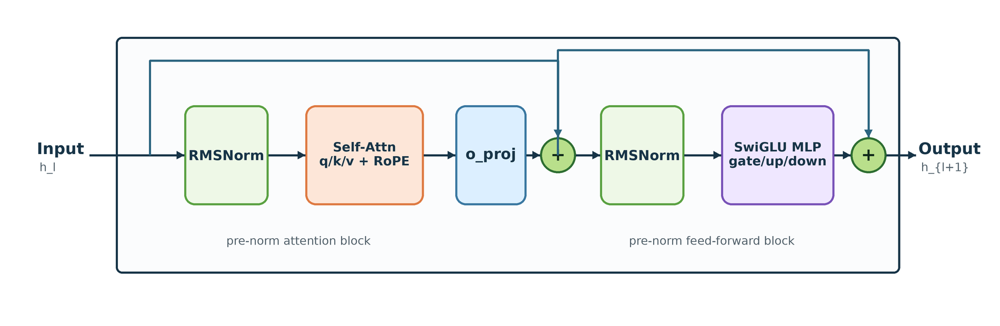

# 大模型微调场景 PaddingFree 优化

## 1. 概述

大语言模型通常以 Transformer 结构作为基础组件。在模型参数量越来越大的情况下，输入序列长度对训练性能有明显影响。在大模型 fine-tune 场景中，输入数据的序列长度不等，因此常见做法是把较短序列 padding 到某个长度，再组成 batch 输入模型训练。当 padding 占比过高时，训练会产生大量无效计算。

PaddingFree 的目标是让模型尽量只处理真实 token，减少 padding 引入的计算和访存开销。本文先从 padding 的额外成本讲起，再介绍 PaddingFree 的实现思路和实验结果。

## 2. PaddingFree 算法原理

### 2.1 基础介绍

#### 2.1.1 数据 padding 过程

在模型 fine-tune 阶段，不同样本的序列长度通常不同。PyTorch Tensor 需要规则的张量形状，因此训练时一般会把较短序列 padding 到指定长度，再一起计算。

当前 fine-tune 中常用的 `transformers` 框架也是类似实现，使用 `tokenizer()` 构造输入数据时，可以设置 `padding` 参数。例如传入 `padding="longest"`，会将一个 batch 内的所有序列 padding 到该 batch 的最大序列长度。

下图是使用 `transformers` 框架对数据进行 padding 后的结果，其中 (a) 为实际数据分布，(b) 为对应的 mask 矩阵。绿色部分是真实数据，粉色部分是 padding 数据。

<p align="center">
  
</p>

#### 2.1.2 数据 padding 的额外计算开销

下图以 LLaMA 2 的 DecoderLayer 为例展示了 Transformer block 的主要结构。padding 后的输入 `hidden_states` 需要依次经过 RMSNorm、Self-Attention、线性映射和 MLP 等模块，每一层都会处理 padding token。

<p align="center">
  
</p>

图中 Self-Attention 详细介绍可参考论文 [1]，其计算公式为：

$$
Attention(Q,K,V)=softmax\left(\frac{QK^T}{\sqrt{h}}\right)\cdot V

$$

当输入序列长度增大时，Attention 层的计算量近似随序列长度平方增长，具体量化分析见 2.3 节。下图是 Self-Attention 计算过程示意图，粉色区域是 padding 部分，常规实现不仅需要额外读取 mask，也会把部分算力浪费在本不需要计算的 padding token 上。

<p align="center">
  
</p>

#### 2.1.3 profiler 分析

当前主流大语言模型已经支持 FlashAttention 加速，详细原理见论文 [2]，本文不再展开。以 xFormers 的 FlashAttention 实现为例，可以从 kernel 侧的 grid 构造看出 padding 带来的计算浪费。该实现会根据输入参数和模型结构构造 launch 到 GPU 上的 grid：

```cpp
__host__ dim3 getBlocksGrid() const {
    return dim3(
        ceil_div(num_queries, (int32_t)kQueriesPerBlock),
        num_heads,
        num_batches);
}
```

假设输入的四个序列长度分别为 `1024`、`32`、`32`、`64`，模型配置为 `HEAD = 16`、`HIDDEN_DIM = 64`。此时 `num_batches = 4`，`num_heads = 16`，`num_queries = 1024`。`kQueriesPerBlock` 是 `constexpr`，表示每个 ThreadBlock 处理的序列片段长度，这里取值为 `64`。

根据上面的代码，grid 维度为 `(16, 16, 4)`，kernel 侧会 launch `1024` 个 block。下图中的 profile 结果也能验证这一点。

<p align="center">
  
</p>

但是在所有 launch 的 ThreadBlock 中，只有 $\frac{1024 + 32 + 32 + 64}{64} \times 16 = 288$ 个会参与真实序列计算，其他 ThreadBlock 都是在处理 padding 数据。也就是说，此时约有 $\frac{1024 - 288}{1024} \times 100\% = 72\%$ 的 block 计算是无效的。

因此，训练时可以把每条序列的真实长度传递给 kernel 侧。kernel launch 后，每个 ThreadBlock 根据真实长度判断当前处理区域是否为 padding 区域；如果是 padding 区域，就直接退出，从而减少计算和访存。

> 注：截至本文原始版本发布时，`transformers` 框架已经支持调用 FlashAttention 库的 `flash_attn_varlen_func`，可以在 FlashAttention 算子层面进行 unpad。但是在构造 QKV 矩阵和其他网络层时，padding 仍会带来额外计算开销。

### 2.2 PaddingFree 算法描述与实现

基于上述分析，PaddingFree 算法可以用来减少 padding 带来的计算资源开销。本节以 LLaMA2 模型为例描述算法实现。

一个 `LlamaModel` 包含 N 个 `LlamaDecoderLayer`。每个 `LlamaDecoderLayer` 包含 `LlamaRMSNorm`、`LlamaAttention` 和 `LlamaMLP` 等模块。PaddingFree 的核心思路是：在模型内部用 pack 后的连续真实 token 计算，在需要恢复 batch 形状的位置再做 unpack。

伪代码如下：

```text
for i in epoch do
    pack input      // [b, max(s[i]), h] -> [sum(s[i]), h]
    for each decoder layer in model do
        run rmsnorm on unpadded hidden states
        run unpadded attention
            build unpadded Q, K, V
            call flash_attn_varlen_func or xFormers memory efficient attention
        run mlp on unpadded hidden states
    end for
    unpack output   // [sum(s[i]), h] -> [b, max(s[i]), h]
end for
```

其中，pack 与 unpack 的操作流程如下图所示。

<p align="center">
  
</p>

对于具体的 LLaMA 模型，算法流程可以拆成三步。

1. 在 `LlamaModel` 输入处，根据 `input_ids` 和 `attention_mask` 得到当前 batch 的真实序列长度列表 `sequence_list`。
2. 对每个 `LlamaDecoderLayer`，使用 `sequence_list` 和 `hidden_states` 执行 unpadded 计算。
3. 模型输出前，将需要恢复形状的输出从 packed layout 转回 padded layout。

第二步中，每个 `LlamaDecoderLayer` 内部的处理更细：

1. 在 `LlamaRMSNorm` 计算前对 `hidden_states` 做 pack，随后在 packed layout 上计算 `LlamaRMSNorm`，并传入 `LlamaAttention`。
2. 在 `LlamaAttention` 中，根据 packed `hidden_states` 计算 QKV 矩阵。调用 attention kernel 时，根据真实序列信息选择 varlen attention 实现，例如 `flash_attn_varlen_func` 或 `call_memory_efficient_attention`。
3. 在 `LlamaMLP` 结束后，对 `hidden_states` 做 unpack，恢复到后续模块需要的形状。

### 2.3 量化分析

参考论文 [4]，可以从计算量角度分析 PaddingFree 的收益。

对于 LLaMA 类模型，假设 `hidden_size = h`，`intermediate_size = h_i`，输入数据形状为 `[b, s]`，其中 `b` 是 batch size，`s` 是 sequence length。假设 padding 比例为 `p`。对模型的每个 DecoderLayer，有如下计算量。

#### 2.3.1 Self-Attention 计算量

Self-Attention 的主要计算为: $Q=xW_Q,\quad K=xW_K,\quad V=xW_V$，$x_{out}=softmax\left(\frac{QK^T}{\sqrt{h}}\right)\cdot V\cdot W_o + x$。

对其逐项进行拆解。为简化形状表示，令 `n` 为注意力头数，`d = h/n` 为每个注意力头的维度。

| 操作 | 输入与输出形状 | 计算量 |
| --- | --- | --- |
| Q、K、V 矩阵乘 | [b, s, h] × [h, h] → [b, s, h] | 3 × 2bsh² = 6bsh² |
| QKᵀ 矩阵乘 | [b, n, s, d] × [b, n, d, s] → [b, n, s, s] | 2bs²h |
| score · V 矩阵乘 | [b, n, s, s] × [b, n, s, d] → [b, n, s, d] | 2bs²h |
| Attention 后线性映射 | [b, s, h] × [h, h] → [b, s, h] | 2bsh² |

得到 Self-Attention 的总计算量为：$4bs^2h + 8bsh^2$

#### 2.3.2 MLP 计算量

LLaMA MLP 的计算公式为：$down(up(x) \times SiLU(gate(x)))$

逐项拆解：

| 操作 | 输入与输出形状 | 计算量 |
| --- | --- | --- |
| `gate_proj` 矩阵乘 | [b, s, h] × [h, h_i] → [b, s, h_i] | 2bs × h × h_i |
| `up_proj` 矩阵乘 | [b, s, h] × [h, h_i] → [b, s, h_i] | 2bs × h × h_i |
| `down_proj` 矩阵乘 | [b, s, h_i] × [h_i, h] → [b, s, h] | 2bs × h × h_i |

得到 MLP 的总计算量为 $6bs \cdot h \cdot h_i$。

#### 2.3.3 RMSNorm 计算量

RMSNorm 公式为 $y=\frac{x}{\sqrt{Mean(x^2)+\epsilon}}\times W$，总计算量为 $2bsh$。

假设模型有 N 个 DecoderLayer，则总计算量为 $(4bs^2h + 8bsh^2 + 6bs \cdot h \cdot h_i + 2bsh) \times N$。

模型计算量中有一部分与序列长度 `s` 的平方成正比。使用 PaddingFree 后，参与有效计算的序列长度可近似表示为 $s \rightarrow (1 - p)s$。因此总计算量可近似减少为：$(1 - p)^2 4bs^2hN + (1 - p)(8bsh^2 + 6bs \cdot h \cdot h_i + 2bsh)N$

#### 2.3.4 显存收益

PaddingFree 也能减少一部分显存占用，缓解训练时的显存压力，具体的显存收益的详细量化分析可参考 blog [7]。

## 3. 实验结果

### 3.1 Stanford Alpaca 项目实验分析

本文以 Stanford Alpaca 项目 [5] 为例进行分析，使用 Stanford Alpaca 数据集和 LLaMA 7B 模型进行微调训练和性能分析。该项目基于指令遵循数据对 Meta 开源的大语言模型 LLaMA 进行 supervised fine-tuning，数据集的序列长度期望在 100 附近。对 Stanford Alpaca 数据集进行分析可知，当 batch size 分别为 `2`、`4`、`6`、`8` 时，训练数据的 padding 比例分别为 `20%`、`38%`、`43%`、`58%`。

以 LLaMA 7B 模型为例，设置 `model_max_length = 512`，使用 DeepSpeed ZeRO-2 训练，并对 baseline 和 PaddingFree 训练过程做 profile。结果显示单个 iteration 的耗时从 `0.54s` 降到 `0.43s`，性能提升约 `24%`。profile 可以看出 PaddingFree 能明显降低 GPU SM 单元的无效计算负载，提高计算效率。

### 3.2 LLaMA-Factory 实验结果

本文也在 LLaMA-Factory 项目 [6] 上进行了更广泛的测试。测试使用阿里云 `ecs.ebmgn7vx.32xlarge` 机型、`alpaca_GPT4_en` 数据集，设置 `model_max_length = 1024`、`padding = "longest"`，使用 DeepSpeed ZeRO-2 做单机训练，baseline 和 PaddingFree 都使用 FlashAttention 2 [3]。结果显示 PaddingFree 相比 baseline 均有可观的性能提升，提升幅度约20%+，并且当 micro batch size 增大、batch 内 padding 比例变高时，收益通常更明显。

## 4. 总结

PaddingFree 可以减少 padding token 带来的无效计算，提高 GPU 计算效率。在本文实验的 LLaMA 类模型 fine-tune 场景中，能带来 20% 以上的性能提升。同时，该技术也能减少一部分显存占用，缓解训练时的显存压力。

## 参考文献

1. Ashish Vaswani, Noam Shazeer, Niki Parmar, Jakob Uszkoreit, Llion Jones, Aidan N Gomez, Lukasz Kaiser, and Illia Polosukhin. Attention is all you need. Advances in Neural Information Processing Systems, 30, 2017.
2. Dao, Tri, et al. "FlashAttention: Fast and Memory-Efficient Exact Attention with IO-Awareness." Advances in Neural Information Processing Systems 35 (2022): 16344-16359.
3. Dao, Tri. "FlashAttention-2: Faster Attention with Better Parallelism and Work Partitioning." arXiv preprint arXiv:2307.08691 (2023).
4. Korthikanti, Vijay Anand, et al. "Reducing Activation Recomputation in Large Transformer Models." Proceedings of Machine Learning and Systems 5 (2023).
5. https://github.com/tatsu-lab/stanford_alpaca
6. https://github.com/hiyouga/LLaMA-Factory
7. https://huggingface.co/blog/mayank-mishra/padding-free-transformer
