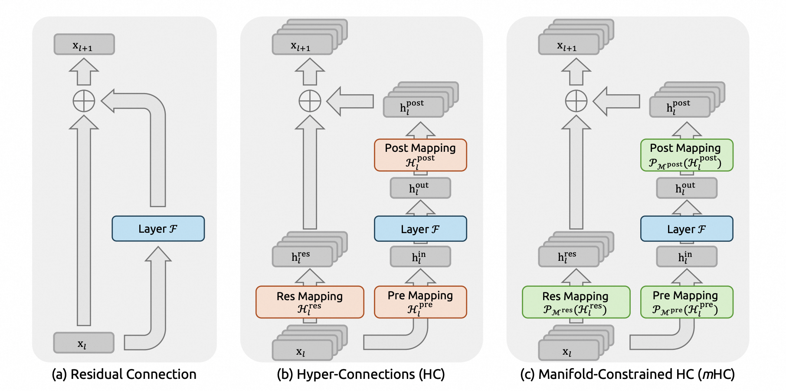

# DeepSeek V4 mHC 原理与 SGLang 实现

本文基于 SGLang 中的 DeepSeek V4 代码，梳理 mHC (Manifold-Constrained Hyper-Connections) 的原理和实现，以及 DeepGEMM 优化。
文章以代码分析为主，SGLang 代码以 main 分支的 `deepseek_v4.py` 为准。

> **mHC 论文**: [mHC: Manifold-Constrained Hyper-Connections](https://arxiv.org/abs/2512.24880)
> **SGLang DSV4 代码**: [deepseek_v4.py](https://github.com/sgl-project/sglang/blob/main/python/sglang/srt/models/deepseek_v4.py)

## mHC 原理

### 从 Residual Connection 到 mHC

传统 Transformer 使用单一残差连接，即 `out = x + attention_or_ffn(norm(x))`，信息只在一条路径上流动。

HC ([Hyper-Connections](https://arxiv.org/abs/2409.19606)) 中把这条单一 residual stream 扩展成多条并行分支，从而保留多份 residual 状态，后续层再通过动态映射选择、交换和写回这些状态。

mHC 则继承 HC 的多分支结构，在此基础上把 residual 分支混合矩阵约束到特定流形上。直观上，它仍然通过三个动态生成的矩阵控制信息流，但其中负责分支混合的矩阵不再完全自由，而是经过 Sinkhorn 约束成近似双随机矩阵。



图中 (a) 是传统 residual connection，(b) 是 HC 的 pre/res/post 三类映射，(c) 是 mHC 在这些映射后加入 manifold projection。

假设 `hc_mult` 表示 mHC 分支数（默认为 4），那么对单个 token 来说，图中 `Res/Pre/Post Mapping` 分别为

| Mapping | 形状 | 约束 | 含义 |
|------|------|------|------|
| `Res Mapping` | `[hc_mult, hc_mult]` | 双随机矩阵，行列和约为 1 | 分支间残差信息的交换矩阵 |
| `Pre Mapping` | `[hc_mult]` | `sigmoid -> [0, 1]` | 各分支进入功能层的权重 |
| `Post Mapping` | `[hc_mult]` | `2 * sigmoid -> [0, 2]` | 功能层输出分配到各分支的权重 |

其中 `Res Mapping` 决定旧的多分支 residual 如何传递到下一层，其作用与传统的 residual 类似；`Pre Mapping` 决定功能层读哪些分支，`Post Mapping` 则决定功能层输出如何写回每个分支。

### mHC 伪代码流程

下面从代码角度来直观理解 mHC，模型 forward 入口处先把普通`[T, D]` hidden state 扩展成 `[T, hc_mult, D]`，然后在 DecoderLayer 中计算 Mapping 矩阵，同时应用到 Attention 或 FFN 中，最后在模型 forward 结束前将 hc_mult 个分支合并。

假设 T = num_tokens, D = hidden_size, hc_mult 为 mHC 的分支数，在 DeepSeek V4 中默认为 4.

```python
# Model.forward start: single stream -> mHC branches.
h = embed_tokens(input_ids)                            # [T, D]
h = h.unsqueeze(1).repeat(1, hc_mult, 1)               # [T, hc_mult, D]

# DecoderLayer: apply mHC for Attention and FFN.
for layer in decoder_layers:
    residual = h
    h_flat = RMSNorm(flatten(h))    # [T, hc_mult * D]
    # split([T, hc_mult * D] @ [hc_mult * D, (2 + hc_mult) * hc_mult])
    #   -> [T, hc_mult], [T, hc_mult], [T, hc_mult, hc_mult]
    pre_w, post_w, res_w = F.linear(h_flat).split([hc_mult, hc_mult, hc_mult * hc_mult], dim=-1)

    # 计算三个 Mapping 矩阵, 约束映射
    pre = σ(scale_pre * pre_w + base_pre)   # [T, hc_mult]
    post = 2 * σ(scale_post * post_w + base_post)  # [T, hc_mult]
    res = Sinkhorn-Knopp(scale_res * res_w + base_res) # [T, hc_mult, hc_mult]

    # 1. Pre-Mapping: 用 pre 矩阵把 hc_mult 条分支合成一条功能层输入。
    # sum([T, hc_mult, 1] * [T, hc_mult, D]) -> [T, D]
    h_pre = (pre.unsqueeze(-1) * residual).sum(dim=1)

    # 功能层计算: Attention 或 FFN
    output = Layer(h_pre)  # [T, D]

    # 2. Res-Mapping: 旧的 hc_mult 条 residual 分支先互相混合，得到新的残差路径。
    # sum([T, hc_mult, hc_mult, 1] * [T, hc_mult, 1, D]) -> [T, hc_mult, D]
    h_res = (res.unsqueeze(-1) * residual.unsqueeze(2)).sum(dim=1)

    # 3. Post-Mapping: 将 output 按 post 权重分配回 hc_mult 条分支，再加上混合后的 residual。
    # [T, hc_mult, 1] * [T, 1, D] + [T, hc_mult, D] -> [T, hc_mult, D]
    h = post.unsqueeze(-1) * output.unsqueeze(1) + h_res

# Model.forward end: mHC branches -> single stream（hc_head）
h_flat = flatten(h)  # [T, hc_mult * D]
mixes = F.linear(h_flat, hc_fn) * rsqrt(h_flat)  # [T, hc_mult]
pre = σ(mixes * hc_scale + hc_base) + hc_eps  # [T, hc_mult]
# sum([T, hc_mult, 1] * [T, hc_mult, D]) -> [T, D]
y = torch.sum(pre.unsqueeze(-1) * h, dim=1)
```

### Sinkhorn-Knopp 算法

在上述伪代码中，我们看到 mHC 在计算 Res Mapping 时使用了 Sinkhorn-Knopp 算法，该算法的目的是将矩阵投影到双随机矩阵空间。

假设矩阵 P 为双随机矩阵，则其有如下性质:
- 所有元素非负: P[i,j] ≥ 0;
- 每行和为 1: Σⱼ P[i,j] = 1  (行归一化)
- 每列和为 1: Σᵢ P[i,j] = 1  (列归一化)

那么为什么 Res Mapping 需要双随机约束呢？原因是 res 控制各分支间的残差混合，使用双随机可以保证每个输出分支接收的总权重 = 1 (行和=1)，且每个输入分支贡献的总权重 = 1 (列和=1)，这样所有分支的信息既不丢失也不放大，保持特征流守恒。

一个典型的计算双随机矩阵的伪代码如下：

```text
输入: 任意矩阵 A ∈ ℝⁿˣⁿ，输出: 双随机矩阵 P

Step 0: 保证非负 (softmax 或 exp)
Step 1-N: 交替归一化
    for iter in range(max_iter):
        A = A / A.sum(dim=-1)  # 行归一化
        A = A / A.sum(dim=-2)  # 列归一化
输出: P = A
```

**算法迭代过程图示如下**

```
                    Sinkhorn-Knopp 迭代过程
                    ═══════════════════════

初始矩阵 A (非负)           经过多次迭代           双随机矩阵 P
┌─────────────────┐                           ┌─────────────────┐
│ 0.8  0.2  0.5   │                           │ 0.33 0.17 0.50  │
│ 0.3  0.9  0.4   │    ──────────────────►    │ 0.17 0.50 0.33  │
│ 0.6  0.4  0.7   │     Row↔Col 交替归一化      │ 0.50 0.33 0.17  │
└─────────────────┘                           └─────────────────┘
行和: [1.5, 1.6, 1.7]                          行和: [1.0, 1.0, 1.0] ✓
列和: [1.7, 1.5, 1.6]                          列和: [1.0, 1.0, 1.0] ✓

迭代步骤详解 (以 4×4 矩阵为例):
═══════════════════════════════════════════════════════════════════

Step 0: 非负化 (exp 或 softmax)
┌──────────────────┐                  ┌─────────────────┐
│   res (任意值)    │  ──► exp() ──►   │    A(非负矩阵)   │
└──────────────────┘                  └─────────────────┘

Step 1: 行归一化 (softmax 或 除以行和)
┌─────────────────┐                   ┌─────────────────┐
│ a₀₀ a₀₁ a₀₂ a₀₃ │    ÷ row_sum      │ a₀₀/r₀ ... ...  │
│ a₁₀ a₁₁ a₁₂ a₁₃ │  ───────────────► │ a₁₀/r₁ ... ...  │  每行和 = 1
│ a₂₀ a₂₁ a₂₂ a₂₃ │    rᵢ = Σⱼ aᵢⱼ    │ a₂₀/r₂ ... ...  │
│ a₃₀ a₃₁ a₃₂ a₃₃ │                   │ a₃₀/r₃ ... ...  │
└─────────────────┘                   └─────────────────┘

Step 2: 列归一化
┌─────────────────┐                   ┌─────────────────┐
│ b₀₀ b₀₁ b₀₂ b₀₃ │    ÷ col_sum      │ b₀₀/c₀ b₀₁/c₁.. │
│ b₁₀ b₁₁ b₁₂ b₁₃ │  ───────────────► │ b₁₀/c₀ b₁₁/c₁.. │  每列和 = 1
│ b₂₀ b₂₁ b₂₂ b₂₃ │    cⱼ = Σᵢ bᵢⱼ    │ b₂₀/c₀ b₂₁/c₁.. │
│ b₃₀ b₃₁ b₃₂ b₃₃ │                   │ b₃₀/c₀ b₃₁/c₁.. │
└─────────────────┘                   └─────────────────┘

Step 3-N: 重复 Step 1-2 直到收敛
    ┌─────────────────────────────────────┐
    │  for i in range(repeat - 1):        │
    │      x = x / row_sum  # 行归一化     │
    │      x = x / col_sum  # 列归一化     │
    └─────────────────────────────────────┘
```

Pytorch 参考代码实现如下：

```python
# 输入: x: [T, hc_mult, hc_mult] - 原始矩阵
# 输出: x: [T, hc_mult, hc_mult] - 双随机矩阵

def sinkhorn_ref(x: torch.Tensor, repeat: int, eps: float) -> torch.Tensor:
    """
    简化形式: 直接在矩阵上做归一化
    """
    # Step 1: 行归一化 (softmax 同时完成非负化 + 行和=1)
    x = x.softmax(-1) + eps                  # [T, hc_mult, hc_mult], 行和=1, 加 eps 防止除零

    # Step 2: 列归一化
    x = x / (x.sum(-2, keepdim=True) + eps)  # [T, hc_mult, hc_mult], 列和≈1

    # Step 3-N: 交替迭代
    for _ in range(repeat - 1):
        x = x / (x.sum(-1, keepdim=True) + eps)  # 行归一化
        x = x / (x.sum(-2, keepdim=True) + eps)  # 列归一化

    return x
```

### GEMM + RMSNorm 融合

接下来插播一个 GEMM + RMSNorm 融合的小优化，在 mHC 的伪代码中我们可以看到需要先对 hidden state 进行 RMSNorm，然后对结果进行矩阵乘，这里可以进行优化。

标准 RMSNorm 的详细原理和代码实现可以参考我的 Triton 教程文件[05-layer_rms_l2-norm.py](https://github.com/slowlyC/ai-infra-notes/blob/main/tutorials/triton/05-layer_rms_l2-norm.py)。

一次标准 RMSNorm + GEMM 的原始公式为 H = RMSNorm(x) @ W = (γ * x / RMS(x)) @ W，其中 RMS(x) = √(sqrsum(x)/n + ε)。

仔细观察公式可以发现，γ 是常数，RMS(x) 是标量(每个 token 一个值)，因此可以有 H = (x @ W') * rsqrt(sqrsum(x)/n + ε)，其中 W' = diag(γ) @ W。即**RMSNorm 可以延迟到 GEMM 之后！**这样可以一边读取 `x` 做 `x @ W`，一边累加 `sqrsum = Σx²`，最后再用 `rsqrt(sqrsum/n + ε)` 缩放 GEMM 输出。

融合的收益主要来自减少 GMEM 的数据读写，如果先做 RMSNorm，再把归一化后的 `x'` 交给 GEMM，就需要把 `x'` 写回显存，然后在 GEMM 中再读一次。也就是说，融合后会节省一次归一化后中间结果 `x'` 的 GMEM 写和读。

## SGLang DeepSeek V4 mHC 实现

接下来进入 SGLang 的 DeepSeek V4 代码。本节先按 `DeepseekV4DecoderLayer.forward` 的 PyTorch 路径梳理 mHC 语义。

### 模型入口：单分支扩展成多分支

SGLang 中的 DeepSeek V4 不是把 mHC 作为外部 wrapper 套在 Transformer 外面，而是将 mHC 的逻辑写到模型主干中，`DeepseekV4Model.forward` 在 embedding 后立刻复制出 `hc_mult` 条分支：

```python
hidden_states = self.embed_tokens(input_ids)                          # [T, D]
hidden_states = hidden_states.unsqueeze(1).repeat(1, self.hc_mult, 1) # [T, hc_mult, D]
```

这里第一维不是单条请求的序列长度，而是展平后的 token 数，在 SGLang 中通常用 `input_ids.shape[0]` 或 `num_tokens` 来表示，本文统一记为 `T := num_tokens`，这也等价于 Megatron 等训练框架中的 B * S。

### DecoderLayer 流程

每个 decoder layer 的功能层仍然是 attention 和 MoE FFN，但两者只处理普通的 `[T, D]` hidden state；mHC 负责在功能层边界完成 `[T, hc_mult, D] <-> [T, D]` 的聚合和写回。

为了突出 mHC 的内容，下面代码中省略 `positions`、`forward_batch`、`x_quant` 以及 MoE 的 DP/TP gather/scatter 等细节：

```python
def __init__():
  mix_hc = (2 + hc_mult) * hc_mult
  hc_dim = hc_mult * config.hidden_size
  self.hc_attn_fn = nn.Parameter(torch.empty(mix_hc, hc_dim, dtype=torch.float32))
  self.hc_ffn_fn = nn.Parameter(torch.empty(mix_hc, hc_dim, dtype=torch.float32))
  self.hc_attn_base = nn.Parameter(torch.empty(mix_hc, dtype=torch.float32))
  self.hc_ffn_base = nn.Parameter(torch.empty(mix_hc, dtype=torch.float32))
  self.hc_attn_scale = nn.Parameter(torch.empty(3, dtype=torch.float32))
  self.hc_ffn_scale = nn.Parameter(torch.empty(3, dtype=torch.float32))

def forward():
  # Attention block
  residual = hidden_states                                  # [T, hc_mult, D]
  hidden_states, post_attn, comb_attn, norm_fused = hc_pre(
      hidden_states, hc_attn_fn
  )                                                              # [T, D], [T, hc_mult], [T, hc_mult, hc_mult]
  if not norm_fused:
      hidden_states = input_layernorm(hidden_states)             # [T, D]
  hidden_states = self_attn(hidden_states)                       # [T, D]
  hidden_states = hc_post(
      hidden_states, residual, post_attn, comb_attn
  )                                                              # [T, hc_mult, D]

  # FFN block
  residual = hidden_states                                   # [T, hc_mult, D]
  hidden_states, post_ffn, comb_ffn, norm_fused = hc_pre(
      hidden_states, hc_ffn_fn
  )                                                              # [T, D], [T, hc_mult], [T, hc_mult, hc_mult]
  if not norm_fused:
      hidden_states = post_attention_layernorm(hidden_states)    # [T, D]
  hidden_states = mlp(hidden_states)                             # [T, D]
  hidden_states = hc_post(
      hidden_states, residual, post_ffn, comb_ffn
  )                                                              # [T, hc_mult, D]
```

在本节的 Torch fallback 路径中，`norm_fused` 始终是 `False`，所以上面的 layernorm 会显式执行。

### hc_pre 实现

`DeepseekV4DecoderLayer.hc_pre` 的作用是将多分支的 residual 聚合成一条功能层输入，同时生成后续 `hc_post` 需要的 `post/comb`。这里聚合的意思就是用 `Pre Mapping` 把 `hc_mult` 条 residual 分支加权合成一条 `[T, D]` hidden state。由于 `pre` 在 `hc_pre` 内部已经被用来生成 `y`，所以不会作为返回值返回。`post/comb` 会在功能层输出后交给 `hc_post` 使用，其中 `comb` 对应原理部分的 Res Mapping，也就是经过 Sinkhorn 约束后的分支间残差混合矩阵。`norm_fused` 是为了兼容后面的优化路径，在 Torch 路径中固定为 `False`。

hc_pre Torch 路径的代码实现逻辑如下：

```python
def hc_pre(
    self,
    x: torch.Tensor,  # [T, hc_mult, D]
    hc_fn: torch.Tensor,     # [(2 + hc_mult) * hc_mult, hc_mult * D]
    hc_scale: torch.Tensor,  # [3]
    hc_base: torch.Tensor,   # [(2 + hc_mult) * hc_mult]
    norm: Optional[nn.Module] = None,  # Optional[RMSNorm]
    forward_batch: Optional[ForwardBatch] = None,
):
    def hc_pre_torch_impl(x, hc_fn):
        x_flat = x.flatten(1).float()  # [T, hc_mult * D]
        rsqrt = torch.rsqrt(
            x_flat.square().mean(-1, keepdim=True) + self.rms_norm_eps
        )  # [T, 1]
        mixes = (F.linear(x_flat, hc_fn) * rsqrt).unsqueeze(1)  # [T, 1, (2 + hc_mult) * hc_mult]
        return x_flat, mixes

    # 生成 mixes，后面切分成 pre/post/comb 三个 mapping 矩阵
    x_flat, mixes = hc_pre_torch_impl(x, hc_fn)  # [T, hc_mult * D], [T, 1, (2 + hc_mult) * hc_mult]

    pre, post, comb = hc_split_sinkhorn(
        mixes,
        hc_scale,
        hc_base,
        self.hc_mult,
        self.hc_sinkhorn_iters,
        self.hc_eps,
    )  # [T, 1, hc_mult], [T, 1, hc_mult], [T, 1, hc_mult, hc_mult]
    # 按 pre 权重合并 hc_mult 条 residual 分支
    y = (pre.squeeze(1).unsqueeze(-1) * x_flat.view(shape)).sum(dim=1) # [T, D]
    # y.to(dtype):      [T, D]
    # post.squeeze(1):  [T, hc_mult]
    # comb.squeeze(1):  [T, hc_mult, hc_mult]
    # norm_fused:       False
    return y.to(dtype), post.squeeze(1), comb.squeeze(1), False
```

`hc_pre` 先调用 `hc_pre_torch_impl` 生成 `mixes`，再通过 `hc_split_sinkhorn` 切分成 `pre/post/comb` 三个 mapping 矩阵并进行约束，最后对 `pre` 矩阵进行聚合，然后返回聚合后的结果 `y`，以及 `post/comb`。

其中 `hc_split_sinkhorn` 函数会去调用 `hc_split_sinkhorn_kernel` TileLang kernel，具体代码为：

```python
def hc_split_sinkhorn(
    mixes: torch.Tensor,     # [T, 1, mix_hc]
    hc_scale: torch.Tensor,  # [3]
    hc_base: torch.Tensor,   # [(2 + hc_mult) * hc_mult]
    hc_mult: int = 4,
    sinkhorn_iters: int = 20,
    eps: float = 1e-6,
):
    b, s, _ = mixes.size()  # mixes: [T, 1, mix_hc], 所以 b = T, s = 1.
    pre = mixes.new_empty(b, s, hc_mult)
    post = mixes.new_empty(b, s, hc_mult)
    comb = mixes.new_empty(b, s, hc_mult, hc_mult)

    kernel = hc_split_sinkhorn_kernel(hc_mult, sinkhorn_iters, eps)
    kernel(
        mixes.view(-1, (2 + hc_mult) * hc_mult), # [T, 1, mix_hc] -> [T, mix_hc]
        hc_scale,
        hc_base,
        pre.view(-1, hc_mult),
        post.view(-1, hc_mult),
        comb.view(-1, hc_mult, hc_mult),
    )
    return pre, post, comb # [T, 1, hc_mult], [T, 1, hc_mult], [T, 1, hc_mult, hc_mult]

@tilelang.jit(pass_configs=pass_configs)
def hc_split_sinkhorn_kernel(hc: int, sinkhorn_iters: int, eps: float):
    n = T.symbolic("n")
    mix_hc = (2 + hc) * hc # mix_hc = pre(hc) + post(hc) + comb(hc * hc)
    threads = 64

    ENABLE_PDL = is_arch_support_pdl()

    @T.prim_func
    def hc_split_sinkhorn_kernel_(
        mixes: T.Tensor[(n, mix_hc), FP32],
        hc_scale: T.Tensor[(3,), T.float32],
        hc_base: T.Tensor[(mix_hc,), T.float32],
        pre: T.Tensor[(n, hc), FP32],
        post: T.Tensor[(n, hc), FP32],
        comb: T.Tensor[(n, hc, hc), FP32],
    ):
        with T.Kernel(n, threads=threads) as i:
            if ENABLE_PDL:
                T.pdl_sync()

            # 当前 token 的 mix_hc 个 logits, 先搬到 shared memory.
            mixes_shared = T.alloc_shared(mix_hc, FP32)
            comb_frag = T.alloc_fragment((hc, hc), FP32)
            T.copy(mixes[i, :], mixes_shared)

            # mixes_shared[0:hc] -> pre, 同时约束到 [0, 1].
            for j in T.Parallel(hc):
                pre[i, j] = T.sigmoid(mixes_shared[j] * hc_scale[0] + hc_base[j]) + eps
            # mixes_shared[hc:2*hc] -> post, 同时约束到 [0, 2].
            for j in T.Parallel(hc):
                post[i, j] = 2 * T.sigmoid(
                    mixes_shared[j + hc] * hc_scale[1] + hc_base[j + hc]
                )
            # mixes_shared[2*hc:] -> comb logits, reshape 成 [hc, hc].
            for j, k in T.Parallel(hc, hc):
                comb_frag[j, k] = (
                    mixes_shared[j * hc + k + hc * 2] * hc_scale[2]
                    + hc_base[j * hc + k + hc * 2]
                )

            # ==== 执行 Sinkhorn-Knopp 算法 ====
            row_sum = T.alloc_fragment(hc, FP32)
            col_sum = T.alloc_fragment(hc, FP32)

            row_max = T.alloc_fragment(hc, FP32)
            T.reduce_max(comb_frag, row_max, dim=1)
            # 先做按行的稳定 exp, 相当于 Sinkhorn 的非负化初始化.
            for j, k in T.Parallel(hc, hc):
                comb_frag[j, k] = T.exp(comb_frag[j, k] - row_max[j])
            T.reduce_sum(comb_frag, row_sum, dim=1)
            # 行归一化, 每行和约为 1.
            for j, k in T.Parallel(hc, hc):
                comb_frag[j, k] = comb_frag[j, k] / row_sum[j] + eps

            T.reduce_sum(comb_frag, col_sum, dim=0)
            # 列归一化, 每列和约为 1.
            for j, k in T.Parallel(hc, hc):
                comb_frag[j, k] = comb_frag[j, k] / (col_sum[k] + eps)

            # 继续交替做行/列归一化, 得到近似双随机矩阵.
            for _ in T.serial(sinkhorn_iters - 1):
                T.reduce_sum(comb_frag, row_sum, dim=1)
                for j, k in T.Parallel(hc, hc):
                    comb_frag[j, k] = comb_frag[j, k] / (row_sum[j] + eps)
                T.reduce_sum(comb_frag, col_sum, dim=0)
                for j, k in T.Parallel(hc, hc):
                    comb_frag[j, k] = comb_frag[j, k] / (col_sum[k] + eps)

            T.copy(comb_frag, comb[i, :, :])
            if ENABLE_PDL:
                T.pdl_trigger()

    return hc_split_sinkhorn_kernel_

```

`mixes` 进入 `hc_split_sinkhorn_kernel` kernel 前会被 view 成 `[T, (2 + hc_mult) * hc_mult]`，所以 TileLang kernel 中的 `n` 可以理解成 `T`，`hc` 就是 `hc_mult`，`mix_hc = (2 + hc_mult) * hc_mult`。kernel 内每次处理一个 token 的 `mixes[i, :]`。以 DeepSeek V4 默认 `hc_mult = 4` 为例，`mix_hc = 24`，这 24 个值会被切成三段：

```python
mixes[i, 0:4]    -> pre logits
mixes[i, 4:8]    -> post logits
mixes[i, 8:24]   -> comb logits, reshape 成 [4, 4]
```

切分之后分别加上 `hc_scale/hc_base`，再做 sigmoid 和 Sinkhorn 约束，对应原理部分的：

```python
pre  = sigmoid(pre_logits * hc_scale[0] + base_pre) + eps
post = 2 * sigmoid(post_logits * hc_scale[1] + base_post)
comb = Sinkhorn(exp(comb_logits * hc_scale[2] + base_comb))
```

所以 `hc_split_sinkhorn` 的作用总结起来就是把 `mixes` 切分成三个受约束的 mapping 矩阵。

### hc_post 实现

`hc_post` 的代码比较简单，其作用就是将功能层的输出写回到多分支的 residual。其接收功能层的输出 `x`，残差`residual`(`hc_pre`之前的 `hidden_states`)，以及 `hc_pre` 返回的 `post/comb`，然后生成新的多分支 hidden_states。

`hc_post` 的 Torch 路径代码的实现简化如下：

```python
def hc_post(
    self,
    x: torch.Tensor,         # [T, D]
    residual: torch.Tensor,  # [T, hc_mult, D]
    post: torch.Tensor,      # [T, hc_mult]
    comb: torch.Tensor,      # [T, hc_mult, hc_mult]
):
    def hc_post_torch_impl(x, residual, post, comb):
        return (
            post.unsqueeze(-1) * x.unsqueeze(1)  # [T, hc_mult, D]
            + (comb.unsqueeze(-1) * residual.unsqueeze(2)).sum(dim=1)  # [T, hc_mult, D]
        ).type_as(x)

    return hc_post_torch_impl(x, residual, post, comb)  # [T, hc_mult, D]
```

`hc_post_torch_impl` 中有 Post Mapping 和 Res Mapping 两条数据流:

```python
post.unsqueeze(-1) * x.unsqueeze(1) # [T, hc_mult, 1] * [T, 1, D] = [T, hc_mult, D]
```

这一行对应 Post Mapping，表示把功能层输出 `x` 按 `post` 权重分配回 `hc_mult` 条分支。

```python
# sum([T, hc_mult, hc_mult, 1] * [T, hc_mult, 1, D]) -> [T, hc_mult, D]
(comb.unsqueeze(-1) * residual.unsqueeze(2)).sum(dim=1)
```

这一行对应 Res Mapping，`sum(dim=1)` 就是在把所有输入分支的贡献累加到每个输出分支上。

两者相加后，最终输出仍然是 `[T, hc_mult, D]`，也就是下一次 `hc_pre` 要继续读取的多分支 residual。

### `hc_head`：多分支合回单分支

在 `DeepseekV4Model.forward` 最后还有一个 `hc_head` 函数，负责把最后一层输出的 `hc_mult` 条分支合成普通 hidden state。

```python
hidden_states = self.hc_head(
    hidden_states, self.hc_head_fn, self.hc_head_scale, self.hc_head_base
)  # [T, D]
```

`hc_head` 只有 `pre` 形式，没有 `post/comb`。原因也比较直接：这里已经是模型末尾，不需要再把功能层输出写回多分支 residual，只需要把多分支状态合成一条 `[T, D]` hidden state，其 torch 代码如下:

```python
def hc_head(
    self,
    x: torch.Tensor,         # [T, hc_mult, D]
    hc_fn: torch.Tensor,     # [hc_mult, hc_mult * D]
    hc_scale: torch.Tensor,  # [1]
    hc_base: torch.Tensor,   # [hc_mult]
):
    shape, dtype = x.size(), x.dtype
    x = x.flatten(1).float()  # [T, hc_mult * D]
    rsqrt = torch.rsqrt(x.square().mean(-1, keepdim=True) + self.norm_eps)  # [T, 1]
    mixes = F.linear(x, hc_fn) * rsqrt  # [T, hc_mult]
    pre = torch.sigmoid(mixes * hc_scale + hc_base) + self.hc_eps  # [T, hc_mult]
    # sum([T, hc_mult, 1] * [T, hc_mult, D]) -> [T, D]
    y = torch.sum(pre.unsqueeze(-1) * x.view(shape), dim=1)
    return y.to(dtype)
```

和 `hc_pre` 一样，`hc_head` 也会先对 `[T, hc_mult, D]` 做 flatten，得到 `[T, hc_mult * D]`，再用 RMS 缩放后的 linear 生成 `pre` 权重, 最后用 `pre` 对 `hc_mult` 条分支做加权求和。也就是说 `hc_head` 可以理解成模型末尾的 pre-only mixer。

## mHC 跨层融合优化

### 优化原理
上一节我们讲了 SGLang 中 DeepSeek V4 mHC 的 torch 实现路径，在每个 DecoderLayer 中依次执行 `hc_pre`, `Atten/FFN`,`hc_post`。那么有没有办法对这个流程进行优化呢？这里有一个自然的优化点，`hc_post` 生成的结果，通常会被下一层 `hc_pre` 立即消费，它就像两层之间用于信息传递的中间状态，而不是模型必须长期保留的输出。因此可以把 `hc_post` 和下一次 `hc_pre` 合并调度，减少中间状态的读写和 kernel launch。

当前版本的 SGLang 中已经集成该优化，设置环境变量 `SGLANG_OPT_FUSE_MHC_POST_PRE=1` 即可启用。启用后，`DecoderLayer.forward` 会走到以下路径：

```python
if prev_residual is not None and use_fused:
    residual, post, comb, hidden_states = mhc_fused_post_pre(
        hidden_states,       # 上一层 FFN 输出, [T, D]
        prev_residual,       # 上一层 FFN 前保存的 residual, [T, hc_mult, D]
        prev_post,           # 上一层 FFN 对应的 Post Mapping
        prev_comb,           # 上一层 FFN 对应的 Res Mapping
        self.hc_attn_fn,     # 当前层 Attention 的 hc_pre 参数
        self.hc_attn_scale,
        self.hc_attn_base,
        self.rms_norm_eps,
        self.hc_eps,
        self.hc_eps,
        _MHC_POST_MULT_VALUE,
        self.hc_sinkhorn_iters,
        norm_weight=(
            self._input_layernorm_weight_bf16
            if self._input_layernorm_weight_bf16 is not None
            else self.input_layernorm.weight.data
        ),
        norm_eps=self.input_layernorm.variance_epsilon,
    )
```

其中 `prev_residual, prev_post, prev_comb` 表示上一层 FFN 后没有完全执行的 `hc_post`。下一层开始时，如果 `prev_residual is not None`，就先把上一层 FFN 的 `hc_post` 和当前层 Attention 的 `hc_pre` 合并到 `mhc_fused_post_pre` 执行。

返回的 `hidden_states` 便是当前层 Attention 的需要的输入 `[T, D]`，并且 `input_layernorm` 已经在 fused kernel 中完成。之后在 Attention 计算结束后，SGLang 会继续把 Attention 的 `hc_post` 和 FFN 的 `hc_pre` 合并：

```python
residual, post, comb, hidden_states = mhc_fused_post_pre(
    hidden_states,               # Attention 输出, [T, D]
    residual,                    # Attention 前保存的 residual, [T, hc_mult, D]
    post,
    comb,
    self.hc_ffn_fn,              # 当前层 FFN 的 hc_pre 参数
    self.hc_ffn_scale,
    self.hc_ffn_base,
    ...,
    norm_weight=self.post_attention_layernorm.weight.data,
)
```

在 FFN 计算后，需要注意的是最后一层没有下一层可以消费的 `hc_post`，所以需要在 `last_layer` 时进行一次 `hc_post`。

```python
if use_fused and last_layer is not None:
    hidden_states = last_layer.hc_post(
        hidden_states, prev_residual, prev_post, prev_comb
    )
```

这样模型对外看到的结果仍然和普通路径一致，都是最后一层闭合后的 `[T, hc_mult, D]`。

### mhc_fused_post_pre 实现

在 small batch 路径下，`mhc_fused_post_pre` 会调用 `mhc_fused_post_pre_fma_tilelang` 完成上一段的 `hc_post`，同时对新的 residual 做 `hc_pre` 所需的 prenorm + GEMM，之后调用 `mhc_pre_big_fuse_with_norm_tilelang` 把 GEMM 结果转换成 `layer_input/post/comb`。需要注意的是，由于 `mhc_fused_post_pre_fma_tilelang` 采用了 FMA 的实现，该路径只在小 batch 下使用，大 batch 时仍会 fallback 到 TileLang 原本的两阶段 kernel。

`mhc_fused_post_pre` 主要代码如下：

```python
def mhc_fused_post_pre(
    x: torch.Tensor,               # [T, D], 上一段功能层输出
    residual: torch.Tensor,        # [T, hc_mult, D], 上一段功能层前保存的 residual
    post_layer_mix: torch.Tensor,  # [T, hc_mult] or [T, hc_mult, 1]
    comb_res_mix: torch.Tensor,    # [T, hc_mult, hc_mult]
    fn: torch.Tensor,              # [(2 + hc_mult) * hc_mult, hc_mult * D]
    hc_scale: torch.Tensor,        # [3]
    hc_base: torch.Tensor,         # [(2 + hc_mult) * hc_mult]
    rms_eps: float,
    hc_pre_eps: float,
    hc_sinkhorn_eps: float,
    hc_post_mult_value: float,
    sinkhorn_repeat: int,
    n_splits: int = 1,
    tile_n: int = 1,
    *,
    norm_weight: torch.Tensor | None = None,
    norm_eps: float | None = None,
) -> tuple[torch.Tensor, torch.Tensor, torch.Tensor, torch.Tensor]:
    hc_mult = residual.shape[-2]
    D = residual.shape[-1]
    hc_mult2 = hc_mult * hc_mult          # comb
    hc_mult3 = 2 * hc_mult + hc_mult2     # pre + post + comb
    hc_hidden_size = hc_mult * D
    outer_shape = residual.shape[:-2]     # 一般就是 [T]

    residual_flat = residual.view(-1, hc_mult, D)  # [T, hc_mult, D]
    num_tokens = residual_flat.shape[0]
    x_flat = x.view(num_tokens, D)                  # [T, D]

    fma_token_threshold = 32

    # 由于其使用了 fma 的实现，因此仅适用于小 batch 场景
    if num_tokens <= fma_token_threshold:
        mhc_fused_post_pre_fma_tilelang(
            comb_res_mix.view(num_tokens, hc_mult, hc_mult),
            residual_flat,
            post_layer_mix.view(num_tokens, hc_mult),
            x_flat,
            fn.view(hc_mult3, hc_mult, D),
            gemm_out_mul,     # [n_splits, T, hc_mult3]
            gemm_out_sqrsum,  # [n_splits, T]
            residual_cur,     # [T, hc_mult, D]
            ...,
        )
    else:
        # fallback: 先完成 hc_post，再计算下一段 hc_pre 的 prenorm GEMM
        mhc_post_tilelang(comb, residual, post, x, residual_cur)
        prenorm_gemm(residual_cur.flatten(1), fn, gemm_out_mul, gemm_out_sqrsum)

    # 调用 big_fuse kernel 把 GEMM partial 转成下一段 hc_pre 的输出
    if norm_weight is not None:
        # 如果传入 norm_weight, 这里会把下一段 layernorm 也融合进去。
        mhc_pre_big_fuse_with_norm_tilelang(
            gemm_out_mul,
            gemm_out_sqrsum,
            hc_scale,
            hc_base,
            residual_cur,
            post_mix_cur,     # [T, hc_mult]
            comb_mix_cur,     # [T, hc_mult * hc_mult]
            layer_input_cur,  # [T, D]
            norm_weight,
            ...,
        )

    return (
        residual_cur.view(*outer_shape, hc_mult, D),       # [T, hc_mult, D]
        post_mix_cur.view(*outer_shape, hc_mult, 1),       # [T, hc_mult, 1]
        comb_mix_cur.view(*outer_shape, hc_mult, hc_mult), # [T, hc_mult, hc_mult]
        layer_input_cur.view(*outer_shape, D),             # [T, D]
    )
```

### mhc_fused_post_pre_fma_tilelang 实现

`mhc_fused_post_pre_fma_tilelang` 是该优化的主要 kernel，它不是融合完整的 `hc_post` + `hc_pre`，而是融合 `hc_post` + `hc_pre` 的前半段，即先算出 `residual_cur`，再基于 `residual_cur` 生成下一次 `hc_pre` 需要的 GEMM partial 和 RMS square-sum partial。后面的 split、sigmoid、Sinkhorn、pre 聚合仍然交给 `mhc_pre_big_fuse_with_norm_tilelang`。

```python
@tilelang.jit(...)
def mhc_fused_post_pre_fma_tilelang(
    prev_comb_mix,      # [T, hc_mult, hc_mult], 上一段 Res Mapping
    prev_residual,      # [T, hc_mult, D], 上一段功能层前 residual
    prev_post_mix,      # [T, hc_mult], 上一段 Post Mapping
    hidden_in,          # [T, D], 上一段功能层输出
    pre_fn,             # [hc_mult3, hc_mult, D], 下一段 hc_pre 的 fn
    mixes_partial_out,  # [split_k, T, hc_mult3]
    sqrsum_partial_out, # [split_k, T]
    cur_residual_out,   # [T, hc_mult, D]
    hc: int,
    hidden_size: int,
    num_mix_outputs: int,
    n_thr: int = 256,
    tile_mix_outputs: int = 1,
    split_k: int = 1,
) -> tilelang.JITKernel:
    num_tokens = T.dynamic("num_tokens")
    split_k = T.dynamic("split_k")

    hidden_per_split = (hidden_size + split_k - 1) // split_k
    num_mix_output_tiles = (num_mix_outputs + tile_mix_outputs - 1) // tile_mix_outputs
    hidden_iters_per_thread = (hidden_per_split + n_thr - 1) // n_thr
    num_warps = n_thr // 32

    # CTA 维度：
    #   token_idx           : 当前 CTA 处理哪个 token
    #   mix_output_tile_idx : 当前 CTA 处理哪一小段 mix output
    #                         hc_mult=4 时, num_mix_outputs=24:
    #                           [0:4]   -> pre logits
    #                           [4:8]   -> post logits
    #                           [8:24]  -> comb logits
    #   hidden_split_idx    : 当前 CTA 处理哪一段 hidden 维度
    with T.Kernel(
        num_tokens,
        num_mix_output_tiles,
        split_k,
        threads=n_thr,
    ) as (token_idx, mix_output_tile_idx, hidden_split_idx):
        thread_idx = T.get_thread_binding()
        warp_idx = T.get_warp_idx()
        lane_idx = T.get_lane_idx()

        mix_acc = T.alloc_local((tile_mix_outputs,), T.float32)
        sqrsum_acc = T.alloc_local((1,), T.float32)
        cur_residual_values = T.alloc_local((hc,), T.float32)

        T.clear(mix_acc)
        T.clear(sqrsum_acc)

        hidden_split_start = hidden_split_idx * hidden_per_split

        # 当前 token 的 post/comb 会先加载到 shared/local memory。
        # 这里省略具体搬运代码，只保留后面的计算逻辑。
        post = prev_post_mix[token_idx]       # [hc]
        comb = prev_comb_mix[token_idx]       # [hc, hc]

        for hidden_iter in T.serial(hidden_iters_per_thread):
            hidden_idx = hidden_split_start + hidden_iter * n_thr + thread_idx

            if hidden_idx < hidden_size:
                # Step 1: fused hc_post
                # cur_residual[j, h] =
                #     post[j] * hidden_in[h]
                #     + sum_k comb[k, j] * prev_residual[k, h]
                for new_route_idx in T.unroll(hc):
                    cur_residual_values[new_route_idx] = (
                        post[new_route_idx] * hidden_in[token_idx, hidden_idx]
                    )

                    for old_route_idx in T.unroll(hc):
                        cur_residual_values[new_route_idx] += (
                            comb[old_route_idx, new_route_idx]
                            * prev_residual[token_idx, old_route_idx, hidden_idx]
                        )

                # 对齐 unfused 路径：mhc_post 写 bf16，下一次 hc_pre 再读 bf16。
                for route_idx in T.unroll(hc):
                    cur_residual_values[route_idx] = T.bfloat16(
                        cur_residual_values[route_idx]
                    )

                # Step 2: 下一次 hc_pre 的 RMS sqrsum partial
                # 只有 mix_output_tile_idx == 0 写 residual/sqrsum，避免重复写。
                if mix_output_tile_idx == 0:
                    for route_idx in T.unroll(hc):
                        cur_residual_out[token_idx, route_idx, hidden_idx] = (
                            cur_residual_values[route_idx]
                        )
                        sqrsum_acc[0] += (
                            cur_residual_values[route_idx]
                            * cur_residual_values[route_idx]
                        )

                # Step 3: 下一次 hc_pre 的 GEMM partial
                # mixes[o] += sum_route pre_fn[o, route, h] * cur_residual[route, h]
                for tile_col_idx in T.unroll(tile_mix_outputs):
                    mix_output_idx = (
                        mix_output_tile_idx * tile_mix_outputs + tile_col_idx
                    )

                    if mix_output_idx < num_mix_outputs:
                        for route_idx in T.unroll(hc):
                            mix_acc[tile_col_idx] += (
                                pre_fn[mix_output_idx, route_idx, hidden_idx]
                                * cur_residual_values[route_idx]
                            )

        # Step 4: CTA 内归约，把当前 hidden split 的 partial 写出去。
        # 源码里会先做 warp_reduce_sum，再通过 shared memory 做 warp 间归约。
        for tile_col_idx in T.unroll(tile_mix_outputs):
            mix_acc[tile_col_idx] = T.warp_reduce_sum(mix_acc[tile_col_idx])

        if mix_output_tile_idx == 0:
            sqrsum_acc[0] = T.warp_reduce_sum(sqrsum_acc[0])

        # 省略 shared memory 上的 warp 间归约代码，最终写出：
        #   mixes_partial_out[hidden_split_idx, token_idx, mix_output_idx]
        #   sqrsum_partial_out[hidden_split_idx, token_idx]
        if warp_idx == 0:
            for tile_col_idx in T.unroll(tile_mix_outputs):
                mix_output_idx = mix_output_tile_idx * tile_mix_outputs + tile_col_idx

                if mix_output_idx < num_mix_outputs and lane_idx == tile_col_idx:
                    mixes_partial_out[hidden_split_idx, token_idx, mix_output_idx] = (
                        mix_acc[tile_col_idx]
                    )

            if mix_output_tile_idx == 0 and lane_idx == 0:
                sqrsum_partial_out[hidden_split_idx, token_idx] = sqrsum_acc[0]
```

该 kernel 的核心就是把 `hc_post` 和下一次 `hc_pre` 的前半段放到同一次读取里完成。它输出三类结果：新的多分支 residual `cur_residual_out`，下一次 `hc_pre` 的 GEMM partial `mixes_partial_out`，以及 RMSNorm 需要的 `sqrsum_partial_out`。后续 `mhc_pre_big_fuse_with_norm_tilelang` 再把 partial 沿 `split_k` 合并，完成 RMS 缩放、`pre/post/comb` 生成和 `layer_input` 聚合。

### mhc_pre_big_fuse_with_norm_tilelang 实现

`mhc_pre_big_fuse_with_norm_tilelang` 负责完成 `hc_pre` 的后半段，其在常规的 `mhc_pre` Tilelang 路径里也会使用，这里是进行了复用，其主要代码如下：

```python
@tilelang.jit(...)
def mhc_pre_big_fuse_with_norm_tilelang(
    gemm_out_mul,     # [n_splits, T, hc_mult3]
    gemm_out_sqrsum,  # [n_splits, T]
    hc_scale,         # [3]
    hc_base,          # [hc_mult3]
    residual,         # [T, hc_mult, D]
    post_mix,         # [T, hc_mult]
    comb_mix,         # [T, hc_mult * hc_mult]
    layer_input,      # [T, D]
    norm_weight,      # [D]
    hidden_size: int,
    rms_eps: float,
    hc_pre_eps: float,
    hc_sinkhorn_eps: float,
    hc_post_mult_value: float,
    sinkhorn_repeat: int,
    norm_eps: float,
    n_splits: int = 16,
    hc_mult: int = 4,
    gemm_last_dim: int = -1,
):
    num_tokens = T.dynamic("num_tokens")
    hc_mult3 = hc_mult * (2 + hc_mult)
    if gemm_last_dim < 0:
        gemm_last_dim = hc_mult3
    hidden_block = math.gcd(1024, hidden_size)

    with T.Kernel(num_tokens, threads=96) as i:
        rms = T.alloc_fragment(1, T.float32)
        mixes = T.alloc_fragment(hc_mult3, T.float32)
        T.clear(mixes)
        rms[0] = 0

        # Step 1: 合并 split partial，并做 hc_pre 的 RMS 缩放。
        # 等价于：
        #   sqrsum = gemm_out_sqrsum[:, i].sum()
        #   mixes = gemm_out_mul[:, i, :].sum(dim=0)
        #   mixes *= rsqrt(sqrsum / (hc_mult * D) + rms_eps)
        for i_split in T.serial(n_splits):
            rms[0] += gemm_out_sqrsum[i_split, i]
        rms[0] = T.rsqrt(rms[0] / (hc_mult * hidden_size) + rms_eps)

        for j in T.Parallel(hc_mult3):
            mixes[j] = 0
            for i_split in T.serial(n_splits):
                mixes[j] += gemm_out_mul[i_split, i, j]
            mixes[j] *= rms[0]

        mixes_shared = T.alloc_shared(hc_mult3, T.float32)
        T.copy(mixes, mixes_shared)

        if T.get_thread_binding() < 32:
            # Step 2: 从 mixes 中生成 post/comb。
            # mixes[hc:2*hc]      -> post
            # mixes[2*hc:2*hc+hc²] -> comb logits -> Sinkhorn
            for j in T.Parallel(hc_mult):
                post_mix[i, j] = (
                    T.sigmoid(
                        mixes_shared[j + hc_mult] * hc_scale[1] + hc_base[j + hc_mult]
                    )
                    * hc_post_mult_value
                )

            cm = T.alloc_fragment((hc_mult, hc_mult), T.float32)
            for j, k in T.Parallel(hc_mult, hc_mult):
                cm[j, k] = (
                    mixes_shared[j * hc_mult + k + hc_mult * 2] * hc_scale[2]
                    + hc_base[j * hc_mult + k + hc_mult * 2]
                )

            cm = sinkhorn(cm, repeat=sinkhorn_repeat, eps=hc_sinkhorn_eps)

            for j, k in T.Parallel(hc_mult, hc_mult):
                comb_mix[i, j * hc_mult + k] = cm[j, k]
        else:
            # Step 3: 从 mixes 中生成 pre，并对 residual 做加权求和。
            # raw_layer_input[h] = sum_route pre[route] * residual[route, h]
            pre_mix_shared = T.alloc_shared(hc_mult, T.float32)
            for j in T.Parallel(hc_mult):
                pre_mix_shared[j] = (
                    T.sigmoid(
                        mixes_shared[j] * hc_scale[0] + hc_base[j],
                    )
                    + hc_pre_eps
                )

            output_shared = T.alloc_shared(hidden_size, T.bfloat16)
            sumsq_per_pos = T.alloc_fragment(hidden_block, T.float32)
            T.clear(sumsq_per_pos)

            for i0_h in T.Pipelined(hidden_size // hidden_block, num_stages=3):
                xs = T.alloc_shared((hc_mult, hidden_block), T.bfloat16)
                xl = T.alloc_fragment((hc_mult, hidden_block), T.float32)
                T.copy(residual[i, 0, i0_h * hidden_block], xs)
                T.copy(xs, xl)

                ol = T.alloc_fragment(hidden_block, T.float32)
                T.clear(ol)

                for i_hc in T.serial(hc_mult):
                    pre = pre_mix_shared[i_hc]
                    for i1_h in T.Parallel(hidden_block):
                        ol[i1_h] += pre * xl[i_hc, i1_h]

                # 先把 pre 加权和写到 shared，并顺手累计 layer_input 的 RMSNorm sqrsum。
                # 这里写 bf16 是为了对齐 unfused 路径的中间舍入。
                for i1_h in T.Parallel(hidden_block):
                    sumsq_per_pos[i1_h] += ol[i1_h] * ol[i1_h]
                    output_shared[i0_h * hidden_block + i1_h] = T.bfloat16(ol[i1_h])

            # Step 4: 对 layer_input 再做模型层 RMSNorm：
            #   layer_input = raw_layer_input * rsqrt(mean(raw²) + norm_eps) * norm_weight
            sumsq = T.alloc_fragment(1, T.float32)
            T.reduce_sum(sumsq_per_pos, sumsq, dim=0)
            rsqrt_norm = T.alloc_fragment(1, T.float32)
            rsqrt_norm[0] = T.rsqrt(sumsq[0] / hidden_size + norm_eps)

            for i0_h in T.Pipelined(hidden_size // hidden_block, num_stages=2):
                w_shared = T.alloc_shared(hidden_block, T.bfloat16)
                w_local = T.alloc_fragment(hidden_block, T.float32)
                T.copy(norm_weight[i0_h * hidden_block], w_shared)
                T.copy(w_shared, w_local)

                ol = T.alloc_fragment(hidden_block, T.float32)
                for i1_h in T.Parallel(hidden_block):
                    ol[i1_h] = (
                        output_shared[i0_h * hidden_block + i1_h]
                        * rsqrt_norm[0]
                        * w_local[i1_h]
                    )

                T.copy(ol, layer_input[i, i0_h * hidden_block])
```

kernel 的主要步骤是先把 split-k 的 GEMM partial 合并并乘上 `1/RMS(residual)`，得到 `pre/post/comb` 的 logits；随后生成 `post_mix` 和经过 Sinkhorn 的 `comb_mix`，同时用 `pre` 聚合出下一段功能层输入，最后会把模型层 RMSNorm 一起融合进来，所以返回的 `layer_input` 已经可以直接送进 Attention 或 FFN。

## 附录：DeepGEMM `tf32_hc_post_prenorm_gemm` 优化

前面介绍的 `mhc_fused_post_pre` 在 large batch 下会优先尝试调用 DeepGEMM 的
`tf32_hc_post_prenorm_gemm`。这个 kernel 的源码位于
`deep_gemm/include/deep_gemm/impls/sm100_tf32_hc_post_prenorm_gemm.cuh`，它面向 SM100，把上一段 `hc_post`
和下一段 `hc_pre` 的 prenorm GEMM 合并在一个 kernel 中完成。

它的输入输出可以先按下面的形状理解：

```python
# 输入
d    # [T, D]              上一段 Attention/FFN 输出
b    # [T, hc_mult, D]     上一段 hc_pre 前保存的 residual
c    # [T, hc_mult]        Post Mapping
a    # [T, hc_mult, hc_mult] Res Mapping
fn   # [(2 + hc_mult) * hc_mult, hc_mult * D]

# 输出
hidden_out  # [T, hc_mult, D]
gemm_out    # [num_splits, T, (2 + hc_mult) * hc_mult]
sqr_sum     # [num_splits, T]
```

其中 `d/b/c/a` 分别对应 SGLang `mhc_fused_post_pre` 里的 `x/residual/post_layer_mix/comb_res_mix`。
`hidden_out` 是上一段 `hc_post` 后得到的新多分支 residual，`gemm_out` 和 `sqr_sum` 则是下一段
`hc_pre` 的 prenorm GEMM partial，后面还会交给 `mhc_pre_big_fuse_with_norm_tilelang` 做 RMS 缩放、
`pre/post/comb` 生成、Sinkhorn 以及下一段 `layer_input` 聚合。

从语义上看，这个 kernel 等价于两步：

```python
# 1. hc_post
hidden_out = c.unsqueeze(-1) * d.unsqueeze(1) \
           + (a.unsqueeze(-1) * b.unsqueeze(2)).sum(dim=1)

# 2. 下一段 hc_pre 的 prenorm GEMM 前半段
flat = hidden_out.reshape(T, hc_mult * D).float()
gemm_out = flat @ fn.T
sqr_sum = (flat * flat).sum(dim=-1)
```

如果启用 split-k，`gemm_out` 和 `sqr_sum` 会按 hidden 维拆成 `num_splits` 份，后续 kernel 再把这些 partial
合并。这样做的好处是避免先把 `hidden_out` 写回显存、再让另一个 GEMM kernel 重新读入完整
`[T, hc_mult, D]`。在 large batch 下，节省中间读写的同时还能保留 DeepGEMM 的 TF32 tensor-core GEMM 路径。

kernel 内部可以分成两组线程角色：

```text
warp 0-3:
  TMA load d / b / fn
  等 cast-and-reduce warps 把 hidden_out tile 写入 TMEM
  用 SM100 UMMA 做 hidden_out_tile @ fn_tile
  最后把 gemm_out partial 写回

warp 4-11:
  读取 post/comb 系数
  计算 hidden_out = post * d + comb * b
  转成 bf16 并写 hidden_out
  同时累计 sqr_sum
  再把 hidden_out tile 转成 fp32 写入 TMEM，供 UMMA 消费
```

这里的关键是 `hidden_out` 只生成一次：一边以 bf16 形式写到 `hidden_out`，对齐 unfused 路径的中间舍入；
另一边转成 fp32 放进 TMEM，直接作为下一段 TF32 GEMM 的 A 矩阵输入。也就是说，它把
`hc_post_tilelang -> tf32_hc_prenorm_gemm` 之间的显存边界压缩到了 kernel 内部。

代码里还有几个实现细节值得注意：

- `BLOCK_M=64`，`BLOCK_K=64`，`hc_mult=4` 时正好对应 DSV4 的多分支 residual 访问模式。
- `d/b` 使用 double buffer，`fn` 使用多 stage buffer，`hidden_out` 写回也有独立 double buffer。
- `num_splits` 按 hidden 维切分，`sqr_sum` 也按 split 输出，后续再 reduce。
- `hidden_out` 写 bf16 后再累计 sqrsum，是为了和 unfused 路径保持同样的中间舍入语义。
- 该 kernel 只在 SM100 路径启用，SGLang 侧还会检查 DeepGEMM Blackwell/JIT 能力以及
  `tf32_hc_post_prenorm_gemm` 是否存在。

因此，`tf32_hc_post_prenorm_gemm` 的作用不是替代整个 `hc_pre`，而是替代 large batch 下
`hc_post + prenorm GEMM + sqrsum` 这段最重的数据搬运和 GEMM 计算。`post/comb/pre` 的约束映射、
Sinkhorn，以及最终进入 Attention/FFN 前的 RMSNorm，仍然由后续的 `mhc_pre_big_fuse_with_norm_tilelang`
完成。

## 总结

本文讲解了 DeepSeek V4 mHC 的原理与 SGLang 实现和相关优化。文章多有不足之处，欢迎大家交流和指正～
