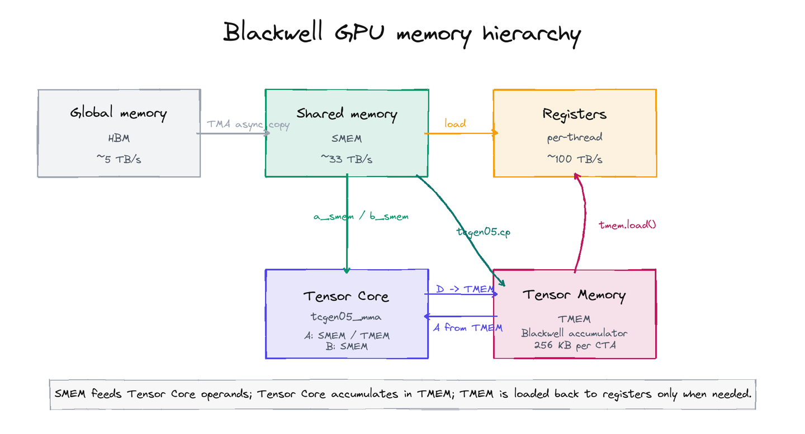
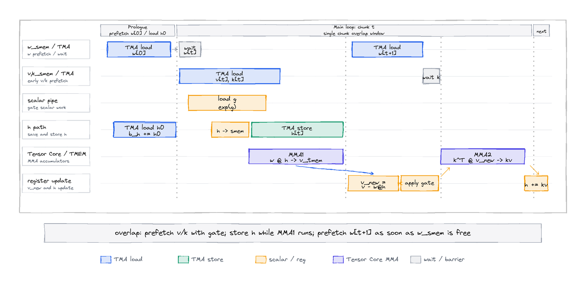
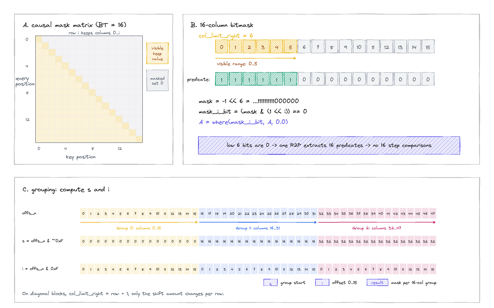

# Qwen3.5 GDN Prefill Kernel 优化

## 概述

本文从代码和 GPU 硬件层面出发，结合 Qwen3.5/Qwen3-Next 优化过程中的实际经验，介绍  GDN prefill kernel 的 Gluon 优化实践。关于 GDN 的算法原理和公式推导，可以参考 [GDN 原理与代码分析](https://zhuanlan.zhihu.com/p/2007937984738129405)。

Qwen3.5 使用 Gated Delta Rule (GDN) 线性注意力机制，其 prefill 阶段使用 chunk_wise 算法。chunk_wise 算法将长度为 T 的序列划分为 \(\lceil T / C \rceil\) 个大小为 C (chunk_size) 的块，在块间串行递推隐藏状态 (inter-chunk)，在块内并行计算注意力 (intra-chunk)，从而在递推依赖和并行度之间取得平衡。当前实现中 chunk_size = 64。


*图片来源: [FlashLinearAttention](https://arxiv.org/abs/2312.06635)。Sequential 更省显存但只能串行，chunk_wise 算法中间的 S 仍需串行递推，但各 chunk 的输出 O 可以并行计算*

GDN prefill 的 chunk_wise 算法主要包含以下 kernel:
1. **chunk_local_cumsum_scalar**: 对 gate 值做 chunk 内前缀和
2. **chunk_scaled_dot_kkt_fwd**: 计算 `A = (Q @ K^T) * scale`，即 chunk 内的注意力矩阵
3. **solve_tril**: 对下三角矩阵求解，用于 WY 分解中的递推展开
4. **recompute_w_u_fwd**: WY 分解，计算 w 和 u 矩阵
5. **chunk_gated_delta_rule_fwd_h**: 更新隐藏状态 h，递推 h_{t+1} = decay * h_t + k^T @ v_new
6. **chunk_o**: 计算输出，包含 inter-chunk (q @ h) 和 intra-chunk (A @ v) 两部分


我们使用 Gluon 对上述部分 Kernel 进行了优化，并开源到了Sglang中，详见 PR: [sgl-project/sglang#17983](https://github.com/sgl-project/sglang/pull/17983)。

本文主要讲解下对 chunk_gated_delta_rule_fwd_h 和 chunk_o 这两个核心的 chunk_wise 算法 Kernel 的优化思路。


## Blackwell 主要特性与 Gluon

### Gluon 是什么

Gluon 是 Triton 的实验性底层编程接口，允许直接控制 GPU 硬件特性。相比 Triton 的自动编译优化，Gluon 提供了对以下资源的显式控制：

| 特性 | Triton | Gluon |
|------|--------|-------|
| 数据搬运 | `tl.load` / `tl.store` (编译器调度) | TMA 异步拷贝 (显式 mbarrier 同步) |
| 矩阵乘法 | `tl.dot` (编译器选择指令) | `tcgen05_mma` (直接调用 Blackwell Tensor Core) |
| 累加器存储 | 寄存器 (编译器分配) | Tensor Memory (TMEM, 显式分配) |
| 数据布局 | 编译器自动 | `BlockedLayout` / `NVMMASharedLayout` (显式指定) |
| 内存同步 | 隐式 | `mbarrier` (显式 barrier 管理) |

更多 Gloun 的教程和使用可以参考我的专栏 https://www.zhihu.com/column/c_1990516179064858333

### 本文使用到的 Blackwell 特性

关于更多 Blackwell 的架构信息可以参考我的前一篇文章 https://zhuanlan.zhihu.com/p/1993393738165278003




**Tensor Memory (TMEM)**

TMEM 是 Blackwell 新增的片上存储层级，专用于 Tensor Core 累加，其容量为 128 行 × 512 列 × 32bit = 256KB per CTA，可以直接作为 `tcgen05_mma` 的输出累加器，避免了 Hopper 上 WGMMA 需要在寄存器中累加的瓶颈。

```
# Gluon中的典型使用模式
o_tmem_layout = TensorMemoryLayout([BT, BV], col_stride=1)
o_tmem = allocate_tensor_memory(gl.float32, [BT, BV], o_tmem_layout)  # 分配 TMEM
tcgen05_mma(a_smem, b_smem, o_tmem, use_acc=False)  # MMA 结果直接写入 TMEM
result = o_tmem.load(reg_layout)  # 需要时再从 TMEM 加载到寄存器
```

**tcgen05_mma**

Blackwell 第五代 Tensor Core 指令。相比 Hopper 的 WGMMA：
- 输入可以从 SMEM/TMEM 读取，输出写入 TMEM（而非寄存器）
- 更高的吞吐量
- 需要 `tcgen05_commit` + `mbarrier.wait` 显式同步

```
# Gluon中的 tcgen05_mma 使用模式
tcgen05_mma(a_smem_2d, b_smem_2d, output_tmem, use_acc=False)  # 不累加
tcgen05_mma(a_smem_2d, b_smem_2d, output_tmem, use_acc=True)   # 累加到已有结果
tcgen05_commit(mma_bar)                                         # 提交 MMA 操作
mbarrier.wait(mma_bar, phase=mma_phase)                         # 等待完成
```

**TMA (Tensor Memory Accelerator)**

TMA 是硬件 DMA 引擎，通过 Tensor Descriptor 描述全局内存中的多维张量布局，实现异步数据搬运。

```
# Gluon中的 TMA 使用模式
# 1. 创建 Tensor Descriptor（在 host 端）
k_desc = TensorDescriptor.from_tensor(k, [1, BT, 1, BK], layout)
# 2. 异步加载：Global -> Shared Memory
mbarrier.expect(tma_bar, k_desc.block_type.nbytes)
tma.async_copy_global_to_shared(k_desc, [i_b, offset, i_h, 0], tma_bar, k_smem)
mbarrier.wait(tma_bar, phase=tma_phase)
# 3. 异步存储：Shared Memory -> Global
fence_async_shared()
tma.async_copy_shared_to_global(h_desc, [i_b, i_t, i_h, 0, i_v * BV], h_smem)
tma.store_wait(pendings=0)
```

**mbarrier (Memory Barrier)**

mbarrier 是 Hopper/Blackwell 的异步同步原语，用于协调 TMA 和 MMA 操作。使用 phase 位翻转机制：

```
# Gluon中的 mbarrier 生命周期
tma_bar = gl.allocate_shared_memory(gl.int64, [1], mbarrier.MBarrierLayout())
mbarrier.init(tma_bar, count=1)     # 初始化
tma_phase = 0

# 每次使用
mbarrier.expect(tma_bar, nbytes)     # 声明预期到达的字节数
tma.async_copy_global_to_shared(...) # 发起异步拷贝
mbarrier.wait(tma_bar, phase=tma_phase)  # 等待完成
tma_phase ^= 1                      # 翻转 phase

# 结束时
mbarrier.invalidate(tma_bar)         # 释放
```


## chunk_delta_h Gluon kernel

### 算法描述

chunk_delta_h 实现 GDN 的隐藏状态递推更新，对应上图中 S 的串行递推过程。序列被划分为 NT = \(\lceil T / BT \rceil\) 个 chunk (BT = chunk_size = 64)，每个 chunk 内的更新如下：

```
对每个 chunk t:
  1. 存储当前 h_t
  2. v_new = v - w @ h_t            (delta rule: 用 w 投影 h 修正 v)
  3. 如果有 gate: v_new *= exp(g_last - g), h *= exp(g_last)
  4. h_{t+1} = h_t + k^T @ v_new    (用 k 的转置乘修正后的 v_new 更新 h)
```

### Gluon kernel 流水线设计



该 kernel 的核心挑战是序列化的递推关系（h_{t+1} 依赖 h_t），无法在 chunk 间并行。因此优化重点在于 **单 chunk 内的数据搬运与计算重叠**。

关键流水线策略：

1. **w 的 prologue 预取**: 在进入主循环之前就发起 w[0] 的 TMA 加载，这样主循环首次迭代可以直接 wait
2. **v 和 k 的早期预取**: 每次迭代开始时同时发起 v 和 k 的 TMA 加载，与 gate 标量计算、h 存储、w 等待、MMA1 计算重叠
3. **w 的下一迭代预取**: MMA1 完成后 w_smem 空闲，立即发起 w[t+1] 的 TMA 加载
4. **h 的 TMA store 与 MMA1 重叠**: 将 h 存入 smem 后，TMA store 和 MMA1 (w @ h) 使用不同的 smem buffer，可以并行

### 代码解析

**Prologue: 预取和初始状态加载**

```python
# 预取 w[0]，与 h0 加载重叠
mbarrier.expect(tma_bar_w, w_desc.block_type.nbytes)
tma.async_copy_global_to_shared(w_desc, [i_n, 0, i_h, 0], tma_bar_w, w_smem)

# 加载初始状态 h0 (支持转置)
if USE_INITIAL_STATE:
    tma.async_copy_global_to_shared(h0_desc, [...], tma_bar_h0, h0_smem)
    mbarrier.wait(tma_bar_h0, phase=tma_phase_h0)
    if TRANSPOSE_STATE:
        h0_smem_2d = h0_smem.reshape([BV, BK])
        h0_smem_t = h0_smem_2d.permute((1, 0))  # smem permute: [BV,BK] → [BK,BV]
        b_h0 = h0_smem_t.load(h_reg_layout)
    else:
        h0_smem_2d = h0_smem.reshape([BK, BV])
        b_h0 = h0_smem_2d.load(h_reg_layout)
    b_h = b_h + b_h0
```

**主循环: 两次 MMA 计算**

```python
for i_t in range(NT):
    # --- 预取 v 和 k (异步) ---
    tma.async_copy_global_to_shared(v_desc, [...], tma_bar_v, v_smem)
    tma.async_copy_global_to_shared(k_desc, [...], tma_bar_k, k_smem)

    # --- 标量 gate 计算 (与 TMA 重叠) ---
    bg_last = gl.load(g + ...)
    b_g = gl.load(g + ..., mask=g_mask, other=0)
    bg_last_exp = gl.exp(bg_last)

    # --- 存储 h, 等待 w, TMA store h, MMA1: w @ h ---
    h_smem_2d.store(b_h.to(dtype))
    mbarrier.wait(tma_bar_w, phase=tma_phase_w)       # 等待 w 到位
    fence_async_shared()
    tma.async_copy_shared_to_global(h_desc, [...], h_smem)  # 异步存 h
    tcgen05_mma(w_smem_2d, h_smem_2d, v_tmem, use_acc=False)  # w @ h
    tcgen05_commit(mma_bar)
    mbarrier.wait(mma_bar, phase=mma_phase)

    # --- 预取 w[t+1] (w_smem 已空闲) ---
    if i_t < NT - 1:
        tma.async_copy_global_to_shared(w_desc, [...], tma_bar_w, w_smem)

    # --- 计算 v_new = v - w @ h ---
    v_acc_reg = v_tmem.load(v_reg_layout)
    mbarrier.wait(tma_bar_v, phase=tma_phase_v)       # 等待 v 到位
    v_new_reg = v_reg - v_acc_reg

    # --- 应用 gate ---
    v_new_reg = v_new_reg * gl.exp(bg_last - b_g)[:, None]
    b_h *= bg_last_exp

    # --- MMA2: k^T @ v_new -> kv, h += kv ---
    mbarrier.wait(tma_bar_k, phase=tma_phase_k)       # 等待 k 到位
    k_t = k_smem_2d.permute((1, 0))                    # 转置
    tcgen05_mma(k_t, v_smem_2d, kv_tmem, use_acc=False)  # k^T @ v_new
    tcgen05_commit(mma_bar)
    mbarrier.wait(mma_bar, phase=mma_phase)
    b_h = b_h + kv_tmem.load(h_reg_layout)
```

### SAVE_NEW_VALUE 的 varlen 处理

在 serving 场景中，一个 batch 内不同请求的序列长度不同 (varlen)。所有序列的 token 被紧密拼接成一个连续的 1D 张量，通过 `cu_seqlens` (cumulative sequence lengths) 记录每个序列的起止位置。当序列长度不是 chunk_size 的整数倍时，最后一个 chunk 不足 BT 行，需要处理写入边界。

由于 `tma.async_copy_shared_to_global` 是按固定 block 尺寸写入的，无法自动跳过越界行。如果直接写入，会覆盖下一个序列的数据。

解决办法是一是使用 `gl.store`， 即通过 Global memory 同步 store, 但这样会带来性能损耗。二是使用 `tma.async_scatter` 按行索引写入，越界行的索引设为 `0x7FFFFFFF`（int32 最大值），TMA 硬件会跳过这些越界地址。

TMA 的 `gather4`/`scatter4` 最初是为稀疏计算设计的——在稀疏矩阵运算中，需要按非连续的行索引从全局内存收集（gather）或分散写入（scatter）数据。这组指令的核心能力是：给定一组任意行索引和连续的列范围，TMA 硬件自动完成多行数据的异步搬运，无需 CPU/GPU 线程逐行处理。varlen 场景恰好契合这个模式：有效行的索引是连续的，而越界行的索引设为无效值（`0x7FFFFFFF`），TMA 硬件自动跳过无效地址。相比同步的 `gl.store` 加 mask 方案，scatter 方式将边界判断卸载到 TMA 硬件，同时保留了异步执行的优势（存储操作与后续计算重叠），实测性能提升约 12%。

`tma.async_scatter` 要求 2D tensor descriptor，block shape 为 `[1, BLOCK_Y]`，即逐行散布。

Gather 和 Scatter 的直觉理解：

```python
# Gather: 从不同行"收集"连续列 → data = tensor[行索引][:, 列范围]
# Scatter: 向不同行"散布"连续列 → tensor[行索引, 列范围] = data
```

最终 v_new 的 store 代码如下：

```python
if SAVE_NEW_VALUE:
    if IS_VARLEN:
        t_limit_right = gl.minimum(T - i_t * BT, BT)
        t_offsets = gl.arange(0, BT, layout=offsets_layout)
        row_valid = t_offsets < t_limit_right
        x_offsets = gl.where(row_valid, bos + i_t * BT + t_offsets, 0x7FFFFFFF)
        v_new_smem.store(v_new_reg.to(dtype))
        fence_async_shared()
        tma.async_scatter(v_new_desc, x_offsets, i_h * V + i_v * BV, v_new_smem)
    else:
        tma.async_copy_shared_to_global(v_new_desc, [...], v_new_smem)
```


## chunk_o Gluon kernel

### 算法

chunk_o 计算 GDN 的输出，包含两部分：
- **inter-chunk**: 利用上一步计算好的隐藏状态 h，计算 `o_inter = q @ h`
- **intra-chunk**: 在 chunk 内部计算注意力 `o_intra = A @ v`，其中 `A = q @ k^T` 并施加 causal mask

最终输出: `o = (o_inter * exp(g) + o_intra) * scale`

### Triton vs Gluon 对比

**Triton 原始 kernel**:
```python
# 数据加载: 同步 tl.load
b_q = tl.load(p_q, boundary_check=(0, 1))
b_k = tl.load(p_k, boundary_check=(0, 1))
b_h = tl.load(p_h, boundary_check=(0, 1))
# 矩阵乘: tl.dot
b_o += tl.dot(b_q, b_h)     # inter-chunk
b_A += tl.dot(b_q, b_k)     # 注意力矩阵
# causal mask: 逐元素比较
o_i = tl.arange(0, BT)
m_A = o_i[:, None] >= o_i[None, :]
b_A = tl.where(m_A, b_A, 0)
```

**Gluon kernel**:
```python
# 数据加载: TMA 异步拷贝 + mbarrier 同步
mbarrier.expect(tma_bar_qh, q_desc.block_type.nbytes + h_desc.block_type.nbytes)
tma.async_copy_global_to_shared(q_desc, [...], tma_bar_qh, q_smem)
tma.async_copy_global_to_shared(h_desc, [...], tma_bar_qh, h_smem)
# 矩阵乘: tcgen05_mma (Blackwell Tensor Core)
tcgen05_mma(q_smem_2d, h_smem_2d, o_tmem, use_acc=use_acc)  # inter-chunk
tcgen05_mma(q_smem_2d, k_t, A_tmem, use_acc=use_acc)         # 注意力矩阵
# causal mask: bitmask 优化 (见下文)
A_reg = _apply_causal_mask(A_reg, col_limit_right)
```

### 优化思路

chunk_o Gluon kernel 的优化思路：
1. **TMA 异步加载**: q 和 h 使用同一个 mbarrier 合并加载，k 使用独立 mbarrier，实现加载与计算的流水线重叠
2. **tcgen05_mma**: 使用 Blackwell Tensor Core，结果直接写入 TMEM，避免寄存器压力
3. **TMEM 累加器**: o_tmem 和 A_tmem 分别作为 inter-chunk 和注意力矩阵的累加器
4. **TMA 异步 scatter (varlen)**: 变长场景使用 `tma.async_scatter` 处理边界

### varlen async_scatter 优化

chunk_o 的输出写入同样面临 varlen 边界问题，处理方式与 chunk_delta_h 的 [SAVE_NEW_VALUE varlen 处理](#save_new_value-的-varlen-处理) 一致，使用 `tma.async_scatter` 按行索引写入，越界行跳过。

```python
if IS_VARLEN:
    t_limit_right = gl.minimum(T - i_t * BT, BT)
    t_offsets = gl.arange(0, BT, layout=offsets_layout)
    mask_o = t_offsets < t_limit_right
    x_offsets = gl.where(mask_o, i_t_start + t_offsets, 0x7FFFFFFF)
    o_smem_2d = gl.allocate_shared_memory(dtype, [BT, BV], o_desc.layout)
    o_smem_2d.store(o_reg.to(dtype))
    fence_async_shared()
    tma.async_scatter(o_desc, x_offsets, i_h * V + i_v * BV, o_smem_2d)
else:
    tma.async_copy_shared_to_global(o_desc, [...], o_smem)
```

### bitmask 优化

**原始 causal mask** 使用逐元素比较：

```python
o_i = tl.arange(0, BT)
m_A = o_i[:, None] >= o_i[None, :]  # BT * BT 次比较
b_A = tl.where(m_A, b_A, 0)
```



**bitmask 优化**（参考 [Tri Dao 的 cuteDSL 相关实现](https://github.com/Dao-AILab/flash-attention/commit/bac1001e4f6caa09d70537495d6746a685a2fa78)）将 causal mask 编码为位掩码，按 16 元素分组批量生成 predicate：

```python
@gluon.jit
def _mask_scalar(A, col_limit_right, s, i):
    col_lim_right_s = col_limit_right - s
    col_lim_right_cur = max(col_lim_right_s, 0)
    mask = -1 << col_lim_right_cur
    mask_i_bit = (mask & (1 << i)) == 0
    return gl.where(mask_i_bit, A, 0.0)

@gluon.jit
def _apply_causal_mask(A, col_limit_right):
    offs_n = gl.arange(0, A.shape[1])[None, :]
    s = offs_n & ~0xF       # 16 元素分组的起始索引
    i = offs_n & 0xF        # 组内偏移 (0-15)
    return gl.map_elementwise(_mask_scalar, A, col_limit_right, s, i)

# 调用
col_limit_right = gl.arange(0, BT)[:, None] + 1  # 第 i 行可见前 i+1 列
A_reg = _apply_causal_mask(A_reg, col_limit_right)
```

`col_limit_right` 的含义：对于当前块的第 i 行，可见的列数为 `col_limit_right[i]`。例如 `col_limit_right = [1, 2, 3, ..., 64]` 表示第 0 行只能看到第 0 列，第 1 行能看到第 0-1 列，以此类推。

`_apply_causal_mask` 将列索引按 16 个一组分组处理。`s = offs_n & ~0xF` 清除低 4 位得到组起始索引，`i = offs_n & 0xF` 得到组内偏移。

位掩码构造示例 (第 21 行, `col_limit_right = 21`)：

```
对于第一组 (s=0, 列 0-15):
  col_lim_right_s = 21 - 0 = 21, col_lim_right_cur = max(21, 0) = 21
  mask = -1 << 21  →  低 16 位全为 0，组内全部可见

对于第二组 (s=16, 列 16-31):
  col_lim_right_s = 21 - 16 = 5, col_lim_right_cur = max(5, 0) = 5
  mask = -1 << 5 = 0xFFFFFFE0
       = ...1111 1110 0000 (低 5 位为 0，表示可见)

  检查组内每个位置:
  ┌─────────────────────────────────────────────────────────┐
  │ i=0: mask & (1<<0) = 0 → mask_i_bit=True  → 保留 (可见)   │
  │ i=1: mask & (1<<1) = 0 → mask_i_bit=True  → 保留 (可见)   │
  │ i=2: mask & (1<<2) = 0 → mask_i_bit=True  → 保留 (可见)   │
  │ i=3: mask & (1<<3) = 0 → mask_i_bit=True  → 保留 (可见)   │
  │ i=4: mask & (1<<4) = 0 → mask_i_bit=True  → 保留 (可见)   │
  │ ─────────────────────────────────────────────────────── │
  │ i=5: mask & (1<<5) ≠ 0 → mask_i_bit=False → 置零         │
  │ i=6 到 i=15: 都被 mask                                    │
  └─────────────────────────────────────────────────────────┘
  结果: 列 16-20 可见, 列 21-31 被 mask → 列 0-20 全部可见
```

使用 `gl.map_elementwise` 而非先算完所有 mask 再做 where 的原因：`map_elementwise` 生成交错的指令序列（`mask[0], where[0], mask[1], where[1], ...`），让 ptxas 更好地优化 SASS，减少寄存器压力。

bitmask 优势：

| 方面 | 朴素方法 | bitmask |
|------|----------|---------|
| 比较次数 | BT 次逐元素比较 | 1 次移位 + R2P 提取 |
| predicate 生成 | 逐个生成 | R2P 指令一次提取 16 个 |
| 分支开销 | 多个 setp 指令 | 位操作单元 |

ncu 结果显示，使用 bitmask 后指令数大幅降低。


## Transposed State 支持

GDN 的隐藏状态 h 默认形状为 `[N, H, K, V]`。在 prefill -> decode 过渡时，CuTeDSL decode kernel 需要 `[N, H, V, K]` 布局（K 维连续）以优化内存访问。相关实现见 PR: [sgl-project/sglang#17981](https://github.com/sgl-project/sglang/pull/17981)。

为避免额外的 transpose kernel，我们在 prefill 的 chunk_delta_h kernel 中直接支持以转置布局输出 h。Triton kernel 通过修改 `make_block_ptr` 的 stride/order 参数切换 row-major/column-major 访问；Gluon kernel 原本在寄存器上进行转置，但发现这种做法额外开销过大，当前通过复用  `smem.permute()` 实现零拷贝转置（只改变访问视角，不产生数据搬运）。


## cumsum 向量化优化

除 Gluon kernel 外，本 PR 还优化了 cumsum kernel。原始 `chunk_local_cumsum_scalar_kernel` 每个 thread block 只处理一个 head 的一个 chunk，存在访存未合并问题。

优化思路是改变数据的Layout，将 BH 个 head 合并到同一个 block 中处理，把 1D tensor `[BT]` 变为 2D tensor `[BT, BH]`。2D tensor 使得 Triton 编译器能推导出更优的 blocked layout：从 8 warp 标量访存变为单 warp 向量化访存（`ld/st.global.v4.b32`），解决了原始 kernel 在 `HEAD_FIRST=False` 布局下的访存未合并问题。

关于 cumsum kernel 的 NCU 性能分析、TTIR/TTGIR layout 推导、PTX 指令对比等详细内容，参见 [Triton cumsum Kernel 访存优化](https://zhuanlan.zhihu.com/p/2007222509582426207)。


## 总结

本文介绍了 Qwen3.5 GDN prefill 阶段的部分 kernel 优化工作，性能提升较为可观。GDN 算法原理和 Triton 侧的 kernel 实现来自 [fla-org/flash-linear-attention](https://github.com/fla-org/flash-linear-attention)，感谢参与以上工作的作者们。

如有相关问题或建议，欢迎留言，以及通过 GitHub Issue 或 PR 交流讨论。

