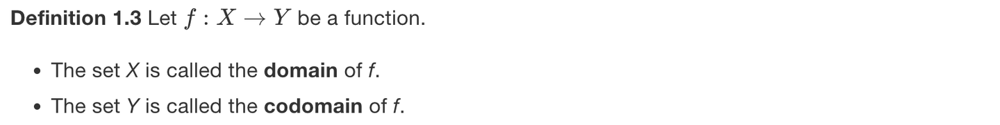
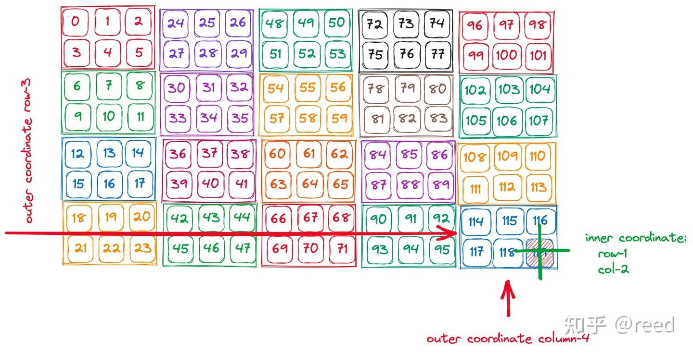
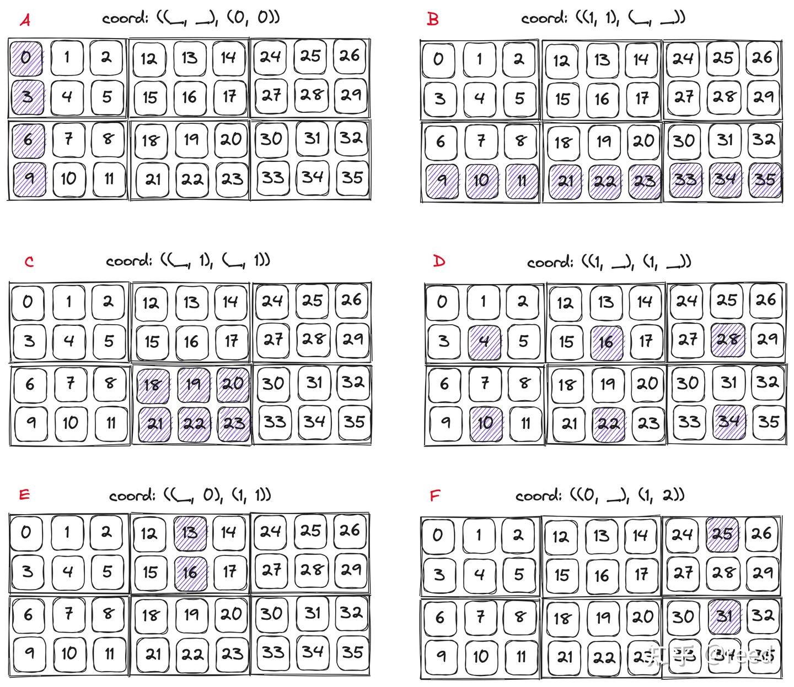
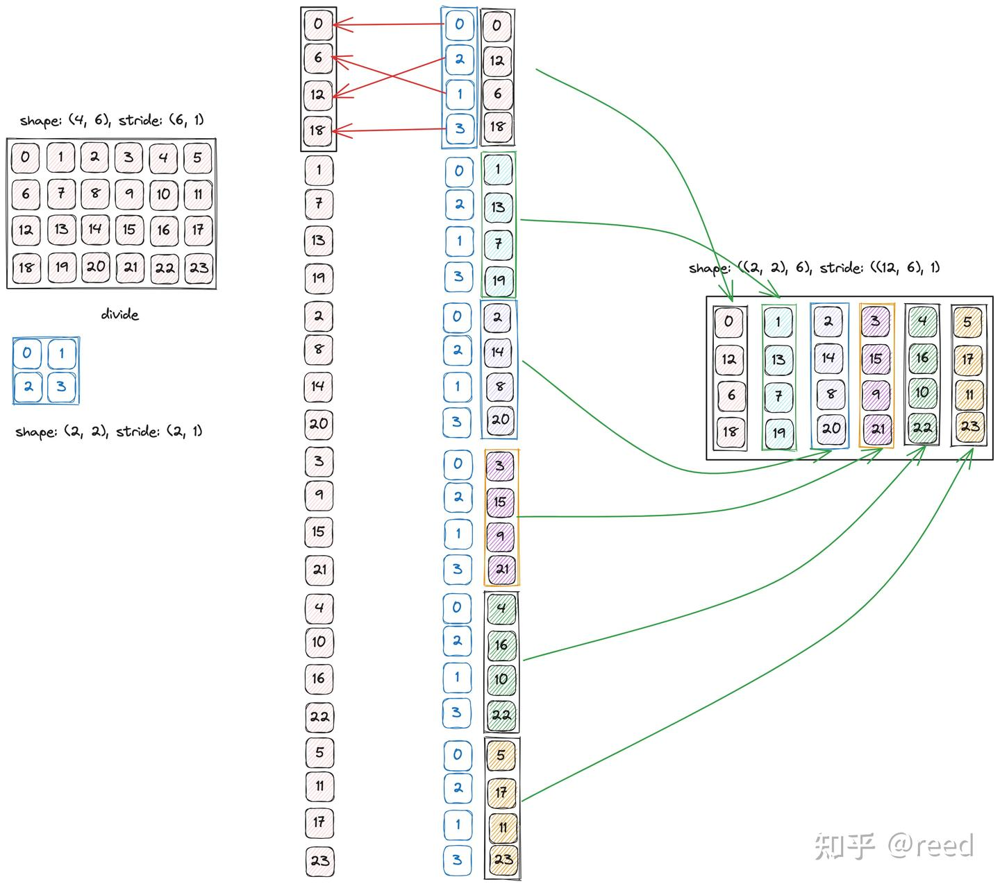
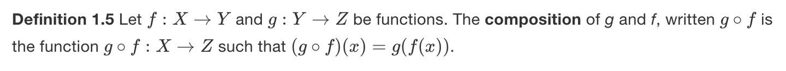
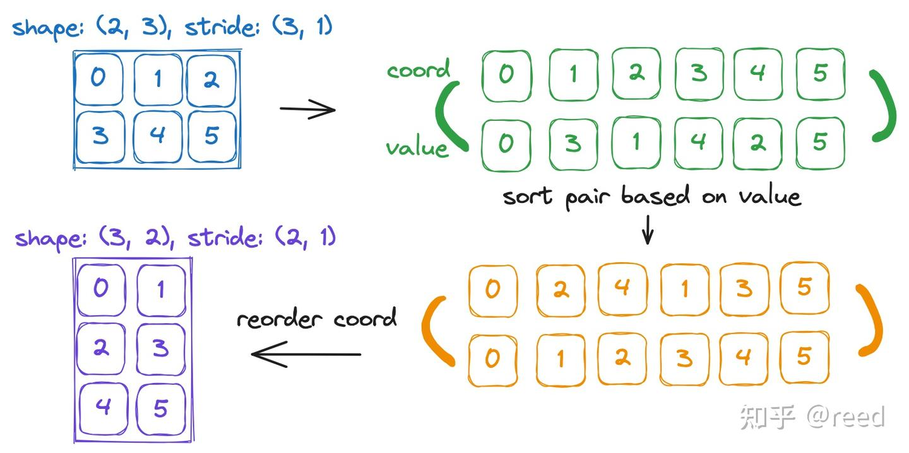

# CuTe Layout 的代数和几何解释

**Author:** [reed](https://www.zhihu.com/people/reed)

**Link:** [https://zhuanlan.zhihu.com/p/662089556](https://zhuanlan.zhihu.com/p/662089556)

---

前面文章"[CuTe 之 Layout](https://zhuanlan.zhihu.com/p/661182311)"通过回顾shape和stride描述体系介绍了有层次的Layout的基础概念。本文将围绕Layout进行更全面的介绍，包含：Layout的基本属性和Layout的运算。这些运算是定义在以shape和stride为参数之上的代数运算，同时为了更直观和形象的展示这些操作，本文会通过几何的形式呈现这些运算。几何是设计和思考模型，代数是实现和计算形式。

## 基本属性

如图1，展示了一个有层次的Layout，可以看到它的组成分为两个层级，其中小的Tensor采用同样的颜色表示，图中的左上角0到5展示了一个内层的Tensor，然后沿着纵向和横向重复该Tensor，其中行方向重复4次，列方向重复5次。得到的Hierarchical Tensor的shape: ((2, 4), (3, 5))，同样我们可以得到其stride: ((3, 6), (1, 24))。Layout的本质是函数其数学描述可以参考


*Figure 1. shape为((2, 4), (3, 5)), stride为((3, 6), (1, 24))的Layout示意图*

针对图1的Layout，有如下基本属性，列举为如下表格

| shape | stride | size | rank | depth | coshape | cosize |
| --- | --- | --- | --- | --- | --- | --- |
| ((2,4),(3,5)) | ((3,6),(1,24)) | 120 | 2 | 2 | 120 | 120 |

其中shape，stride表示Layout的逻辑形状和每一个维度上在地址空间上步长；size表示该逻辑空间的大小其数值上等于shape维度的积即
$$
size = \prod_{i = 0}^{nshape - 1} shape_{i}
$$
，rank表示该Layout的秩，其数值上等于shape中第一层的元素的个数（括号表示一个维度合并），图示的维度为2，其中（2，4）贡献一个维度，（3，5）贡献一个维度；depth表示嵌套的深度，flat Layout 的 depth 为 1，则此处图示的Tensor的深度为2；coshape，cosize表示codomain的空间大小和占用的空间大小，此处为120，如果stride存在不紧凑的情形，则cosize可能会大于domain域的size。

## 坐标（coordinate）

Layout是有层次的，那么访问这种有层次的Layout所需的坐标自然也是有层次的。对于只有一层的Tensor的访问，可以通过指定行坐标和列坐标来实现，如 `auto coord1 = make_coord(0, 1);`其表示构建一个一层的坐标，其中行坐标为0，列坐标为1。如需构建有层次的坐标，则可以通过将make_coord的结果进行嵌套，形如如下格式

```cpp
auto row_coord = make_coord(1, 3);
auto col_coord = make_coord(2, 4);
auto coord = make_coord(row_coord, col_coord);
```

*Figure 2. coord: ((1, 3), (2, 4))所表示的位置和访问层次*

其实现了对Layout(实际为Tensor)的有层次访问，其中的row_coord中的1，3分别表示在内层和外层Tensor的行方向的坐标，col_coord中的2，4表示在内层和外层Tensor的列方向的坐标，该坐标可以简记为 `coord: ((1, 3), (2, 4))`。如图2，其表示了对该坐标的访问。  
除了具体的坐标值，CuTe提供了用于对某个维度全选的Underscore类型和对应的变量`_`;该变量类似于python或fortran语言中的冒号(`:`)，可以用来表示某个维度的全部选定，该功能在下一小节的Layout切片中被大量使用。

## 切片（slice）

通过提供坐标可以访问到某一个具体坐标上的数值，很多时候我们除了需要访问单个位置之外，还需要只固定一些坐标位置，而其他位置进行全选，来完成Tensor的切片操作（slice）。这种需求可以通过之前坐标章节提到的Underscore类型来完成。具体地，我们可以slice第一列数据，或者一行数据，或者其中的第一层Tensor。如图3其展示了不同的slice的效果，函数调用形式如代码片段所示：


*Figure 3. Layout的切片运算示意图*
```cpp
auto layout_out = slice(coord, layout_in);
```

## 补集（complement）

Layout的本质是函数，函数的本质是集合，Layout定义了从domain到codomain的投影，当codomain存在不连续时，则存在空洞的位置，如图4所示，这时候我们可以构造一个Layout2能够填充上codomain的空洞位置，此时我们构造的Layout则为原Layout的补集，同时为了表示的简洁性，补集会被压缩为最小表示，周期性重复的部分会被约掉。


*Figure 4. Layout的补集*

## 乘法（product）

实数域乘法的语义是将某个量重复若干次。Layout乘法计算中同样遵循该语义：重复某个Tensor若干次。由于Tensor的表示是有高维数据，所以其上的乘法在实现上也有多个，但本质不变。CuTe中定义的乘法包含如下5个  
logical_product，tiled_product，zipped_product，blocked_product，raked_product  
我们有两个Layout对其进行相乘，其中第一个shape:(x, y)，第二个shape: (z, w), 则其乘积的shape: (x, y, z, w)。同时我们约定各种乘法的层级顺序，如shape: ((x,y ), (z, w))，本质上而言x, y, z, w的顺序和层级关系并不重要，核心是我们对乘积进行访问的时候需要按照乘约定的顺序即可。只是在现实实现中我们要遵循一种约定，方便我们后期的使用，于是我们约定了各个乘法的顺序和层级如下

| 乘法模式 | 乘积的shape |
| --- | --- |
| logical | ((x, y), (z, w)) |
| zipped | ((x, y), (z, w)) |
| tiled | ((x, y), z, w) |
| blocked | ((x, z), (y, w)) |
| raked | ((z, x), (w, y)) |

如图5所示，Layout乘法在集合上可以认为是按照图示的形式进行的，在Layout x Layout的计算中，首先将Layout1按照Layout2的顺序进行重复，原来Layout2中的位置被Layout1所占据，然后将其中的内层数据数据Layout1按照列优先的顺序排成一列，外层Layout按照列优先排列后表示为最终矩阵的列。


*Figure 5. Layout乘法的几何解释*

## 除法（divide）

除法是乘法逆运算，实数域上的除法表示被除数能被除数分多少份。如
$$
10 \div 5 = 2
$$
，Layout上的除法也有类似的逻辑，但Layout除法和实数域不同的是Layout除法的结果是一种划分层次，但不是被划分的结果。如果用实数域的公式来表达则为
$$
10 \div 5= (5, 2)
$$
。其中作为结果的括号中的5表示被分解的块的大小，2表示可以被分解多少次。如图6所示，其展示了Layout的除法，首先按照列优先将被除数Layout转化为一维表示，同时按照列优先将除数Layout展开为一维表示，结果中第一维度为除数Layout的大小，根据其中的Layout数值从被除数中取值作为输出的结果。如（0，6，12，18）序列按照（0，2，1，3）的顺序进行取值后得到（0，12，6，18）序列，重复后续位置，并且表示为列行模式，则得到图中右侧表示。其shape表示中rank-0表示分块时每一个块的大小，rank-1表示能被分割多少块。


*Figure 6. Layout除法的几何解释*

在CuTe中，提供了三个Layout除法函数，分别为logical、tiled、zipped。它们的整体逻辑是一致的，只是在最后的维度（rank）表示上有略微差别。

## 复合函数和逆（composition & inverse）

Layout的本质是函数，Layout的复合即函数复合，此处我们引用复合定义如下，



同时，函数域上我们引用单位函数的定义如下


在有了复合函数和单位函数的定义之后，我们引入左逆和右逆的定义如下


几何化的right_inverse表示如图7所示，首先将Layout按照列优先对coord和对应的value进行排列，采用two line notation表示形式。根据右逆的计算逻辑，要找到一个排列能够使得其满足输入value得到单位排列（此处刚好为coord），则按照value进行排列得到的coord即为上面要求的排列，如图中橙色排列所示，其coord就是我们需要的right inverse，将其转换为shape和stride形式如图左下角结果。


*Figure 7. right inverse的几何解释*

## 总结

我们介绍了Layout的基本属性和常用代数方法，并通过几何图形的形式对Layout常用的运算进行了相应的解释，通过该文章，我们可以对Layout有基本的认识，并且能用Layout计算完简单的Layout变换。更详细的差异和结果可以直接通过CuTe进行实验来得到。

## 参考

[https://zhuanlan.zhihu.com/p/661182311](https://zhuanlan.zhihu.com/p/661182311)

[https://www.ucl.ac.uk/~ucahmto/0007_2021/1-2-functions.html](https://www.ucl.ac.uk/~ucahmto/0007_2021/1-2-functions.html)
