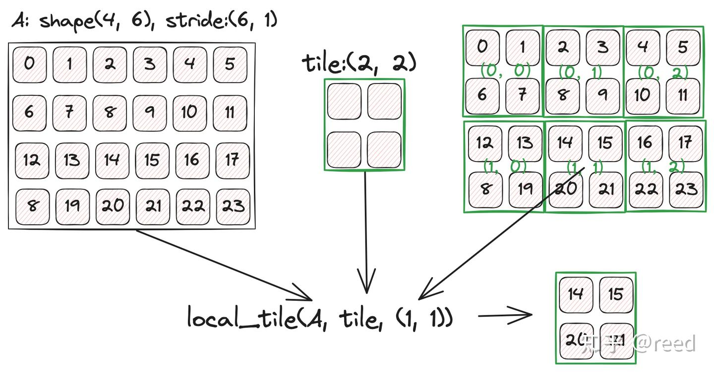

# CuTe 之 Tensor

**Author:** [reed](https://www.zhihu.com/people/reed)

**Link:** [https://zhuanlan.zhihu.com/p/663093816](https://zhuanlan.zhihu.com/p/663093816)

---

前面的章节介绍了[CuTe Layout](https://zhuanlan.zhihu.com/p/661182311)以及[Layout的代数和几何解释](https://zhuanlan.zhihu.com/p/662089556)，Layout描述了数据的排列和底层存储位置关系，但Layout并没有指定存储。Tensor就是在Layout的基础上包含了存储，即Tensor = Layout + storage，数据存储的具体表现上可以是指针表达的数据或是栈上数据（GPU上表现为寄存器）。CuTe中的Tensor并不同于深度学习框架中的Tensor（如PyTorch、Tensorflow），深度学习框架中的Tensor更强调数据的表达实体，通过Tensor实体与实体之间的计算产生新的Tensor实体，即多份数据实体，CuTe中的Tensor更多的是对Tensor进行分解和组合等操作，而这些操作多是对Layout的变换（只是逻辑层面的数据组织形式），底层的数据实体一般不变更。也就是说深度学习框架中的Tensor是通过Tensor产生新Tensor，CuTe中是对数据表达形式的变换，底层数据一般不变更，指变更表达的形式，这个表达形式的变更是通过之前文章介绍的Layout上的运算实现的。之所以有这些差别是因为深度学习框架中的Tensor是用来表达数据实体，CuTe中的Tensor是偏向描述的实体。

本文介绍了CuTe中Tensor的相关操作，通过阅读本文，开发者可以了解CuTe中Tensor的常用方法，熟悉Tensor方法的语义，为后续通过Tensor进行操作和变换提供基础知识。在文章结构方面，本文首先介绍CuTe中Tensor的常用函数，然后以一个向量求和的例子展示如何使用CuTe Tensor工具，最后文章对Tensor的特性和使用进行了总结。

## Tensor的生成

```cpp
// 栈上对象：需同时指定类型和Layout，layout必须是静态shape
Tensor make_tensor<T>(Layout layout);

// 堆上对象：需指定pointer和Layout，layout可动可静
Tensor make_tensor(Pointer pointer, Layout layout);

// 栈上对象，tensor的layout必须是静态的
Tensor make_tensor_like(Tensor tensor);

// 栈上对象，tensor的layout必须是静态的
Tensor make_fragment_like(Tensor tensor);
```

通过make_tensor可以方便的生成Tensor，常用的Tensor构造方式有两种，一种是栈上对象，如上形式1；第二种是堆上对象，通过指定pointer来实现；线性地址指针pointer，layout描述pointer指向的数据的layout，其可以是多hierarchy的。其中pointer可以通过`make_gmem_ptr, make_smem_ptr`来生成。其中栈上的对象必须是静态的，堆上对象可以是动态也可以是静态，不存在动态的栈上结构，整体如下表格：

|  | Static | Dynamic |
| --- | --- | --- |
| Heap non-owning | make_tensor(ptr, make_shape(Int<M>{}, Int<N>{})); make_tensor_like(tensor); make_fragment_like(tensor); | make_tensor(ptr, make_shape(M, N)); |
| Stack owning | make_tensor(make_shape(Int<M>, Int<N>{})); make_tensor_like(tensor); make_fragment_like(tensor); | NA |

## Tensor维度信息查询

全局`size`函数可以获取tensor的元素的个数。其重载了比较运算，可以直接和整数类型进行比较。同时Tensor也提供了面向对象的方式来获取各个属性信息，其成员函数和全局函数如下：

```cpp
// 成员函数
Tensor::layout();
Tensor::shape();
Tensor::stride();
Tensor::size();

// 全局函数, 可以获取完整信息，或者通过<>获取某一个维度
auto cute::layout<>(Tensor tensor);
auto cute::shape<>(Tensor tensor);
auto cute::stride<>(Tensor tensor);
auto cute::size<>(Tensor tensor);
auto cute::rank<>(Tensor tensor); // (1, (2, 3)) => rank 2
auto cute::depth<>(Tensor tensor);
```

## Tensor的访问operator()/operator[]

Tensor可以通过**括号运算符**来实现对数据的访问（可读+可写）, 坐标可以使用一维的，也可以使用有层次的表示形式，具体的如下：

```cpp
Tensor tensor = make_tensor(ptr, layout);
auto coord = make_coord(irow, icol);

tensor(0) = 1;
tensor(1, 2) = 100;
tensor(coord) = 200;
```

也可以通过`data`函数直接获取数据存储空间的地址

```text
Tensor::data();
```

## Tensor的Slice

可以通过`_`来筛选（slice）特定轴，和Layout的表达形式一致，具体的代码如下：

```cpp
Tensor tensor = make_tensor(ptr, make_shape(M, N, K)); // MxNxK
Tensor tensor1 = tensor(_, _, 3); // MxN, k=3
```

## Tensor的Take

通过take函数提取take出[B, E)的轴上的数据

```cpp
Tensor tensor = make_tensor(ptr, make_shape(M, N, K));
Tensor tensor1 = take<0, 1>(tensor);
```

## Tensor的flatten

将层次的layout展开为一层（不是将M，N，K 展开为 MNK）

```cpp
Tensor tensor = ...; // M, N, K
Tensor tensor1 = flatten(tensor); // M, N, K
```

## Tensor的层级合并coalesce

层级中如果存在空间可连续的坐标，即stride意义下不存在空隙，则进行合并

```cpp
Tensor tensor = make_tensor(ptr, make_shape(M, N));
Tensor tensor1 = coalesce(tensor);
```

## Tensor的主轴层级化group_modes

将[B,E)的主轴层级化为一个新的层级

```cpp
Tensor tensor = ...; // 1, 2, 3, 4
Tensor tensor1 = group_modes<B, E>(tensor); // B=1,E=3 => 1, <2, 3>, 4
```

## Tensor的划分logical_divide/tiled_divide/zipped_divide

divide是将tensor进行按照tile参数的大小进行划分，具体的可以参考前序文章"CuTe Layout代数和几何解释"中的除法的解释：

```cpp
Tensor tensor = ...;
Tensor tensor1 = logical_divide(tensor, tile);
Tensor tensor2 = zipped_divide(tensor, tile);
Tensor tensor3 = tiled_divide(tensor, tile);
```

## Layout的乘积logical/zipped/tiled/blocked/raked

Tensor上没有定义乘法，只有Layout上有乘法，其表达了**重复**的语义：

```cpp
Layout = ..;
Tile tile = ...;
Layout tensor1 = logical_product(layout, tile);
Layout tensor2 = zipped_product(layout, tile);
Layout tensor3 = tiled_product(layout, tile);
Layout tensor4 = blocked_product(layout, tile);
Layout tensor5 = raked_product(layout, tile);
```

## Tensor的局部化切块local_tile

该函数是Tensor中用户可以使用到的重要的函数，可以通过tile方法对tensor进行分块，通过local_tile可以实现从大的tensor中切取tile块，并且通过coord进行块的选取，以下代码展示了将维度为MNK的张量按照`2x3x4`的小块进行划分，取出其中的第`(1, 2, 3)`块。

```cpp
Tensor tensor = make_tensor(ptr, make_shape(M, N, K));
Tensor tensor1 = local_tile(tensor, make_shape(2, 3, 4), make_coord(1, 2, 3));
```

*Figure 1. local tile的几何解释*

如上图1所示，A Tensor表达了4行6列的行优先的数据，分块的tile大小为2x2, local_tile会将A矩阵按照tile的单位进行分块，然后根据坐标选取出(1, 1)位置的分块，如图则取出了（1，1）位置的tensor得到右下角的结果。

## Tensor的局部数据提取local_partition

local partition和local tile类似，现将大的Tensor按照tile大小进行分块，分块后每一块取出coordinate指定的元素形成新的块，代码形式和具体实例参考图2:

```cpp
Tensor tensor = make_tensor(ptr, ...);
Tensor tensor1 = local_partition(tensor, tile);
```

*Figure 2. local partition的几何解释*

## Tensor数据类型转换recast

Tensor表达了特定的数据类型的数据，可以对其进行数据类型的重新解释，然后形成新的tensor，类似于C++中的reinterpret_cast语义，代码形式如下：

```cpp
Tensor tensor = make_tensor<float>(make_shape(...));
Tensor tensor1 = recast<NewType>(tensor);
```

## Tensor内容的填充fill和清除clear

`clear()`, `fill()` 可以对tensor进行元素级别的清除和填充操作

```cpp
Tensor tensor = make_tensor(...);

clear(Tensor); // 使用T{}类型的默认构造函数对tensor进行赋值
fill(Tensor tensor, T value); // 将Tensor中的值填充为value值。
```

## Tensor的线性组合axpby

对两个tensor进行线性组合运算`y = a*x + b*y`：

```cpp
Tensor x = make_tensor(...);
Tensor y = make_tensor_like(x);

axpby(a, x, b, y);
```

## Tensor的打印print

可以通过全局print方法来完成对tensor的打印来debug和展示Tensor的信息，print会打印tensor存储空间所在的位置和shape、stride信息，而print_tensor除了以上信息还会打印Tensor中具体的每一个数值：

```cpp
Tensor tensor = make_tensor(...);
print(tensor);
print_tensor(tensor);
```

## 特殊矩阵

构造只有形状没有类型的tensor，用于一些特定变换：

```cpp
Tensor tensor = make_identity_tensor(shape);
```

## 使用Tensor实现Vector Add示例：

以上回顾了Tensor的常用操作和方法，下面我们通过具体的实例展示如何使用Tensor工具实现CUDA kernel来完成针对half类型数据的向量化的z = ax + by + c的计算。

对于该向量类问题，如果有丰富的CUDA 开发的经验，我们可以通过如下优化手段提供高效的实现：

* 单个线程处理多个数据，通过数据预取和指令并行，提升数据读取效率、提升执行单元的流水线效率；
* 对global内存进行大字长读写，减少数据IO所需要的指令数目，减少调度开销，提升程序运行效率；
* 使用Half2类型，减少half类型引入的PRMT指令的转换和开销；
* 使用FMA（fused multiply accumulate）指令完成计算，减少FMUL、FADD指令数，提升计算精度；

具体地，我们实现了如下函数，

```cpp
// z = ax + by + c
template <int kNumElemPerThread = 8>
__global__ void vector_add_local_tile_multi_elem_per_thread_half(
    half *z, int num, const half *x, const half *y, const half a, const half b, const half c) {
  using namespace cute;

  int idx = threadIdx.x + blockIdx.x * blockDim.x;
  if (idx >= num / kNumElemPerThread) {  // 未处理非对齐问题
    return;
  }

  Tensor tz = make_tensor(make_gmem_ptr(z), make_shape(num));
  Tensor tx = make_tensor(make_gmem_ptr(x), make_shape(num));
  Tensor ty = make_tensor(make_gmem_ptr(y), make_shape(num));

  Tensor tzr = local_tile(tz, make_shape(Int<kNumElemPerThread>{}), make_coord(idx));
  Tensor txr = local_tile(tx, make_shape(Int<kNumElemPerThread>{}), make_coord(idx));
  Tensor tyr = local_tile(ty, make_shape(Int<kNumElemPerThread>{}), make_coord(idx));

  Tensor txR = make_tensor_like(txr);
  Tensor tyR = make_tensor_like(tyr);
  Tensor tzR = make_tensor_like(tzr);

  // LDG.128
  copy(txr, txR);
  copy(tyr, tyR);

  half2 a2 = {a, a};
  half2 b2 = {b, b};
  half2 c2 = {c, c};

  auto tzR2 = recast<half2>(tzR);
  auto txR2 = recast<half2>(txR);
  auto tyR2 = recast<half2>(tyR);

#pragma unroll
  for (int i = 0; i < size(tzR2); ++i) {
    // two hfma2 instruction
    tzR2(i) = txR2(i) * a2 + (tyR2(i) * b2 + c2);
  }

  auto tzRx = recast<half>(tzR2);

  // STG.128
  copy(tzRx, tzr);
}
```

其中template行通过编译时常量指定每个线程处理8个数据，避免运行时常量不能利用寄存器（寄存器不可以寻址）所带来的Local Memory问题。由于一个线程处理8个元素，并且单个数据的大小为sizeof(half) = 2, 这样一个线程所需要的数据量为8 x 2 = 16byte，该大小的数据可以通过LDG.128指令实现一条指令完成对数据从全局内存到寄存器到加载；

其中函数声明行通过 __global__ 关键字指明该函数为cuda kernel函数，且通过const等信息提示了输入输出数据；

using行引入CuTe的名字空间，以便使用CuTe名字空间中的Tensor工具和其他函数；

idx和if判断行，通过使用cuda提供的内建threadIdx、blockIdx、blockDim变量来定位线程在网格中的位置；

Tensor tz、tx、ty行，通过利用make_tensor 接口将kernel参数中的裸指针和维度信息包装成tensor表达；

Tensor tzr、txr、tyr行，通过local_tile方法实现对tz/tx/ty Tensor的分块和选择（利用idx），在这之后我们只需要关注我们需要处理的局部的tensor即可，无需关注大的全局的tensor。同时在进行局部切块的时候，我们使用Int<>{}形式实现形状的编译常量表示，避免了运行时的量及其会引入的local memory；

Tensor txR、tyR、tzR行通过make_tensor_like接口实现栈上tensor的定义（GPU表现为寄存器空间）；

copy行通过调用CuTe提供的copy函数实现全局内存数据读入到寄存器空间，此处会生成LDG.128指令；

half2 a2、b2、c2行，重复系数a、b、c构造half2类型的系数，以利用的HFMA2的指令完成后续计算；

auto tzR2等行通过recast指令实现连续的half类型到half2类型的转换，以便能利用更高效的HFMA2指令；

pragma 及后续for行实现了多个元素的z = ax + by + c的计算，并且通过括号将该计算通过两个HFMA2指令实现，如果没有括号，则其会生成 HMUL2 + HMUL2 + HADD2 + HADD2指令（由于乘法不满足结合律，且IEEE规定了浮点数计算的顺序需按照代码书写顺序）；

最后我们将结果cast回来并通过copy接口将计算结果存储到全局内存；

值得注意的是，Tensor tz; Tensor tzr; 行看似是生成Tensor但实际其并没有涉及到全局内存到读写（并没有Tensor被拷贝），只是利用Layout进行tensor的表达和变换数，数据实体没有移动，只有在copy的时候才有实际的数据读写。这也回应了文章开头的对CuTe中Tensor和深度学习框架中的Tensor不一样，大部分时间，我们在CuTe中使用Tensor只是使用Tensor的逻辑语义和变换，并没有实质的触发Tensor的搬运。同时我们也看到我们使用Tensor语义和工具能够更形象化的表达我们的逻辑，方便我们的思考，而CUDA的优化思路和技巧并不会因为Tensor的引入而变简单或困难。Tensor只是工具，可以方便我们的表达，至于深层次的优化思路那还是对经验的挑战。

## 总结与讨论

本文介绍CuTe中Tensor常用的方法，并通过该Tensor工具完成了向量乘加法运算。Tensor是对数据表达的一种很好的抽象，我们可以利用这些抽象简化我们的思考模型（使我们的思考可以更抽象），降低编程困难，CuTe中提供的Tensor更多的是对Tensor的表达和变换，由Tensor生成Tensor只是Layout表达的变换并不产生数据实体的搬运（如local_tile）。Tensor表达虽然提供了很多方便，但也只限于表达的高效和便捷，如何对程序进行优化，Tensor表达的引入并没有提供额外帮助，它仍然需要我们从别的途径来获得。

即便如此，"表达和抽象"依然无比重要，那正如：伽罗瓦如果没有群这一表达工具，就难以解决多项式根的问题；杨振宁没有群这一工具就难以构思举世的杨-米尔斯理论。

抽象和工具让我们可以在更高的维度上思考。在后续文章中我们将基于Tensor（Layout）这种抽象进行MMA（matrix multiply accumulate）和COPY的介绍。
