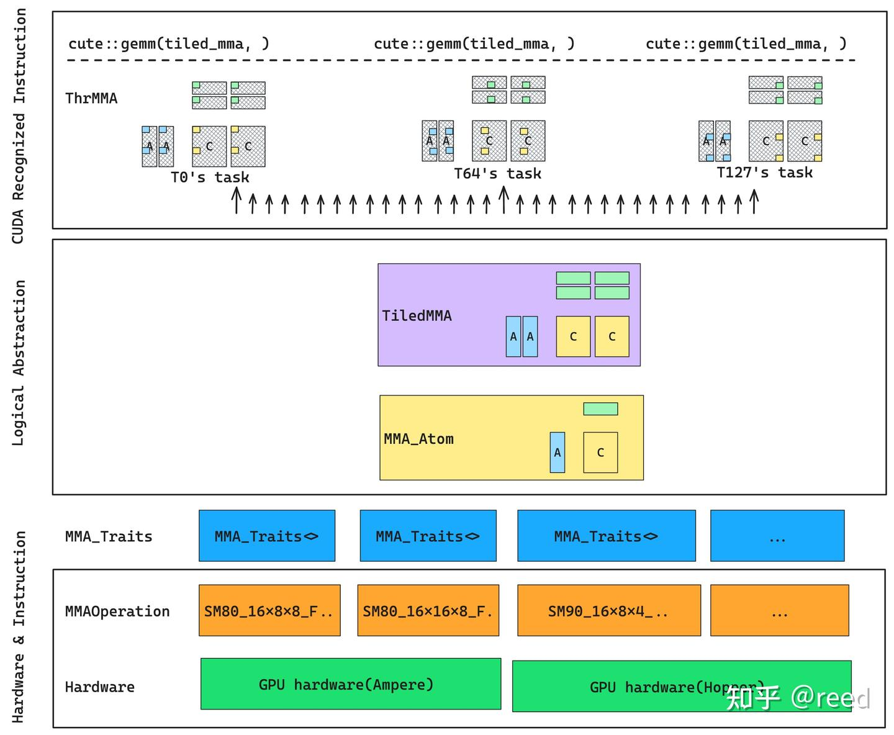

# CuTe 之 MMA抽象

**Author:** [reed](https://www.zhihu.com/people/reed)

**Link:** [https://zhuanlan.zhihu.com/p/663092747](https://zhuanlan.zhihu.com/p/663092747)

---

Layout和Tensor是描述数据逻辑排列和数据的抽象工具，在Tensor抽象之上我们可以完成矩阵乘法。前序文章我们介绍了[Layout](https://zhuanlan.zhihu.com/p/661182311)、[Layout解释](https://zhuanlan.zhihu.com/p/662089556)和[Tensor](https://zhuanlan.zhihu.com/p/663093816)，本文将介绍CuTe中利用Tensor Core完成矩阵乘法（MMA = matrix multiply accumulate）所需要的数据结构抽象。在介绍这些抽象之前，我们先对NVIDIA GPU上的Tensor Core作简单介绍。

## NVIDIA Tensor Core 简介

深度学习的出现极大的提升了对算力需求，尤其是矩阵类算力的需求，NVIDIA为了应对Google推出的TPU并抢占算力市场，于2017年推出Volta架构装配Tensor Core的显卡。在推出Tensor Core架构之前，矩阵类计算多诉诸SIMT的CUDA Core算力和传统的CPU上的SIMD算力。Tensor Core是专门针对矩阵计算而设计的硬件单元，其可以高效的实现小块的矩阵乘法，公式为`D = A x B + C`，如 Ampere 架构 A100 显卡所装配的Tensor Core，可以实现单周期完成8x4x8（MNK描述方法，即A矩阵的维度为8x8, B矩阵为8x4, C矩阵为8x8）的半精度的矩阵乘法。其效率要比传统的CPU和CUDA Core高很多，所以对算力需求极高的深度学习计算（如卷积、矩阵乘法、注意力）也多是使用Tensor Core来完成。


*Figure 1. Tensor Core对不同计算精度的效率动画（引用参考1）*

*Figure 2. 不同架构支持的计算精度（引用参考1）*

Tensor Core 在Volta、Turing、Ampere架构上输入输出数据都为和CUDA Core共享的寄存器，在Hopper架构上，为了得到更好的带宽，计算所需要的输入数据可以直接存放在共享内存上，在更新的 Blackwell 架构上进一步扩展。更详细的信息可以参考[关于Tensor Core数据存储空间的讨论](https://www.zhihu.com/question/587780273/answer/2929756314)。Tensor Core支持不同精度的计算，不同精度的计算效率也有区别，其动画效果如图1，各代架构对不同计算精度的支持如图2。Tensor Core提供了高算力，我们有两种形式可以使用Tensor Core，第一种是利用NVIDIA提供的矩阵计算库cublas和深度学习库cudnn，它们封装了常用的矩阵类计算和深度学习计算所需要的函数，以SDK的形式提供能力；第二种是通过CUDA编程提供的特定的接口和PTX汇编实现。对于第二种形式，CUDA编译器NVCC 提供了wmma（warp matrix multiply accumulate）和mma（matrix multiply accumulate）两种形式，第一种形式是通过提供`fragment`数据表示和特定的`load_matrix_sync()`、`store_matrix_sync()`、`mma_sync()` 数据加载存储和计算API来触发对Tensor Core的编程。另一种是通过PTX汇编实现，其数据直接面向寄存器表示，计算则是通过`mma.sync`类的函数实现。wmma形式对数据和API都进行了相应的抽象，编程相对简单，但对指令单控制也相对粗糙。mma形式的编程直接面向寄存器表示和汇编指令，难道较大，容易出错，但是可以实现精细的控制从而达到更高的计算效率。

## CuTe的MMA核心数据结构及其相互关系

CuTe作为高性能的原语表示和抽象，其直接面向mma实现，对数据和计算进行很好抽象的前提下，依然保留了精细控制能力。对于矩阵计算类任务，CuTe提供了MMA的抽象。其主要包含的核心结构：`MMAOperation`、`MMA_Traits`、`MMA_Atom`、`TiledMMA`、`ThrMMA`。这些结构共同完成对MMA的抽象和实现，这些结构是实现矩阵计算的基础。具体地，

* MMAOperation提供了指令层的封装，针对不同的GPU架构，NVIDIA提供了不同的指令来使用Tensor Core，MMAOperation即对这些硬件指令的封装同时提供了公共的`fma`方法，供框架层调用，终端用户从既定的架构中选择适合的即可；
* 了解MMA_Traits，必须先了解C++中traits的概念。在C++程序设计中traits被翻译为萃取，其表达对类型的提取。这种解读非常抽象，这里我提供一种更简洁的理解：traits是函数抽象，这个函数接受的输入是数据类型而不是传统的变量或对象，同时这个函数可以返回多个属性。对于使用者而言，这些信息是使用者所需要的，但是有不是原始的类型所必须的。也就是说有些信息不属于类型，但是这部分信息对于调用者却需要，这样我们引入traits，其承接类型到该类型使用者之间的桥梁作用。MMA_Traits就是这个桥梁。MMAOperation的使用者是MMA_Atom，但是MMA_Atom所需要的信息又比MMAOperation本身提供的要多，这时引入MMA_Traits则填补上它们之间的这个空隙。
* MMA_Atom自然的如其名字中的Atom所表达的"原子"，这是硬件提供的能执行的矩阵乘法的最小的单位，其能完成一个特定规格(如MNK)的矩阵乘法问题 `D = A x B + C`。
* 在MMA_Atom之上进行扩展，形成更大的矩阵乘法能力，即TiledMMA，它应当是原子的整数倍。这种扩展可以是执行单元层面的也可以是对Atom重复执行因为任何一个扩展都能提供更大的矩阵乘法。
* TiledMMA提供的是逻辑表达，而具体到CUDA编程实现的时候，我们的代码只能是线程级别的，即我们在CUDA kernel中只能写每一个线程执行的指令，不能写其级别的指令，即便我们知道有些指令是warp level的，但是我们能code的，都是线程级别的指令。这样，我们在矩阵乘法问题上也需要将前面的逻辑的矩阵块分块，然后写出线程级别的代码。ThrMMA就是完成这个工作：将逻辑的矩阵根据提供的线程号（`threadIdx.x`）来获得自己这个线程的任务（可以是warp level的等）。
* 在ThrMMA得到各个线程的计算任务后，各个线程同时调用cute::gemm函数完成各个线程级别的任务下发，最终所有线程等结果体现为大块的`D = A x B + C`的任务完成计算。

以上MMA核心结构的关系如图3，表现为三个大的抽象层：硬件和指令抽象、逻辑抽象、和CUDA编程型指令。


*Figure 3. CuTe MMA核心结构和其相互关系*

## MMAOperation

operation通过指令实现D = AB + C计算，该operation需要设定A/B/C/D的操作数的类型。其中fma的参数形式依赖于D/A/B/CRegisters的类型和数据量。即，如果DRegister的类型为float[2], 则fma的接口中最前面的两个参数为float输出。如`SM75_16x8x8_F32F16F16F32_TN` 表示SM75算力的Turing架构的MMA，16x8x8表示矩阵的MNK大小，F32F16F16F32表示D、A、B、C的数据类型分别为float32、float16、float16、float32。T表示A矩阵为行优先，B矩阵为列优先（blas中约定normal矩阵为列优先，T表示transpose，即对列优先的矩阵进行转置则为行优先），

```cpp
struct SM75_16x8x8_F32F16F16F32_TN {
  using DRegisters = float[4];
  using ARegisters = uint32_t[2];
  using BRegisters = uint32_t[1];
  using CRegisters = float[4];

  // Register asm fma
  CUTE_HOST_DEVICE static void
  fma(float & d0, float & d1, float & d2, float & d3,
      uint32_t const& a0, uint32_t const& a1,
      uint32_t const& b0,
      float const& c0, float const& c1, float const& c2, float const& c3)
  {
    asm volatile("mma.sync.aligned.m16n8k8.row.col.f32.f16.f16.f32" ...);
  }
};
```

*Figure 4. MMA_Traits提供给TiledMMA的信息（引用自参考3）*

## MMA_Traits

针对特定的MMAOperation类型，定义其相关的辅助**类型**或**值**给MMA_Atom使用，用以完成块状的矩阵乘法，其需要提供出的类型信息如下，

```cpp
using ElementDVal = // Logical D-value type
using ElementAVal = // Logical A-value type
using ElementBVal = // Logical B-value type
using ElementCVal = // Logical C-value type

using ElementAFrg = // A-type consumed by MMA (if ommitted, same as ElementAVal)
using ElementBFrg = // B_type consumed by MMA (if ommitted, same as ElementBVal)
using ElementCFrg = // C_type consumed by MMA (if ommitted, same as ElementCVal)

using Shape_MNK = // Logical MxNxK shape of the MMA

using ThrID = // Logical thread id (tid) -> tidx
using ALayout = // (Logical thread id (tid), Logical value id (vid)) -> Flat MK-coord
using BLayout = // (Logical thread id (tid), Logical value id (vid)) -> Flat NK-coord
using CLayout = // (Logical thread id (tid), Logical value id (vid)) -> Flat MN-coord
```

## TiledMMA

TiledMMA整体表达了矩阵在MNK空间维度如何通过Atom组织而来，其结构内部定义了很多函数，这些函数提供了对给定计算块的划分能力，但是这部分逻辑终端用户早期可以不用太多关注(这些)，只需要关注如下两个API即可，第一个是TiledMMA的模版参数，第二时TiledMMA提供的get_thread_slice函数。模版参数表达了TiledMMA在MMA_Atom上的扩展逻辑：`AtomLayoutMNK`表示M N K方向上分别重复几次Atom，这种重复会要求更多的执行线程，`ValueLayoutMNK`表述了对该Atom在M N K方向上重复几次，这里的重复是通过重复计算来完成的。get_slice、get_thread_slice函数功过给定线程id则获取线程对应到ThrMMA结构，形式如下

```cpp
template <class MMA_Atom,
          class AtomLayoutMNK = Layout<Shape<_1,_1,_1>>,
          class ValLayoutMNK = Layout<Shape<_1,_1,_1>>,
          class PermutationsMNK = Tile<Underscore,Underscore,Underscore>>
struct TiledMMA : MMA_Atom {
  ...;
  ThrMMA get_slice(ThrIdx thr_idx)；
  ThrMMA get_thread_slice(ThrIdx thr_idx);
  ...;
}
```

CUTLASS 3.4 版本中更新了该接口去掉了ValLayoutMNK，具体的参数解读可以参考CuTe核心作者[Cecka的解释](https://github.com/NVIDIA/cutlass/discussions/1345)。

## ThrMMA

该结构由TiledMMA根据具体的线程id分解而来（ThrMMA即Thread MMA），其描述了线程级实现`D = A x B + C`任务时的功能抽象，主要是如下`partition`类函数和`partition_fragment`类函数。其中`partition`函数完成对逻辑Tensor针对该线程的划分，即Tensor参数提供大块的逻辑矩阵单元，其返回值返回该线程需要进行的任务的Tensor描述。如Tensor C为BLK_M x BLK_N，则partition_C可以得到线程级别的任务，维度为（MMA, MMA_M, MMA_N）, MMA表达了TileMMA一次能计算的单元，MMA_M, MMA_N表达了M方向和N方向需要分块数量。`partition_fragment`类函数是按照`partition`类函数返回的Tensor形状生成的对应的寄存器表示。

```cpp
ThrMMA {
  Tensor partition_C(Tensor C);
  Tensor partition_A(Tensor A);
  Tensor partition_B(Tensor B);
  Tensor partition_fragment_C(Tensor C);
  Tensor partition_fragment_A(Tensor A);
  Tensor partition_fragment_B(Tensor B);
}
```

## cute::gemm

cute::gemm是线程完成MMA计算的函数，其核心接口如下，这里D、A、B、C接收的Tensor即为ThrMMA所划分出来的Tensor，

```cpp
void gemm(TiledMMA &mma, Tensor& D, Tensor const& A, Tensor const& B, Tensor const& C)；
```

cute::gemm和其他组件的相互关系如表格所示。

| 功能 | MMA |
| --- | --- |
| 指令+存储类型 | MMAOperation |
| 逻辑类型和形状要求 | MMA_Traits |
| 原子能力 | MMA_Atom |
| 块状能力(多个原子能力) | TiledMMA |
| 线程级能力 | ThrMMA |
| 数据拆分API | ThrMMA::partition_A/B/C() |
| 触发功能执行 | cute::gemm(tiled_mma, thr_d,...); |

## 总结

CuTe提供了MMA能力来完成`D = A x B + C`的矩阵乘法运算，其针对指令封装，适配层，原子能力、块状MMA、线程划分和执行进行了抽象，形成了`MMAOperation`、`MMA_Traits`、`MMA_Atom`、`TiledMMA`、`ThrMMA`、`cute::gemm`数据结构和函数，我们通过这些结构能够完成逻辑块状矩阵乘法的划分和执行。这些抽象通过软件分层设计使得各层次独立，我们不必关注底层细节，只需要从提供的模块中组合我们的逻辑即可，同时抽象的解偶设计，使得我们可以专注于顶层逻辑而降低对底层细节的要求。

后续我们会介绍`Copy`类结构抽象，来实现数据从不同存储结构的搬运，在介绍`Copy`之后我们将结合MMA和Copy能力完成一个简单的矩阵乘法，然后在这个版本之上进行一步步优化，最终得到SOTA的矩阵计算。

## 参考

[NVIDIA Tensor Cores: Versatility for HPC & AI](https://www.nvidia.com/en-us/data-center/tensor-cores/)

[大佬们，A100显卡上的tensorcore有自己的私有寄存器吗？](https://www.zhihu.com/question/587780273/answer/2929756314)

[https://www.cs.utexas.edu/users/flame/BLISRetreat2023/slides/Thakkar_BLISRetreat2023.pdf](https://www.cs.utexas.edu/users/flame/BLISRetreat2023/slides/Thakkar_BLISRetreat2023.pdf)

[[QST] What is PermutationMNK in TiledMMA in CUTLASS 3.4 changes? · NVIDIA/cutlass · Discussion #1345](https://github.com/NVIDIA/cutlass/discussions/1345)
