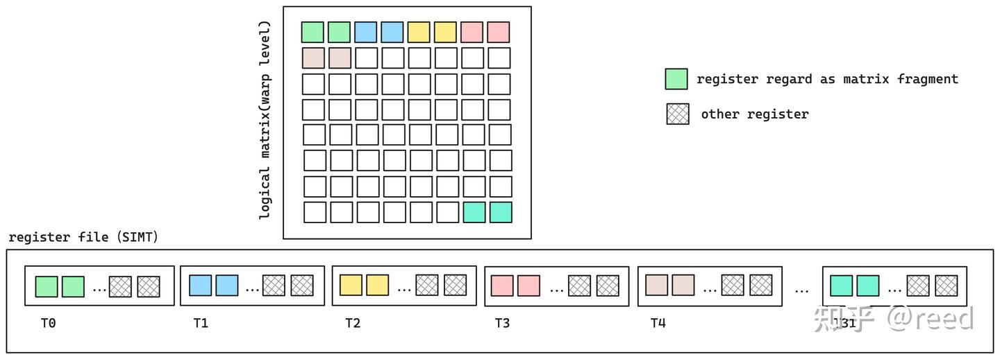
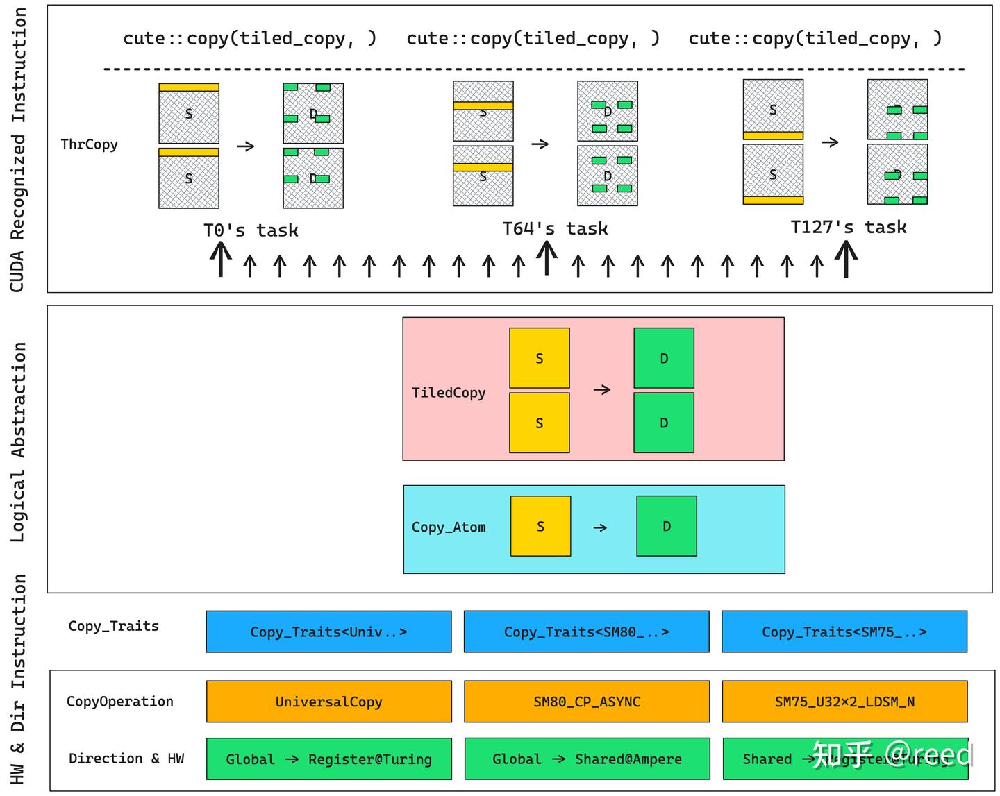

# CuTe 之 Copy抽象

**Author:** [reed](https://www.zhihu.com/people/reed)

**Link:** [https://zhuanlan.zhihu.com/p/666232173](https://zhuanlan.zhihu.com/p/666232173)

---

前面文章介绍了[CuTe中的MMA抽象](https://zhuanlan.zhihu.com/p/663092747)，通过MMA我们可以利用Tensor Core完成寄存器上的`D = AxB + C`计算。对于GPU编程而言，输入数据一般来被存储在全局内存之上。这就涉及到如何高效地将全局内存上的数据运到Tensor Core MMA计算所要求的寄存器上的问题。数据搬运的数学描述是 `D = S`,其中D和S是前文中介绍的[Tensor结构](https://zhuanlan.zhihu.com/p/663093816)，分别表示目标Tensor（Destination）和源Tensor（Source）。 它们一般存储在不同的存储层次上，它们有各自的[Layout描述](https://zhuanlan.zhihu.com/p/661182311)。本文我们将围绕该问题，重点介绍CuTe在数据搬运的方面的数据结构的抽象。在文章结构上，本文首先介绍CUDA GPU中的存储层次和矩阵计算相关的ldmatrix指令，然后总体介绍CuTe中Copy相关的数据结构和函数的抽象以及各个结构之间的相互关系；然后我们依次对各个数据结构的核心函数和成员进行介绍，最后我们总结CuTe对Copy的抽象。

## CUDA的存储层次和数据加载路径


*Figure 1. GPU的存储层次和数据搬运路径*

经典的GPU存储层次如图1所示，主要有：片外存储结构-全局内存（global memory）；片上SM（stream multi-processor）内的shared memory 和 L1 data cache，以及寄存器堆（register file）；以及在全局内存和SM之间的L2 Cache。具体地，全局内存（图中标记为绿色global memory）容量最大，在数据中心级A100显卡中存储空间可以达到80GB，采用HBM2e技术实现，最高带宽可达2TB/s；再往内层为L2 Cache，在A100-80GB上为80MB，带宽可达20TB/s; 再向内层为片上(on-chip)存储shared memory 和L1 data cache，shared memory 和 L1 data cache 共享192KB的空间，可以配置shared memory 和L1的大小，最大可将shared memory配置为164KB。离计算单元Tensor Core和CUDA Core（图中分别标记为TC和CUDA）更近的存储结构为寄存器堆（图中标记为Register File），计算单元计算所需要的数据必须来自寄存器（Ampere及之前架构如此，Hopper架构的Tensor Core可以直接读取存储在shared memory数据进行计算），是GPU中最快的存储结构，一个线程最多使用255个32bit的寄存器。对于一个用GPU进行计算的问题，其原始数据来自于全局内存，可以经过三条路径到达核心计算单元上（Tensor Core或CUDA Core）。第一条路径，如图中路径1所示，从global内存经过L2到达shared memory（L1 bypass），然后从shared memory到达寄存器；第二条路径，如图中路径2所示，从global内存经过L2到达L1然后到达shared memory，再从shared memory到达寄存器；第三条路径从global内存经过L2到达L1，然后到达寄存器。其中路径1和2只在Ampere及其之后的架构才支持。Ampere之前的架构从全局内存到寄存器只支持路径3，从全局内存到共享内存只能先通过3将数据加载到寄存器，然后通过路径4存储到共享内存。这些存储结构我们可以编程控制的部分为全局内存共享内存和寄存器，L1 Cache和L2 Cache是缓存机构，我们可以控制其bypass与否，同时我们也可以通过PTX指令modifier控制L2 cache的数据预取行为。

## 高效的ldmatrix指令

在矩阵计算的优化中，非常重要的一个技术是通过数据分块实现数据复用，数据复用可以减少对低层级存储器的访问数据量，提升数据访问效率继而提升总体计算效率。在GPU的实现中，可编程的数据复用发生在共享内存部分，即用户通过编程手段将部分数据加载到共享内存然后复用共享内存中的数据，实现数据由共享内存到寄存器，然后实现更高效的计算。前面MMA章节我们介绍了Tensor Core的基础信息，如果我们认真研究Tensor Core的汇编指令我们不难发现，参与计算warp内的线程只持有矩阵的部分数据，这些数据保存在线程的私有寄存器中（SIMT架构中，可以认为寄存器为线程所私有），warp内的所有线程的寄存器共同组成完整的矩阵计算数据。这是NVIDIA在SIMT架构下实现warp level的Tensor Core计算的创新实践。如图2所示，在SIMT意义下每个线程持有两个数据（如float16，可以表达为一个寄存器），warp内的32个线程共同构成64个数据，形成8x8的warp level的小矩阵，供Tensor Core计算用。


*Figure 2. SIMT寄存器协作构成warp level矩阵*

通过各个线程提供的寄存器可以完成warp level的矩阵表示和存储，利用Tensor Core则可以完成高效的存储在寄存器上的矩阵计算。就数据从共享内存到寄存器的加载方面而言，可以通过SIMT意义下的LDS（load shared）来完成，但是由于数据是分布在不同的线程的寄存器上连续性方面不友好。为了更极致的性能NVIDIA从Turing架构开始提供了专门针对这种场景的加载指令ldmatrix。如图3，其展示了SIMT形式的模式加载矩阵数据和ldmatrix协作式加载矩阵数据的对比，ldmatrix协作式加载可以通过线程提供共享内存的地址（提供16Byte数据）完成数据的加载然后将数据分配到warp中各个线程的寄存器中，实现了跨越SIMT寄存器边界的写出，而如果是SIMT形式的加载，则只能使用更窄的数据位宽，这也就需要更多的指令完成等量数据的读写，同时ldmatrix由于是单线程提供16Byte的数据地址，warp内所有线程可以提供16Byte x 32 = 512Byte的数据到寄存器的加载，单指令实现16x16 float16矩阵的加载，减少指令数提高调度效率，同时其可以在写出时合并矩阵转置能力（可以参考[tensorcore中ldmatrix指令的优势是什么？](https://www.zhihu.com/question/600927104/answer/3029266372)）。通过ldmatrix可以实现warp level共享内存到寄存器的数据搬运，自然地，CuTe对这种数据搬运提供了对应的抽象能力。


*Figure 3. SIMT形式加载矩阵数据和ldmatrix协作式加载矩阵的对比*

## CuTe Copy抽象及其相互关系

和MMA类似，CuTe对数据搬运提供了对数据搬运的数据结构抽象，主要包括`CopyOperation`、`Copy_Traits`、`Copy_Atom`、`TiledCopy`、`ThrCopy`和拷贝函数`cute::copy`。这些结构和函数共同完成对GPU各个层级存储之上的数据进行搬运的抽象和实现，具体地，

* CopyOperation提供了指令级的数据搬运的封装，NVIDIA在不同的硬件架构、不同的存储层次之间数据搬运提供了不同的指令，如前文提到的`ldmatrix`和`LDS`等，还有针对Ampere架构的`cp.async`等，Hopper架构则引入了 TMA（Tensor Memory Accelerator）用于更高效的大块全局内存与共享内存间的异步拷贝；我们在使用时只需要根据我们的硬件支持的指令情况和需要搬运的内存层次来选择已经提供的Operation即可;
* Copy_Traits和MMA_Traits类似，提供了CopyOperation类型没有提供，但是其使用者Copy_Atom却需要的起到桥梁作用的信息；
* Copy_Atom提供了指令级别不可分割的数据搬运的拷贝能力；
* TiledCopy是对Copy_Atom的能力的封装通过重复拷贝执行单元的个数（增加执行线程）或者做多次的拷贝实现对原子能力的重复；
* TiledCopy提供的是逻辑上的拷贝的概念，在具体的kernel执行之时，为了复合CUDA的编程范式，需要写成线程级别的指令，ThrCopy可以实现将大块的数据根据TiledCopy所描述的划分规则，通过提供当前线程的线程号threadIdx.x对大块的Tensor进行划分，得到当前线程为了完成`D = S` 拷贝所需要该线程做的任务；
* cute::copy在ThrCopy提供了当前线程的任务之后，便可以通过copy函数触发具体的数据搬运指令。


*Figure 4. CuTe Copy核心结构和其相互关系*

如图4所示，在硬件和拷贝方向之上提供了了指令抽象CopyOperation，再往上形成D = S的拷贝逻辑抽象，包含指令级别所能完成的拷贝原子能力Copy_Atom和对Atom重复后得到的TiledCopy能力，再逻辑之上针对具体的线程划分出具体的线程级的任务，通过cute::copy函数触发相应的拷贝任务，所有线程共同完成Tensor到Tensor的拷贝。下面我们针对每一个抽象层次，具体的介绍各个数据结构和抽象的细节。

## CopyOperation

Operation封装了特定硬件支持拷贝能力。它一般通过PTX汇编指令（或CUDA实现）来完成，实现指令集的拷贝能力抽象，其定义了源数据类型和目标数据类型以及个数，同时提供copy函数供框架层调用，示例如下，源寄存器为一个uint128_t(128bit数据)，目标寄存器位一个uint32_t的数据：

```cpp
struct SM75_U32x1_LDSM_N {
  using SRegisters = uint128_t[1];
  using DRegisters = uint32_t[1];
  void copy(uint128_t const& smem_src, uint32_t& dst) {
    asm volatile ("ldmatrix.sync. ...\n");
  }
};
```

## Copy_Traits

traits补充了CopyOperation的信息，如其提供了执行operation所需要的线程数，源数据和目标数据的Layout排布情况，其描述了线程和数据的存放关系，即通过线程号和寄存器号可以得到数据的逻辑位置，同时提供RefLayout供线程级的数据拆分时实现retile能力，具体的定义如下，

```cpp
struct Copy_Traits<SM75_U32x1_LDSM_N> {
  // Logical thread id to thread idx (warp)
  using ThrID = Layout<_32>;
  // Map from (src-thr,src-val) to bit
  using SrcLayout = Layout<Shape <Shape < _8,_4>,_128>,
                          Stride<Stride<_128,_0>, _1>>;
  // Map from (dst-thr,dst-val) to bit
  using DstLayout = Layout<Shape <_32,_32>,
                           Stride<_32, _1>>;
  // Reference map from (thr,val) to bit
  using RefLayout = DstLayout;
};
```

## Copy_Atom

Atom将Operation和Traits进行封装和抽象，定义了内部数据类型，供形成TiledCopy和后续的ThrCopy分解任务时提取信息，如其继承来自Traits的线程情况和数据Layout情况，提供call方法实现对底层指令的调用入口，

```cpp
struct Copy_Atom<Copy_Traits<Args...>, T>
  : Copy_Traits<Args...>
{
  using Traits = Copy_Traits<Args...>;
  // Bit and Thr layouts from the Copy_Traits
  using ThrID = typename Traits::ThrID;
  using BitLayoutSrc = typename Traits::SrcLayout;
  using BitLayoutDst = typename Traits::DstLayout;
  using BitLayoutRef = typename Traits::RefLayout;
  using ValType = T;
  void call(Tensor<TS,SLayout> const& src, Tensor<TD,DLayout>& dst);
};
```

## TiledCopy

tiled抽象通过对Atom能力进行重复得到更大的块的拷贝能力，对Atom的重复可以通过提供线程-存储的Layout来提供，也可以直接通过提供Atom能力和MMA中的tiled_mma实现，如`make_tiled_copy_A/B/C`，因为MMA已经提供了计算`D = AxB + C`时所需要的数据划分能力，当然这些函数时针对寄存器表达能力的，具体的模版参数和形参如下。除了描述对Atom的重复方式外，TiledCopy提供的核心函数时`get_slice`和`get_thread_slice`,其可以实现将逻辑Tensor的拷贝能力根据线程的id得到每一个线程的Layout描述的拷贝任务，所以以上两个函数的返回对象为ThrCopy：

```cpp
template <class Copy_Atom,
          class LayoutCopy_TV,   // (tid,vid) -> coord [Need not be 2D...]
          class ShapeTile_MN>   // coord space
struct TiledCopy : Copy_Atom {
  ThrCopy get_slice(ThrIdx const& thr_idx)；
  ThrCopy get_thread_slice(ThrIdx const& thr_idx));
};
CUTE_HOST_DEVICE
auto make_tiled_copy_A(Copy_Atom<Args...> const& copy_atom,
                       TiledMMA const& tiled_mma)
```

## ThrCopy

thread copy是线程级别的拷贝的抽象，其通过TiledCopy调用`get_slice`方法而得到，其核心函数为`partition_S/D`和`retile_S/D`,其中S和D分别表示source和destination，partition表示对一个大的逻辑Tensor进行划分得到当前线程的拷贝所需要的源Tensor和目标Tensor， 而retile系列的函数表示其输入的数据已经是当前的线程的私有的数据了，但是其可能不满足拷贝所要求的形状，需要将其变换到拷贝所支持的形状，形式如下代码：

```cpp
template <class TiledCopy, class ThrIdx>
struct ThrCopy {
  auto partition_S(Tensor&& stensor);
  auto partition_D(Tensor&& dtensor);
  auto retile_S(Tensor&& stensor);
  auto retile_D(Tensor&& dtensor);
};
```

## cute::copy

copy函数是拷贝的实际执行函数，调用该函数会触发线程级别的拷贝的发生，完成线程指令的执行，实现src到dst到数据拷贝指令，实现逻辑上的`D = S`。我们用块状逻辑对数据进行拷贝的时候可能遇到边界处理的情况，这时可以通过copy_if实现对某些数据拷贝的mask，从额避免非法的数据访问，其函数原型如下，

```cpp
void copy(TiledCopy const& copy, Tensor const& src, Tensor& dst);
void copy_if(TiledCopy const& copy, PrdTensor const& pred, Tensor const& src, Tensor& dst);
```

cute::copy和其他组件的相互关系如表格所示。

| 功能 | Copy |
| --- | --- |
| 指令+存储类型 | CopyOperation |
| 逻辑类型和形状要求 | Copy_Traits |
| 原子能力 | Copy_Atom |
| 块状能力(多个原子能力) | TiledCopy |
| 线程级能力 | ThrCopy |
| 数据拆分API | ThrCopy::partition_S/D(), ThrCopy::retile_S/D() |
| 触发功能执行 | cute::copy(tiled_copy, thr_s, thr_d); |

## 总结

CuTe提供了Copy能力来完成实现`D = S`Tensor的搬运，其通过对指令、适配层、原子能力、块状能力和线程级别的抽象分别形成了数据结构`CopyOperation`、`Copy_Traits`、`Copy_Atom`、`TiledCopy`、`ThrCopy`和`cute::copy`,在这些抽象的帮助下，我们可以实现逻辑Tensor由一个存储单元向另一个存储单元的拷贝，而不用过多的关注指令细节。 这种能力和MMA一道共同构成CuTe下矩阵乘法的基础。在Copy和MMA抽象的帮助下我们可以在逻辑层次构造数据的搬运`D = S`和矩阵乘法`D = A x B + C`。

至此我们已经讲解了CuTe中的Layout、Tensor、MMA、Copy抽象，我们已经可以完成一个GEMM（GEneral Matrix Multiplaction）问题了。通过Tensor和Layout抽象我们可以实现对计算矩阵的分块；基于Copy抽象，我们可以完成块状矩阵A、B数据从global内存到寄存器的加载；通过MMA抽象我们可以利用Tensor Core完成寄存器上小块矩阵的乘法运算；再次通过Copy抽象，我们可以将寄存器上的结果拷贝到global内存，完成完整的GEMM运算。下一篇文章我们将利用Layout、Tensor、MMA、Copy能力完成一个简单的矩阵乘法。

## 参考

[https://docs.nvidia.com/cuda/parallel-thread-execution/index.html#warp-level-matrix-instructions-for-mma](https://docs.nvidia.com/cuda/parallel-thread-execution/index.html#warp-level-matrix-instructions-for-mma)

[https://github.com/NVIDIA/cutlass/blob/main/include/cute/algorithm/copy.hpp](https://github.com/NVIDIA/cutlass/blob/main/include/cute/algorithm/copy.hpp)

[tensorcore中ldmatrix指令的优势是什么？](https://www.zhihu.com/question/600927104/answer/3029266372)
