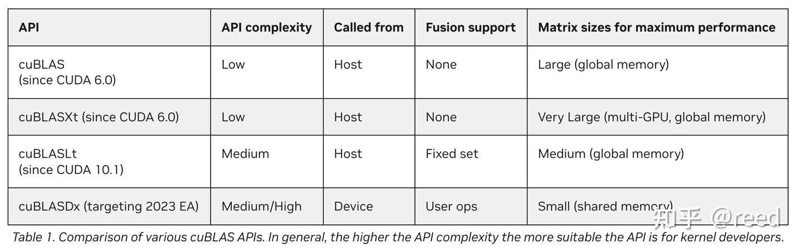

# cute 之 简单GEMM实现

**Author:** [reed](https://www.zhihu.com/people/reed)

**Link:** [https://zhuanlan.zhihu.com/p/667521327](https://zhuanlan.zhihu.com/p/667521327)

---

前面的文章我们对CuTe提供的核心数据结构和抽象进行了一系列的介绍，包括[Layout](https://zhuanlan.zhihu.com/p/661182311)、[Tensor](https://zhuanlan.zhihu.com/p/663093816)、[MMA](https://zhuanlan.zhihu.com/p/663092747)和[Copy](https://zhuanlan.zhihu.com/p/666232173)。本文我们将利用这些概念和抽象实现一个简单版本的矩阵乘法。在介绍具体实现之前，我们首先介绍BLAS约定和深度学习对矩阵乘法的需求和约定，然后介绍cuda上的矩阵库cuBLAS和矩阵乘法任务到硬件执行单元的划分策略，最后我们从Tensor构建、切块、划分，执行、拷贝等方面结合代码实现具体介绍了矩阵乘法的实现，同时我们对该版本的实现选取了实际场景中遇到的问题规模进行了实验并对比了该实现的效率。

## BLAS约定和深度学习约定

在科学计算和数值分析领域，经常需要解决矩阵特征值、线性方程（代数）等问题，形成了如EISPACK、LINPACK、LAPACK数学求解库。这些库解决的是偏上层的数学问题，它们共同依赖了更加底层的、更基础的数学库BLAS（**B**asic **L**inear **A**lgebra **S**ubprograms）。BLAS总共分为三个层次：

* 第一层是向量操作，如
  $$
  \bm{y} = \alpha \bm{x} + \bm{y}
  $$
  计算问题；
* 第二层向量-矩阵操作，如
  $$
  \bm{y} = \alpha \bm{A} \bm{x} + \beta \bm{y}
  $$
  计算问题；
* 第三层矩阵-矩阵操作，如
  $$
  \bm{C} = \alpha \bm{A} \bm{B} + \beta \bm{C}
  $$
  。

$$
\bm{C} = \alpha \bm{A} \bm{B} + \beta \bm{C}
$$
就是我们常说的GEMM（**GE**neral **M**atrix **M**ultiplication）问题，它也是BLAS第三层次要求解的问题。其中的广义来自于
$$
\alpha
$$
$$
\beta
$$
可以是任意数值，
$$
\bm{A}
$$
和
$$
\bm{B}
$$
可以是转置的也可以是非转置的，数值精度方面可以是单精度浮点数、双精度浮点数等。BLAS早期实现的时候采用的是数值计算领域的Fortran语言，在Fortran语言中二维数组是列主序的（列优先），所以在BLAS的API中针对AB矩阵的转置情况描述而言，列优先称为Normal（简写为N），行优先则称为Transpose（简写为T），值得注意的是转置与否是针对A B矩阵而言的，
$$
\bm{C}
$$
$$
\bm{D}
$$
矩阵必须是列优先的。同时为了区分不同的数值精度，BLAS规定了不同的简写，如单精度浮点为s（缩写自single precision）, 双精度浮点为d （缩写自double precision），单精度复数为c （缩写自complex），双精度浮点复数记为z。所以在附加上数据类型（如单精度浮点）之后函数名字就由gemm变为了sgemm（single precision general matrix multiplication）。同时BLAS约定了矩阵的维度，表示为
$$
\bm{D\_{m,n}} = \alpha \bm{A\_{m, k}} \bm{B\_{k, n}} + \beta \bm{C\_{m,n}}
$$
,

其中的m，n表示行列数目，k为reduce轴上的数据维度。

深度学习中也有矩阵乘法所表达的网络层（如Pytorch中Linear层、Tensorflow中的Dense层），但是神经网络中该层的公式可以表达为
$$
y = x \bm{A} + b
$$
，其中x为input，维度一般为（N, Cin）y为output维度为（N, Cout），b为bias（一般是boardcast语义，此处我们忽略掉）。我们在忽略掉bias同时采用BLAS的矩阵形式描述，则其公式可以变更为
$$
\bm{D} = \bm{A}\bm{B}
$$
，我们可以发现深度学习中需要的也是矩阵乘法的语义，和BLAS类似但是又不完全相同，不同点一深度学习中的公式没有BLAS公式中的
$$
\alpha
$$
, 不同点二深度学习中公式没有BLAS中的加法右侧项，不同点三输出的D是行优先的而非BLAS中的列优先。除了公式层面的差异外，深度学习中的层为了计算效率会选用比传统的BLAS中的数据类型更低的精度如半精度和整数量化精度。

由于深度学习的输出要求的是行优先的，而BLAS中的约定中输出矩阵D是列优先的，因此当我们借助BLAS类函数完成深度学习的矩阵乘法时，需要对BLAS的公式进行转置变换，即

$$
\bm{D^{T}} = \alpha \bm{B^TA^T} + \beta \bm{C^{T}}
$$
，同时设置
$$
\alpha
$$
为1，
$$
\beta
$$
为0。由于转置矩阵AB的顺序也发生了变化。使用BLAS实现深度学习矩阵乘法的伪代码调用如下

```cpp
// blas_gemm(D, A, B, trans_a, trans_b, m, n, k, alpha, beta) API specifaction;
// D = alpha op(A) op(B) + beta C;
// op can be 'N'ormal or 'T'ranspose
// output:
// D(m, n) column major
// input:
// A(m, k) column major
// B(k, n) column major
// C(m, n) column major
// D(m, n) row major
// A(m, k) row major
// B(k, n) column major
void linear_layer(T* D, const T* A, const *B, int m, int n, int k) {
T alpha = 1;
T beta = 0;
blas_gemm(D, B, A, 'T', 'N', n, m, k, alpha, beta);
}
```

## NVIDIA cuBLAS

NVIDIA使用GPU进行了BLAS加速实现，形成了cuBLAS加速库，cuBLAS除了实现BLAS中的API（Application Programming Interface）还扩展实现了多Batch支持、多GPU支持和针对深度学习加速的混合精度、低精度实现。对于我们深度学习中常用半精度（half precision）的gemm类似于之前的sgemm，在cuBLAS中提供了hgemm（half precision general matrix multiplication）。本质而言cuBLAS是一个大的kernel仓库，其中存储了NVIDIA针对不同数据类型，计算精度、矩阵维度、地址对齐等维度综合考虑的高度优化的kernel。当用户调用其进行矩阵运算时，cuBLAS会使用特定的方法从这些kernel中选择出一个针对该问题规模和约束的性能较好的实现版本。除了cuBLAS外，NVIDIA同时针对不同功能需求和性能追求提供了cuBLASLt库等，如图1所示，其对比了NVIDIA提供的BLAS类库的API复杂度和融合后处理能力。


*Figure 1. NVIDIA提供的BLAS类库对比（引用自参考5）*

cuBLASLt库是cuBLAS库的基础上提供针对人工智能和机器学习更灵活的应用，它允许用户指定更复杂的输入输出类型、计算类型（解决混合精度的多类型指定问题）等，同时它还提供了启发式算法，允许用户选择底层实现的性能更好的kernel。后续的文章中我们的实验会利用cuBLASLt的这种选择kernel能力，选择候选kernel中最好的那一个作为我们的baseline。本文中实验我们使用cuBLAS选定的kenrel作为baseline。

## Tensor表示


*Figure 2. 矩阵乘法问题的Tensor表示及其属性*

如图2所示，本文我们研究深度学习中常用的`C = AB`的矩阵乘法问题，其中矩阵A、B存储在GPU的全局内存中，输出C矩阵将会被存储在全局内存中；维度方面A为m行k列，B为k行n列，输出C为m行n列；数据存储Layout方面，A为行优先，B为列优先，C为行优先。数据类型方面A、B、C都位16bit的半精度浮点数，在cuda中表示为half类型（cute封装为cute::half_t类型）。我们将矩阵ABC的信息形成如下表格，同时将row/column major表示为stride形式，填充上指针变量名称

| ·矩阵 | 指针变量 | 存储位置 | shape | stride | 数据类型 |
| --- | --- | --- | --- | --- | --- |
| A | Aptr | global memory | (m, k) | (k, 1) | half |
| B | Bptr | global memory | (k, n) | (1, k) | half |
| C | Cptr | global memory | (m, n) | (n, 1) | half |

我们将ABC表示为Tensor形式，则可以写出如下kernel代码

```cpp
template <typename T>
__global__ void gemm_simple(T* Cptr, const T* Aptr, const T* Bptr, int m, int n, int k) {
Tensor A = make_tensor(make_gmem_ptr(Aptr), make_shape(m, k), make_stride(k, Int<1>{}));
Tensor B = make_tensor(make_gmem_ptr(Bptr), make_shape(n, k), make_stride(k, Int<1>{}));
Tensor C = make_tensor(make_gmem_ptr(Cptr), make_shape(m, n), make_stride(n, Int<1>{}));
}
```

其中`make_gmem_ptr()` 函数用于标识tensor指针的存储层次，方便后续使用时能从指针中取出该指针的存储层次。同时，我们修改了Tensor B的矩阵表示形式把它的形状表示(n, k)，对应的stride 为(k, 1); 这样后续的循环的时候我们就可以写成reduce的形式。为了编译时决策和优化，我们把stride中的连续维度1表示为编译时常量的形式，即Int<1>{}，这样后续对矩阵进行操作的时候如果需要用到stride的计算则可以利用编译时的决策和优化减少不必要的运行时运算。

## 以C矩阵为中心的任务划分策略

GPU中有多个SM（Stream Multiprocessor）我们编程时以grid、block的软件层级进行编程来利用这些SM，在矩阵计算中，我们以输出矩阵C作为划分thead block的单元进行任务拆分，也就是说一个thread block完成C矩阵中的一个小块（TileC）的计算任务，如图3所示，我们定义矩阵TileC的大小为kTileM、kTileN，分别表示小块矩阵包含元素的行数目和列数目，根据块状矩阵乘法的公式完成TileC的计算需要A矩阵中的绿色高亮部分和B矩阵的黄色高亮部分，它们的形状分别为(kTileM, k)和(kTileN, k)。我们对AB矩阵的k轴按照kTileK的大小进行分块，则可以将TileC矩阵表达为AB矩阵块的点积运算

$$
TileC = \sum\_{itile = 0}^{num\\_tile}{TileA\_{itile} TileB\_{itile}}
$$


*Figure 3. sliced-k模式的C矩阵为中心的任务划分方法*

如此，我们在k轴上移动kTileK得到AB上的小块
$$
TileA\_{itile}
$$
和
$$
TileB\_{itile}
$$
将他们相乘的积累加到TileC上，便可以得到TileC的计算结果。这种沿着k轴移动的策略称sliced-k方法。这样我们使用一个block（坐标如图blockIdx.x, blockIdx.y）便可以完成C矩阵中一个小块的完整的计算。通过block维度的扩展，如图所示的矩阵C中M轴方向的blockIdx.y和N轴方向的blockIdx.x的扩展，便可以完成整个C矩阵的计算。由此我们可以计算出完成整个C矩阵所需要的gird维度：grid.x = N / kTileN, grid.y = M / kTileM (此处暂时不考虑不可整除的情形)。根据上面的计算过程我们可以继续完善代码，

```cpp
template <typename T, int kTileM, int kTileN, int kTileK>
__global__ void gemm_simple(T* Cptr, const T* Aptr, const T* Bptr, int m, int n, int k) {
Tensor A = make_tensor(make_gmem_ptr(Aptr), make_shape(m, k), make_stride(k, Int<1>{}));
Tensor B = make_tensor(make_gmem_ptr(Bptr), make_shape(n, k), make_stride(k, Int<1>{}));
Tensor C = make_tensor(make_gmem_ptr(Cptr), make_shape(m, n), make_stride(n, Int<1>{}));
int ix = blockIdx.x;
int iy = blockIdx.y;
Tensor gA = local_tile(A, make_tile(Int<kTileM>{}, Int<kTileK>{}), make_coord(iy, _));
Tensor gB = local_tile(B, make_tile(Int<kTileN>{}, Int<kTileK>{}), make_coord(ix, _));
Tensor gC = local_tile(C, make_tile(Int<kTileM>{}, Int<kTileN>{}), make_coord(iy, ix));
}
int main() {
...
dim3 grid(n / kTileN, m / kTileM);
...
}
```

如我们上面所述，我们在模版参数中给定划块的超参kTileM、kTileN、kTileK，同时使用Tensor章节中介绍local_tile方法对矩阵进行固定大小的分块，同时通过指定坐标的的全slice方法，得到当前thread block要处理的Tensor gA, gB, gC。和构造Tensor A时类似，我们在进行Tensor分块的时候也将编译时能确定的量进行了`Int<>`化，用以指示该维度信息是编译时常量，编译器可以在编译阶段完成必要的路径决策和优化计算，避免运行时的开销。同时我们在主函数中给出了grid的大小（如上代码）。值得注意的是，经过`local_tile`函数我们得到的gA, gB, gC的维度信息如下表格

| Tensor | shape |
| --- | --- |
| gA | (kTileM, kTileK, num_tile_k) |
| gB | (kTileN, kTileK, num_tile_k) |
| gC | (kTileM, kTileN) |

先选定TileC，然后沿着k轴移动小块进行累加求和的策略为sliced-k，它对于m、n维度较大的场景（m n分块所需要的block数目足以填充所有的SM）比较有效。对于k比较大，而m、n比较小的场景，由于m、n较小而我们根据C来划分thread block，这时需要的thread block数目比较小，当这个数目无法填充所有的SM时，则存在很多SM无任务，而有任务的SM需却又需要循环多次的问题，这时候可以考虑将k轴拆分成多段，每一段都计算一个TileC结果，最后再通过额外的累加过程将多段的结果进行求和，这种模式的任务划分方法成为split-k方法。如图4，把k拆分成两段，由不同的计算单元来完成不同段段段计算，如此则得到多份C，最后将多个C进行累加求和得到最终结果。该方法在特殊场景下有用，而且实现不困难，本文暂不实现该策略。


*Figure 4. split-k策略的计算逻辑*

除了sliced-k、split-k策略在任务划分方面还有stream-k方法，stream-k方法作者们指出sliced-k或者split-k方法都是静态的划分任务，在划分的任务数目和SM执行单元不能整除的时候，总会在存在某轮（wave）计算中存在SM空闲的问题。stream-k则是抛弃以任务为中心的划分逻辑，而是变成了以计算资源为核心的分配任务方式，使得SM的任务量基本相当，如图5，其展示了假设只有4个SM的情况下，不同任务划分逻辑的差异，其中stream-k对计算资源的利用效果最好，具体可以参考发表在PPoPP‘23上的poster。现阶段cuBLAS中的kernel依然多为sliced-k和split-k实现。本文暂不实现该策略。


*Figure 5. stream-k策略任务划分逻辑（引用自PPoPP23: Stream-K）*

## TiledMMA：主机端选择指令，设备端将分块划分到线程

前面经过把C++ pointer封装成Tensor，然后利用`local_tile`将Tensor划分成小块，我们便可以得到一个thread block需要处理的任务。这时，假设我们通过前面MMA章节构造了一个TiledMMA能力，则借助其方法我们便可以通过ThrMMA的partition_A/B/C方法实现对TileA、TileB、TileC、的划分，通过partition_fragment_A/B/C便可以构造矩阵乘所需要的寄存器表示。通过cute::gemm方法便可以完成线程级别寄存器表示的矩阵乘法。具体的kernel代码为

```cpp
template <typename T, int kTileM, int kTileN, int kTileK, typename TiledMMA>
__global__ void gemm_simple(T* Cptr, const T* Aptr, const T* Bptr, int m, int n, int k) {
Tensor A = make_tensor(make_gmem_ptr(Aptr), make_shape(m, k), make_stride(k, Int<1>{}));
Tensor B = make_tensor(make_gmem_ptr(Bptr), make_shape(n, k), make_stride(k, Int<1>{}));
Tensor C = make_tensor(make_gmem_ptr(Cptr), make_shape(m, n), make_stride(n, Int<1>{}));
int ix = blockIdx.x;
int iy = blockIdx.y;
Tensor gA = local_tile(A, make_tile(Int<kTileM>{}, Int<kTileK>{}), make_coord(iy, _));
Tensor gB = local_tile(B, make_tile(Int<kTileN>{}, Int<kTileK>{}), make_coord(ix, _));
Tensor gC = local_tile(C, make_tile(Int<kTileM>{}, Int<kTileN>{}), make_coord(iy, ix));
// gA(kTileM, kTileK, num_tile_k)
// gB(kTileN, kTileK, num_tile_k)
// gC(kTileM, kTileN)
TiledMMA tiled_mma;
auto thr_mma = tiled_mma.get_slice(threadIdx.x);
auto tAgA = thr_mma.partition_A(gA); // (MMA, MMA_M, MMA_K, num_tile_k)
auto tBgB = thr_mma.partition_B(gB); // (MMA, MMA_N, MMA_K, num_tile_k)
auto tCgC = thr_mma.partition_C(gC); // (MMA, MMA_M, MMA_N)
auto tArA = thr_mma.partition_fragment_A(gA(_, _, 0)); // (MMA, MMA_M, MMA_K)
auto tBrB = thr_mma.partition_fragment_B(gB(_, _, 0)); // (MMA, MMA_N, MMA_K)
auto tCrC = thr_mma.partition_fragment_C(gC(_, _)); // (MMA, MMA_M, MMA_N)
clear(tCrC);
}
int main() {
...
using mma_op = SM80_16x8x16_F16F16F16F16_TN;
using mma_traits = MMA_Traits<mma_op>;
using mma_atom = MMA_Atom<mma_traits>;
auto MMA = decltype(make_tiled_mma(mma_atom{},
make_layout(Shape<_2, _2, _1>{}),
make_layout(Shape<_1, _2, _1>{})));
dim3 block(size(MMA{}));
dim3 grid(n / kTileN, m / kTileM);
...
}
```

其中`get_slice`函数能够将TiledMMA能力根据具体的线程id得到每一个线程所需要的layout信息。利用partition函数实现对gA gB gC的矩阵在线程级别的分解，经过partition后得到的维度信息为(MMA, MMA_M, MMA_K, num_tile_k)，其中MMA表示TiledMMA一次能做的矩阵运算所需要的数据，MMA_M、MMA_K表示(kTileM, kTileK)按照TiledMMA能力去划分的时候，M方向和K方向需要重复多少次才能完成该矩阵乘法，即M K方向需要循环多少遍TildMMA才能完成计算，而num_tile_k则为将gA的维度自然带入下来。也就是说partition_A的逻辑本质上是将Tensor的前两维进行划分，划分后得到一个三维的结果，其中第一维度表示TiledMMA单次所能处理的数据，接下来的两维表示两个方向上的重复，而如果被partition的维度再多，则后续的维度自然的继承下来即可。partition_fragment类函数和前面的类似，只是其返回的是寄存器声明。同时我们注意到对于partition_fragment_A/B，我们输入的gA时保留了前两个维度，对第三个维度我们选择了位置0，这就等价于传递给partition_fragment_A/B的是形状为(kTileM, kTileK)、（kTileN, kTileK）的Tensor。自然的其返回的结果形状也是类似的：第一维表示TiledMMA单次能力所需的数据，接下来的两维表示对TileMMA能力在M方向和K方向的重复次数。在得到TileC的寄存器表示后，我们使用clear方法将其初始化为0，以备后面进行矩阵乘法时的累加操作。

在main函数中，我们选择使用Ampere架构提供的16x8x16的Tensor Core矩阵乘法指令，数据精度和计算精度都为fp16。然后通过MMA_Traits得到mma_traits，继续将traits转换成MMA_Atom。我们知道SM80的Tensor Core执行是warp level的，也就是说这个MMA_Atom是32个线程，我们对MMA_Atom能力通过增加线程的方式进行M、N方向的重复，同时我们让B矩阵C矩阵使用更多寄存器在N方向扩展2次，得到main函数中的MMA类型。这样，我们便可以得到TiledMMA需要32x2x2 = 128线程，其能处理的矩阵的大小: M = 16 x 2 x 1 = 32, N = 8 x 2 x 2 = 32, K = 16 x 1 x 1 = 16, 即TiledMMA能处理的MNK为32x32x16。

## Loop Over K

有了TiledMMA的数据划分之后，我们调用`cute::gemm`即可以完成 `C[kTileM, kTileN] =A[kTileM, kTilleK] B[kTileN, kTileK]`利用Tensor Core进行矩阵乘的能力，我们对其进行这个块沿着k方向循环便可以得到最总的矩阵计算结果，实现如下

```cpp
template <typename T, int kTileM, int kTileN, int kTileK, typename TiledMMA>
__global__ void gemm_simple(T* Cptr, const T* Aptr, const T* Bptr, int m, int n, int k) {
Tensor A = make_tensor(make_gmem_ptr(Aptr), make_shape(m, k), make_stride(k, Int<1>{}));
Tensor B = make_tensor(make_gmem_ptr(Bptr), make_shape(n, k), make_stride(k, Int<1>{}));
Tensor C = make_tensor(make_gmem_ptr(Cptr), make_shape(m, n), make_stride(n, Int<1>{}));
int ix = blockIdx.x;
int iy = blockIdx.y;
Tensor gA = local_tile(A, make_tile(Int<kTileM>{}, Int<kTileK>{}), make_coord(iy, _));
Tensor gB = local_tile(B, make_tile(Int<kTileN>{}, Int<kTileK>{}), make_coord(ix, _));
Tensor gC = local_tile(C, make_tile(Int<kTileM>{}, Int<kTileN>{}), make_coord(iy, ix));
// gA(kTileM, kTileK, num_tile_k)
// gB(kTileN, kTileK, num_tile_k)
// gC(kTileM, kTileN)
TiledMMA tiled_mma;
auto thr_mma = tiled_mma.get_slice(threadIdx.x);
auto tAgA = thr_mma.partition_A(gA); // (MMA, MMA_M, MMA_K, num_tile_k)
auto tBgB = thr_mma.partition_B(gB); // (MMA, MMA_N, MMA_K, num_tile_k)
auto tCgC = thr_mma.partition_C(gC); // (MMA, MMA_M, MMA_N)
auto tArA = thr_mma.partition_fragment_A(gA(_, _, 0)); // (MMA, MMA_M, MMA_K)
auto tBrB = thr_mma.partition_fragment_B(gB(_, _, 0)); // (MMA, MMA_N, MMA_K)
auto tCrC = thr_mma.partition_fragment_C(gC(_, _)); // (MMA, MMA_M, MMA_N)
clear(tCrC);
int num_tile_k = size<2>(gA);
#pragma unroll 1
for(int itile = 0; itile < num_tile_k; ++itle) {
cute::copy(tAgA(_, _, _, itile), tArA);
cute::copy(tBgB(_, _, _, itile), tBrB);
cute::gemm(tiled_mma, tCrC, tArA, tBrB, tCrC);
}
cute::copy(tCrC, tCgC);
}
int main() {
...
using mma_op = SM80_16x8x16_F16F16F16F16_TN;
using mma_traits = MMA_Traits<mma_op>;
using mma_atom = MMA_Atom<mma_traits>;
auto MMA = decltype(make_tiled_mma(mma_atom{},
make_layout(Shape<_2, _2, _1>{}),
make_layout(Shape<_1, _2, _1>{})));
dim3 block(size(MMA{}));
dim3 grid(n / kTileN, m / kTileM);
gemm_simple<T, kTileM, kTileN, kTileK, MMA>(Cptr, Aptr, Bptr, m, n, k);
...
}
```

通过gA我们可以获取k方向的tile需要循环的次数num_tile_k，然后利用sliced-k模式循环k方向的tile，通过`cute::copy`实现全局内存到寄存器到直接copy，数据拷贝到寄存器后通过`cute::gemm`完成Tile块的矩阵乘法。在循环结束后再次利用`cute::copy`实现寄存器到全局内存的写出。`cute::copy`在不指定Copy_Atom时采用`UniversalCopy`实现，即简单的cuda语言层面的`T d = s`形式。到此，我们已经可以使用TileMMA 和 cute::copy实现简单的矩阵乘法。

## 实验性能对比

我们选定了一个实际深度学习推理中会使用到的矩阵的大小(M, N, K) = （81920，256，256），选定(kTileM, kTileN, kTileK) = (128, 128, 32)，在RTX 3090显卡上进行了相应的实验，其中操作系统版本为Ubuntu 20.04.6 LTS，CUDA 驱动版本为535.113.01，编译器NVCC版本为V11.7.64。我们实现的kernel和cuBLAS选定的kernel分别调用100次取kernel平均的耗时，得到如下表格，实现及测试代码见[https://github.com/reed-lau/cute-gemm](https://github.com/reed-lau/cute-gemm)。

| 方法 | 平均耗时(us)（实验100次取平均） |
| --- | --- |
| gemm_simple | 218 |
| ampere_h16816gemm_256x128_ldg8_stages_32x3_tn | 138 |

我们看到cuBLAS中选择的kernel为ampere架构的实现，我们的简单实现版本比cuBLAS中的实现还有很大差距，在后续的文章中我们会通过在该实现上进行优化最终达到甚至超越这个实现效率。

## 总结

本文我们介绍了cuBLAS的矩阵乘法约定和深度学习中的约定，介绍了矩阵任务向硬件模型划分任务的常用方法，最后通过CuTe提供的Layout、Tensor，TiledMMA和Copy功能实现了简单的gemm，针对特定的规格进行了性能对比实验，结果显示该简单实现可以达到cuBLAS的60%的效率。后续我们会在该版本基础上进行进一步优化，最终实现SOTA的gemm能力。

## 参考

[http://history.siam.org/pdfs2/Dongarra_%20returned_SIAM_copy.pdf](http://history.siam.org/pdfs2/Dongarra_%20returned_SIAM_copy.pdf)

[https://pytorch.org/docs/stable/generated/torch.nn.Linear.html](https://pytorch.org/docs/stable/generated/torch.nn.Linear.html)

[https://www.tensorflow.org/api_docs/python/tf/keras/layers/Dense](https://www.tensorflow.org/api_docs/python/tf/keras/layers/Dense)

[https://developer.nvidia.com/cublas](https://developer.nvidia.com/cublas)

[https://developer.nvidia.com/blog/new-cublas-12-0-features-and-matrix-multiplication-performance-on-nvidia-hopper-gpus](https://developer.nvidia.com/blog/new-cublas-12-0-features-and-matrix-multiplication-performance-on-nvidia-hopper-gpus)

[https://dl.acm.org/doi/10.1145/3572848.3577479](https://dl.acm.org/doi/10.1145/3572848.3577479)
