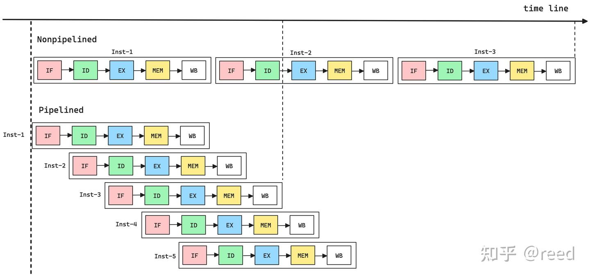
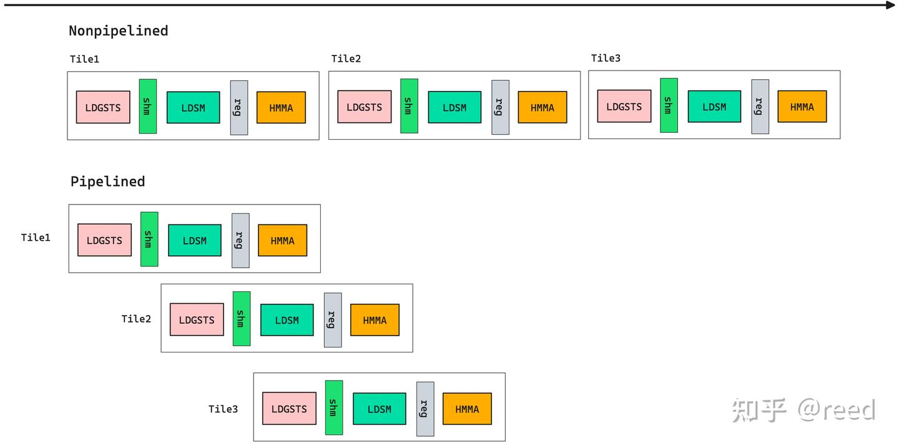

# cute 之 GEMM流水线

**Author:** [reed](https://www.zhihu.com/people/reed)

**Link:** [https://zhuanlan.zhihu.com/p/665082713](https://zhuanlan.zhihu.com/p/665082713)

---

前面文章我们介绍了CuTe的[Copy抽象](https://zhuanlan.zhihu.com/p/666232173)、[MMA抽象](https://zhuanlan.zhihu.com/p/663092747)，基于这些抽象我们进行了[简单的GEMM实现](https://zhuanlan.zhihu.com/p/667521327)。从逻辑上而言，CuTe的介绍已经结束了，但是对于我们要完成的GEMM运算而言还有很重要的一项优化需要考虑，那就是如何高效的、并行的利用GPU中的数据加载和计算单元，亦即如何组织CuTe中的Copy抽象和MMA抽象以完成高效的GEMM计算。这部分内容属于GEMM的策略部分，不是CuTe的功能范畴，但是为了这系列文章的标题的对称性，我们依然将题目取为"CuTe之GEMM流水线"，我们需要知道的是，本质而言流水线部分本身不属于CuTe，而是GEMM的优化策略。文章结构方面，本文首先通过回顾经典的RISC硬件实现的指令流水线引入流水线对性能提升的作用，然后由类比介绍了GEMM算法常用的软件流水线（Tile间和Tile内），其后介绍了NVIDIA Ampere架构提供的异步拷贝指令和MultiStage流水线，最后文章总结了GEMM流水线和CuTe的关系。

## RISC硬件流水线

在当今的处理器微架构中，流水线技术是提升指令并行的核心技术。流水线处理器是指将每一个指令的执行过程分为多个阶段（Stage），并且允许不同指令的不同阶段可以被同时处理。以经典的RISC（Reduced Instruction Set Computer）流水线为例，一条指令的执行被分为五个阶段：

* 取指（IF = Instruction Fetch），从指令缓存中根据程序运行的位置（PC = program counter）取出一条要执行的指令；
* 译码（ID = Instruction Decode），将取出的二进制编码分解成要进行的运算类型、源寄存器和目的寄存器；
* 执行（EX = EXecute），执行单元执行特定的运算；
* 访存（MEM = MEMory），如果指令有对内存的访问需求，该阶段则负责相应的内存读写；
* 写回（WB = Write Back），将执行单元的执行结果和（或）内存的访问结果写出到目的寄存器。

*Figure 1. 流水线和非流水线处理器指令执行的时间分析*

图1对比了非流水线和流水线架构执行指令时的时间对比，可以看到非流水线结构执行每一条指令都需要执行所有的阶段，其执行三条指令（Inst-1, Inst-2, Inst-3）所需要的时间如图上半部分所示。在流水线结构下，第一条指令在做取指后进入译码阶段，这时候第二条指令则可以进入取指阶段，后续的指令阶段也是类似的可以产生重叠。如图中的下半部分所示，以流水线的形式执行三条指令所需的时间要比非流水线的模式小很多。流水线模式提升了指令执行中的各个阶段的不同单元的使用率，使得每一个时刻每一个单元都能充分利用，而不是非流水线结构中一个时间点只有一部分单元运行，而其他时间都在空闲等待。

## GEMM软件流水线（Tile间）

我们看到指令流水线通过硬件的设计逻辑可以提升各个单元的利用情况，提升并行度既而提升运行效率。对于GEMM问题而言，我们也可以采用这种思路利用软件编程的过程的来实现更好的并行。

*Figure 2. 循环k模式的矩阵乘法的指令构成*

如图2所示，一个典型的sliced-k模式的GEMM实现中，通过循环K轴方向的tile来累加得到最终的CTile的结果。则类似RISC中的流水线模式，我们将计算每一个Tile的矩阵乘积作为一个基本的单元（如RISC中的指令），则该指令的执行类比RISC流水线可以划分为多个阶段，

* 数据加载到共享内存（LDGSTS = LoaD Global STore Shared memory）
* 数据加载到寄存器（LDSM = LoaD Shared Matrix）
* 块状矩阵乘法运算（MMA = Matrix Multiply Accumulate）

其中第一个阶段的输出数据存放在共享内存中，第二个阶段的数据存放在寄存器中。和RISC中的流水线类似，我们把一个Tile的计算过程分成三个阶段，如果各个阶段可以重叠则效率可以极大的提升，于是有了流水线思路优化的GEMM执行效果，如图3所示，

*Figure 3. 非流水线模式和流水线模式下的GEMM执行逻辑*

这样三个阶段的执行便可以并行起来，通过流水线使得各个单元能够同时工作，提高了各个单元的利用效率，包括全局内存到共享内存到数据加载、共享内存到寄存器到数据加载、矩阵计算，提升GEMM的运行效率。

## Tile内的流水线

*Figure 4. GEMM Tile内的流水线模式*

对于矩阵乘法中的分块模式Tile内也可以使用流水线模式（本文称为tile内小k循环），如图4所示，对于Tile级别的矩阵乘，一般一个Tile内包含的矩阵大小需要若干个指令（MMA_Atom中的指令）才能完成矩阵乘法，并且各个矩阵乘法的输入数据相互独立，所以我们可以将数据加载和计算组成流水线模式以提高数据加载单元和计算单元的利用率，如此便可以形成Tile内的流水线模式（二级流水线），如图中pipelined标记的部分，其可以通过重叠数据加载和计算提高Tile内完成矩阵计算的整体效率。

## 异步拷贝和MultiStage流水线

为了提升数据加载效率，NVIDIA在Ampere架构的GPU中提供了异步拷贝指令`cp.async`（SASS汇编为LDGSTS = LoaD Global Store Shared）。该异步拷贝指令可以异步地完成全局内存到共享内存的数据加载。在Ampere架构之前，全局内存到共享内存数据的加载必须经过寄存器，所以在寄存器层面会产生数据依赖，由于GPU的顺序执行机制和scoreboard的依赖解决方法（in-order issue, in-order execute），使得全局内存到共享内存到数据有寄存器依赖引入到stall。而Ampere下提供的`cp.async`则克服了这个约束，直接做实现全局内存到共享内存到加载，由于数据是异步加载的，即指令发射出去后便可以执行后续指令而无需等待，所以该架构提供了commit和wait机制来做显式的同步。其中commit用于标记事件的同步点，wait用于同步到特定同步点，保证某个同步点之前到数据都已经拷贝完成。

*Figure 5. 异步拷贝机制*

如图5所示，我们通过`cp.aync`指令提交了三个全局内存到共享内存到拷贝任务，同时通过commit提交了三个事务点和两个wait，其中`wait<1>`表示可以允许最多有一个未完成的异步事务（G2 -> S2），即`wait<1>`执行结束能够确保G1到S1的拷贝已经完成，`wait<0>`表示允许有零个未完成的事务。也就是其会等待之前所有的commit的任务都完成，即G1->S1, G2->S2, G3->S3全部已经完成。

有了异步数据拷贝指令我们便可以完成全局内存到共享内存的异步加载，即完成矩阵A、B Tile的加载，再整合Tile间和Tile内的流水线，我们可以得到GEMM计算的MultiStage流水线模型，如图6所示，

*Figure 6. MultiStage流水线模型*

其中浅绿色的
$$
G^i\rightarrow S^i
$$
表示全局内存到共享内存到异步数据加载其对应的大小为Tile的大小，其合并表示TileA和TileB的数据加载（即tile循环），棕色的
$$
S\_j \rightarrow R\_j
$$
表示共享内存到寄存器到数据加载，其对应Tile内的小矩阵的数据加载，也是合并的表示A B的加载（即tile内的小k循环）；深绿色
$$
mma(R\_i)
$$
表示寄存器上的矩阵乘法计算，亦tile内的小k循环。mma的边界有两条黑色边界线，两边界线通过曲线虚线连接，其表示tile内小k循环的起点和终点，即黑线之间完成tile内的矩阵乘法；曲线虚线表示完成一个tile的计算之后继续进行下一个tile的计算。在第一个tile开始计算之前（即第一个黑色实现边界之前）对于multistage实现（图示kStage为4），需要将stage - 1个异步的全局内存到共享内存到加载任务发射出去（G0->S0, G1->S1, G2->S2），同时为了能够读取第一个Tile的内容，则在所有异步任务发射之后，我们wait S0完成，wait之后表示数据已经到达了共享内存，在进入tile的小k循环之前我们首先从S0中取出ik = 0的矩阵计算所需要的数据到寄存器R0(第一条黑色虚线和第一条黑实线之间)，这时，我们已经有了第一个矩阵计算所需要的数据了，于是我们进入tile内的小k循环，进入循环我们需要执行三个动作：1. 发射异步读取新的Tile数据G3->S3，2. 从共享内存读取下一个小k矩阵乘法所需要的数据R1，3. 执行第一个小k的矩阵运算。其中共享内存写出的数据和mma所需数据依赖关系通过其中的箭头表示。进入小k循环后重复上面的2、3步骤即可以流水线的完成数据加载和计算在最后一个小k循环之前，我们需要读取下一个tile中的第一个小k的数据（共享内存到寄存器），但是此时下一个tile的数据（全局内存到共享内存）需要通过wait S1保证数据加载完成，所以在最后一个小k循环之前需要插入对S1的异步事务等待，等待结束后我们便可以像之前进入小k循环之前一样在进入下一个循环（tile循环）之前加载共享内存到数据到寄存器，值得注意的是此处的共享内存已经不是当前tile，而是下一个tile，即S1。读完R0之后，完成最后一个小k的mma计算，如此便完成了tile内的小k循环，小k循环结束便重复下一个tile的计算，最终完成tile循环。

如上便是multi stage的GEMM流水线（Tile间多级，Tile内二级），其中multi表示多个，具体的个数则为shared memory中间buffer的个数。即stage为5的GEMM流水线指有五个shared memory buffer的流水线设计，其中每个buffer可以存放一个Tile的数据（包含TileA和TileB）。在Tile循环开始之前需要先发射stage - 1个全局内存到共享内存的加载，然后在循环中加载下一个Tile，如此循环使用以上stage个buffer完成所有数据到加载。在没有异步拷贝支持的GPU架构中，寄存器的依赖关系和`syncthread`的全局影响，决定了其最多只能有两个memory buffer（实质是寄存器buffer），一个用于当前数据的计算，一个用于后续数据的加载，这也是常说的双缓存机制（double buffer），双算缓存机制可以认为是multi stage中stage为2的一个特例。

合适的stage大小本质是数据加载能力和矩阵计算能力的balance，其由Tile大小和硬件latency决定，在具体选择时可以通过micro-benchmark来获取相应的指令的latency来正向设计，也可以通过具体环境试验tuning得到。后面的文章中，我们会利用这种软件流水线方式实现更高效的GEMM。

## 总结

我们回顾上面的流水线建立过程不难发现，软件流水线的本质是：合理的控制数据搬运和计算的大小和执行顺序，使得它们背后的硬件单元能够更充分的并行执行。CuTe提供了这两者的抽象：Copy和MMA，按照流水线的思路去组织这些Copy和MMA即可以完成高效的矩阵乘法。也就是说CuTe是工具，如何更好的使用这些工具来达到更好的硬件利用则属于设计，其已经超越了CuTe的范畴。后续文章我们会使用CuTe提供的Copy和MMA抽象，基于本文讨论的流水线模式实现高效的GEMM。

## 参考

[https://en.wikipedia.org/wiki/Classic_RISC_pipeline](https://en.wikipedia.org/wiki/Classic_RISC_pipeline)

[https://link.springer.com/book/10.1007/978-3-031-01729-2](https://link.springer.com/book/10.1007/978-3-031-01729-2)

[https://github.com/NVIDIA/cutlass/blob/main/include/cutlass/gemm/collective/sm80_mma_multistage.hpp](https://github.com/NVIDIA/cutlass/blob/main/include/cutlass/gemm/collective/sm80_mma_multistage.hpp)
