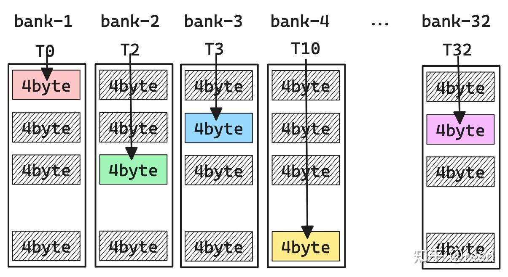
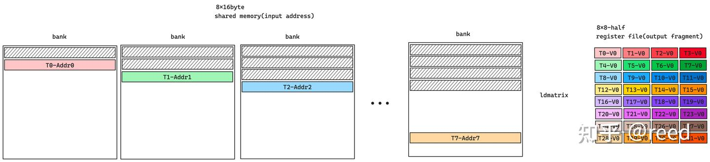
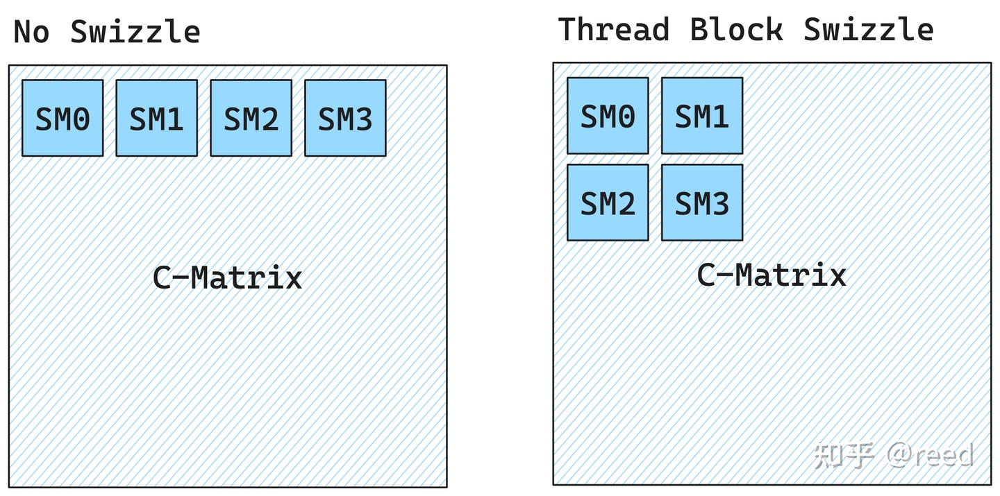

# cute 之 Swizzle

**Author:** [reed](https://www.zhihu.com/people/reed)

**Link:** [https://zhuanlan.zhihu.com/p/671419093](https://zhuanlan.zhihu.com/p/671419093)

---

前面的文章我们介绍了[GEMM中的流水线技术](https://zhuanlan.zhihu.com/p/665082713)，流水线的核心是将[拷贝](https://zhuanlan.zhihu.com/p/666232173)和[计算](https://zhuanlan.zhihu.com/p/663092747)并行或者说是将数据加载隐藏在计算过程中。矩阵计算中的数据加载是从全局内存到共享内存然后到寄存器。共享内存作为中间的媒介可以减少矩阵计算时对全局内存的访问数据量，从而提升计算访存比。共享内存为了提升访问的并行性采用多bank结构，这也造成了编程时的困难，CuTe通过提供swizzle抽象简化了逻辑空间和多bank存储空间的映射的复杂度。本文首先介绍了shared memory的多bank存储结构，之后介绍了矩阵计算中的ldmatrix指令对逻辑空间和存储空间的要求，再次我们介绍了异或运算的特性和Swizzle抽象，最后我们简单介绍了Thread Block Swizzle和对本文进行了总结。

## 局部性原理和Shared Memory

局部性原理（Principle of Locality）是计算机科学的基石之一，它包括空间局部性和时间局部性。其中的空间局部性（也叫数据局部性）是指对数据的使用会限制在一个相对临近的存储空间中。Cache是针对空间局部性的很好的解决方案，但是Cache的数据更新和替换逻辑一般会实现在硬件中，表现为不可编程。在SIMT（single Instruction Multiple Thread）编程模式下，线程私有的寄存器提供了线程级别的存储能力，有时线程间需要交换一些数据来协同的完成特定任务，为了追求更好的数据局部性和实现线程间的数据共享，提供可编程的、线程间可共享的Cache就显得尤其重要。CUDA在硬件SM（Stream Multiprocessor）上提供了Shared Memory存储机构，同时软件上通过提供了相应的读写接口和同步源语言来实现其读写、同步和可见性，这样线程块内的线程便可以通过共享内存完成数据共享，同时对于线程块公共使用的数据便可以存储在其中达到线程块级别的可编程的数据局部性。

由于Shared Memory是为线程块服务的，所以其必须能支持线程块内的线程并行的对其进行访问（包含数据读取和写入），为了保障Shared Memory存储结构在多线程并发读写下的效率（更低的Latency和更高的Throughput），其硬件被实现为多bank的模式，每个bank都是可以独立寻址的存储空间，bank之间可以并行的读写数据，相互之间不会影响。在NVIDIA的架构中，shared memory包含32个bank，bank中可寻址的基本单元为4byte，如图1所示，每个bank为黑框所包含的单元，用户看到的地址空间为箭头所示的方向，即相邻的4byte占用不同的bank。如图2，当32个线程同时访问32个不同的bank时，各个bank是并行执行的，其效率是最高的，即32个线程并发的访问32个bank中不同颜色的单元，是可以并行的，值得注意的是其中的线程编号（如图2中的T0所示）和bank中的行位置并没有连续性要求。如图3，如果某两个线程T0、T2要同时访问相同bank-2的不同地址，则这两次访问会被排队执行，即先访问该bank的一个地址，然后再访问第二个地址，这样两次访问在发射任务维度上（产生访问请求指令）时间维度上是并行的，但是在真正bank读写数据在时间维度上是串行的。这就是所谓的bank conflict。由于一个bank上有两次冲突，这种情况称为二路冲突（two-way conflict）。

\*Figure 1. 共享内存bank结构和地址连续方向\*

\*Figure 2. 无bank conflict的共享内存访问模式\*

\*Figure 3. 两路冲突的共享内存访问模式\*

为了减少指令数，我们在进行kernel优化时会采用向量化的读写指令（也叫大字长读写），如以128bit的形式读写共享内存，此时线程需要访问的单位数据量为16byte，32个线程需要访问的数据量为16byte x 32 = 512byte。完整的512byte需要4个phase才能完成访问，第一phase，T0-T7无bank conflict的访问所有bank，第二phase，T8-T15无bank conflict的访问所有bank，第三phase，T16-T23无bank conflict的访问所有bank，第四phase，T24-T31无bank conflict的访问所有的bank。这种情况也可以看作是：shared memory基本单元为16byte，总bank数为8，冲突与否的分析不在是32线程，而变成4个phase中的不同线程。如果采用64bit的访问形式，则相应的基本单元可以看作是8byte，总bank数目为16，冲突与否的条件变成两个phase内的线程是否冲突。整体上shared memory空间可以看作二维存储空间，其中列方向表示bank情况，行方向表示自由定义的大小。值得注意但是冲突与否是通过内存访问事务级别来判定的，具体的可以参考[NVIDIA开发者论坛的讨论](https://forums.developer.nvidia.com/t/how-to-understand-the-bank-conflict-of-shared-mem/260900)。

## 共享内存读取（ldmatrix指令）

\*Figure 4. ldmatrix输入和输出数据\*

在GEMM流水线中，利用Tensor Core可以完成特定规格的矩阵计算乘计算（如
$$
D\_{16\times8} = A\_{16\times16} B\_{16\times8} + C\_{16\times8}
$$
），其中矩阵数据A、B、C、D是通过warp内的所有线程提供一部分寄存器共同表示的。如图4中右侧的register file所示，其表示32个线程T0-T31每一个线程提供一个寄存器V0（4byte），共同表示形状为8x8 half类型的矩阵块多个8x8的块可以构成更大的16x16，16x8的块。前序文章已经介绍过，这部分数据可以利用ldmatrix指令通过warp level实现。针对一个8x8-half的寄存器表示的作为输出的矩阵块，ldmatrix其输入要求为8个shared memory地址，每个地址指向一个16byte共享内存中的数据，其中T0-Addr0指向的16byte数据经过ldmatrix会被分派到T0-T3的V0寄存器中。T1-Addr1指向的数据会被分派到T4-T7的V0寄存器中。通过ldmatrix指令便可以实现矩阵数据从共享内存到寄存器到加载，前面的介绍我们知道共享内存是有bank结构的，并且按照16byte的形式进行读取，所以T0-T7读取该数据时会被作为一个独立的phase，这就要求所有的16byte表示的8个数据必须分布在不同的bank，才能确保读取共享内存数据时不产生bank conflict。图5展示了一种ldmatrix时无bank conflict的布局形式。

\*Figure 5. ldmatrix指令无bank conflict时的bank占用情况\*

从数学逻辑上看，8x8-half的寄存器数据表示连续的矩阵块，共享8x16byte的内存也有很好空间局部性的矩阵块，但是从共享内存的存储逻辑上看，为了避免读取时的bank冲突，其必须分配在不同的bank中。所以其横向位置在共享内存排列时不是简单的逻辑向下排列，而需要横向（bank方向）错开来避免bank conflict。

## Shared Memory写入

在GEMM流水线中数据的起点是全局内存，如图6所示，矩阵乘法所需要的寄存器数据来自于共享内存，共享内存数据来自于全局内存，数学逻辑上寄存器表示的数学空间和全局内存的位置是对应的。但是共享内存由于有bank的存在，其块状数据在共享内存存储时不是简单行列排列。需要根据ldmatrix的要求来避免冲突，这样从全局内存读取数据后写入共享内存时，也需要按照逻辑要求进行存储空间的映射。同时在全局内存向共享内存加载时，为了提升全局内存的读取效率需要考虑合并访存和L2 Cache line的情况，一般会要求其线程沿着线性地址的空间顺序排列，如图T0->Tn所示。也就是说我们在做全局内存到共享内存数据搬运时，思考模型是逻辑空间，而执行时需要考虑存储空间以避免bank conflict。

\*Figure 6. 数据加载的逻辑空间和物理空间\*

## 异或运算的封闭性和双射性

计算机异或指令（符号表示为^）接收两个输入，对于1bit数据，如果输入的bit相同则输出0，如果bit不同则输出1。对于多bit数据，则针对各个位置进行1bit异或操作。如5^3 = b0101 ^ b0011 = b0110 = 6。异或计算满足交换律，结合率。同时对于集合
$$
S = \{ x, x \in[0, 2^n-1] \}
$$
中的任意两个元素，异或所形成的输出满足封闭性。如图7，我们可以发现该结果满足双射性（bijective），以上这些性质可以通过集合理论来进行严谨的证明。

\*Figure 7. 使用异或避免共享内存bank冲突\*

图7中左侧的逻辑矩阵可认为是icol为1的共享内存，其在共享内存对应一个bank，即矩阵的逻辑位置为
$$
(irow = [0, 7], icol = 1)
$$
，我们可以通过对column进行异或得到新的column作为bank值，即
$$
（irow = [0, 7], ibank = irow \wedge icol）
$$
。如图7中右侧黑框标注的部分，可以看到这些数据被分配到了不同的bank中，在读写时可以避免bank conflict。

## Swizzle抽象

CuTe中通过swizzle抽象来实现共享内存bank conflict的冲突解决。通过前面的描述我们知道，在整个计算体系中，我们需要的是二维的逻辑空间来描述矩阵块，但是为了避免共享内存的冲突，我们在共享内存存储数据时需要的是物理空间。回顾之前的介绍我们知道描述逻辑空间我们可以使用[Layout（本质是函数）](https://zhuanlan.zhihu.com/p/661182311)，而为了避免bank 冲突，CuTe中定义了swizzle抽象，swizzle的本质也是函数，swizzle作用在layout上，即函数作用在函数上，复合函数复合的定义。Layout的作用是给定坐标返回offset，而swizzle的作用则是给定offset返回bank conflict free的offset。即
$$
offset_{bank\_conflict\_free} = Swizzle(Layout(coord))
$$
。为了达成这个目的，Swizzle定义了三个参数: B、M、S。它们共同表达描述一维坐标向二维空间映射的三个层次。当我们把一个一维度坐标转换成二维坐标时，我们首先将一维中连续的几个元素作为新空间中的基础元素，然后描述该二维空间有多少行和列。其中一维坐标中连续的
$$
2^M
$$
个元素构成二维空间中最基本的元素，
$$
2^S
$$
表示新的二维空间中有多少列，
$$
2^B
$$
表示新的二维空间中有多少行。

\*Figure 8. Swizzle的计算逻辑\*

如图8所示，当B = 1, M= 1，S = 2时，M描述了一维坐标连续的两个元素构成一个二维空间的元素，S描述了形成二维空间后的元素的个数，B描述了形成二维空间的行数，如此我们便得到了图2-D(a)，其二维空间包含二行四列，基本单元包含两个元素。然后我们对二维空间中的列坐标和对应的行坐标进行异或得到新的列号(icol = irow ^ icol)，形成2-D(b)。如果一维坐标映射后超过出了
$$
2^B
$$
的大小，则超出的部分的行号从0开始记，但是offset上要加上前面的所有的元素个数。

在实际操作时，如我们有一块half类型，shape:(8, 32), stride: (32, 1)的共享内存，我们定义Swizzle<3, 3, 3>作用到该shared memory Layout上，形成 A = Composition(Swizzle<3, 3, 3>{}, Layout<Shape<8, 32>, Stride<32, 1>>{}); 则Layout中有效的offset为0 - 256。Swizzle中M为3，所以8个元素形成一个新的最小的元素，即8x2byte = 16byte；Swizzle中S为3，所以2D空间中一行包含8个元素，则有8x16byte = 128byte，128byte为shared memory无conflict访问所有bank的最大宽度；Swizzle中B为3，则2D空间irow更新的间隔为8。如此则实现了将一个逻辑的空间向2D的shared memory空间的映射，其中列的宽度为128byte占满所有的bank，行列异或后得到新的列号，避免了在bank方向（亦即icol方向）的冲突。

## Thread Block Swizzle

除了避免共享内存冲突的swizzle外，CuTe（CUTLASS）中还有另一种swizzle，为thread block swizzle，在以C为中心的任务划分模式中，如果没有Thread Block Swizzle，则任务块会按照线性的行优先或者列优先的顺序分配给所有的执行单元（如图9中SM0-3，假设硬件只有4个SM），进行Thread Block Swizzle后，可以形成如图9右侧所示的任务划分关系，在某些场景下，其可以提升L2 Cache的命中率，数学上表现为在相同的元素能覆盖更大的面积，同时这部分面积(A、B)能够很好的被L2缓存住，具体的可以参考CUTLASS中的thread block swizzle实现。

\*Figure 9. Thread Block Swizzle\*

## 总结

本文介绍了shared memory的bank结构和特征，以及通过行列异或实现bank的交错的方法。继而介绍了CuTe中Swizzle的抽象，最后介绍了优化L2命中率的Thread Block Swizzle方法。至此矩阵乘法优化的理论性部分已经全部介绍完毕，接下来的文章我们会基于这些方法完成高效的矩阵乘法。

## 参考

[https://en.wikipedia.org/wiki/Locality_of_reference](https://en.wikipedia.org/wiki/Locality_of_reference)

[https://on-demand.gputechconf.com/gtc/2018/presentation/s81006-volta-architecture-and-performance-optimization.pdf](https://on-demand.gputechconf.com/gtc/2018/presentation/s81006-volta-architecture-and-performance-optimization.pdf)

[https://patentimages.storage.googleapis.com/44/ed/9d/7b0c401348f57b/US8108625.pdf](https://patentimages.storage.googleapis.com/44/ed/9d/7b0c401348f57b/US8108625.pdf)

[https://patentimages.storage.googleapis.com/e7/27/98/de3cbfc7ab3b8c/US7680988.pdf](https://patentimages.storage.googleapis.com/e7/27/98/de3cbfc7ab3b8c/US7680988.pdf)

[https://github.com/NVIDIA/cutlass/blob/main/include/cutlass/gemm/threadblock/threadblock_swizzle.h](https://github.com/NVIDIA/cutlass/blob/main/include/cutlass/gemm/threadblock/threadblock_swizzle.h)

[How to understand the bank conflict of shared_mem](https://forums.developer.nvidia.com/t/how-to-understand-the-bank-conflict-of-shared-mem/260900)
