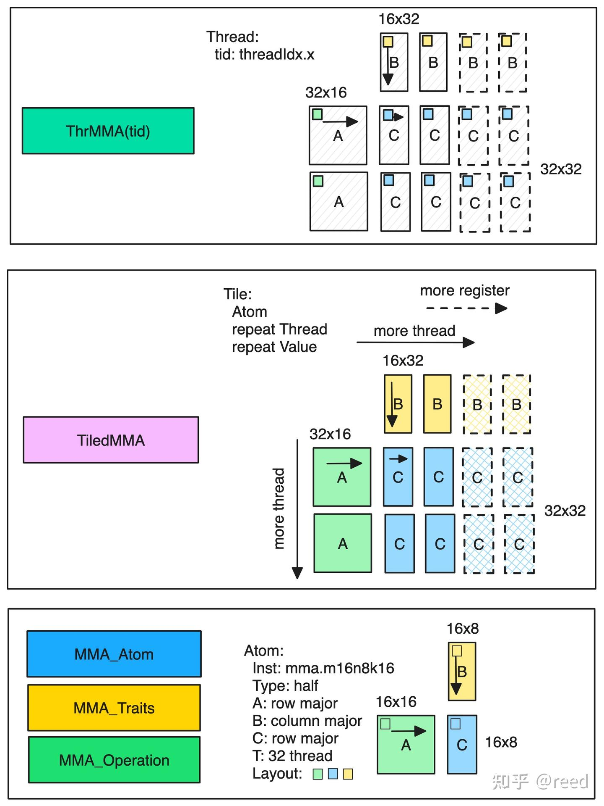
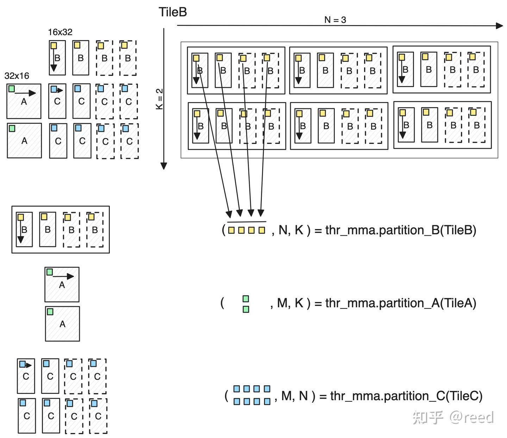

# cute 之 高效GEMM实现

**Author:** [reed](https://www.zhihu.com/people/reed)

**Link:** [https://zhuanlan.zhihu.com/p/675308830](https://zhuanlan.zhihu.com/p/675308830)

---

前面的文章我们介绍了CuTe中的[Layout抽象](https://zhuanlan.zhihu.com/p/661182311)、[Tensor抽象](https://zhuanlan.zhihu.com/p/663093816)、[MMA抽象](https://zhuanlan.zhihu.com/p/663092747)、[Copy抽象](https://zhuanlan.zhihu.com/p/666232173)、[Swizzle抽象](https://zhuanlan.zhihu.com/p/671419093)和[流水线技术](https://zhuanlan.zhihu.com/p/665082713)。本文将组合利用这些抽象和技术形成高效的矩阵乘法。为了更好地实现高效的矩阵乘法，本文从多个维度介绍了高效的实现方法。在文章结构上，本文首先介绍了计算高效，然后介绍了访存高效，再后介绍了算法高效，最后介绍了尾阶段高效。我们基于这些高效方案利用CuTe实现了高效的矩阵乘法，并和cuBLAS、cuBLASLt进行了性能对比，对比结果表明我们的实现达到了SOTA水平。文章最后讨论了搜索kernel的启发式算法和参数相容性问题并对文章进行了总结。

## 计算高效

GEMM中的核心计算部分是块状的矩阵乘法，针对输入为半精度类型（half precision），Accumulator为半精度类型的计算任务，Ampere架构提供了Tensor Core上的如下计算指令

* `mma.sync.aligned.m16n8k8.row.col.f16.f16.f16.f16`
* `mma.sync.aligned.m16n8k16.row.col.f16.f16.f16.f16`，

CuTe将这两条指令抽象为MMA_Operation：

* `SM80_16x8x8_F16F16F16F16_TN`和
* `SM80_16x8x16_F16F16F16F16_TN`，

当我们的问题规格较大时，我们尽可能选用计算量更大的指令，这样同一条指令产生的计算任务就更多，可以减少指令数目，提升调度效率。

选定计算指令之后，我们便可以通过MMA_Traits，如图1，在MMA_Operation的基础上补充上后续计算所需要的其它信息，如矩阵计算的形状、该指令所需要的协作线程（此处为32线程）、A、B矩阵的寄存器Layout分布情况。有了MMA_Traits之后，我们便可以将其进一步封装为MMA_Atom，其利用Traits提供的信息，提供数据划分所需要的信息和Operation的执行功能。MMA_Atom描述了矩阵计算的原子能力（单条指令的计算能力，最小能力），我们通过增加更多的线程、每个线程做多次任务则可以将计算的规格增大，如此则有了TiledMMA，TiledMMA针对每一个线程则被分裂为ThrMMA，TiledMMA和ThrMMA利用MMA_Atom提供的信息，能够实现对矩阵块的划分。调用相应的cute::gemm函数即可以完成矩阵乘法计算。


\*Figure 1. MMA能力层次和各层的主要功能\*

此时，我们便可以得到如下主机端代码

```cpp
using mma_op = SM80_16x8x16_F16F16F16F16_TN;
using mma_traits = MMA_Traits<mma_op>;
using mma_atom = MMA_Atom<mma_traits>;
static constexpr int kMmaEURepeatM = 2;
static constexpr int kMmaEURepeatN = 2;
static constexpr int kMmaEURepeatK = 1;
static constexpr int kMmaVRepeatM = 1;
static constexpr int kMmaVRepeatN = 2;
static constexpr int kMmaVRepeatK = 1;
using MMA_EU_RepeatT = decltype(make_layout(make_shape(
Int<kMmaEURepeatM>{}, Int<kMmaEURepeatN>{}, Int<kMmaEURepeatK>{})));
using MMA_V_RepeatT = decltype(make_layout(make_shape(
Int<kMmaVRepeatM>{}, Int<kMmaVRepeatN>{}, Int<kMmaVRepeatK>{})));
using MMA =
decltype(make_tiled_mma(mma_atom{}, MMA_EU_RepeatT{}, MMA_V_RepeatT{}));
```

其中前三行选择了MMA指令形成了Atom能力，然后定义了对该Atom能力的重复方法（包括线程重复和寄存器重复），它们分别形成各自重复的Layout，然后利用`make_tiled_mma`接口形成更大块的矩阵乘法描述。设备端的代码如下：

```cpp
TiledMMA tiled_mma;
auto thr_mma = tiled_mma.get_slice(idx);
auto tCrA = thr_mma.partition_fragment_A(gA(_, _, 0)); // (MMA, MMA_M, MMA_K)
auto tCrB = thr_mma.partition_fragment_B(gB(_, _, 0)); // (MMA, MMA_N, MMA_K)
auto tCrD = thr_mma.partition_fragment_C(gD); // (MMA, MMA_M, MMA_N)
```

将TileMMA提供线程号，则获得具体线程的数据划分能力，对给定的数据块进行划分，得到线程级的数据描述。


\*Figure 2. partition_A/B/C逻辑示意图\*

如图2所示，其展示了ThrMMA提供的partition_A/B/C和partition_fragment_A/B/C函数的计算逻辑，给定一个静态大小的Tensor TileB（被划分维度为Int<>编译时常量），则thr_mma可以对其进行划分，其中划分的逻辑为：以TileMMA中描述的矩阵大小对目标Tensor进行周期性平铺，对高亮的部分进行选取形成新的矩阵，其中第一个维度为TiledMMA中单个线程的数据描述，第二个维度和第三个维度为行方向和列方向需要重复的次数。如果TileB的维度比两维高，则高出的部分继承到N,K维度之后。类似地，A/C的划分采用同样的逻辑。

## 访存高效

整个GEMM计算体系中数据的在到达Tensor Core进行计算之前需要包含：全局内存到共享内存，共享内存到寄存器，在流水线章节我们介绍过全局内存到共享内存的异步拷贝方法，和共享内存到寄存器的ldmatrix指令。在CuTe中，针对全局内存到共享内存，我们和选择MMA能力类似，选择CuTe已经定义好的抽象能力即可，此处我们选择`SM80_CP_ASYNC_CACHEGLOBAL`Copy_Operation，该指令可以实现全局内存到共享内存到异步拷贝，同时CACHEGLOBAL指示了数据只在L2做Cache，对L1则做bypass。于是我们可以形成如下主机端代码：

```cpp
using g2s_copy_op = SM80_CP_ASYNC_CACHEGLOBAL<cute::uint128_t>;
using g2s_copy_traits = Copy_Traits<g2s_copy_op>;
using g2s_copy_atom = Copy_Atom<g2s_copy_traits, T>;
using G2SCopyA =
decltype(make_tiled_copy(g2s_copy_atom{},
make_layout(make_shape(Int<32>{}, Int<4>{}),
make_stride(Int<4>{}, Int<1>{})),
make_layout(make_shape(Int<1>{}, Int<8>{}))));
using G2SCopyB = G2SCopyA;
```

和MMA时的make_tiled_mma类似，Copy抽象提供了make_tiled_copy能力，其通过制定线程和数据的重复方法将Atom能力扩展到块状能力。数据拷贝时可以区分AB矩阵的不同拷贝方法，我们此处选用同样的Copy能力。设备端代码如下

```cpp
G2SCopyA g2s_tiled_copy_a;
auto g2s_thr_copy_a = g2s_tiled_copy_a.get_slice(idx);
auto tAgA_copy = g2s_thr_copy_a.partition_S(gA); // (CPY, CPY_M, CPY_K, k)
auto tAsA_copy =
g2s_thr_copy_a.partition_D(sA); // (CPY, CPY_M, CPY_K, kStage)
```

和图1中的MMA层级类似，Copy时先将TileCopy通过指定线程号得到线程级的Copy能力抽象ThrCopy。也和图2中的MMA划分类似，ThrCopy抽象提供了partiton_S/D函数，其实现将大块的矩阵划分到线程维度上。经过partition_S/D划分的数据维度为(E, M, K)，E表示该线程要做的数据大小（包含分布），M、K表示由于给定的被划分的块需要在纵轴和横轴上需要重复的次数。如果被划分的Tile的维度大于2，则多出的维度附加到（，M，K）维度之后。

对于共享内存到寄存器的拷贝，CuTe提供了对ldmatrix指令的封装，主机端代码和设备端代码分别如下：

```cpp
// shared memory to register copy
using s2r_copy_op = SM75_U32x4_LDSM_N;
using s2r_copy_traits = Copy_Traits<s2r_copy_op>;
using s2r_copy_atom = Copy_Atom<s2r_copy_traits, T>;
using S2RCopyAtomA = s2r_copy_atom;
using S2RCopyAtomB = s2r_copy_atom;
```

设备端代码：

```cpp
auto s2r_tiled_copy_a = make_tiled_copy_A(S2RCopyAtomA{}, tiled_mma);
auto s2r_thr_copy_a = s2r_tiled_copy_a.get_slice(idx);
auto tAsA = s2r_thr_copy_a.partition_S(sA); // (CPY, CPY_M, CPY_K, kStage)
auto tCrA_view = s2r_thr_copy_a.retile_D(tCrA); // (CPY, CPY_M, CPY_K)
```

其中主机端选择ldmatrix指令的x4模式，形成Atom抽象，设备端通过`make_tiled_copy_A`函数借助tiled_mma抽象出共享内存到寄存的TileCopy。前面的全局内存到共享内存TileCopy不同的是，这里直接利用tiled_mma的信息形成块状拷贝，原因是TiledMMA包含了计算所需要的数据描述，所以对于以它作为目标的Copy而言，tiled_mma自然也是精准描述这部分数据的，所以就不需要用户额外制定Copy_Atom到TileCopy的信息，而是之间从MMA能力中获得，其一定程度上可以避免了独立设置的不一致性问题。由于MMA时已经声明了寄存器存储空间，此处直接对其进行线程级小块的retile即可，不再是大块到小块的partition。

## 算法高效

前面两个章节介绍了计算的高效和访存的高效，如何将这两个步骤组合起来也是GEMM性能的关键要素，这部分我们成为算法的高效。其主要包含两个部分：1. 分块；2. 流水线。这两部分内容我们在简单GEMM实现和流水线中都有介绍，我们此处就不再赘述。对于分块部分，我们主机端和设备端的代码如下：

```cpp
static constexpr int kTileM = kTileM_;
static constexpr int kTileN = kTileN_;
static constexpr int kTileK = kTileK_;
static constexpr int kStage = kStage_;
```

设备端：

```cpp
// slice the tensor to small one which is used for current thread block.
Tensor gA = local_tile(A, make_tile(Int<kTileM>{}, Int<kTileK>{}),
make_coord(iy, _)); // (kTileM, kTileK, k)
Tensor gB = local_tile(B, make_tile(Int<kTileN>{}, Int<kTileK>{}),
make_coord(ix, _)); // (kTileN, kTileK, k)
Tensor gD = local_tile(D, make_tile(Int<kTileM>{}, Int<kTileN>{}),
make_coord(iy, ix)); // (kTileM, kTileN)
// shared memory
auto sA = make_tensor(make_smem_ptr(Ashm),
SmemLayoutA{}); // (kTileM, kTileK, kStage)
auto sB = make_tensor(make_smem_ptr(Bshm),
SmemLayoutB{}); // (kTileN, kTileK, kStage)
```

分别定义了分块的大小和设备端如何通过Tensor抽象和local_tile将矩阵进行分块。

流水线方面，为了做multi stage流水线，需要在共享内存分配时指定流水线级数，同时设备端需要做必要的数据加载和计算重叠方案。主机端代码如下

```cpp
static constexpr int kShmLoadSwizzleM = 3;
static constexpr int kShmLoadSwizzleS = 3;
static constexpr int kShmLoadSwizzleB = 3;
using SmemLayoutAtom = decltype(composition(
Swizzle<kShmLoadSwizzleB, kShmLoadSwizzleM, kShmLoadSwizzleS>{},
make_layout(make_shape(Int<8>{}, Int<kTileK>{}),
make_stride(Int<kTileK>{}, Int<1>{}))));
using SmemLayoutA = decltype(
tile_to_shape(SmemLayoutAtom{},
make_shape(Int<kTileM>{}, Int<kTileK>{}, Int<kStage>{})));
using SmemLayoutB = decltype(
tile_to_shape(SmemLayoutAtom{},
make_shape(Int<kTileN>{}, Int<kTileK>{}, Int<kStage>{})));
```

其定义了共享内存的Layout，其中Swizzle用来避免bank conflict，其详细介绍可以参考前序文章CuTe之Swizzle抽象，其中kStage表示流水线的级数。

核心设备端代码由两个for循环组成，具体如下，

```cpp
// loop over k: i. load tile, ii. mma
int ntile = k / kTileK;
#pragma unroll 1
for (int itile = 0; itile < ntile; ++itile) {
int nk = size<2>(tCrA);
#pragma unroll
for (int ik = 0; ik < nk; ++ik) {
int ik_next = (ik + 1) % nk;
if (ik == nk - 1) {
cp_async_wait<kStage - 2>();
__syncthreads();
ismem_read = (ismem_read + 1) % kStage;
}
// shm -> reg s[itile][ik + 1] -> r[ik + 1]
cute::copy(s2r_tiled_copy_a, tAsA(_, _, ik_next, ismem_read),
tCrA_view(_, _, ik_next));
cute::copy(s2r_tiled_copy_b, tBsB(_, _, ik_next, ismem_read),
tCrB_view(_, _, ik_next));
if (ik == 0) {
if (itile_to_read < ntile) {
cute::copy(g2s_tiled_copy_a, tAgA_copy(_, _, _, itile_to_read), tAsA_copy(_, _, _, ismem_write));
cute::copy(g2s_tiled_copy_b, tBgB_copy(_, _, _, itile_to_read), tBsB_copy(_, _, _, ismem_write));
++itile_to_read;
ismem_write = (ismem_write + 1) % kStage;
}
cp_async_fence();
}
cute::gemm(tiled_mma, tCrD, tCrA(_, _, ik), tCrB(_, _, ik), tCrD);
} // for ik
} // itile
```

外层循环对Tile做循环，内层循环对Tile内做k循环，同时在ik == 0 和 ik == nk -1的时候发射了后kStage-1的Tile的全局内层到共享内存的数据加载和针对即将读取的共享内存的数据同步。

## 尾阶段高效（Epilogue）

通过上面的计算、加载、算法，我们便可以得到矩阵乘之后的块状的数据，这些数据表示为线程内寄存器，由于数据存储，将这些数据存储出去并不平凡，如图3所示，如果将寄存器数据直接写出，则在全局地址空间中会产生内存地址的不连续，这将导致存储时需要更多的内存事务，并且不能使用向量化存储指令（STG.128）。


\*Figure 3. 寄存器堆直接存储至全局内存引入的不连续\*

针对这个问题，CuTe中（实质为CUTLASS中），专门提供了Epilogue来通过共享内存作为中间媒介。先将寄存器数据存储到共享内存，然后再从共享内存中以更连续、更高位宽的形式存储到全局内存中去。PACT'20 Fireiron文章有对该问题的详细探讨，可以参考之。


\*Figure 4. Epilogue中Accumulator寄存器通过共享内存实现到全局内存的数据搬运\*

本文通过共享内存实现高效的TileC的存储，具体代码可以参考github上的实现，整体过程如图4所示。

## 试验设置和结果

根据上面介绍的优化方法，我们利用CuTe实现了高效的Multi-Stage GEMM，代码地址为[https://github.com/reed-lau/cute-gemm](https://github.com/reed-lau/cute-gemm)。我们针对具体业务中使用的问题规格进行了性能测试。具体地问题规格为：M=81920, N=256, K=256, 其中A矩阵为行优先，B矩阵为列优先，C矩阵为行优先，输入输出和计算数据类型均为half。测试环境方面，显卡为NVIDIA GeForce RTX 3090，操作系统为Ubuntu 20.04.6 LTS，NVIDIA驱动版本为535.113.01，NVCC编译器版本为V11.7.64。我们对比了cuBLAS和cuBLASLt的调优的kernel，其cuBLAS和cuBLASLt版本号为111001。我们使用cuBLASLt的启发式方法选择尽可能多的kernel进行对比。

使用Nsight Compute对kernel运行时间进行精准的测量，同时为了避免L2 Cache缓存数据对效率评估对影响，我们主动设置--cache-control=all选项来保证在进行kernel profiling的时候清空历史cache数据，通过设置--clock-control=base选项来锁定GPU运行的频率，避免动态调频对性能测量的影响。

cuBLASLt经过启发式算法选出5个kernel，针对上面提到的问题规格进行了11次试验， 我们统计了这11次的均值、方差和中位数，结果如下表格：

| 所属库 | kernel名称 | 均值(us) | 方差(us) | 中位数(us) |
| --- | --- | --- | --- | --- |
| our-impl | gemm_multi_stage | 130.1 | 0.4 | 130.1 |
| cuBLAS | ampere_h1688gemm_128x128_ldg8_stages_32x1_tn | 153.4 | 2 | 154.1 |
| cuBLASLt | ampere_h16816gemm_128x64_ldg8_tn | 154.0 | 0.5 | 154.1 |
| cuBLASLt | ampere_h16816gemm_256x128_ldg8_stages_32x3_tn | 154.2 | 0.6 | 154.2 |
| cuBLASLt | ampere_h1688gemm_128x128_ldg8_stages_32x1_tn | 153.4 | 2 | 154.1 |
| cuBLASLt | ampere_h1688gemm_128x128_ldg8_tn | 136.5 | 0.7 | 136.5 |
| cuBLASLt | cutlass_80_tensorop_h16816gemm_128x256_32x3_tn_align2 | 183.4 | 0.7 | 183.4 |

表格中的数据可以看出均值和中位数相当，所以测量结果相对稳定。我们看到我们的实现为130.1 us，cuBLAS和cuBLASLt的最好结果为136.5us。针对该问题规格，我们的实现达到了SOTA的结果。

## 总结和讨论

### 启发式算法

回顾前文或者代码，我们不难发现代码中的很多参数是可以调整的，如矩阵分块的大小kTileM、kTileN、kTileK，流水线级数kStage等。针对不同的问题规格适当的调整这些参数能得到更好的效果。逻辑上，我们可以用理论计算来设计公式实现不同问题规模对这些参数的选择；我们也可以对不同的问题规格进行一些离线的穷举试验，分析这些参数维度空间中的分布数据，分析这些数据得到不同问题规格和这些优化参数的映射关系，归纳出特定的启发式算法，使得我们给定一个问题时能够选择出一个不错的kernel。本文只针对一个特定的case做优化，所以不涉及这部分内容，甚至可以直接参考cuBLAS选中的kernel对这些参数的设置情况。

### 参数相容性

前面的代码介绍，我们发现无论是MMA还是Copy每一个操作都需要设置很多参数，这些参数有的是描述layout，有的是描述线程数，有的描述寄存器重复，有的是描述计算块的大小。这些参数并不是完全自由的，它们之间会存在某种约束，这种约束可以是共享内存大小、可以是寄存器多少、可以是线程块大小、可以是划分方法，这是我们调优时调整参数需要考虑的。

### 其它方面

CUDA优化还有很多方面，如在流水线章节的最后部分我们介绍的提升L2命中率的Thread Block Swizzle方法，本文中的N维度不大，所以并没有使能；设置`__launch_bounds__`给编译器提供更多的优化提示本文也并未探究。本文的实现没有考虑数据地址非对齐和Tile非整除情形，这些在实际使用时都是有限制或者需要考虑的。同时CUTLASS的核心部分也已借助CuTe进行了collective和epilogue的抽象，我们也可以使用它来实现我们的矩阵计算，并且它们有更好的通用性。

### 总结

本文从计算高效、访存高效、算法高效、尾阶段高效这几个方面介绍了矩阵乘的高效实现方法。并且对核心代码进行了细致的解读。文章针对特定case将本文实现和cuBLAS、cuBLASLt进行了对比，实验结果表明，使用CuTe实现的GEMM方法可以达到SOTA的效果。

掌握CuTe的Layout、Tensor、MMA、Copy抽象可以帮助我们快速的构建矩阵计算能力，我们可以借助这种能力更高效的解决其它更复杂的问题（如Flash Attention）。

这是该cute系列的最后一篇，希望该系列文章能够帮助大家快速掌握CuTe。后续我将再选个topic和大家共同探讨高性能计算、高性能系统，希望我们很快又能见面。

## 参考

[PACT'20 Fireiron](https://dl.acm.org/doi/10.1145/3410463.3414632)

[NVIDIA CUTLASS Epilogue](https://github.com/NVIDIA/cutlass/blob/main/include/cutlass/epilogue/collective/sm70_epilogue_vectorized.hpp)
