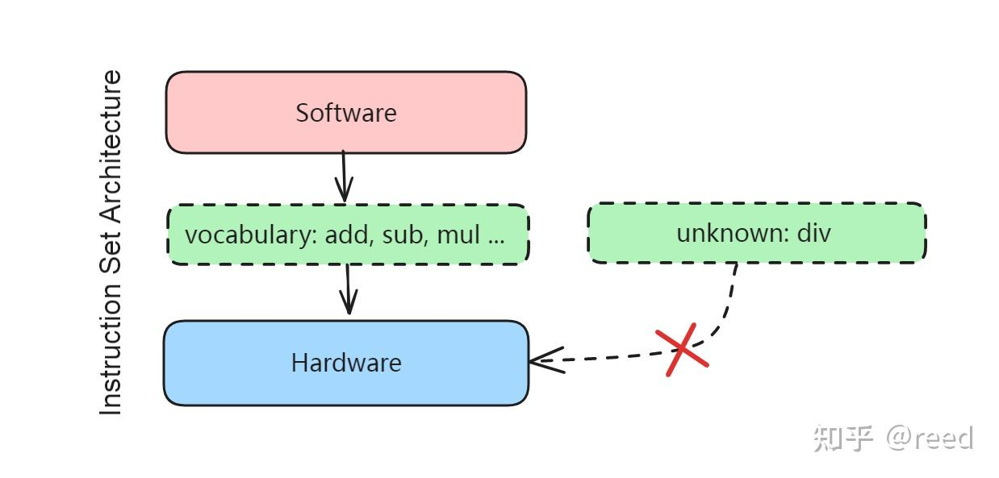

# NVidia GPU指令集架构-前言

**Author:** [reed](https://www.zhihu.com/people/reed)

**Link:** [https://zhuanlan.zhihu.com/p/686198447](https://zhuanlan.zhihu.com/p/686198447)

---

2017年ACM图灵奖颁给了John L. Hennessy和David A. Patterson，表彰他们在计算机架构方面的开拓性贡献。在他们共同撰写的文章"计算机架构的新黄金时代"中，详细介绍了指令集架构的发展和未来的机遇点。此处我们引用其中对指令集架构（Instruction Set Architecture）的定义："Software talks to hardware through a **vocabulary** called an instruction set architecture (ISA)"，以及DSA（Domain Specific Architecture）的优势：1. 针对特定领域更高效的并行模式，2. 对内存层级更有效的利用，3. 某些场景可以使用更低的精度，4. DSL（Domain Specific Language）可以更好地暴露硬件能力。

NVIDIA GPU在高性能计算和深度学习领域的算力输出中扮演着重要角色，可以视为图形和深度学习领域的DSA架构。指令集是软件与硬件沟通的"词汇"，我们通过这套语言体系将算法逻辑转换为硬件可理解的指令。如图1所示，指令集体现了硬件能力的暴露：通过指令集可以使用硬件提供的加法、减法和乘法计算能力，如果硬件没有提供除法能力，软件需要用其他指令来模拟实现。

*Figure-1. Instruction Set Architecture*

了解指令集架构能让我们更清楚地知晓硬件提供的基础能力，辅助选择硬件友好的算法，同时选择更高效的指令来提升运行效率。

### PTX 与 SASS

NVIDIA GPU的软件核心语言为CUDA，硬件指令在不同代际（Tesla、Fermi、Kepler、Maxwell、Pascal、Volta、Turing、Ampere、Hopper、Blackwell）各不相同。本文基于Ampere架构进行介绍。如图2所示，NVIDIA GPU从软件编程到硬件执行的编译流程为 CUDA C++ → PTX → SASS，涉及两层指令表示：

- **PTX（Parallel Thread Execution）** 是NVIDIA定义的虚拟指令集，由NVCC编译器从CUDA代码生成。PTX是架构无关的中间表示（虽然也有版本号），用于屏蔽不同代际的硬件差异。PTX具有前向兼容性：旧版PTX可以在新架构上运行，NVIDIA保证PTX指令的语义在后续架构上有效。PTX面向程序员可读、可编写（通过内联汇编 `asm volatile(...)` 使用），也有完整的官方文档（PTX ISA Reference）。
- **SASS（Streaming ASSembler）** 是GPU实际执行的本地机器码，由PTXAS汇编工具从PTX生成。SASS是架构相关的，每代GPU的SASS编码不同，不具备跨架构兼容性。NVIDIA没有公开SASS的官方文档，只在cuda binary utilities中简要提及。

*Figure-2. NVidia GPU Complation and Execution Phase*

由于NVIDIA没有公开SASS文档，本系列内容多通过cuobjdump反汇编libcublas、libcublasLt、libfft等官方库，结合ncu分析实际用例得到，同时与PTX文档相互对应印证，其中不乏推测的部分。

### 系列结构

本系列以指令分类的形式介绍NVIDIA Ampere GPU的指令集架构，在介绍具体指令时会结合实际场景分析性能风险和优化点。希望读者在完成本系列后能够回答类似以下问题：SASS中PRMT指令很多，是如何产生的，如何优化？有了half类型为什么还需要half2类型？整数除法是如何实现的？浮点除法的效率如何？Flash Attention中的快速EXP指数是怎么回事，在什么场景下结果会有问题？

后续章节将覆盖如下内容

* 通用寄存器
* 特殊寄存器
* Uniform寄存器
* Predication寄存器
* 常量Cache
* 整数操作指令
* 浮点操作指令
* BIT操作和逻辑指令
* 特殊函数指令
* 分支和控制指令
* 数据加载和存储指令
* Warp Level指令
* Atomic指令

**总结**

指令集架构是软件与硬件沟通的"词汇"，熟悉这些词汇才能更好地将软件问题映射到硬件上。了解NVIDIA GPU ISA也有助于设计自己的GPU/NPU ISA。

**参考**

[https://amturing.acm.org/byyear.cfm](https://amturing.acm.org/byyear.cfm)

[https://dl.acm.org/doi/10.1145/3282307](https://dl.acm.org/doi/10.1145/3282307)

[https://docs.nvidia.com/cuda/cuda-binary-utilities/index.html](https://docs.nvidia.com/cuda/cuda-binary-utilities/index.html)
