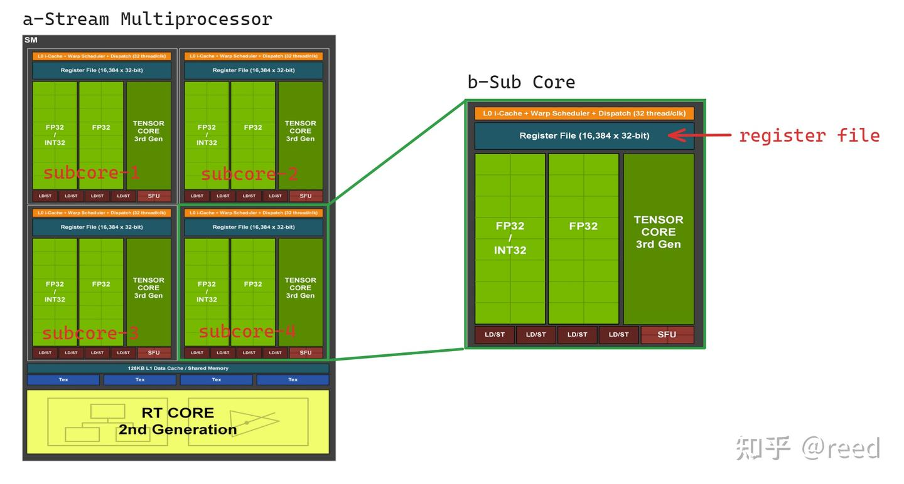
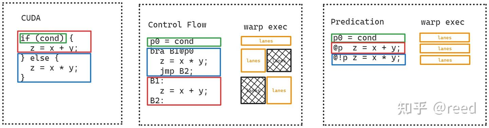

# NVidia GPU指令集架构-寄存器

**Author:** [reed](https://www.zhihu.com/people/reed)

**Link:** [https://zhuanlan.zhihu.com/p/688616037](https://zhuanlan.zhihu.com/p/688616037)

---

指令集是软件与硬件沟通的"词汇"，而寄存器则是这些词汇中具体的输入输出参数。作为芯片上最基础的存储结构，了解寄存器是学习具体指令的前提。本文介绍NVIDIA GPU上的寄存器体系，包括通用寄存器、特殊寄存器、Predicate寄存器和Uniform寄存器。文章首先通过Load-Store架构引入寄存器概念，然后介绍寄存器所表达的程序状态与GPU的延迟隐藏机制，最后分别介绍各类寄存器。

## Load-Store架构

Load-Store架构（也称寄存器-寄存器架构）是RISC体系中的重要形式：所有计算类指令的源操作数和目的操作数都必须是寄存器，内存与寄存器之间的通信通过独立的Load和Store指令完成。NVIDIA Ampere及之前的GPU架构基本符合Load-Store定义（常量内存是一个例外）。由于GPU的内存层次比传统CPU更多，Load/Store指令也区分为全局内存（LDG/STG）、共享内存（LDS/STS）、Local Memory（LDL/STL），以及针对Tensor Core数据搬运的ldmatrix（LDSM）。各类指令的操作数位置如下


| 指令             | 类型     | 目标操作位置 | 源操作位置 |
| ------------------ | ---------- | -------------- | ------------ |
| LDG              | Load     | 寄存器       | 全局内存   |
| STG              | Store    | 全局内存     | 寄存器     |
| LDS              | Load     | 寄存器       | 共享内存   |
| STS              | Store    | 共享内存     | 寄存器     |
| LDL              | Load     | 寄存器       | 局部内存   |
| STL              | Store    | 局部内存     | 寄存器     |
| LDSM             | Load     | 寄存器       | 共享内存   |
| 非Load/Store指令 | 算数指令 | 寄存器       | 寄存器     |

Load-Store架构的优势在于：计算和内存访问解耦，简化了指令集设计和流水线实现；显式的Load/Store指令使编译器更容易进行指令重排和冗余消除等优化；统一的三地址指令格式便于处理器高效调度。

从Hopper架构开始，Tensor Core引入了wgmma指令，该计算类指令可以直接读取共享内存上的数据进行计算，不要求操作数必须在寄存器上，突破了Load-Store架构的约束。但SIMT类的计算指令仍然遵循Load-Store架构。Blackwell架构进一步引入了tcgen05指令和Tensor Memory，在数据搬运方面也有新的变化。

## 寄存器表达的程序状态机


*Figure 1. Register File in Sub-Core of SM*

图1为NVIDIA Ampere SM（Stream Multiprocessor）的架构示意。一个SM包含4个Sub Core（也称Sub Partition），每个Sub Core拥有16,384个32-bit通用寄存器，物理上用SRAM实现。

CUDA GPU的调度单位为warp，一个warp包含32个线程(也称lane）。16,384个寄存器分配给32个lane，总共有512组寄存器。Sub Core的寄存器文件可以理解为图2-a所示的二维结构，横向32个lane对应warp中的32个线程，纵向为512组。SM执行kernel时，将这些寄存器按需分配给Sub Core上驻留的各个warp，分配粒度为4组。图2-b展示了每个warp分配4组寄存器的情况，从warp视角看，该warp占用了寄存器文件中4行 x 32列的区域；从单个线程（thread-view）看，每个线程拥有R0-R3共4个寄存器。


*Figure 2. Register File and its Warp View and Thread View*

这种寄存器分配模式构成了CUDA中最重要的延迟隐藏机制。每个warp的执行状态都保存在各自的寄存器中，warp调度单元利用执行单元（如图1中的FP32单元）读取对应warp的寄存器数据并写回结果。当某个warp因Load指令等待数据时，调度器可以切换到其他数据已就绪的warp继续执行，只需切换到对应的一组寄存器状态即可。这和CPU超线程的思路一致：执行单元只有一份，但寄存器状态有多份，通过warp切换来掩盖访存延迟。物理上寄存器文件使用SRAM实现。

## 通用寄存器

通用寄存器是GPU上最高效的存储结构，可读可写，非Load/Store指令只能对寄存器进行操作。单个寄存器位宽为32-bit，每个线程最多可使用255个，在SASS中以R为前缀，表示为R0-R255。当需要更宽的数据时，使用连续的多个寄存器组成寄存器对，SASS编码中只体现首寄存器编号。例如 `F2F.F64.F32 R4, R2;` 表示float32到float64的类型转换，目标寄存器使用R4和R5两个连续寄存器来存储double值，源寄存器R2存储float值。R255约定为常零寄存器，SASS中表示为RZ（Register ZERO）。

```text
R0, R1, R2, R3, ..., R251, R252, R253, R254, R255(RZ)
```

> 单线程最多使用255个寄存器的限制来自SASS指令编码，通用寄存器以8-bit编号（R0-R255），其中R255保留为常零寄存器RZ，因此可用编号为R0-R254共255个。物理上512组足以容纳255个寄存器的需求（255 < 512），剩余的组数留给同一Sub Core上其他warp使用。如果一个warp用满255个寄存器（对齐到分配粒度4后为256组），512 / 256 = 2，Sub Core上最多只能驻留2个warp。

## 特殊寄存器

特殊寄存器（Special Register）一般为只读，用于标识执行单元的定位信息， 需要通过特定指令来读取。其中 `SR_TID` 对应CUDA编程中的threadIdx，`SR_CTAID` 对应blockIdx，还有获取SM ID、时间信息等的特殊寄存器，常见的如下

```text
SR_TID.X, SR_TID.Y, SR_TID.Z,
SR_CTAID.X, SR_CTAID.Y, SR_CTAID.Z,
SR_VIRTUALSMID, SR_LANEID, SR_LEMASK, SR_LTMASK, SR_GEMASK,
SR_CLOCKLO, SR_CLOCKHI
SR_GLOBALTIMERLO, SR_GLOBALTIMERHI
SRZ
SR_PM0-7
SR_SMEMSZ
```

具体的寄存器意义，可以参考PTX文档中的Special Register章节。

## Predicate寄存器

Predication是GPU架构中用于处理分支的技术。与CPU的分支预测不同，GPU通过Predicate寄存器将条件分支转化为条件执行：warp内的每个线程根据Predicate值决定是否执行某条指令，而不是跳转到不同的代码路径。这样可以避免短分支带来的流水线清空（pipeline flush）和指令重取的开销，对于分支体较短的if-else场景尤其有效。如图3所示，展示了一段分支代码在不使用Predicate和使用Predicate寄存器后的对比效果：


*Figure 3. Predication avoid pipeline stall*

Predicate寄存器有两种用法。

一是作为指令的执行条件（guard），以前缀形式放在指令前面，控制该指令是否执行。例如 `@P6 FADD R5 R5 R28;` 表示仅当P6为True时才执行加法，`@!P1 FADD R11 R11 R17;` 中 `!` 表示取反，即P1为False时执行。条件不满足的线程静默跳过，不产生任何副作用。

二是作为操作数参与运算，例如 `FMNMX R9 RZ R6 !PT;` 中的 `!PT` 是一个Predicate操作数，FMNMX（Float Min/Max）指令根据它决定取最大值还是最小值：Predicate为True时取max，为False时取min。PT是常真寄存器，`!PT` 即常假，因此该指令始终执行min操作。Predicate寄存器为线程私有，每个线程有8个（P0-P7），其中P7为硬件常真寄存器，SASS中记作PT（Predicate True）：

```text
P0, P1, P2, P3, P4, P5, P6, P7(PT)
```

## Uniform寄存器

前面介绍的通用寄存器和Predicate寄存器都是线程私有的。在某些场景中warp内所有lane会执行完全相同的逻辑或做reduce操作（CUDA中对应 `__reduce_sync` 类函数），NVIDIA提供了Uniform寄存器、Uniform Predicate及相应指令来完成warp级的公共计算。使用Uniform寄存器可以减少对私有通用寄存器的占用，使SM上能运行更多warp提升并发度，同时warp级计算不需要向量化执行单元，也能降低功耗。SASS中Uniform寄存器以UR为前缀，每个warp最多64个；Uniform Predicate以UP为前缀，每个warp最多7个。UR63为常零寄存器（URZ），UP7为常真Predicate（UPT）。

Uniform 寄存器表示如下：

```text
UR0, UR1, UR2, UR3, ..., UR60, UR61, UR62, UR63（URZ）
```

Uniform Predicate表示如下：

```text
UP0, UP1, UP2, UP3, UP4, UP5, UP6, UP7(UPT)
```

## 总结

GPU通过提供大量寄存器实现高并发的延迟隐藏模型。对于单线程而言，使用较少的寄存器可以提升SM上并发的warp数。NVIDIA限制了单线程寄存器上限为255个32-bit。特殊寄存器用于获取线程块索引等逻辑坐标信息。Predicate寄存器将短分支转化为条件执行，避免流水线清空。Uniform寄存器实现warp级公共计算，减少通用寄存器占用从而提升能效。

## 参考

[https://eng.libretexts.org/Bookshelves/Computer_Science/Programming_Languages/Introduction_to_Assembly_Language_Programming](https://eng.libretexts.org/Bookshelves/Computer_Science/Programming_Languages/Introduction_to_Assembly_Language_Programming:_From_Soup_to_Nuts:_ARM_Edition_(Kann)/04:_New_Page/4.04:_New_Page)

[https://en.wikipedia.org/wiki/Load%E2%80%93store_architecture](https://en.wikipedia.org/wiki/Load–store_architecture)

[https://en.wikipedia.org/wiki/Predication_(computer_architecture)](https://en.wikipedia.org/wiki/Predication_(computer_architecture))

[https://www.nvidia.com/content/PDF/nvidia-ampere-ga-102-gpu-architecture-whitepaper-v2.pdf](https://www.nvidia.com/content/PDF/nvidia-ampere-ga-102-gpu-architecture-whitepaper-v2.pdf)

[https://course.ece.cmu.edu/~ece740/f13/lib/exe/fetch.php?media=onur-740-fall13-module7.4.2-predicated-execution.pdf](https://course.ece.cmu.edu/~ece740/f13/lib/exe/fetch.php?media=onur-740-fall13-module7.4.2-predicated-execution.pdf)

[https://docs.nvidia.com/cuda/parallel-thread-execution/index.html#special-registers](https://docs.nvidia.com/cuda/parallel-thread-execution/index.html#special-registers)
