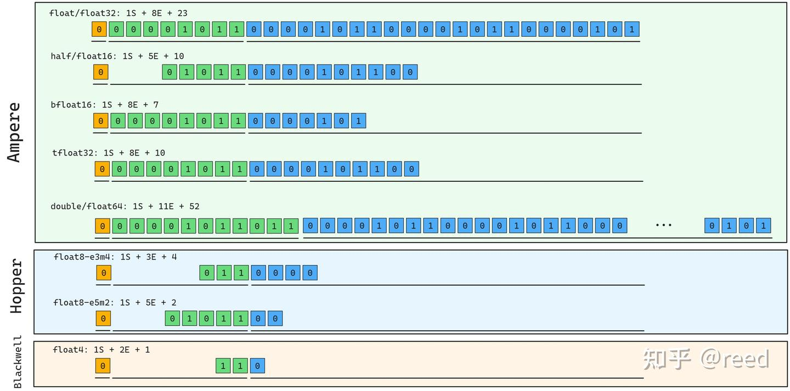

# NVidia GPU指令集架构-浮点运算

**Author:** [reed](https://www.zhihu.com/people/reed)

**Link:** [https://zhuanlan.zhihu.com/p/695667044](https://zhuanlan.zhihu.com/p/695667044)

---

[计算机算术](https://ieeexplore.ieee.org/xpl/conhome/1000125/all-proceedings)是计算机工程的一个重要分支，现代计算类软件多构建在浮点运算之上。了解浮点数和浮点运算对理解计算类任务、提升计算精度和效率有很大帮助。NVidia GPU 上 Tensor Core 和 CUDA Core 都提供了浮点计算能力，本文只关注 CUDA Core 部分（后续有专门章节介绍 Tensor Core 指令集），重点介绍浮点数相关知识和 NVidia GPU 上的浮点运算指令。文章首先介绍浮点数的表示（基础、圆整、特殊值、denormal），然后介绍 NVidia GPU 上的浮点运算指令（加法和乘法、乘加运算、随路取负和绝对值、低精度指令、超越函数、除法）。

## 浮点数的表示

### 浮点数基础

计算机中数据以二进制存储，在有限位数下只能表示有限的离散数据。对于整数，这种离散是自然的，如图 1 中用二进制 b00000101 表示十进制 5。对于实数（Real Number），可以使用图 1 中定点数的表示形式，即固定小数点位置（Fixed Point），小数点左侧为整数部分，右侧为小数部分。图中的定点数表示 ${1\over 2} + {1\over8} = 0.625$。但定点表示等价于将数轴均匀划分，精度固定而数据范围有限。为此提出了浮点数表示方法，通过浮动小数点（floating point）扩大数据表示范围。


*Figure 1. Integer, Fixed Point and Floating Point Number*

如图 2 所示，32bit 浮点数包含三个部分：1bit 符号位（0 为正，1 为负）；8bit 指数位，表示小数点的位置，取值 k 为无符号整数，实际指数为 k - 127（偏置表示），8bit 无符号数范围 [0, 255]，减去偏置 127 后指数范围为 [-127, 128]，其中全零和全一用于表示特殊数字，有效指数为 [-126, 127]；23bit 尾数位（也叫有效位），表达浮点数的有效数字，在计算实际数值时会在尾数前隐含添加 1（规则化，normal），使有效位数达到 24 位。


*Figure 2. 32bit floating point bit details*

浮点数的数值计算公式为 $v = (-1)^{sign} \times 2^{(E - 127)} \times 1.S$。以图 2 中的例子为例：符号位为 0（正数），指数位 b00001011 十进制为 11，实际指数为 11 - 127 = -116，尾数（含隐含 1）的二进制为 1.00001011000010110000101，十进制约为 1.043137。将指数作用到尾数后得到约 1.2556 × 10^-35。可在 [float.exposed](https://float.exposed/0x05858585) 上交互验证。


*Figure 3. various floating point with various sign exponents significands bits*

浮点数中指数 E 调整小数点位置，尾数表示有效数值。指数位越多，数据范围越大；尾数位越多，精度越高。针对不同场景对范围和精度的平衡需求，Ampere 支持五种浮点类型：float32、half（float16）、bfloat16、tfloat32 和 double；Hopper 添加了 float8 类型，按指数和尾数位数分为 E5M2 和 E4M3 两种子类型；Blackwell 架构进一步添加了 fp4 类型。各类型的指数和尾数位数如图 3 所示。

### 浮点数的圆整

浮点数是实数的近似表示，IEEE 754 标准为四则运算定义了四种圆整模式：向最近圆整（Round to Nearest）、向零圆整（Round to Zero）、向正无穷圆整（Round Up）和向负无穷圆整（Round Down）。一般情况下四则运算采用向最近圆整，能满足标准规定的 ULP 误差。浮点转整数时，向正无穷圆整对应 ceiling 函数，向负无穷圆整对应 floor 函数。高精度除法等场景中，需要特定的圆整方式对结果做修正。

### 浮点数特殊值

前面提到浮点数指数位中全 0 和全 1 是保留值。指数全 1 且尾数非全 0 时，浮点数被解释为 NaN（Not a Number），用于表示数学上无意义的结果，如 0/0、对负数开平方等（有些编程语言会抛异常，GPU 作为异步设备不产生异常，而是用 NaN 表示）。NaN 具有传递性：一旦中间结果产生 NaN，后续运算结果也会是 NaN，如 NaN + 1.0 = NaN、NaN × 0.0 = NaN。这也是编程中常见的陷阱：认为未初始化的数据乘以 0 一定得 0，但如果该数据恰好是 NaN 则结果不为 0。NaN 还可以细分为 Quiet NaN 和 Signaling NaN，具体可参考 IEEE 754 标准。

指数全 1、尾数全 0 时，根据符号位定义正无穷（+Infinity）和负无穷（-Infinity）。正负无穷上的运算遵循数学规则，如 exp(-Infinity) = 0。恰当使用 NaN 和 Infinity 可以简化计算逻辑，避免不必要的分支。

### 浮点数的denormal

前文提到尾数前会隐含添加 1（规则化，normal），使有效位数达到 24 位。当指数 E 为全 0 时，不再添加这个隐含的 1，尾数可能以 0 开头，有效位数因此减少。这样的数据称为非规格化浮点数（denormal 或 subnormal）。全零的指数记为 $2^{-126}$（而非 $2^{-127}$），这样可以表示比最小 normal 数更接近 0 的浮点数，加密了 0 附近的数据表示，对绝对值极小的数据提供更好的精度。


*Figure 4. All the special values of floating point(引用自参考1)*

图 4 展示了 0、normal 数、subnormal 数、无穷和 NaN 各自的指数与尾数取值情况。

## NVidia GPU浮点运算指令

### 加法和乘法

NVidia GPU 实现了符合 IEEE 754 标准的加减乘指令，支持不同的圆整模式。加法指令 FADD（Float Add）和乘法指令 FMUL（Float MULtiply）用于 float32 类型，默认采用 Nearest 圆整；double 精度对应 DADD（Double Add）和 DMUL（Double MULtiply）：

```sass
FADD R0 R1 R2; // R0 = R1 + R2 with round to NEAREST
FADD.RZ R0 R1 R2; // R0 = R1 + R2 with round to ZERO
FADD.RP R0 R1 R2; // R0 = R1 + R2 with round to POSITIVE(+Infinity)
FADD.RM R0 R1 R2; // R0 = R1 + R2 with round to MINUS(-Infinity)
FMUL R0 R1 R2; // R0 = R1 * R2 with round to NEAREST
FMUL.RZ R0 R1 R2; // R0 = R1 * R2 with round to ZERO
FMUL.RP R0 R1 R2; // R0 = R1 * R2 with round to POSITIVE(+Infinity)
FMUL.RM R0 R1 R2; // R0 = R1 * R2 with round to MINUS(-Infinity)

DADD R0 R2 R4; // R0.64 = R2.64 + R4.64 with round to NEAREST
DADD.RZ R0 R2 R4; // R0.64 = R2.64 + R4.64 with round to ZERO
DADD.RP R0 R2 R4; // R0.64 = R2.64 + R4.64 with round to POSITIVE(+Infinity)
DADD.RM R0 R2 R4; // R0.64 = R2.64 + R4.64 with round to MINUS(-Infinity)
DMUL R0 R2 R4; // R0.64 = R2.64 * R4.64 with round to NEAREST
DMUL.RZ R0 R2 R4; // R0.64 = R2.64 * R4.64 with round to ZERO
DMUL.RP R0 R2 R4; // R0.64 = R2.64 * R4.64 with round to POSITIVE(+Infinity)
DMUL.RM R0 R2 R4; // R0.64 = R2.64 * R4.64 with round to MINUS(-Infinity)
```

对于忽略denormal数据的处理也有对应的modifier（FTZ = flush to ZERO）等

```sass
FMUL.FTZ R3, R4, R5 ;
```

### 乘加FMA（Fused Multiply Add）

乘加运算可以用 FMUL + FADD 两条指令实现，但 IEEE 754-2008 标准定义了 FMA（Fused Multiply Add），一条指令完成 d = a × b + c，中间结果以无限精度保持，只在最终做一次圆整，因此精度高于 FMUL + FADD 的组合。FMA 指令的延迟与 FMUL 或 FADD 相同，所以单条 FMA 的算力吞吐是单独加法或乘法的两倍。单精度对应 FFMA（Float Fused Multiply Add），双精度对应 DFMA（Double Fused Multiply Add），各圆整模式的 Modifier 如下：

```sass
FFMA R0, R1, R2, R3; // R0 = R1 * R2 + R3 with round to NEAREST
FFMA.RZ R0, R1, R2, R3; // R0 = R1 * R2 + R3 with round to ZERO
FFMA RP R0, R1, R2, R3; // R0 = R1 * R2 + R3 with round to POSITIVE
FFMA.RM R0, R1, R2, R3; // R0 = R1 * R2 + R3 with round to MINUS

DFMA R0, R2, R4, R6; // R0 = R2 * R4 + R6 with round to NEAREST
DFMA.RZ R0, R2, R4, R6; // R0 = R2 * R4 + R6 with round to ZERO
DFMA RP R0, R2, R4, R6; // R0 = R2 * R4 + R6 with round to POSITIVE
DFMA.RM R0, R2, R4, R6; // R0 = R2 * R4 + R6 with round to MINUS
```

### 随路取负和绝对值

NVidia 指令集中没有独立的减法指令，减法通过 FADD 随路取负实现，即 d = a - b 写作 d = a + (-b)：

```sass
FADD R0 R1 -R2; // R0 = R1 - R2 with round to NEAREST
FADD.RZ R0 R1 -R2; // R0 = R1 - R2 with round to ZERO
FADD.RP R0 R1 -R2; // R0 = R1 - R2 with round to POSITIVE(+Infinity)
FADD.RM R0 R1 -R2; // R0 = R1 - R2 with round to MINUS(-Infinity)
```

这样 FADD 一条指令就同时覆盖了加法和减法，圆整能力不变。NVidia 浮点指令支持对任意操作数随路取负，形如 $d = \pm a \pm \pm b$，$d = \pm a \times \pm b$，$d = \pm a \times \pm b + \pm c$

的操作都可以通过 FADD、FMUL、FFMA 随路取负用单条指令完成。NVidia 甚至没有提供独立的取负指令，而是通过 d = -d - 0 统一实现。除了随路取负，这些浮点指令也支持随路取绝对值。如 d = abs(a) × abs(b) - abs(c) 可以用单条 FMA 指令实现：

```sass
FFMA R7, |R0|, |R7|, -|R6|;
```

### 低精度浮点指令

half 和 bfloat16 是 NVidia 提供的 16bit 浮点类型。由于寄存器宽度为 32bit，两个连续的 16bit 数据合并为一个 32bit packed 类型：half2 和 bfloat162。NVidia 的计算指令针对 packed 类型提供，即便操作单个 half，也使用 packed 指令并在操作数上做重复或选择。

对于 half2，提供了 HADD2、HMUL2、HFMA2.MMA 指令，不支持多种圆整模式（仅 Round Nearest），但提供了 SAT（饱和，结果截断到 [0.0, 1.0]）和 RELU（整流）Modifier，同时支持随路 abs 和取负。对于 bfloat162，没有独立的 ADD 和 MUL 指令，加法乘法统一通过 HFMA2.BF16\_V2 实现，支持随路取负和 abs，Modifier 方面仅提供 RELU。

```sass
HADD2 R7, R0, R7;
HMUL2 R7, R0, R7;
HADD2.SAT R7, R0, R7;
HMUL2.SAT R7, R0, R7;

HFMA2.MMA R7, R0, R7, R6;
HFMA2.MMA.SAT R7, R0, R7, R6;
HFMA2.MMA.RELU R7, R0, R7, R6;
HADD2 R7, |R2|, -RZ.H0_H0;
HADD2 R7, -R2, -RZ.H0_H0;
HADD2 R7, R0, -R7;

HFMA2.BF16_V2 R7, -RZ.H0_H0, RZ.H0_H0, |R2|;
HFMA2.BF16_V2 R7, R0, 1, 1, R7;
HFMA2.BF16_V2 R7, R0, R7, R6;
HFMA2.BF16_V2.RELU R7, R0, R7, R6;
HFMA2.BF16_V2 R7, R0, R7, -RZ.H0_H0;
HFMA2.BF16_V2 R7, -RZ.H0_H0, RZ.H0_H0, -R2;
HFMA2.BF16_V2 R7, R7, -1, -1, R0;
```

### 类型转换

各浮点类型之间的转换指令如下表。部分类型间没有单指令转换能力，需要借助中间类型实现，表中标记为 Multi-Instr（多条指令）：


| 转换成-> | float64     | float32     | half          | bfloat16           |
| ---------- | ------------- | ------------- | --------------- | -------------------- |
| float64  | /           | F2F.F32.F64 | F2F.F16.F64   | Multi-Instr        |
| float32  | F2F.F64.F32 | /           | F2FP.PACK\_AB | F2FP.BF16.PACK\_AB |
| half     | Multi-Instr | HADD2.F32   | /             | NA                 |
| bfloat16 | Multi-Instr | PRMT        | NA            | /                  |

### 超越函数

浮点运算中还有一类特殊函数：exp、log、sin、cos、rcp（倒数）、sqrt（平方根）等。这些函数在 NVidia 指令集中由特殊函数单元（SFU = Special Function Unit）实现，底层将函数分段，在每个小区间内用二次多项式 y = ax^2 + bx + c 逼近，不同区间通过查表获取系数 a/b/c。常见指令如：

```sass
MUFU.EX2 R7, R6 ;
MUFU.SIN R7, R7 ;
MUFU.COS R7, R7 ;
MUFU.LG2 R7, R0 ;
MUFU.RCP R7, R6 ;
MUFU.RSQ R5, R2 ;
MUFU.SQRT R7, R13 ;
MUFU.TANH R11, R4 ;
```

这些 SFU 指令的精度较低（约 22 bit 有效精度），需要高精度时 NVCC 编译器会通过软件做高阶修正。如果对精度要求不高，可以使用快速版本（函数名前加 `__` 前缀，如 `sinf()` 的快速版本 `__sinf()`），也可以在编译选项中启用 `--use_fast_math` 全局使能。

### 除法

NVidia 指令集没有提供满足 IEEE 标准的硬件除法指令。除法通过 SFU 的 MUFU.RCP（倒数）得到低精度初始值，再结合 Newton-Raphson 迭代用 FADD/FMUL/FFMA 进行高阶修正。以 normal 数除法为例，修正序列大致如下：

```sass
MUFU.RCP R8, R5 ; /* 0x0000000500087308 */ /* 0x000e220000001000 */
FADD.FTZ R10, -R5, -RZ ; /* 0x800000ff050a7221 */
FFMA R3, R8, R10, 1 ; /* 0x3f80000008037423 */
FFMA R12, R8, R3, R8 ; /* 0x00000003080c7223 */
FFMA R3, R7, R12, RZ ; /* 0x0000000c07037223 */
FFMA R8, R10, R3, R7 ; /* 0x000000030a087223 */
FFMA R11, R12, R8, R3 ; /* 0x000000080c0b7223 */
FFMA R7, R10, R11, R7 ; /* 0x0000000b0a077223 */
FFMA R3, R12, R7, R11 ; /* 0x000000070c037223 */
```

除了计算指令外，浮点数还有相关的比较、判断和取整指令，它们协作完成浮点数相关的控制流：

```sass
FSETP
FMNMX
FCHK
FRND FRND.CEIL FRND.F16.FLOOR FRND.F64.FLOOR FRND.FLOOR
```

## 总结

本文回顾了浮点数的表示、圆整和特殊值等基础知识，介绍了 NVidia GPU 指令集中的浮点运算指令：加法、乘法、FMA、随路取负和绝对值、低精度 packed 指令、超越函数和除法，以及各类型间的转换指令。了解这些指令有助于理解硬件对浮点计算的支持，指导算法设计和数据类型选择（如用 FFMA 替换 FMUL + FADD，用 half2 packed 类型替换单元素类型）。

## 参考

[Exposing Floating Point – Bartosz Ciechanowski](https://ciechanow.ski/exposing-floating-point/)

[https://ieeexplore.ieee.org/xpl/conhome/1000125/all-proceedings](https://ieeexplore.ieee.org/xpl/conhome/1000125/all-proceedings)

[https://iremi.univ-reunion.fr/IMG/pdf/ieee-754-2008.pdf](https://iremi.univ-reunion.fr/IMG/pdf/ieee-754-2008.pdf)

[https://web.ece.ucsb.edu/~parhami/pubs\_folder/parh02-arith-encycl-infosys.pdf](https://web.ece.ucsb.edu/~parhami/pubs\_folder/parh02-arith-encycl-infosys.pdf)

[https://en.wikipedia.org/wiki/Floating-point\_arithmetic](https://en.wikipedia.org/wiki/Floating-point\_arithmetic)

[https://docs.oracle.com/cd/E19957-01/800-7895/800-7895.pdf](https://docs.oracle.com/cd/E19957-01/800-7895/800-7895.pdf)

[CUDA Toolkit Documentation](https://docs.nvidia.com/cuda/cuda-math-api/group\_\_CUDA\_\_MATH\_\_INTRINSIC\_\_SINGLE.html)
