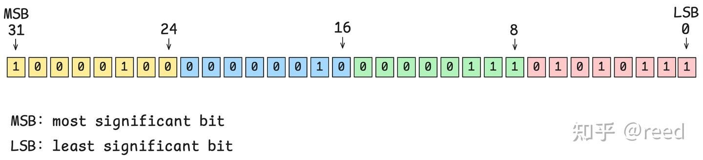
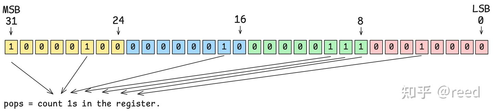
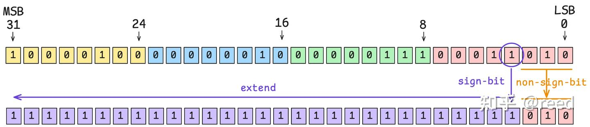
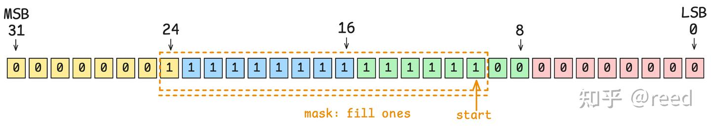
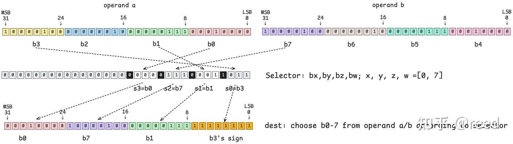
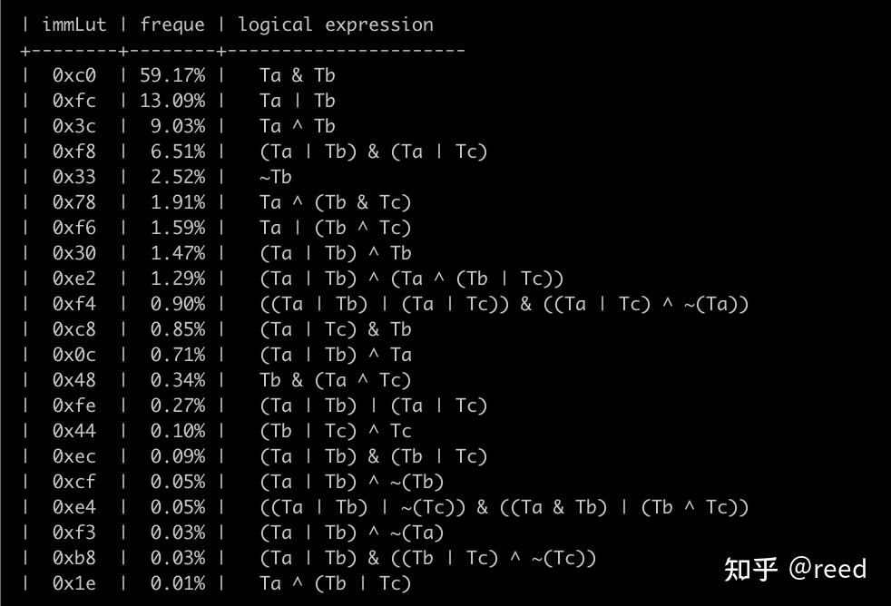

# NVidia GPU指令集架构-比特和逻辑操作

**Author:** [reed](https://www.zhihu.com/people/reed)

**Link:** [https://zhuanlan.zhihu.com/p/712356884](https://zhuanlan.zhihu.com/p/712356884)

---

前面文章我们介绍了[NVidia GPU](https://zhuanlan.zhihu.com/p/686198447)中常用的[浮点运算](https://zhuanlan.zhihu.com/p/695667044)和[整数运算指令](https://zhuanlan.zhihu.com/p/700921948)，除了浮点和整数运算外，比特和逻辑操作也是重要的基础运算。比特操作（Bit Operation），即位操作，是计算机科学中对二进制位进行操作的运算，主要包括单bit的位与（AND）、位或（OR）、位非（NOT）、位异或（XOR）和多bit的计数等操作（如bit reverse等）。位操作应用广泛且至关重要，其在数据压缩与优化存储、加密算法等方面有重要应用。NVidia GPU针对bit操作在指令集层面提供了的丰富的支持。本文将重点介绍NVidia GPU指令集层面的bit操作能力。文章结构方面，首先介绍了无类型的寄存器表示，然后依次介绍了简单的指令：POPC, FLO, BREV, SGXT, BMSK，最后文章详细介绍了功能复杂的PRMT 和 LOP3指令。

## 无类型的寄存器表示

计算机中的数据是二进制表示的，对于NVidia GPU体系中一个寄存器可以存储32位，也就说[寄存器中是32个0和1的序列](https://zhuanlan.zhihu.com/p/688616037)，如图1所示，一个寄存器表示32bit的0和1，寄存器只是0/1序列表示，本身没有数据类型。只有当具体的指令处理这些数据时候会根据指令的语义来解读该序列的0/1表示。如当该寄存器作为[有符号加法（IADD3）指令](https://zhuanlan.zhihu.com/p/700921948)的输入时，指令会把该寄存器的最高位（MSB）作为符号位来处理；如果将该寄存器给浮点的[乘法指令（FMUL）](https://zhuanlan.zhihu.com/p/695667044)，则浮点数处理单元会把最高位解释为浮点数的符号位，紧接着7bit解释成指数位，再其后的23bit解释为尾数。


*Figure 1. NVidia GPU中32bit寄存器*

也就是说寄存器只存储数据，并没有具体的数据类型其代表的值的概念，bit操作同样的不关注操作数的类型，只针对其中的每一位的0和1进行处理。

## POPC指令

每一个bit位存储着0或1，NVidia GPU提供了 POPC（**POP**ulation **C**ount）指令，它可以数出32bit寄存器数据中bit为1的个数，图2展示了该指令的功能。


*Figure 2. Population Count指令功能*

具体的指令如下，其表示计数R2寄存器中bit-1的个数，将其结果存储在R7中：

```text
POPC R7, R2;
```

CUDA device API提供了\_\_popc(unsigned int)来封装该指令，针对64bit的数据，虽然api提供了\_\_popcll(uint64\_t)类的函数，但是其内部会对高32bit和低32bit分别调用POPC指令，然后将高低bit的POPC结果通过整数加法求和得到。

## FLO指令

FLO（**F**irst **L**eading **O**ne）指令，从高位（MSB）向低位（LSB）查找第一个为1的位置（index），最低位的位置为index记为0，向高位依次增加，最高位为31，如果输入bit全为0，则返回0xFFFFFFFF，输入bit全为1则返回31。

```text
FLO.U32 R0, R2 ;
```

指令集只提供32bit的计算能力，针对64bit的计算任务，通过多条指令组合出64bit的计算逻辑，同时该指令还针对有符号数据提供了区分正数和负数的处理逻辑，正数则找从高位开始找第一个1，负数则从最高位开始找第一个0，同时该指令还提供了SH modifier，该modifier可以返回将前面的index调整到符号位置所需要的左移量，整体指令如下:

```text
FLO R7, R2 ; // signed find leading one
FLO.U32.SH R7, R2 ;
FLO.SH R7, R2 ;
```

该指令在PTX层面通过bfind触发。

## BREV指令

BREV指令实现比特逆序的功能（**B**it **REV**erse），实现32bit数据的高地位交换。


*Figure 3. Bit Reverse指令功能*

```text
BREV R7, R2 ;
```

针对64bit的数据reverse功能，可以通过两条BREV指令实现。

## SGXT指令

SGXT（**S**i**G**n e**XT**end）指令，实现特定bit位数据的符号位扩展，


*Figure 4. Sign Extend指令功能*

```text
SGXT R7, R0, R7 ; // nbit = R7
```

其中输入操作数R7指定操作数当做多少bit的数据（如4bit数据，其中最高位为符号位），以上指令可以将R0的第R7 - 1bit扩展到填充至高32bit。其也可以通过前面介绍的[算术左移和右移](https://zhuanlan.zhihu.com/p/700921948)实现，具体的如下

```text
R7 = (R0 << (32 - R7)) >> (32 - R7)
```

通过位移实现需要的操作指令会更多，效率方面相较于SGXT也会更低。

## BMSK指令

BMSK（**B**it **M**a**SK**）指令可以返回一个32bit的数据，从其从start位置开始连续填充mask个1，其余位置位0，如图5所示，


*Figure 5. Bit Mask指令功能*

```text
BMASK R2 R0 R1; // start: R0, mask: R1;
BMSK R5, R5, 0x3 ;
```

## PRMT指令

PRMT（**P**e**RM**u**T**e）指令可以实现按照8bit（一byte）为基础单位，根据selector指定的位置数据重新选择和排列。如下指令示例，该指令接受三个输入Ra、Rb、Rsel，产生一个Rd。如图6所示，Ra每8bit构成一个最小的byte单位，从低到高被编号为b0, b1, b2, b3; Rb每8bit表示一个最小单位，从低比特位向高位依次被标记为b4, b5, b6, b7。Rsel寄存器用来指定b0-7的编号，即从b0-b7中选择4个字节（可以重复）重新输出到一个32bit的寄存器中。Rsel需要选择4个编号来完成32bit的输出，每个字段占用4bit，其中每个字段的低3bit表示operand a/b中选取的byte的编号，4bit中的高bit表示该选择的编号位置是原值复制还是重复符号位（0表示原值复制，1表示填充符号位）。也就说结果中的高8bit（24-31bit）是由Rsel中的12-15bit决定的（s3=b0），其中12-14bit用来决策选择operand a/b中的第几个byte，如图所示，其bx=0b000=0表示选择operand a/b中的b0段，且最高位（15bit）位0表示原值复制，这样operand a b0位置的数据则复制到输出位置（24-31bit），类似地，输出位置的16-23bit由Rsel的第二个4bit（s2=0b111=7）控制，表示选择b7，即operand b中的b7所对应的8bit数据，同时该控制Rsel 4bit中的最高位为0表示复制原值，输出位置的8-15bit来自operand a的b1位置，输出位置0-7bit由Rsel的s0（s0=0b1011）控制，其中低3bit表示来自于b的序号，为3，高1bit表示复制符号位，则其综合表示复制b3的符号位，且将该符号位填充输出的8bit，结果上表现为Rd的0-7bit为全1。

```text
// RRMT Rd Ra Rb Rsel;
PRMT R7 R4 R5 R6;
```

*Figure 6. Permute指令功能*

PRMT指令还提供了其他的modifier来简化上面的操作，但是功能方面和上面是一致的，此处就不再赘述，更详细的modifier的介绍可以参考PTX文档。

## LOP3指令

LOP3 （ **L**ogical **OP**eration on **3** inputs）指令实现三个操作数的按位的bit运算。如三个操作数的位与`d = a & b & c;` 更复杂的 `d = a & b ^ (~c)`;等。该指令可以实现三操作数的位逻辑运算自然地其也可以实现两个操作数的逻辑位运算和一个操作数的取反等操作，指令形式如下，其中第一个R7为输出，R0、R7、R6为三个输入操作数，0xf为查找表的列项(记为imm)，!PT暂时不考虑：

```sass
LOP3.LUT R7, R0, R7, R6, 0xf, !PT ;
```

该指令是通过查表（Look Up Table）方式实现，所以其指令都有LUT modifier。查表法执行逻辑为：依次提取三个输入操作数A、B、C的特定bit位（如从0bit到31bit），每次可以得到一个3bit的输入数据，如图7中的ABC中的黑框所示（0b001序列），将该3bit数据输入给LookUp Table, 在查找表中找到该三bit对应的列，然后找到immLut对应的列，既可以得到一个1bit的输出值（图示为黄色1），将该值放置在输出D的对应bit位置即可（如图中下半部分斜箭头所示）。遍历输入操作数ABC的所有bit，便可以通过查表immLut得到所有的D对应位置的输出。


*Figure 7. Logical Operation on 3 inputs指令功能*

我们不难发现，查找表的本质为三个输入bit的全排列，每一种排列形式都确定一个输出bit值这样三操作数的任意逻辑结果便可以表示，不难发现图中的`Ta = 0xF0`, `Tb = 0xCC`, `Tc = 0xAA` ,将immLut设置为Ta、Tb、Tc的逻辑组合结果便可以得到3bit组合逻辑到一个输出空间的全映射。如我们要计算三个操作数的与运算（`A & B & C`），本质上是要求当输入3bit数据为0b000时输出0b0, 输入为0b001时输出为0b1, 输入为0b010时，输出为0b1, 以此类推便可以得到3bit所表达的8个数的所有的映射值，即为immLut的值。对于更少的输入数的场景，该查找表方法依然有效，如我们要计算一个32bit数据的取反，我们可以把这个数作为ABC的任意一个操作数，则有三种计算路径，如 `D = ~A`, `D = ~B`, `D = ~C`,这样我们分别对Ta、Tb、Tc取反可以得到不同的立即数查找表，分别是`immLut = 0x0F`,`immLut = 0x33`, `immLut = 0x55` ,这三种路径都可以实现对输入的取反，具体细节如下表

|  | 方法一 | 方法二 | 方法三 |
| --- | --- | --- | --- |
| 路径操作数 | A | B | C |
| 公式 | D = ~A | D = ~B | D = ~C |
| T值计算 | ~Ta | ~Tb | ~Tc |
| ImmLut | 0x0F | 0x33 | 0x55 |
| 伪调用形式 | lop3(x, 0, 0, 0x0F) | lop3(0, x, 0, 0x33) | lop3(0, 0, x, 0x55) |
| 指令示例 | LOP3.LUT R7, R0, RZ, RZ, 0x0f, !PT ; | LOP3.LUT R7, RZ, R0, RZ, 0x33, !PT ; | LOP3.LUT R7, RZ, RZ, R0, 0x55, !PT ; |

以上三个方法都可以实现对特定数的取反，更复杂的操作可以通过对Ta、Tb、Tc作用得到。对Ta、Tb、Tc进行常见的一元二元和三元操作得到对应的immLut的值如图8所示，


*Figure 8. 常用的bit逻辑对应的immLut值*

反汇编常用的cuda库得到的immLut值和出现的频率和逻辑表达（未化简）情况如图9所示，



同时该LOP3指令还可以将输出结果与、或上一个而外的Predication值得到一个Predication输出来增强该指令的功能，具体的可以参考PTX文档和反汇编常见库得到。和LOP3类似，NVidia GPU提供了PLOP3指令，用于计算多个1bit Predication的逻辑组合。

## 总结

本文以图示的形式介绍了NVidia GPU常用的bit操作指令如POPC, FLO, BREV, SGXT, BMSK，同时详细介绍了相对复杂的PRMT和逻辑LOP3指令，了解这些指令的功能和计算对特定的优化有一定的指导意义，其可以帮助我们在遇到类似计算需求是选择合适的指令，提升运算效率。

## 参考

[reed：NVidia GPU指令集架构-前言](https://zhuanlan.zhihu.com/p/686198447)

[reed：NVidia GPU指令集架构-浮点运算](https://zhuanlan.zhihu.com/p/695667044)

[reed：NVidia GPU指令集架构-整数运算](https://zhuanlan.zhihu.com/p/700921948)

[reed：NVidia GPU指令集架构-寄存器](https://zhuanlan.zhihu.com/p/688616037)

[PTX ISA 8.5](https://docs.nvidia.com/cuda/parallel-thread-execution/index.html#data-movement-and-conversion-instructions-prmt)

[PTX ISA 8.5](https://docs.nvidia.com/cuda/parallel-thread-execution/index.html#logic-and-shift-instructions-lop3)
