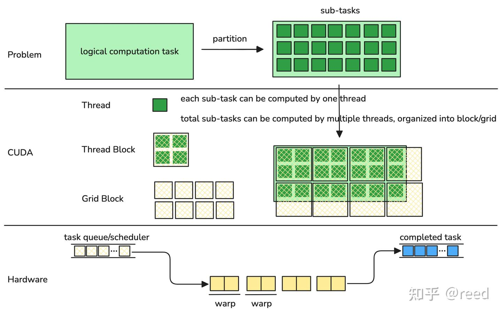
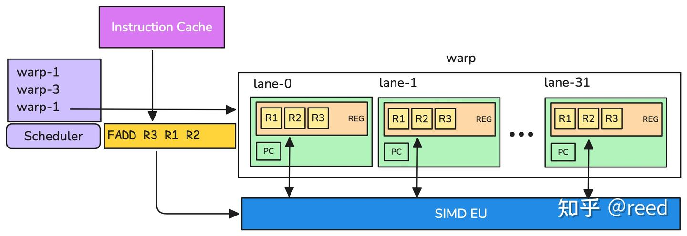
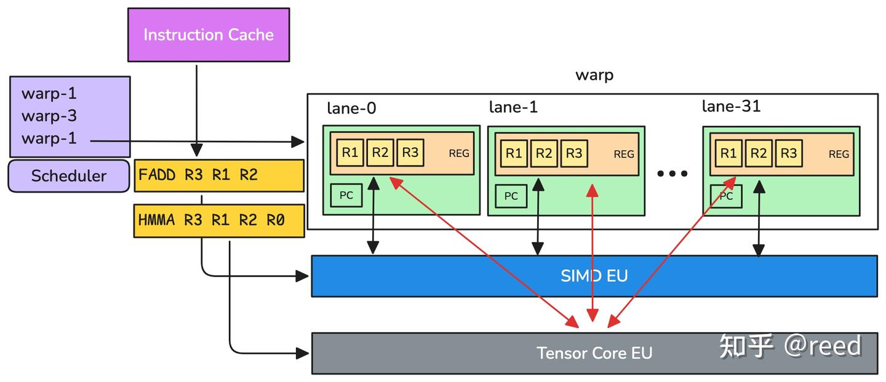
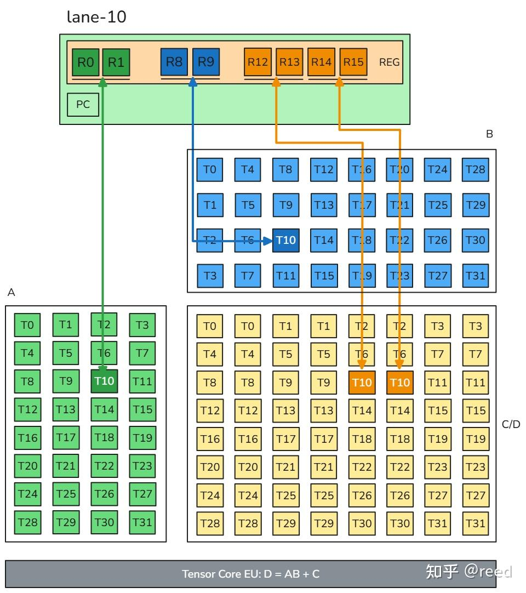
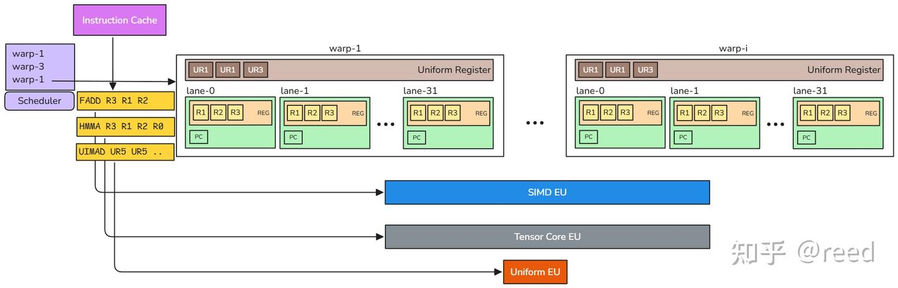

# NVidia GPU指令集架构-Warp级和Uniform操作

**Author:** [reed](https://www.zhihu.com/people/reed)

**Link:** [https://zhuanlan.zhihu.com/p/712357647](https://zhuanlan.zhihu.com/p/712357647)

---

前面文章我们介绍了NVidia GPU的[Load指令](https://zhuanlan.zhihu.com/p/692445145)、[浮点计算指令](https://zhuanlan.zhihu.com/p/695667044)、[整数计算指令](https://zhuanlan.zhihu.com/p/700921948)、[比特和逻辑操作指令](https://zhuanlan.zhihu.com/p/712356884)，逻辑上这些指令都是以单线程的模式工作的。除此之外，NVidia GPU提供了warp级别的指令，这些指令不再是单线程的视角，而必须以warp作为整体来理解和执行，同时NVidia GPU提供了warp级别的Uniform寄存器和对应的指令集来提升GPU的效率。本文重点介绍了NVidia GPU上的Warp级别的指令和Uniform类的指令。在文章结构方面，本文首先介绍了SIMT模型和Tensor计算，然后介绍了Warp Level指令：DMMA、HMMA、IMMA、SHFL等，接着介绍了Uniform指令，最后对本文进行了总结。

## SIMT体系下的Tensor计算

NVidia GPU体系结构提供了单指令多线程的执行模型（SIMT: **S**ingle **I**nstruction **M**ultiple **T**hread），前端语言体现为CUDA，用户在编写CUDA程序时，整体的思考模型是：

* 将一个可并行的问题划分为规格更小的原子的计算单元；
* 使用CUDA中单个线程完成以上计算任务；

在该过程中，专注的是局部的、原子的单个线程的执行逻辑。通过配置Thread Block、Grid Block来实现单个线程计算逻辑的横向扩展，以便构成更大规模的计算逻辑。图一中Problem部分展示来原始问题划分成单个计算任务的过程，这些子任务在CUDA中体现为线程的执行任务，也是CUDA Kernel的核心逻辑，这些计算逻辑可以更近一步的组织成线程块（Thread Block），线程块有一定的局部性，其中的线程可以做必要的同步和数据交换，线程块间相互独立，多个线程块可以继续组织成计算网格（Grid Block）。线程网格中的线程块会被调度到硬件上执行，线程网格整体构成的规格可以比硬件规格大很多，这些任务可以分批次的利用有限的硬件单元来完成计算，使得有限的硬件单元可以处理逻辑上无限的任务。


\*Figure 1. Partition Problem into small task then feed it to Hardware\*

虽然CUDA编写时，思考和书写的是单个线程的计算逻辑，但在硬件执行时，真正被调度的最小单位是Warp（线程束），其由从零开始的连续的32个线程组成，这32个线程会同时开始和结束，即锁步执行（lock step），逻辑上它们共享着相同的执行进度。在Volta之前的架构这个执行同步是被硬件约束的，这32个执行线程共享同一个PC（Program Counter），在Volta及其之后的架构中各个线程有了自己独立的PC，它克服了在一些竞争算法实现中锁步带来的死锁问题，但这并不是说这些线程可以自由且高效的独立的运行，只是说它们可以不锁步，在这个竞争区之后还会设立同步点进行同步操作，来确保Warp可以高效且同步的执行。

在SIMT意义下，可以认为每一个线程有自己独立的、私有的存储空间（划分后的寄存器）,如图二所示，lane-0、lane-1、lane-31表示Warp中的第一、二和最后一个线程，这些lane逻辑概念上包含了自己独立的寄存器状态。执行时，调度器选定一个可以运行的warp，得到其运行的指令，如图示的`FADD R3 R2 R1`，来执行一条浮点数加法R3 = R2 + R1任务，将任务发送给执行单元（图示SIMD EU），执行单元则能够并行地完成32个lane的R3 = R2 + R1任务，执行结束后，每一个lane中有自己独立的R3的结果，lane之间相互没有影响，逻辑上可以认为每一个lane是独立执行的。


\*Figure 2. Lane holds Register and is an isolated logical unit\*

我们可以看到，在SIMT框架下寄存器资源是按照线程划分的，每一个线程都持有一组寄存器资源，用于表示该线程的计算和执行状态，并且逻辑上线程相对独立，它们之间不会相互影响，寄存器资源的使用也限定在单个线程内部。这种模型简单且高效，传统的CUDA类的编程都是在该线程私有寄存器框架下完成的。

随着深度学习的爆发和其对算力的强力需求，同时为了对抗Google的TPU，NVidia从Volta架构开始提供了Tensor Core计算单元，Tensor Core计算单元可以在更短的指令周期内完成特定规格的矩阵乘法计算，极大的提高了GPU的算力能力，支持了深度学习对于矩阵类计算的需求，并且依赖这种优势迅速占领市场。在编程方面NVidia也相应的在SIMT的编程模型上扩展出相应的编程能力。如图3所示，Tensor Core的引入，让SIMT的模型不再像之前那样：每一个lane有独立的存储和简单的执行逻辑。Tensor Core执行时要求warp内的所有的lane都需要参与，并且每个Lane只提供一部分数据作为输入，这些数据整体参与运算，运算结果会再次分发到各个lane的寄存器。这种计算引入了lane间的数据共享和交换。这对于硬件模型是平凡的，因为寄存器文件本身只有一份，所谓的各个lane私有寄存器也是只是一种逻辑映射；但是对于软件的SIMT抽象或多或少是不平凡的，因为这类指令突破了单个线程完成自己线程内的私有、独立计算的逻辑，单线程的思考模型已经不再具备意义，这时需要同时考虑所有的线程提供数据，每一个lane只是这个计算中的一个部分（fragment），经过Tensor Core进行计算，计算的结果再次填充给各个lane的寄存器中，这种模式下各自lane的输入输出不在具有lane内的局部性，他们之间相互影响，即lane-i的输入会影响lane-j的输出（
$$
i\ne j
$$
）。由于该类指令要求warp内的所有lane同时参与，所以本文将该类型相关的指令称为Warp-Level指令。


\*Figure 3. Tensor Core is not a trival SIMT, it shares all the Register resources among lanes\*

如图三所示，对于`FADD`指令，其为传统的SIMT模型，逻辑上可以认为每一个lane都有自己独立的寄存器空间，都可以进行独立的计算，并且这个计算在lane之间相互独立。对于`HMMA`类指令，其为Warp Level的指令，其要求warp内的所有lane都参与，每个lane提供计算所需要的一部分数据，写出的结果会由lane所有的输入决定，而不是lane内私有的数据部分决定。

## Warp Level指令

常见的Warp Level的指令有Tensor Core所提供的核心的矩阵计算

```text
DMMA， HMMA，IMMA```

### DMMA指令

其中DMMA表示**D**ouble **M**atrix **M**ultiply **A**ccumulate，其可以完成双精度（double）的矩阵乘累加运算，图三展示了DMMA指令计算的逻辑空间和，其中lane-10所提供的寄存器，Tensor Core可以完成如图中D = AB + C的矩阵计算，其要求该矩阵的A来自于lane-0到lane-31，每一个lane中的寄存器在A中的排布如图所示，形成一个8x4的矩阵，其中lane-10提供的寄存器在A矩阵中为第2行，第2列（坐标从0开始），同样的lane-10提供了B矩阵的寄存器，在B中表示为第2行，第2列，经过Tensor Core计算，lane-10得到来计算结果为D矩阵的第2行，第4、5列。根据矩阵计算的定义我们知道D中T10的两个元素需要的数据为当前行和列，并不是完全来自于lane-10自己，而别的lane也参与来该计算。


\*Figure 4. Tensor Core DMMA instruction and its register distribution\*

在NVidia Ampere架构下具体的DMMA指令示例如下：

```text
DMMA.884 R64 R96 R90 R64```

其中884表示矩阵指令实现的的矩阵乘法的mnk分别为8，8，4，即
$$
D\_{8\times 4} = A\_{8\times 4} B\_{4\times 8} + C\_{8\times 8}
$$
。该指令中输出操作数R64表示输出矩阵D，同时约定R64, R65, R66, R67四个连续的寄存器表示两个输出的double数据，R96，R97两个连续的寄存器共同存储A矩阵中的一个double数据，R90, R91表示B矩阵中的double数据。另外常见的带有Modifier的指令还有如下，分别表示对A矩阵取负数，对B矩阵取负，对AB都取负；reuse表示寄存器复用减少寄存器io压力。

```text
DMMA.884 R64 -R96 R90 R64
DMMA.884 R64 R96 -R90 R64
DMMA.884 R64 -R96 -R90 R64
DMMA.884 R64 R96.reuse R90 R64
DMMA.884 R64 R96 R90.reuse R64```

NVidia GPU针对上面的寄存器排布提供了特定的LDSM指令，对该指令的探讨可以参考问题：[ldmatrix指令的优势](https://www.zhihu.com/question/600927104/answer/3029266372)，具体用例可以参考：[cute 之 Swizzle](https://zhuanlan.zhihu.com/p/671419093)。

### HMMA指令

**H**alf **M**atrix **M**ultiply **A**ccumulate 半精度类型的矩阵乘累加指令，具体的指令有

```text
HMMA.16816.F16
HMMA.16816.F32
HMMA.16816.F32.BF16
HMMA.1688.F16
HMMA.1688.F32
HMMA.1688.F32.BF16
HMMA.1688.F32.TF32```

其中16816和1688 Modifier表示Warp Level的指令所支持的矩阵的mnk规格，具体地，1688表示m为16，n为8，k为16，1688表示m为16，n为8，k为8。类型Modifier表示具体的类型，其中F16表示所有的矩阵（ABCD）都是Half类型，F32表示求和器（Accumulator）为float32类型，即C、D为float32类型，A、B矩阵为Half类型；F32.BF16表示C、D为float32类型，A、B为bfloat16类型；F32.TF32表示C、D为float32类型，A、B为tfloat32类型。具体的类型可以参考[NVidia GPU指令集架构介绍的浮点数章节](https://zhuanlan.zhihu.com/p/695667044)。具体的寄存器排布可以参考[PTX手册中的相关章节](https://docs.nvidia.com/cuda/parallel-thread-execution/#warp-level-matrix-multiply-accumulate-instructions)。

### IMMA指令

**I**nteger **M**atrix **M**ultiply **A**ccumulate 整数类型的矩阵乘累加指令，常见的指令有

```text
IMMA.16816.S8.S8
IMMA.16832.S8.S8.SAT
IMMMA.8816.S8.S8.SAT```

和DMMA、HMMA类似，16816Modifier表示矩阵乘累加时的mnk的规格，整数类型的矩阵乘法指令Accumulator为int32类型。Modifier中的S8.S8表示A、B矩阵为Signed Int8，即有符号的8bit数据。SAT modifier表示饱和处理，即当accumulator加法溢出int32的表示范围时会使用int32的最大值（向上溢出时）和最小值表示（向下溢出时）。A、B除了有符号8bit数据类型，还可以是无符号的8bit数据、有符号的4bit数据、无符号的4bit数据以及1bit的数据，对应的mnk的规格也会有调整，具体的支持规格和数据排布要求可以参考PTX手册或[cute中的MMA抽象](https://github.com/NVIDIA/cutlass/blob/main/include/cute/arch/mma\_sm80.hpp)。

### SHFL等

除了矩阵乘累加类指令，Warp Level的指令还有

```text
SHFL
VOTE/VOTEU
REDUX
WARPSYNC```

SHFL表示**SH**u**F**f**L**e，可以实现Warp内不同lane间的寄存器数据的交换，这些指令对于实现排序、规约等功能具有重要作用，具体的指令有

```text
SHFL.BFLY SHFL.DOWN SHFL.IDX SHFL.UP```

这些Modifier可以实现lane号异或、向下、指定index、向上形式的lane之间的寄存器数据交换。在CUDA中体现为`__shfl_sync`类函数，具体的语义可以参考[CUDA编程手册相关章节](https://docs.nvidia.com/cuda/cuda-c-programming-guide/#warp-shuffle-functions)。

VOTE类指令提供了Warp内的lane的bool级别规约能力，即每一个线程提供一个1bit的bool值，在Warp的lane内规约Any或者All，同时将规约后的结果同步给所有线程。规约All表示只有当warp内的所有lane都成立时规约结果为True；规约Any表示线程中只要有一个结果为True，则最终结果为True，该指令多用于统计等类场景中，VOTEU指令除了VOTE的功能外还会合并上Warp Level的[Uniform寄存器的作用](https://zhuanlan.zhihu.com/p/688616037)。

除了规约bool值，NVidia Ampere架构还提供了对整数数值的规约能力，具体的指令为REDUX，其常用的带Modifier为

```text
REDUX.MAX.S32
REDUX.MIN.S32
REDUX.OR```

上述指令可以实现Warp内lane的有符号32bit整数的最大值规约和最小值规约，和异或。即如下语义

```text
int32\_t ret = Vilane0;
for (ilane = 1; ilane < 32; ++ilane) {
ret = max(ret, Vilane); // min, xor()
}```

该指令在CUDA端可以通过`__reduce_add_sync`类函数触发，也可以通过PTX中的`redux.sync`指令触发，更多的类型和详细操作可以参考[CUDA编程手册中的Warp Reduce函数章节](https://docs.nvidia.com/cuda/cuda-c-programming-guide/#warp-reduce-functions)。

从Volta开始lane可以分裂执行，其可以解决竞争情况下锁步造成的死锁问题，但是如果都以独立的形式运行，效率会受很打影响，所以NVidia GPU的指令集架构也提供了WARPSYNC来实现warp内线程的同步，即该指令可以等待前面分裂执行的lane，使lane的执行对齐。提高后续指令的效率。

## Uniform指令

在[NVidia GPU介绍寄存器](https://zhuanlan.zhihu.com/p/688616037)时，我们介绍了Uniform寄存器，该寄存器是Warp Level的，即所有的lane共享这些状态，不需要每一个lane独立存储。如图五，Uniform寄存器（如图示UR1，UR2等）被分配到不同的warp中，这些单元不同于lane级别的通用寄存器，Uniform寄存器表示warp的状态而非lane的状态，的warp内所有lane的公共状态，对于指令集而言，也提供了相应的操作指令来完成这些寄存器的操作，由于是warp level的，所以其表达的是控制和执行流而非核心计算，NVidia针对Uniform指令集只提供了整数和逻辑相关指令，并没有提供浮点等类型的指令，并且这部分指令用户无法通过CUDA/PTX编程来触发和控制。在AMD体系下该类型的寄存器称为Scalar寄存器，也明确表明了该类型的计算单元为Scalar计算单元，但在NVidia体系下对该部分没有暴露编程能力，而是保留给编译器。当代码执行流分析时，如果路径上有warp一致的公共计算和控制逻辑，编译器会自动决断该部分是否使用Uniform寄存器和Uniform指令控制。


\*Figure 5. Uniform Register and Uniform Instruction\*

使用Uniform寄存器和Uniform指令可以一定程度上减少通用寄存器的使用，继而提高kernel的Occupancy并发度，最终提高kernel的执行效率。经过编译器生成的常用地Uniform指令如下

```text
UFLO UIADD3 UIMAD UISETP ULDC ULEA ULOP3 UMOV UPLOP3 UPOPC UPRMT USEL USGXT USHF ```

这些指令名称表现为整数指令、比特和逻辑指令之前添加来U前缀，具体的含义可以参考该系列文章之前介绍[整数指令](https://zhuanlan.zhihu.com/p/700921948)、比[特和逻辑运算的部分](https://zhuanlan.zhihu.com/p/712356884)。

## 总结

本文介绍了SIMT编程体系，介绍了资源划分和执行的关系，在此基础上介绍了NVidia GPU的warp level的指令，它们需要warp内的所有lane协作来表示数据，共同完成相关指令的计算。详细介绍了DMMA等矩阵乘累加指令对lane的数据表示和协作逻辑。最后文章介绍了warp的状态表示uniform寄存器和相关指令。通过本文可以帮助读者更好的理解SIMT体系下Tensor类协同指令是如何工作的。

## 参考

[reed：NVidia GPU指令集架构-浮点运算](https://zhuanlan.zhihu.com/p/695667044)

[reed：NVidia GPU指令集架构-寄存器](https://zhuanlan.zhihu.com/p/688616037)

[reed：NVidia GPU指令集架构-整数运算](https://zhuanlan.zhihu.com/p/700921948)

[https://docs.nvidia.com/cuda/parallel-thread-execution/#warp-level-matrix-multiply-accumulate-instructions](https://docs.nvidia.com/cuda/parallel-thread-execution/#warp-level-matrix-multiply-accumulate-instructions)

[https://github.com/NVIDIA/cutlass/blob/main/include/cute/arch/mma\_sm80.hpp](https://github.com/NVIDIA/cutlass/blob/main/include/cute/arch/mma\_sm80.hpp)

[https://docs.nvidia.com/cuda/cuda-c-programming-guide/#warp-shuffle-functions](https://docs.nvidia.com/cuda/cuda-c-programming-guide/#warp-shuffle-functions)

[https://docs.nvidia.com/cuda/cuda-c-programming-guide/#warp-reduce-functions](https://docs.nvidia.com/cuda/cuda-c-programming-guide/#warp-reduce-functions)

[tensorcore中ldmatrix指令的优势是什么？](https://www.zhihu.com/question/600927104/answer/3029266372)

[reed：cute 之 Swizzle](https://zhuanlan.zhihu.com/p/671419093)
