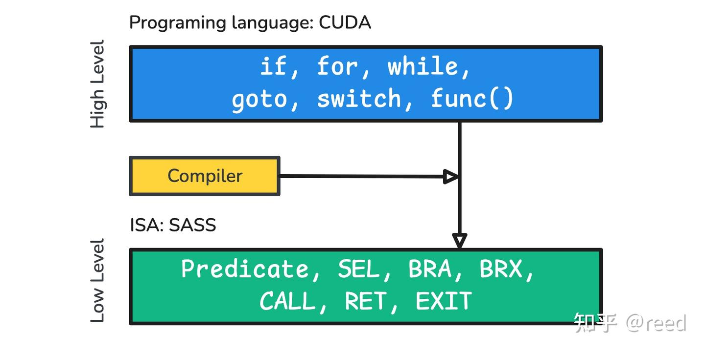
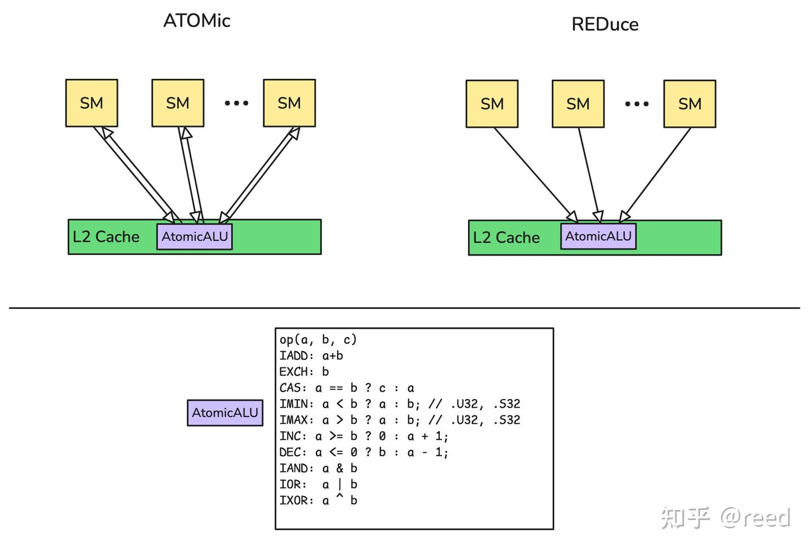

# NVidia GPU指令集架构-程序控制和原子操作

**Author:** [reed](https://www.zhihu.com/people/reed)

**Link:** [https://zhuanlan.zhihu.com/p/712357443](https://zhuanlan.zhihu.com/p/712357443)

---

在前面的文章中，我们详细介绍了NVIDIA GPU中的[浮点计算](https://zhuanlan.zhihu.com/p/695667044)、[整数计算](https://zhuanlan.zhihu.com/p/700921948)、[位操作](https://zhuanlan.zhihu.com/p/712356884)以及[Warp级协同计算](https://zhuanlan.zhihu.com/p/712357647)，这些构成了GPU的核心计算能力，为图形渲染和AI计算提供了强大的支持。此外，我们还探讨了GPU的[寄存器](https://zhuanlan.zhihu.com/p/688616037)、[加载/存储单元和缓存机制](https://zhuanlan.zhihu.com/p/692445145)，它们负责数据的存储和传输，确保计算单元能够高效地获取和处理数据。

然而，计算和数据搬运只是GPU功能的一部分，程序控制逻辑同样是不可或缺的。程序控制逻辑负责协调计算流程，确保程序按照预期的逻辑执行。尽管GPU是一个高度并行的系统，但在许多情况下，我们仍然需要局部或全局的串行逻辑来完成程序控制和数据同步。为此NVIDIA GPU提供了一系列原子操作指令，以支持这些需求。

本文将重点介绍NVIDIA GPU的程序控制逻辑和原子操作指令。首先，我们将从编程语言层和底层指令的对应逻辑开始介绍，逐步深入到指令层的控制流，探讨Predicate、SEL、BRA等指令在程序控制中的作用，然后我们介绍了原子指令ATOM、ATOMG、ATOMS以及更高效的RED指令，最后文章对全文进行了总结。

## 高级编程语言和底层指令

在高级编程语言（如CUDA C）中，控制流结构, 如`if`、`for`、`while`、`switch`、`goto`、`function call`、`return`被广泛使用（如图1），这些结构可以为高级编程语言提供丰富的控制和表达能力，底层硬件指令在实现时会结合GPU多线程、高并行的硬件特征提供更底层和原子的控制能力。具体地，NVidia GPU提供了Predicate能力，Select、Branch、Call、Return、Exit等相关指令来完成程序控制（如图1所示）。


*Figure 1. High level CUDA and Low Level SASS*

利用或组合这些指令可以表达出高层语言的控制流结构。值得注意的是，高层语言和底层指令并不是一一对应，同一个高层语言的逻辑可以对应底层指令的多种组合形式，如有些if逻辑可以通过Predicate实现，可以通过SEL实现，也可以通过BRA实现，但是针对不同的场景效率会有很大的差别，编译器会结合具体的上下文给出更好的指令选择。

在后续介绍中会频繁出现 **Modifier** 这一概念。Modifier 是 SASS 指令助记符中以 `.` 分隔的后缀标记，用于指定指令行为的各种细节。例如 `RED.E.ADD.F32.FTZ.RN.STRONG.GPU` 中，`.E` 表示 64 位扩展地址，`.ADD` 表示操作类型，`.F32` 表示数据类型，`.FTZ` 和 `.RN` 分别控制非规格化处理和舍入模式，`.STRONG.GPU` 指定内存序和作用域。不同类别的指令有不同的 Modifier 集合，编译器根据源码语义选择合适的组合。

## 指令层的控制流

**Predicate实现控制流**

如下CUDA代码展示了if 控制流，在lower到指令集时，一般会使用Predicate来完成控制，

```cpp
if (c > 0) {
    v = __sinf(f);
} else {
    v = __cosf(f);
}
```

上述CUDA代码对应的指令表示

```sass
@!P0 MUFU.COS R0, R8 ;
@P0 MUFU.SIN R0, R8 ;
```

从上面可以看到高层编程语言的if控制流在底层指令中是通过Predicate来实现。

**选择指令（SEL）**

CUDA编程语言中的if语句，如果满足某种约定且足够简单，则编译器可以从后端的指令集中选择**SEL**ect指令，如下CUDA语句

```cpp
if (c > 0) {
    v = 1;
} else {
    v = 2;
}
```

则编译器生成指令的一种可能的行为如下：

```sass
MOV R7, 0x1 ;
...
SEL R7, R7, 0x2, P0 ;
```

其中P0为Predicate寄存器，其表达了`c > 0` 这个条件，如果条件成立，则选择R7, 否则选择立即数 0x2 (即整数2)。SEL指令在SIMIT意义下可以避免跳转的开销，提升执行效率。

**分支指令（BRA，BRX，BRXU）**

分支指令（Branch）通过改变程序计数器（PC）实现指令流的跳转，是循环和条件分支在底层的基本实现机制。以CUDA中的for循环为例，

```cpp
float v = 0.f;
#pragma unroll 1
for (int i = 0; i < n; ++i) {
    v += ff;
}
```

编译器将其转换为分支跳转指令实现循环，一种可能的指令序列如下

```sass
/*0070*/ IADD3 R3, R3, 0x1, RZ ;
/*0080*/ FADD R0, R0, c[0x0][0x184] ;
/*0090*/ ISETP.GE.AND P0, PT, R3, c[0x0][0x180], PT ;
/*00a0*/ @!P0 BRA 0x70 ;
```

逐条对应来看：

`IADD3 R3, R3, 0x1, RZ` 对R3做整数加1（Ampere 架构的整数加法单元本身是三操作数设计的，不需要的操作数填 RZ（0）即可，这样一条指令就能覆盖两操作数和三操作数加法的需求。），对应CUDA中的 `i++`。

`FADD R0, R0, c[0x0][0x184]` 做浮点加法，`c[0x0][0x184]` 是常量内存中存放的ff值，对应 `v += ff`。

`ISETP.GE.AND P0, PT, R3, c[0x0][0x180], PT` 是整数比较并设置Predicate寄存器的指令：比较R3（当前i值）和 `c[0x0][0x180]`（n值），条件为GE（Greater than or Equal，大于等于）。当 `i >= n` 时P0置True，当 `i < n` 时P0置False。

`@!P0 BRA 0x70` 表示当P0为False时（即 `i < n`，循环条件仍成立）跳转回地址0x70继续执行循环体；当P0为True时（`i >= n`，循环结束）不跳转，顺序执行后续指令退出循环。整个循环的控制逻辑通过 ISETP 设置条件 + BRA 条件跳转配合实现。

除了上面这种跳转到固定地址的BRA指令，NVidia GPU指令集还提供了动态跳转指令 `BRX`，形如 `BRX R6 -0x7960`，跳转目标由寄存器值加上偏移量计算得到，在switch语句的跳转表实现中可能出现。类似地，`BRXU` 指令（如 `BRXU UR34 -0xb200`）使用Uniform寄存器计算跳转目标，适用于warp内所有线程跳转到同一地址的场景。

**函数调用和返回（CALL，RET）**

在CUDA中可以通过`__device__`定义device函数，这些device函数可以在global函数中进行调用，对于比较小的函数，编译器一般会对此类函数进行inline优化，使其成为主函数的一部分，减少函数调用的指令的使用，但是有时候依然会使用到函数调用指令，在NVidia GPU中，常见的函数调用指令如下，Modifier有REL/ABS和NOINC：

```sass
CALL.REL 0x60f0;
CALL.REL.NOINC 0xfd00;
CALL.ABS.NOINC R2;
```

其中Modifier REL表示相对调用，ABS表示绝对调用，NOINC表示PC值不改变。函数返回常见的指令为

```sass
RET.ABS R18 0x20;
RET.REL.NODEC R80 0x0;
```

由于NVidia并没有公开其函数调用的ABI约定，并且GPU是一个拥有大量寄存器的设备，其很难在调用时把大量的寄存器都save下来，并且大部分函数都在一个编译单元内部，其有很大的优化空间，并且这部分内容更多的是编译器约定的范畴，此处就不做过多解读。

**线程退出（EXIT）**

由于GPU是一个多线程设备，大部分情况下不同的线程会执行同样的指令，有些时候其中的某些线程并不需要工作，其可以提前退出，NVidia GPU也提供了相应的指令

```sass
EXIT ;
```

执行EXIT的线程立即停止执行后续指令，不会因为同warp中其他线程仍在运行而被"拖着"继续执行。需要注意的是，如果warp中部分线程已EXIT而其余线程仍然active，这些active线程在遇到SYNC、BAR等同步指令时，硬件必须保证行为正确（已退出的线程不参与同步，但不会导致死锁或错误）。和其他指令一样，EXIT也支持Predicate条件执行，如

```sass
@P2 EXIT
```

**执行逻辑分裂与合并**

由于GPU是多线程模型，在某些场景下需要一部分线程执行一个基本块，另一部分线程执行另外的基本块，这样可以确保逻辑正确，但是长期分裂执行会导致效率低下，NVidia GPU提供了相应的指令来显式的设置同步点，以达到高效的目的，具体的有如下指令实例：

```sass
BSSY B0, 0x150
BSYNC B0 ;
@!P0 BREAK B2 ;
```

其中BSSY表示设置同步点指令，BSYNC为同步等待指令，BREAK为打破同步点指令，这些指令对于处理复杂的嵌套条件有重要作用，同时NVidia并没有对用户开放这部分能力，这部分能力由编译器裁决，更详细的信息可以参考[NVidia的专利](https://patents.google.com/patent/US11847508B2)。

除此之外，NVidia GPU 中常见的控制相关指令还有 NOP（No Operation）和 LEPC（Load Effective PC）：

```sass
NOP;
LEPC R96;
```

NOP 不执行任何计算，但在指令流中有实际作用，编译器可以插入 NOP 来做流水线时序填充（避免数据冒险）和指令地址对齐（满足跳转目标的对齐要求）。LEPC 将当前指令的程序计数器（PC）值加载到指定寄存器中，常用于位置无关代码的地址计算，当需要计算相对地址时（比如访问只读数据段中的跳转表或常量表），先用 LEPC 获取当前 PC，再加上偏移量就能得到目标地址，不依赖绝对地址。还可以配合 BRX/BRXU 实现 switch-case 跳转表时，先用 LEPC 获取基址再加上偏移量得到跳转目标。

简单说，NOP 是编译器做调度和对齐的工具，LEPC 是运行时获取 PC 值用于地址计算的工具。

## 原子操作

前面介绍的计算类指令，在逻辑上是单个线程独立工作或 Warp Level 协同工作，具有很好的局部性和独立性。在一些应用中，除了各线程独立的计算之外，还需要在 Block 级别进行规约或计数操作，并且这些操作要求在逻辑上原子执行。为此 NVidia GPU 指令集架构引入了 Atomic 类指令，主要包含：

```sass
ATOM, ATOMS, ATOMG, RED
```

ATOMS 和 ATOMG 分别对 Shared Memory 和 Global Memory 进行原子操作；ATOM 是 generic 地址空间的原子操作，当编译器能推断出地址空间时使用对应的 ATOMS/ATOMG，否则使用 ATOM 由硬件在运行时裁决地址空间。指令通过 Modifier 指定具体的运算类型（ADD、MIN、MAX、OR、XOR、CAS 等，具体支持的操作可参考图 2 中 AtomicALU 部分）和作用 Scope。

```sass
RED.E.ADD.64.STRONG.GPU         RED.E.ADD.STRONG.GPU            RED.E.OR.STRONG.GPU
RED.E.ADD.F32.FTZ.RN.STRONG.GPU RED.E.MAX.S32.STRONG.GPU
RED.E.ADD.F64.RN.STRONG.GPU     RED.E.MIN.S32.STRONG.GPU
```

ATOM 类指令的形式如下，语义为将 R9 的值原子地加到全局地址 [R4.64] 上，并返回操作前的旧值，读取和写回是原子的，不能被其它操作打断：

```sass
ATOMG.E.ADD.STRONG.GPU PT R5 [R4.64] R9
```

有时只需要原子地更新内存，不需要旧值。NVidia GPU 为此提供了更轻量的 RED（Reduction）指令（如图 2）：


*Figure 2. ATOM and RED Operation Difference and Supported Operation*

对目标内存而言，RED 与 ATOM 的写回副作用一致，区别在于 RED 不把旧值写回寄存器。省去返回路径可以减少寄存器压力，因而 RED 通常比 ATOM 更高效。设计背景可参考 [NVidia 的专利](https://patents.google.com/patent/US7627723B1)。常见的 RED 指令形式有：

```sass
RED.E.ADD.64.STRONG.GPU         RED.E.ADD.STRONG.GPU            RED.E.OR.STRONG.GPU
RED.E.ADD.F32.FTZ.RN.STRONG.GPU RED.E.MAX.S32.STRONG.GPU
RED.E.ADD.F64.RN.STRONG.GPU     RED.E.MIN.S32.STRONG.GPU
```

一条具体的 RED 指令示例：

```sass
RED.E.MAX.S32.STRONG.GPU [R4.64] R7
```

可以看到 RED 只需要源操作数寄存器和目标地址，没有目标寄存器接收返回值。从指令编码的角度，操作类型（ADD/MAX/MIN/OR 等）、数据类型（S32/F32/F64/64 等）、舍入模式（RN/FTZ）和可见性 Scope（STRONG.GPU）都通过 Modifier 组合表达。

## 总结

本文介绍了高级编程语言中的控制流和底层的程序控制的指令，指出了它们之间可能的多映射关系，针对不同的场景有不同的优化和映射方式，同时针对底层程序控制指令进行了详细介绍：Predicate实现控制流、SEL选择指令，BRA分支指令、函数调用CALL和返回RET指令，指出EXIT退出指令并不是简单的退出而需要考虑其他的BARRIER的一致性行为和并行执行引入的分裂和合并逻辑。同时文章介绍了原子指令，和无需返回值的RED类指令，了解这些指令能够更好的了解高并行硬件和相关编译器设计。

## 参考

[reed：NVidia GPU指令集架构-浮点运算](https://zhuanlan.zhihu.com/p/695667044)

[reed：NVidia GPU指令集架构-整数运算](https://zhuanlan.zhihu.com/p/700921948)

[reed：NVidia GPU指令集架构-比特和逻辑操作](https://zhuanlan.zhihu.com/p/712356884)

[reed：NVidia GPU指令集架构-Warp级和Uniform操作](https://zhuanlan.zhihu.com/p/712357647)

[reed：NVidia GPU指令集架构-寄存器](https://zhuanlan.zhihu.com/p/688616037)

[reed：NVidia GPU指令集架构-Load和Cache](https://zhuanlan.zhihu.com/p/692445145)

[Do switch statements require gmem reads for the jump table?](https://forums.developer.nvidia.com/t/do-switch-statements-require-gmem-reads-for-the-jump-table/179914/4)

[https://forums.developer.nvidia.com/t/the-calling-process-of-device-function/287822](https://forums.developer.nvidia.com/t/the-calling-process-of-device-function/287822)

[https://docs.nvidia.com/cuda/cuda-binary-utilities/index.html](https://docs.nvidia.com/cuda/cuda-binary-utilities/index.html)

[https://patents.google.com/patent/US11847508B2](https://patents.google.com/patent/US11847508B2)

[https://patents.google.com/patent/US7627723B1](https://patents.google.com/patent/US7627723B1)
