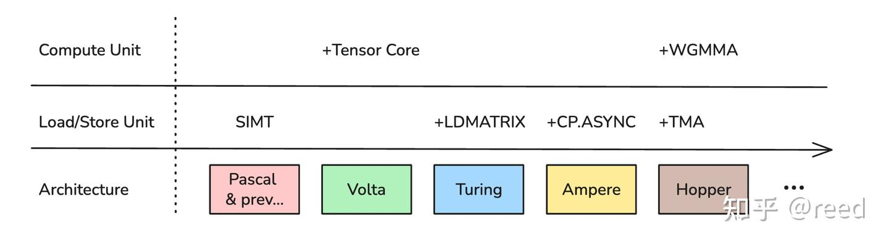
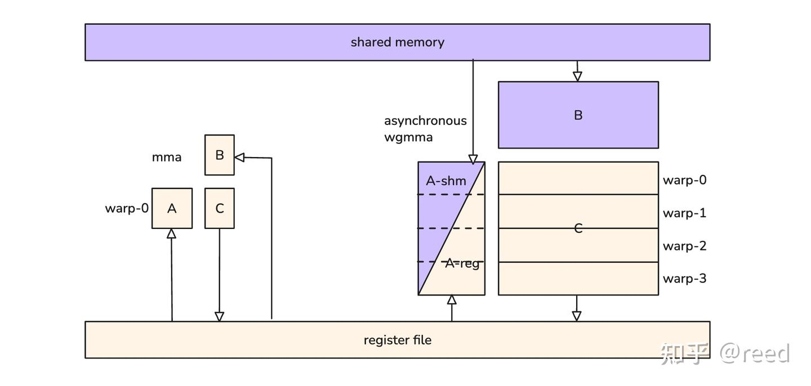
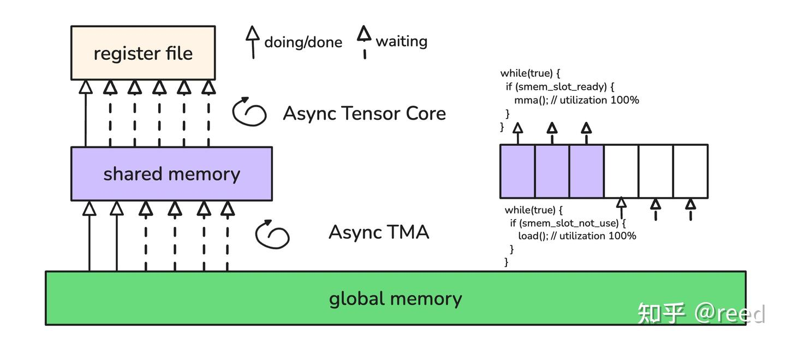
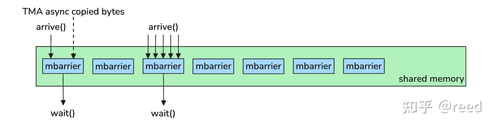
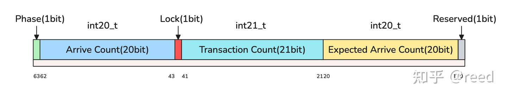
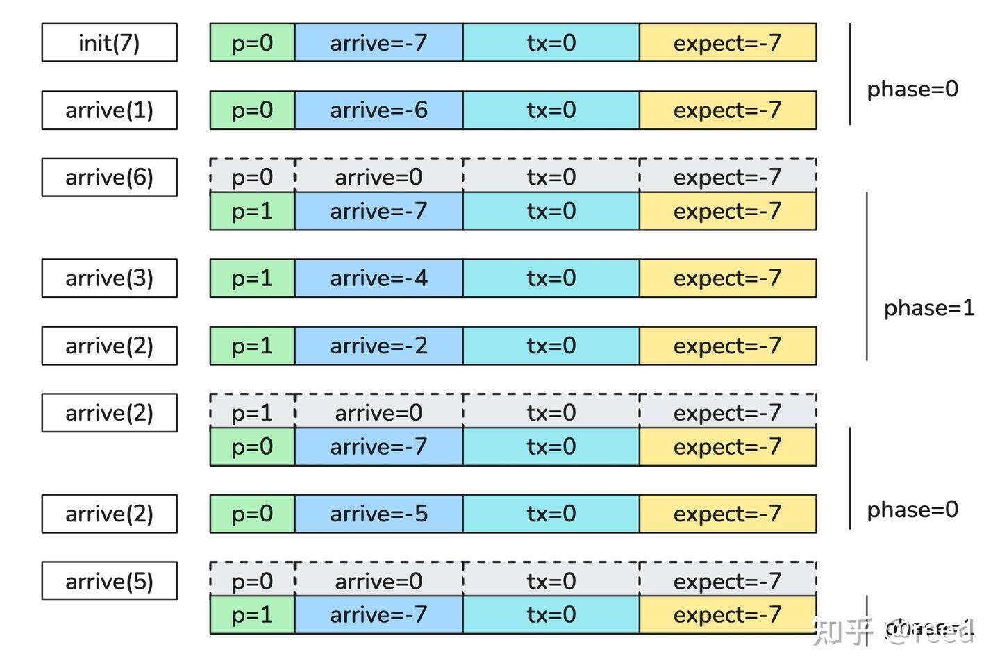
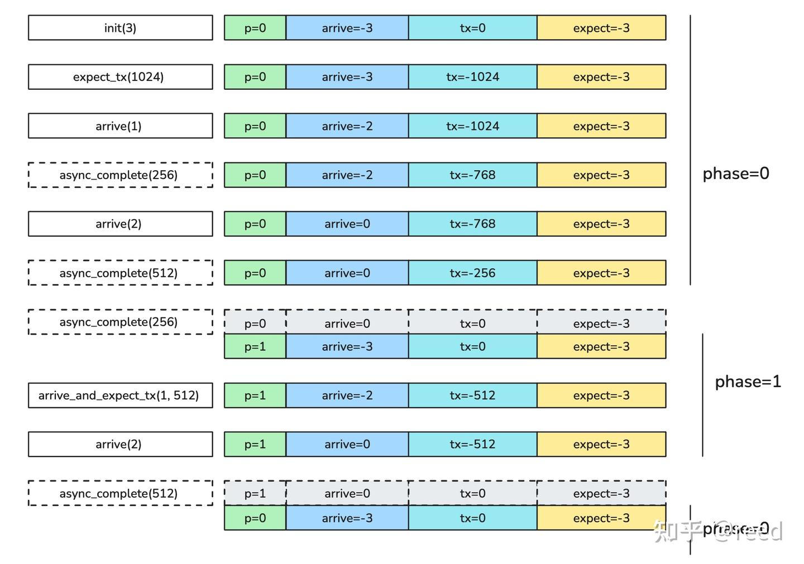

# cute 之 Hopper MBarrier

**Author:** [reed](https://www.zhihu.com/people/reed)

**Link:** [https://zhuanlan.zhihu.com/p/1962636004235153810](https://zhuanlan.zhihu.com/p/1962636004235153810)

---

Hopper 架构提供了异步 Tensor Core（WGMMA）和独立数据搬运单元（TMA），两者通过共享内存解耦后需要高效的同步机制来协调执行进度。为此 Hopper 引入了 MBarrier，能够统一管理线程到达和数据到达事件。本文介绍 MBarrier 的功能、数据表示和状态转移，并通过实验验证状态转移过程。

## 计算和数据搬运的桥梁

在高性能处理器架构体系中，有两个核心点，一个核心是计算，另一个核心是数据搬运。处理器的推陈出新始终是在围绕更高效的计算核心和更高效的数据搬运引擎在演进。

NVidia GPU的演进自然也在这个范式之内，如图1所示，从Volta架构开始，GPU的处理器单元SM（Stream Multiprocessor）上装配了Tensor Core来提高计算能力，尤其是矩阵计算能力; 从Turing架构开始提供了`ldmatrix`指令以提升共享内存（shared memory）向寄存器（register）进行数据搬运的能; Ampere架构上提供了`cp.async`指令实现全局内存（global memory）到共享内存异步数据搬运的能力; 在Hopper架构中针对计算部分，其装配了具有异步执行能力的WGMMA（WarpGroup Matrix Multiply-Accumulate）Tensor Core，针对数据搬运部分，其装配了独立的数据搬运TMA（Tensor Memory Accelator）单元。


*Figure 1. Compute and Load/Store unit evolution*

如图2左侧所示，Hopper 之前的 Tensor Core（MMA 指令）源操作数和目的操作数都在寄存器中，执行周期固定。Hopper 的 Tensor Core 新增了 WGMMA 指令（图2右侧），由连续四个 warp 组成的 warp group 协同完成更大规格的矩阵乘法。WGMMA 的操作数布局与 MMA 不同，输入矩阵 A 可以在寄存器或共享内存中，B 必须在共享内存中，输出矩阵 C 在寄存器中。WGMMA 是异步指令，需要配合 commit/wait 来确保计算完成和结果可见性。由于计算规格更大、多 warp 协同、支持更低精度输入（如 FP8），WGMMA 的计算效率更高。


*Figure 2. Hopper tensor core instruction operand source location*

Hopper 同时提供了高效的数据拷贝引擎 TMA，可以异步地完成全局内存和共享内存之间的数据搬运。如图3所示，一个典型的 GEMM 实现中，TMA 负责循环地将全局内存数据写入共享内存，Tensor Core 通过 WGMMA 循环地从共享内存读取数据进行矩阵运算，计算结果写入寄存器。

共享内存在这里充当了生产者（TMA）和消费者（Tensor Core）之间的解耦缓冲区。对 Tensor Core 而言，它不关心数据从哪里来，只要共享内存中的数据就绪就可以开始计算; 对 TMA 而言，它不关心数据被谁消费，只要共享内存有空闲空间就可以写入新数据。两者通过共享内存独立运行、互不阻塞，各自达到最大吞吐。共享内存作为中间缓冲区还能平滑数据加载的延迟抖动，避免计算单元因等待数据而空转。


*Figure 3. A typical GEMM data dependency decoupled by shared memory*

以上编程范式在传统的算法中表现为生产者消费者模型，在一个典型的C++实现中，其通过锁和条件变量实现，为了更好的适配这种编程范式，使得Tensor Core和TMA能够更好的发挥各自的性能，Hopper架构上提供了能够协调线程到达，数据到达和等待的高效的同步机制，即MBarrier。

## MBarrier

传统的 barrier（栅栏）在 NVidia GPU 体系上实现为独立的硬件单元。最常用的是 `__syncthreads()`，它包含两条语义：

- **执行同步**：所有参与线程到达该同步点后才能继续执行后续指令，可以拆解为两步，即线程到达（arrive）和等待其他线程到达（wait）。
- **内存可见性屏障**：确保同步点之前任意线程发起的共享内存写入对同步点之后的所有线程可见。借用 C++ 内存模型的术语，可以简单的表达为同步前执行 release 语义，同步后施加 acquire 语义。

`__syncthreads()` 的逻辑可以简单地拆解为如下

```cpp
void __syncthreads() {
  memory_release();
  thread_arrive();
  wait_all_threads();
  memory_acquire();
}
```

除了 `__syncthreads()`, CUDA 还通过 PTX 提供了 [named barrier](https://docs.nvidia.com/cuda/parallel-thread-execution/#parallel-synchronization-and-communication-instructions-bar) 同步机制 `bar.sync a b;`，其中 a 是 barrier id（每个线程块可使用 0-15 共 16 个），b 是需要参与的线程数。Named barrier 可以实现部分线程的同步，控制粒度更细，其逻辑可以拆解如下：

```cpp
void bar_sync(int id, int count) {
  memory_release();
  thread_arrive(id);
  wait_threads(id, count);
  memory_acquire();
}
```

NVidia 进一步提出了 mbarrier（memory barrier），它以共享内存为存储后端，概念上不再受限于固定数量的硬件单元，数量可以和共享内存空间一样多（如图4所示）。相比传统 barrier，mbarrier 提供了三方面增强，一是 arrive 和 wait 解耦为独立操作; 二是支持部分线程参与; 三是将 TMA 异步拷贝的完成机制也合并其中，当 TMA 拷贝完成时自动更新 mbarrier 的状态，这样用统一的 wait 就可以同时等待线程到达和数据到达。


*Figure 4. mbarrier semantic*

硬件层面为 mbarrier 提供了 cache 加速，只有初始化和销毁时 cache 内容才写回共享内存，其他操作均在 cache 内完成。虽然从 SASS 指令层面看，barrier 对应的 SYNCS 指令操作对象标注为共享内存，但实际并不触发共享内存写回，效率远高于普通的共享内存操作。

> **补充说明：mbarrier 的 cache 加速机制**
>
> 从编程模型看，mbarrier 是分配在共享内存中的 64-bit 对象（`.shared .b64`）。但 Hopper 硬件在 SM 内部为 barrier 操作维护了专用的缓存结构，工作方式类似 CPU 的 write-back cache：
>
> - **`mbarrier.init`**：将 mbarrier 状态从共享内存加载到专用 cache
> - **`mbarrier.arrive` / `try_wait` / `expect_tx` 等操作**：直接在 cache 内读写 Phase、Arrive Count、Transaction Count 等字段，不访问共享内存
> - **`mbarrier.inval`**：将 cache 中的最终状态写回共享内存，释放 cache 条目
>
> SASS 层面 mbarrier 操作对应 `SYNCS` 类指令，其操作数地址仍标注为共享内存空间，但这只是用共享内存地址来标识"哪个" mbarrier 对象，硬件执行时会路由到专用 cache，并不触发实际的共享内存读写。这样设计的好处是：在 GEMM 流水线中 TMA 和 WGMMA 需要高频访问共享内存搬运数据和读取操作数，barrier 操作不占用共享内存带宽，避免了与数据通路的竞争。
>
> 这也解释了为什么在后面的使用示例中需要先调用 `mbarrier.inval` 写回 cache，才能通过 `lds`（load shared）读到 mbarrier 的真实状态。

mbarrier 在数据表示上是一个 64 bit 整数，内部各域的定义如图5所示，从低位到高位（从右往左）共六个域，分别是最低位的一比特的保留域，第一比特到第二十比特的Expected Arrive Count域，第二十一比特到第四十一比特的Transaction Count域，第四十二比特位置的Lock域，第四十三比特到第六十二比特的Arrive Count域和第六十三比特位置的Phase域。


*Figure 5. MBarrier fields*

如图6所示，以初始化 mbarrier 为 7（即等待 7 个 arrive）为例说明各域的初始值和状态转移过程。

**初始化**：Expected Arrive Count 和 Arrive Count 都被设置为 -7，表示还需要等待 7 个到达。这两个域都是 20 bit 有符号整数（int20_t），正数用原码，负数用补码，-7 表示为 `b11111111111111111001`。Transaction Count 域初始化为 0，它也是有符号数据，比 Arrive Count 多一位（int21_t）。Lock 域初始化为 0，表示正常状态。Phase 域初始化为 0，只有 1 bit，取值 0 或 1，通过翻转来实现 mbarrier 的复用（原理可参考并行计算中的 Sense Reversing Barrier）。

**Arrive 触发的状态转移**（图6第二行及以后）：当线程调用 arrive(n) 时，Arrive Count 加上 n。根据加法结果有三种情况：

- **Arrive Count 刚好等于 0**：该 phase 完成。Phase 自动翻转（0→1 或 1→0），Arrive Count 重置为 Expected Arrive Count 的值，开始新一轮等待。
- **Arrive Count 仍小于 0**：该 phase 尚未完成，需要等待后续 arrive。
- **Arrive Count 大于 0**：mbarrier 出错，Lock 置 1 进入错误锁定状态。

Phase 翻转后（图6中第灰色状态），对该 mbarrier 调用 wait(old_phase) 可以立即通过。而翻转前调用 wait 则会阻塞，直到 Arrive Count 归零。值得注意的是，初始状态 `p=0, arrive=-7, tx=0, expect=-7` 可以视为从 `p=1, arrive=0, tx=0, expect=-7` 翻转而来，因此在初始状态下 wait(phase=1) 也能立即通过。


*Figure 6. mbarrier state update with arrival*

**Transaction Count 相关的状态转换**（如图7）：以初始化 mbarrier 为 3 为例，Arrive Count 和 Expected Arrive Count 都设置为 -3，Transaction Count（tx）初始化为 0，Phase 初始化为 0。设置 mbarrier 需要等待的 transaction bytes 后（如图7中设置 1024 bytes），tx 更新为 -1024，表示需要等待 1024 bytes 数据到来。

线程可以通过 arrive 完成到达（更新 Arrive Count），同时 mbarrier 会被关联到 TMA 拷贝单元，当 TMA 完成数据拷贝时（图7中虚线框 async_complete），它自动通知 mbarrier，tx 字段加上已到达的数据量。Phase 完成的条件是 Arrive Count 和 Transaction Count 同时归零。此时 Phase 翻转，Arrive Count 重置为 Expected Arrive Count，Transaction Count 重置为 0，可以对 mbarrier 进行新一轮配置和复用。图中灰色框表示该 phase 完成，此时 wait 相应 phase 可以立即通过; 在此之前 wait 则需要等待 arrive 和 tx 事件都完成。Phase 翻转后对上一 phase 的 wait 也能立即通过。

mbarrier 还提供了同时指定 arrive 和 tx 的指令，可以原子地更新两个字段，减少指令调用次数。此外，除了直接 wait，还可以通过 PTX 提供的 test 指令来探测 mbarrier 的当前状态。

mbarrier提供的wait可以指定内存可见性scope，这样当wait成功时，可以确保整个scope是可以看见其内存副作用的，避免了需要所有线程wait。


*Figure 7. mbarrier state update with asynchronous transaction*

CUDA以PTX的形式提供了mbarrier的能力，cute针对mbarrier进行了函数封装（位于`cute/arch/copy_sm90_desc.hpp`），常用的有

```cpp
void initialize_barrier(
    uint64_t& smem_barrier,   // 64 bits user-managed barrier in smem
    int thread_count = 1);    // Thread count expected to arrive/wait on this barrier

void set_barrier_transaction_bytes(
    uint64_t& smem_barrier,   // 64 bits user-managed barrier in smem
    uint32_t bytes);          // Number of bytes transfered by per TMA transaction

void wait_barrier(
    uint64_t& smem_barrier,   // 64 bits user-managed barrier in smem
    int phase_bit);           // Current phase bit the barrier waiting to flip

void arrive_barrier(
    uint64_t& smem_barrier);  // 64 bits user-managed barrier in smem
```

还有一部分能力被封装在了cutlass/arch/barrier.h中。

## 使用示例

针对以上mbarrier的状态转移过程，通过代码进行了验证，由于通常情况下mbarrier是被缓存在cache中的，并且不会写回共享内存，正常情况下我们无法通过读取共享内存来获取mbarrier的数据，但我们可以通过调用`mbarrier.inval`指令来销毁mbarrier，这会使得cache中的数据向共享内存写回，这时我们就可以通过读取共享内存（LDS）来获取mbarrier的状态了。具体实验代码参见[https://github.com/reed-lau/cute-gemm/tree/main/mbarrier](https://github.com/reed-lau/cute-gemm/tree/main/mbarrier)。

## 总结

本文介绍了Hopper上硬件加速的事务型内存同步机制MBarrier，重点介绍了其核心的数据表示和状态转移，它作为Hopper上高效的同步机制是实现生产者-消费者模式的必要组件，是TMA和Tensor Core形成流水线的核心组件，同时本文通过代码示例展示了mbarrier的状态转移过程。

## 参考

[https://patents.google.com/patent/US20230289242A1/en](https://patents.google.com/patent/US20230289242A1/en)

[https://docs.nvidia.com/cuda/parallel-thread-execution/#parallel-synchronization-and-communication-instructions-bar](https://docs.nvidia.com/cuda/parallel-thread-execution/#parallel-synchronization-and-communication-instructions-bar)

[https://mattchung.me/blog/2020/09/18/making-sense-of-the-sense-reversing-barrier-synchronization/](https://mattchung.me/blog/2020/09/18/making-sense-of-the-sense-reversing-barrier-synchronization/)

[https://en.cppreference.com/w/cpp/atomic/memory_order.html](https://en.cppreference.com/w/cpp/atomic/memory_order.html)
