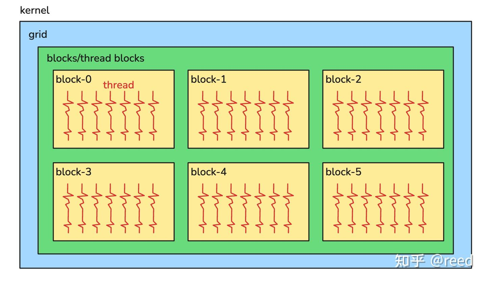
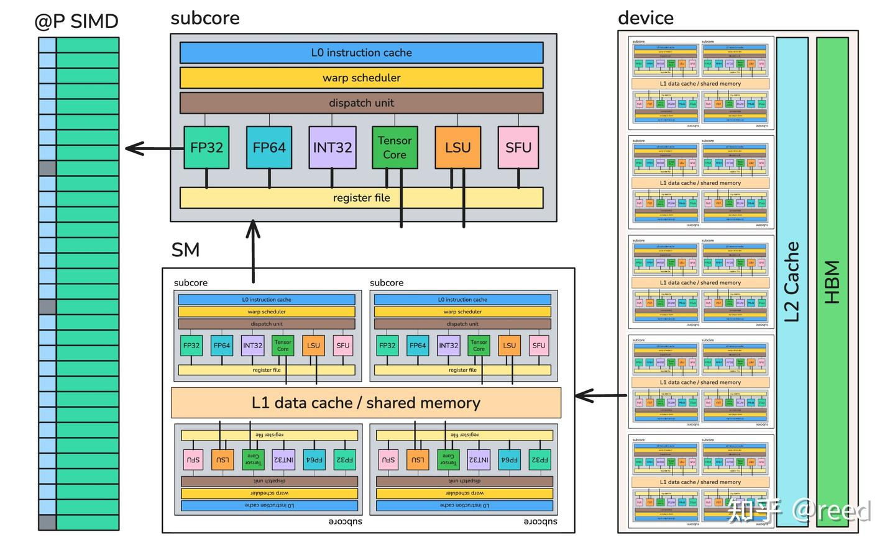
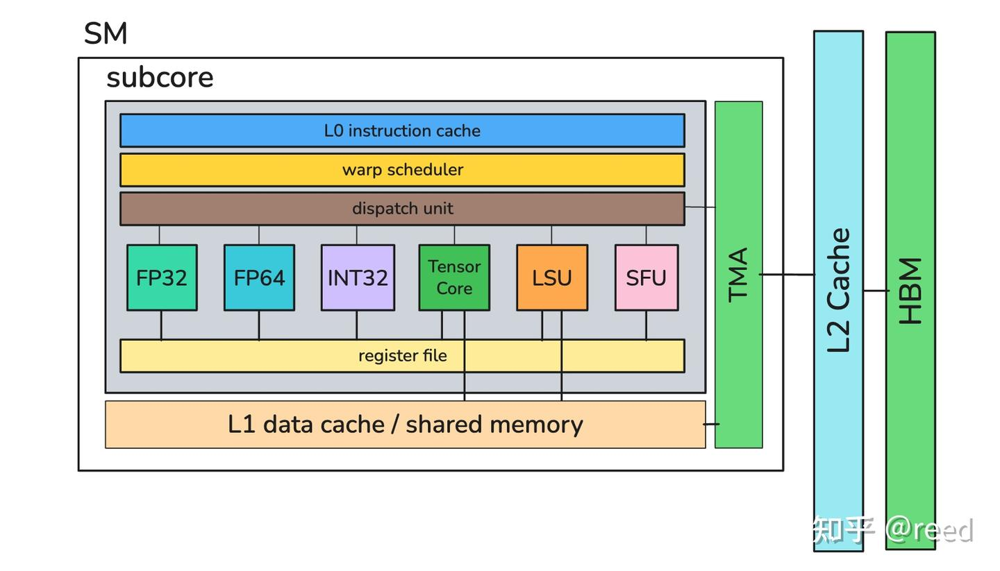
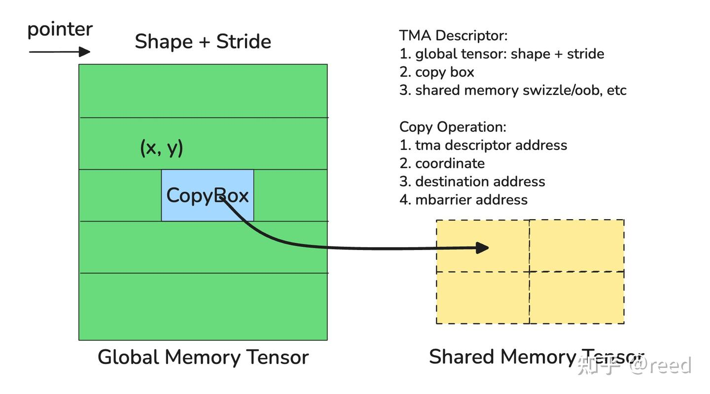
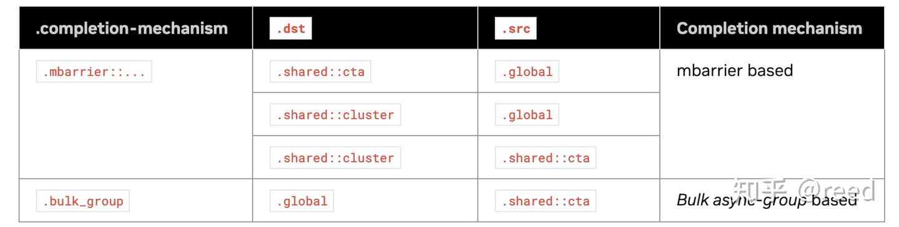
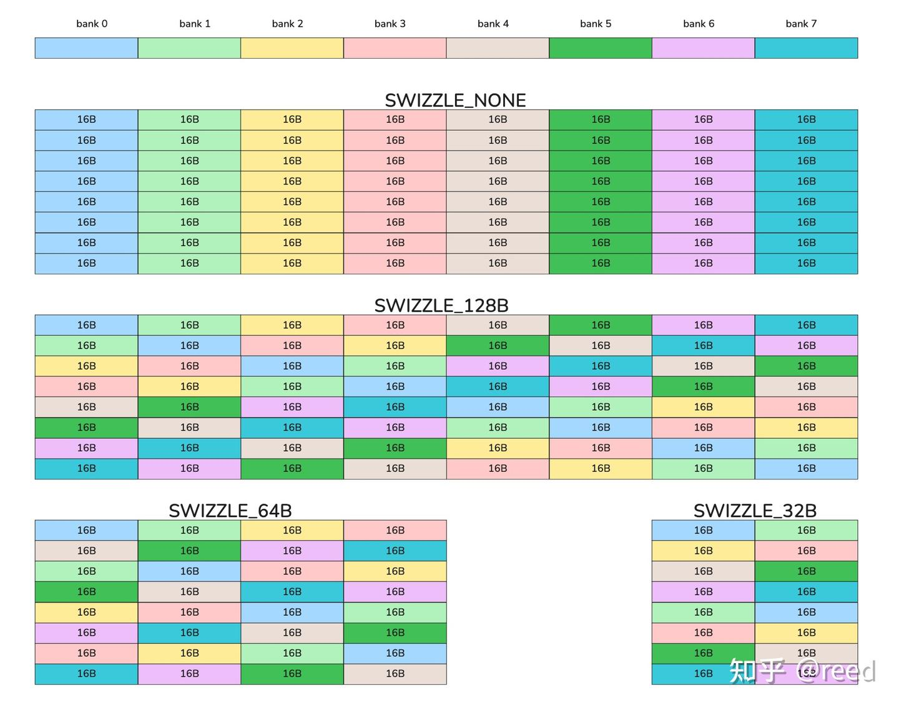
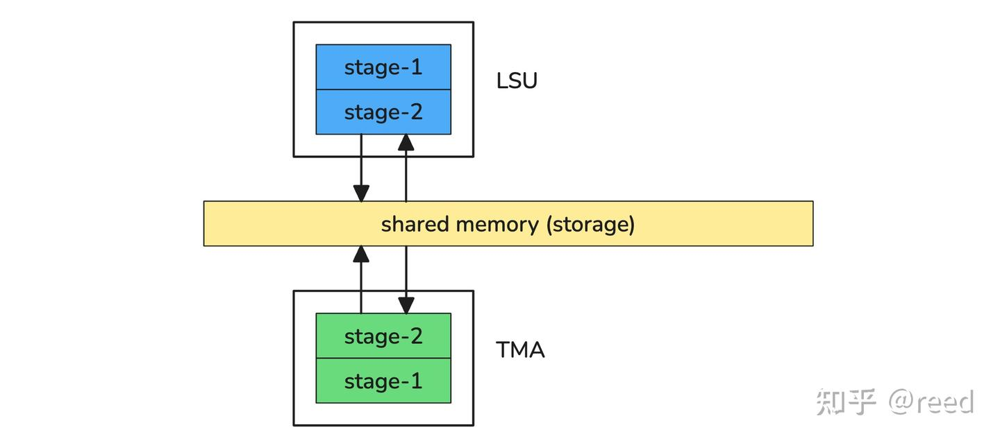
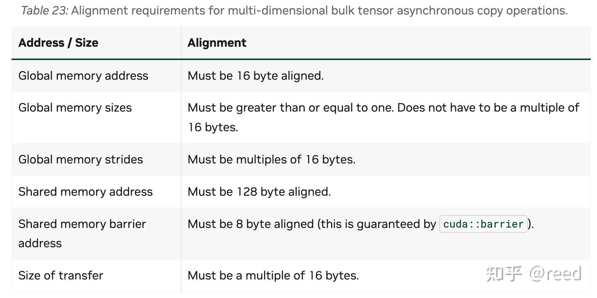

# cute 之 Hopper TMA

**Author:** [reed](https://www.zhihu.com/people/reed)

**Link:** [https://zhuanlan.zhihu.com/p/1985678344352731952](https://zhuanlan.zhihu.com/p/1985678344352731952)

---

Hopper 之前的架构中，所有数据拷贝由多个线程协同完成，每个线程各自计算地址，单次最多加载 16 字节，通过多轮循环搬运更大的数据块。Hopper 架构引入了独立的硬件单元 TMA（Tensor Memory Accelerator），将数据搬运从线程中解耦出来，单条指令即可发起大块 Tensor 拷贝。

本文先介绍传统 SIMT 模型下的数据搬运方式及其局限，再重点介绍 TMA 的描述符、拷贝指令、完成机制和可见性保障，最后介绍 CuTe 对 TMA 的封装。

## SIMT编程模型中的数据搬运

CUDA 采用 SIMT（Single Instruction, Multiple Threads）编程模型。如图1所示，一个 kernel 启动一个线程网格（grid），grid 由多个线程块（block）组成，每个 block 包含多个线程（thread）。


*Figure 1. SIMT Programming Model*

编程模型本质上是对硬件结构的抽象，SIMT 的层级划分直接对应 NVIDIA GPU 的硬件设计。如图2所示，GPU 硬件自下而上分为四层：

**SIMD 核心**，最内层的执行单元。GPU 在硬件执行层面是 SIMD（Single Instruction, Multiple Data）架构，一条指令被发射后，32 个物理执行单元同时对各自的数据执行相同操作。以 FP32 核心为例，单个周期内可完成 32 路 32-bit IEEE 浮点乘加运算。每个执行单元带有 Predication 能力，即每个 lane 有一个 1-bit 的 predicate 标志，控制该 lane 是否真正执行当前指令。遇到 `if-else` 分支时，硬件通过 predicate mask 选择性地使各 lane 的结果生效或忽略，从而在 SIMD 硬件上模拟出每个 lane 独立控制流的效果，这就是 SIMT 语义的实现基础（也是 warp divergence 性能损失的来源，因为分支两侧的指令都需要执行）。类似地，硬件还提供 INT32、FP64、Tensor Core、LSU（数据加载单元）和 SFU（特殊函数单元，负责三角函数、倒数、指数等）。

**Subcore**，将上述不同类型的功能单元组合在一起形成多功能计算能力，配合 warp scheduler 和 dispatch unit，形成 warp 级调度和执行能力。

**SM（Stream Multiprocessor）**，4 个 subcore 加上 L1 data cache、共享内存和 barrier 硬件单元构成一个 SM。共享内存提供本地数据复用，barrier 单元协调多个 subcore 的同步。

**Device**，多个 SM 加上 L2 Cache 和 HBM（High Bandwidth Memory）构成完整的 GPU 设备。


*Figure 2. NVidia GPU Hardware Architecture Abstraction*

软件概念和硬件结构的对应关系如下。Grid 对应 Device，通过调度使有限的 SM 支撑任意大小的 grid; Block 对应 SM，block 内线程共享 shared memory 并可通过 barrier 同步（一个 SM 可同时承载多个 block 以提高利用率）; Warp 对应 subcore，32 个线程在同一 subcore 内并行执行; Thread 对应带 Predicate 的 SIMD lane，通过 Predicate mask 实现 SIMT 语义。

当我们使用GPU完成一个特定问题的求解时，本质是将任务拆分为可并行的更小的子任务，这些任务最终被分配到一个并行执行的FP32或者INT32等核心上执行。在 SIMT 模型下，每个线程根据 `blockIdx` 和 `threadIdx` 映射到问题域的一小块计算逻辑，即 $T = P(\text{threadIdx}, \text{blockIdx})$，然后使用 FP32/INT32/LSU 等单元完成数据加载和计算。

对于深度学习场景，输入输出通常是高维 Tensor，任务划分后每个线程需要搬运的也是高维空间中的一块数据。以 Ampere 架构上的 GEMM 为例，每个线程的典型任务流程为：

1. 将数据加载到共享内存（使用INT32）
2. 读取共享内存数据到寄存器
3. 使用TensorCore完成矩阵乘加计算
4. 将结果写出到共享内存
5. 读取共享内存数据到寄存器
6. 将寄存器数据写出到全局内存

可以看到，GEMM 的内存操作大量围绕共享内存展开，通过共享内存复用数据，减少对全局内存的访问，提升计算效率。然而全局内存和共享内存之间的拷贝涉及繁琐的地址计算和边界处理：

- **地址计算**：每个线程需要用 INT32 单元分别计算全局内存和共享内存的地址
- **Bank 冲突处理**：共享内存的 bank 结构要求引入 swizzle 逻辑来避免冲突，消耗额外的整数和逻辑指令
- **边界处理**：矩阵按块计算时，边界不能整除（tile quantization）的场景需要 mask 读取、零填充写入

在 SIMT 模型下，这些操作需要所有线程参与。处理起来既容易出错又消耗大量整数 ALU 资源，有统计表明 CUDA 开发者 90% 的时间花在数据访问相关的问题上。

## 高效的异步Tensor内存拷贝加速单元

针对上述问题，NVIDIA 在 Hopper 架构上给出了软硬件协同的解决方案。

硬件方面，提供独立的张量内存加速单元 TMA（Tensor Memory Accelerator），将地址计算、swizzle、边界填充等逻辑集成到硬件中。TMA 支持 1D 到 5D 的全局内存与共享内存之间的 Tensor 块拷贝，可配置 swizzle 模式避免 bank 冲突，可配置 OOB（Out Of Bound）填充模式处理边界，且拷贝异步执行，不阻塞 SM 上的计算。

软件方面，打破了 SIMT 编程范式，不再需要所有线程参与地址计算和数据读取，单个线程发起一条指令即可完成大块 Tensor 拷贝。


*Figure 3. TMA Connection Illustration*

如图3所示，TMA 在硬件上和 SM 一一对应，布置在 SM 内部。Dispatch 单元向 TMA 发送拷贝指令后，TMA 即可异步地完成全局内存与共享内存之间的数据搬运。

### TMA描述符（TMA Descriptor）

使用 TMA 进行数据搬运分为两个阶段：**定义描述符**和**发起拷贝**。

如图4所示，TMA 描述符（TMA Descriptor）是一段 128 字节的内存结构，包含拷贝所需的全部元信息。

- **全局内存描述**，输入 Tensor 的基地址、Shape 和 Stride
- **拷贝块描述**（CopyBox），单次拷贝的块大小
- **共享内存配置**，swizzle 模式和 OOB 填充模式

在拷贝发起阶段，SM 向 TMA 提供描述符的地址（TMA 据此读取上述元信息）、拷贝块的起点坐标（如图中 x, y）、目标共享内存地址，以及作为完成通知机制的 mbarrier 地址。


*Figure 4. TMA operation mechanism*

CUDA 通过 Driver API `cuTensorMapEncodeTiled` 在 host 端构建 TMA 描述符（`tensorMap`），使用时需要将其传递给 kernel。

```cpp
CUresult cuTensorMapEncodeTiled(
    CUtensorMap* tensorMap,
    CUtensorMapDataType tensorDataType,
    cuuint32_t tensorRank,
    void* globalAddress,
    const cuuint64_t* globalDim,
    const cuuint64_t* globalStrides,
    const cuuint32_t* boxDim,
    const cuuint32_t* elementStrides,
    CUtensorMapInterleave interleave,
    CUtensorMapSwizzle swizzle,
    CUtensorMapL2promotion l2Promotion,
    CUtensorMapFloatOOBfill oobFill);
```

TMA Descriptor 传递给 kernel 有三种形式。

**形式一**，通过 `const __grid_constant__` 修饰的 kernel 参数传值。

```cpp
__global__ void tma_desc_demo1(const __grid_constant__ CUtensorMap map);
```

**形式二**，通过 `cudaMemcpyToSymbol` 拷贝到 `__constant__` 修饰的 device 变量。

```cpp
// device
__constant__ CUtensorMap device_tma_desc;

// Host
CUtensorMap host_tma_desc;
cudaMemcpyToSymbol(device_tma_desc, &host_tma_desc, sizeof(host_tma_desc));
```

**形式三**，存储在全局内存中，kernel 内直接传地址给 TMA。

```cpp
__global__ void update_tma(CUtensorMap *desc) {
    // update TMA Descriptor fields
    // update global memory shape / stride
    // update copy box etc.
}
__global__ void tma_desc_demo3(CUtensorMap *desc) {
    // pass desc to TMA operation
}
```

以上三种形式适用于不同的场景，第一种适用于从host端可以确定全局内存Tensor的情形，如固定长度的linear层对应的gemm，第二种和第一种类似但是需要多出一个拷贝类的API调用; 第三种为需要动态修改全局内存中Tensor的维度等信息时采用的模式，如大模型中MoE（Mixture of Experts）层中的GroupGEMM实现时，矩阵的m轴是动态变化的，这时一般采用第三种形式。不论是那种形式，其本质都是一个大小为128字节的描述信息，只是这个信息是相对固定的还是在运行时会动态更新和变化。就效率方面而言，前两种方法CUDA驱动层能够确保描述符是在更高效的缓存系统中，所以TMA获取描述符时效率更高一下，第三种形式需要TMA单元从HBM经由L2 Cache来获取该描述符，会有一定的overhead，此时可以通过软件编程的角度在恰当的位置对描述符进行预取，使用的PTX指令和对应的SASS如下

```text
// PTX
prefetch{.tensormap_space}.tensormap [a];

.tensormap_space = { .const, .param };

// SASS
UTMACCTL.PF [UR4] ; // Uniform TMA Cache ConTRoL PreFetch
```

SASS 中的 `UTMACCTL.PF` 指令表明 TMA 单元内部维护了描述符的 cache。TMA 发起拷贝时优先从本地 cache 查找描述符，命中则直接发起拷贝，未命中才从更低层级的存储读取。

### 发起拷贝任务

描述符准备好后，通过 PTX 指令发起拷贝。以全局内存到共享内存为例。

```text
cp.async.bulk.tensor.dim.dst.src{.load_mode}.completion_mechanism{.level::cache_hint}
    [dstMem], [tensorMap, tensorCoords], [mbar] {, cache-policy}

.dst = { .shared::cta }
.src = { .global }
.dim = { .1d, .2d, .3d, .4d, .5d }
.completion_mechanism = { .mbarrier::complete_tx::bytes }
.load_mode = { .tile, .im2col }
.level::cache_hint = { .L2::cache_hint }
```

各 modifier 的含义如下。

- **cp**：来自 copy 的缩写，表示数据搬运指令。
- **async**：异步指令，指令执行后只代表 copy 任务被发起，并不代表 copy 完成。
- **bulk**：大块内存拷贝，区别于 Ampere 架构中依然是 SIMT 范式的 cp.async 指令。
- **tensor**：面向 tensor 的 copy，即 Tensor 到 Tensor 的块拷贝。
- **dim**：tensor 的维度信息（rank），支持一维到五维。
- **dst / src**：copy 的目的和源内存类型，分别是 thread block 中的共享内存和全局内存。
- **load_mode**：TMA 的加载模式，除了本文重点介绍的 tile 模式（块到块，输入输出等大小），还有针对卷积运算的 im2col 模式。
- **completion_mechanism**：完成机制，此处为 `mbarrier::complete_tx::bytes`，表示拷贝完成时 TMA 负责将拷贝的字节数写入 mbarrier 的 transaction bytes 字段（参考 cute 之 Hopper MBarrier），同时通知其完成。
- **level::cache_hint**：L2 cache 的驱逐策略，如 evict_norm、evict_first、evict_last，根据数据复用的时间/空间局部性选择恰当的策略，以提升 L2 利用效率。

操作数方面，`dstMem` 为共享内存目标地址，`tensorMap` 和 `tensorCoords` 分别指定描述符地址和拷贝块的起点坐标（坐标数量随 `dim` 变化），`mbar` 为 mbarrier 地址用于完成通知，`cache-policy` 为可选的 L2 驱逐策略。

对于一维场景，可以不构建 TMA Descriptor，直接指定全局内存地址和拷贝大小。

```text
// global -> shared::cta
cp.async.bulk.dst.src.completion_mechanism{.level::cache_hint}
    [dstMem], [srcMem], size, [mbar] {, cache-policy}

.dst = { .shared::cta }
.src = { .global }
.completion_mechanism = { .mbarrier::complete_tx::bytes }
.level::cache_hint = { .L2::cache_hint }
```

这个变体不需要 `tensor` 和 `dim` modifier，参数上只需全局内存地址和 size。虽然省去了 TMA Descriptor 的构建，但工作范式仍然是 TMA 模式，单条指令、单线程发起、异步完成。

### 完成机制

不同方向的拷贝使用不同的完成机制。全局内存到共享内存方向采用 mbarrier（拷贝完成时 TMA 自动更新 mbarrier 的 tx-count）; 共享内存到全局内存方向采用 bulk group 的 commit/wait 机制，类似 Ampere 的 `cp.async`，先提交再等待确认。具体对应关系见下图（引自 NVIDIA PTX 文档）。


*Figure 5. TMA completion mechanism (From NVidia PTX ISA-9.1, chapter-9.7.9.25.4.1)*

### Swizzle机制

创建 TMA Descriptor 时可指定 swizzle 模式来避免共享内存的 bank 冲突，支持四种模式。

```cpp
CU_TENSOR_MAP_SWIZZLE_NONE,
CU_TENSOR_MAP_SWIZZLE_32B,
CU_TENSOR_MAP_SWIZZLE_64B,
CU_TENSOR_MAP_SWIZZLE_128B
```

图6展示了 shared memory 的 bank 分布，最小单元为 16 字节，可视为 8 个 bank（不同颜色表示）。

- **SWIZZLE_NONE**，不做 swizzle，每行的 bank 分布与第一行相同
- **SWIZZLE_128B**，以 128B 为 swizzle 边界，bank 号通过行号和列号异或得到，即 `ibank = irow ^ icol`
- **SWIZZLE_64B**，可以理解为将 SWIZZLE_128B 的每行 128B 对半拆成两行（前 64B 一行，后 64B 折返为下一行），再对折后的行列做异或
- **SWIZZLE_32B**，类似地，每行 128B 拆为四行，以此类推


*Figure 6. Swizzle Pattern for TMA*

统一的计算逻辑如下。

```cpp
int banks[sizeh][sizew];
for (int irow = 0; irow < sizeh; ++irow) {
    for (int icol = 0; icol < sizew; ++icol) {
        int ioffset = irow * sizew + icol;
        int irow1 = ioffset / 8;
        int icol1 = ioffset % 8;
        banks[irow][icol] = irow1 ^ icol1;
    }
}
```

### Async 单元和可见性保障

CUDA 引入了 **proxy** 的概念来描述不同的内存访问路径。普通的 load/store 操作（通过 LSU 执行）走 **generic proxy**（通用代理），而 TMA、WGMMA 等异步操作走 **async proxy**（异步代理）。如图7所示，两种 proxy 拥有各自独立的数据通路，对共享内存的操作在不同 proxy 之间没有顺序保证，需要额外的机制来保障可见性。


*Figure 7. LSU and TMA have their own pipelines*

**TMA 写 → LSU 读**（async proxy → generic proxy）的方向没有问题。TMA 拷贝完成后会自动 arrive mbarrier，线程调用 `mbarrier.try_wait` 等待 phase 翻转。Wait 返回本身隐含了内存屏障语义，PTX 文档描述为 "the arrival of async-operation on the mbarrier object will make the results of the async-operation visible to the waiting threads"。所以 wait 返回后，线程通过 LSU 读共享内存能得到正确数据。

**LSU 写 → TMA 读**（generic proxy → async proxy）的方向则存在隐患。看下面的例子，LSU 先写共享内存，`__syncthreads()` 同步后，单线程发起 TMA 读取共享内存。时序上看写操作在前，但 `__syncthreads()` 只保证线程间的执行同步（generic proxy 内部），不保证 generic proxy 的写入对 async proxy 可见。TMA 发起读取时，LSU 的写入可能仍未被 async proxy 观察到，导致 TMA 读到错误数据。（如果是 LSU 读而非 TMA 读，因为走同一个 generic proxy，就没有这个问题。）

```cpp
__shared__ float sdata[1024];

sdata[idx] = idx;
__syncthreads();

if (elected) {
    TMA::copy(sdata, ...);
}
```

解决方法是在 LSU 写入后插入 `fence.proxy.async` 指令，使 LSU 的写入对 TMA 可见。

```cpp
sdata[idx] = idx;
asm volatile("fence.proxy.async.shared::cta;\n");
__syncthreads();

if (elected) {
    TMA::copy(sdata, ...);
}
```

`fence.proxy.async` 将 generic proxy 中先前的共享内存写入排序到后续 async proxy 操作之前，使 TMA 能观察到这些写入。`__syncthreads()` 负责线程间的执行同步（确保所有线程的 fence 都已执行），fence 负责跨 proxy 的可见性同步，两者配合才能保证正确性。

### 其他方面

除了上面介绍的基本拷贝能力，TMA 还提供了以下扩展功能。

- **Multicast**，读取一份数据后可以组播给 cluster 内的多个 block，避免各 block 各自重复读取同一份全局内存数据
- **Im2col**，针对卷积（convolution）计算模式的 image-to-column 能力，TMA 硬件自动完成复杂的坐标变换和数据重排，省去了软件层面的 im2col 预处理
- **Reduce**，在 TMA 从共享内存写出到全局内存时，可以附带 reduce 操作（如累加），将数据写出和归约合并为一步完成
- **数据预取**，除了前面提到的描述符预取，TMA 还支持对全局内存中待读取的数据进行预取，使程序员能够在计算过程中提前加载后续需要的数据，以隐藏访存延迟

由于 TMA 是单线程发起范式，一个 block 内只需要一个线程发起拷贝指令即可完成大块数据搬运。在指令设计上 TMA 指令属于 Uniform 指令范畴，参数存储在 Uniform 寄存器中，不占用 general 寄存器资源。为了辅助这种单线程发起模式，NVIDIA 提供了 `elect.sync` PTX 指令来方便地选取 leader 线程。

由于 TMA 涉及大块内存访问，出于效率考虑，全局内存的基地址和共享内存的地址都有对齐要求，具体见下图（引自 CUDA Programming Guide）。


*Figure 8. Alignment Requirement for TMA (from NV CUDA Programming Guide)*

## CuTe 封装

CuTe 对 TMA 的描述符创建、拷贝发起、预取和 fence 等能力做了完整封装，后续在实现 Hopper 上高效 GEMM 时会直接使用这些封装。核心代码位于 `cute/arch/copy_sm90_desc.hpp` 和 `cute/arch/copy_sm90_tma.hpp`。

`copy_sm90_desc.hpp` 中提供了描述符预取和 L2 cache hint 的封装。

```cpp
void prefetch_tma_descriptor(TmaDescriptor const* desc_ptr);

enum class CacheHintSm90 : uint64_t {
    EVICT_NORMAL = 0x1000000000000000,
    EVICT_FIRST  = 0x12F0000000000000,
    EVICT_LAST   = 0x14F0000000000000,
};
```

`copy_sm90_tma.hpp` 中封装了各类拷贝操作，覆盖 LOAD、STORE、REDUCE、IM2COL 和 MULTICAST。

```text
struct SM90_TMA_LOAD{_MULTICAST}[_1D/2D/3D/4D/5D]/PREFETCH
struct SM90_TMA_LOAD_IM2COL{_MULTICAST}[_3D/4D/5D]
struct SM90_TMA_STORE[_1D/2D/3D/4D/5D]
struct SM90_TMA_REDUCE_ADD[_1D/2D/3D/4D/5D]
struct SM90_BULK_COPY_G2S/S2G
```

## 总结

传统 SIMT 范式下所有线程参与数据搬运，需要处理地址计算、bank 冲突、边界填充等繁琐逻辑，消耗大量整数 ALU 指令且易出错。TMA 将这些逻辑集成到独立硬件单元中，通过配置式的描述符完成 swizzle、OOB 填充等处理，单线程单指令即可发起大块异步拷贝，是 NVIDIA 对 SIMT 编程范式的一次突破。

使用 TMA 需要两个步骤：在 host 端构造 TMA Descriptor 描述全局 Tensor 和拷贝块的信息，在 device 端通过 PTX 指令发起拷贝。本文以全局内存到共享内存方向为例，详细介绍了拷贝指令的语义和各种 modifier 的含义，同时介绍了 TMA 支持的 swizzle 配置，以及开发中容易遇到的 TMA 与 LSU 跨流水线可见性问题及其解决方案（`fence.proxy.async`）。CuTe 对 TMA 的描述符创建、拷贝发起、预取和 fence 等能力提供了完整封装，后续将结合 WGMMA（异步矩阵运算）和 MBarrier（同步协调），利用三者的能力在 Hopper 上实现高效的 GEMM 流水线。

## 参考

[cute 之 Hopper MBarrier](https://zhuanlan.zhihu.com/p/1962636004235153810)

[cute 之 GEMM流水线](https://zhuanlan.zhihu.com/p/665082713)

[cute 之 Swizzle](https://zhuanlan.zhihu.com/p/671419093)

[cute 之 Layout](https://zhuanlan.zhihu.com/p/661182311)

[https://docs.nvidia.com/cuda/cuda-programming-guide/04-special-topics/async-copies.html#using-the-tensor-memory-accelerator-tma](https://docs.nvidia.com/cuda/cuda-programming-guide/04-special-topics/async-copies.html#using-the-tensor-memory-accelerator-tma)

[https://docs.nvidia.com/cuda/parallel-thread-execution/#data-movement-and-conversion-instructions-bulk-copy](https://docs.nvidia.com/cuda/parallel-thread-execution/#data-movement-and-conversion-instructions-bulk-copy)

[https://patents.google.com/patent/US20230289292A1/en](https://patents.google.com/patent/US20230289292A1/en)

[https://resources.nvidia.com/en-us-hopper-architecture/nvidia-h100-tensor-c](https://resources.nvidia.com/en-us-hopper-architecture/nvidia-h100-tensor-c)
