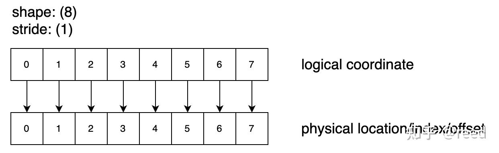
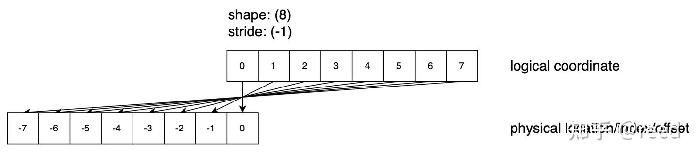
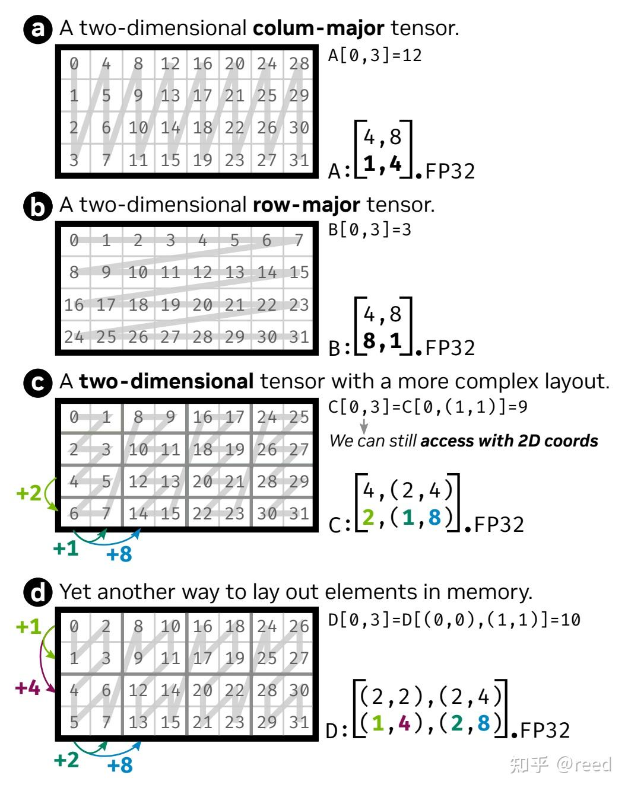
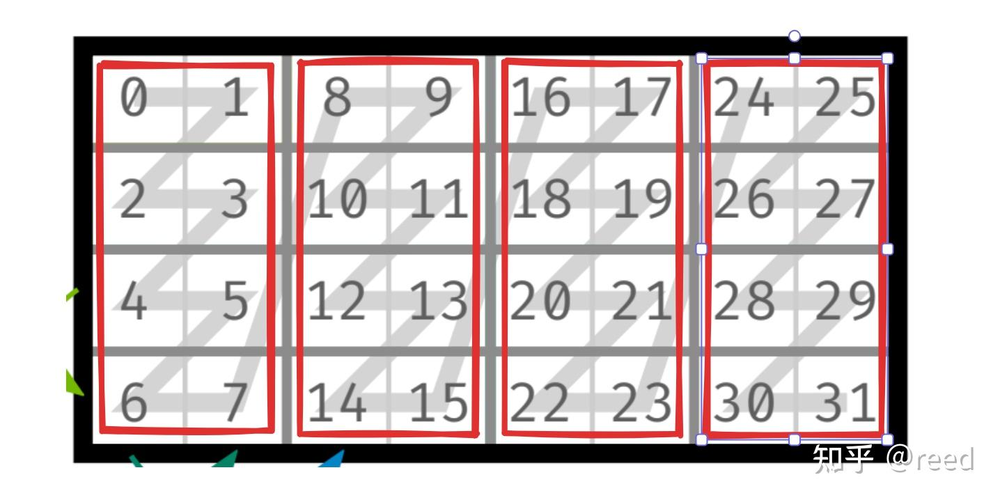
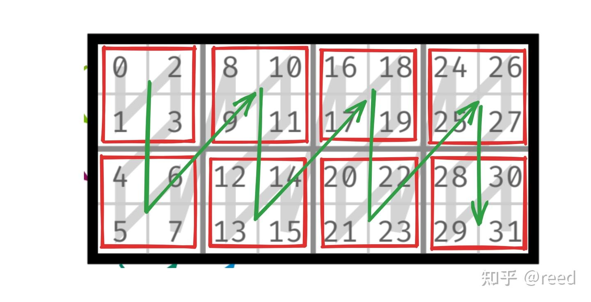

# cute 之 Layout

**Author:** [reed](https://www.zhihu.com/people/reed)

**Link:** [https://zhuanlan.zhihu.com/p/661182311](https://zhuanlan.zhihu.com/p/661182311)

---

计算机中的内存是一维的线性地址空间，而数学计算问题所要处理的空间经常是高维的。如 GEMM（General Matrix Multiplication）问题的数学计算体系是二维计算空间，Deep Learning 计算体系是三维以上的计算空间（batch, height, width, channel 等）。如何高效地表达高维计算空间，如何高效便捷地将计算所要求的高维空间映射到一维空间，变得越来越重要。

历史上对该问题的探究可以分为三个阶段：

- 第一阶段 BLAS 的 row/col-major + leading dimension 描述阶段; 
- 第二阶段 Tensor 的 shape + stride 阶段; 
- 第三阶段为 Hierarchical Tensor 阶段。

二十世纪七八十年代开发的 BLAS（Basic Linear Algebra Subprograms）库中描述矩阵时面对的问题多为二维问题，其通过引入行优先、列优先的概念来刻画一维存储结构和二维逻辑结构的映射关系。为了做某个维度的地址对齐、padding 等，引入了 leading dimension 的概念，其可以描述第二个维度上数据的连续性关系。二十一世纪初 Deep Learning 在模式识别等领域崭露头角，各种框架应运而生，在 Deep Learning 计算中为了提升计算密度，batch 化成了重要手段，这时高维数据的描述成为必须，相关人员在 BLAS 中 leading dimension 基础上进行了扩展，引入了 shape 和 stride 描述体系。shape-stride 描述体系可以很好地刻画一维存储结构和高维逻辑结构的映射关系，并且使得某些操作只需要改变 shape-stride 描述无需对数据实体进行移动，在 stride 的帮助下通过简单的 coordinate 和 stride 点积既可以完成逻辑地址和一维索引的映射。shape-stride 描述可以表达简单的高维数据，但是其对于具体的维度的轴必须是单调的，在数据的连续性方面要求比较严格。2023 年层级的 Tensor（Hierarchical Tensor）描述被提出，其在 shape-stride 描述的基础上添加了具体的轴的层级描述（Graphene Tensor IR）[[1]](https://dl.acm.org/doi/abs/10.1145/3582016.3582018)，使得数据在某个具体的轴上可以有更为丰富的表达。对于现代 GPU 计算体系而言，Tensor 的分块和复杂映射都可以通过该层级体系（描述 + 代数）来表达和推导，其构建了复杂逻辑空间和硬件排列映射的一条途径。

Tensor 的层次化描述体系在 Graphene Tensor IR 中进行了详细的描述; 在具体实现方面，NVIDIA 开源的 CUTLASS 模板库中也利用同样的思路进行 Tensor 描述和计算。为了更好的抽象和利用编译时优化，CUTLASS 利用 C++17 实现了 CuTe，它定义了层次化 Tensor 体系和其之上的代数计算，然后基于该 CuTe 描述体系实现了 Hopper、Blackwell 等架构之上的矩阵运算。Tensor 是数据的表达，其表达一个相对独立且有结构的数据体，而 Tensor 内的数据排布则由 Layout 来表达。本文将关注这种映射结构，即 Layout。本文在行文组织结构上：首先以示例的形式介绍一维向量的表示、二维矩阵的表示，然后介绍层次化的 Tensor 表示，再后介绍 CuTe 中常用的编译时和运行时形状描述，最后本文总结 Layout 的功能。

简单地讲，引入有层次的描述（Layout）代数来表达计算空间和一维地址空间的映射问题。Layout 是一个数据排列的描述体系，其可以实现将逻辑坐标映射到索引坐标（offset 表示）。Layout 包含 Shape 和 Stride 两部分。其中 Shape 描述排列的分块层次和结构。Stride 描述块内或块间的数据排列连续性。Shape 和 Stride 都是层级的嵌套表示。也就是说 Shape 可以包含整数和子 Shape。Shape 和 Stride 需要有相同的层次关系（也叫"congruent"，即结构一致）。

在介绍有层次的 Layout 之前，我们先回顾无层次的 Layout 描述，也就是 shape 和 stride 描述的高维 Tensor。

## 一维向量的表示

**Shape: (8), Stride: (1)** 表示该排列包含 8 个逻辑位置，在逻辑位置和物理（数据）做映射的时候每一个元素之间的差为 1，如图 1 所示其描述了 0-7 总计 8 个数字。


*Figure 1. shape = 8, stride = 1 的逻辑空间和物理空间映射关系*

**Shape: (8), Stride: (2)** 表示该排列包含 8 个逻辑位置，即还是0-7 总计 8 个数字，如图 2 所示。其对应物理位置映射时的公式为 index_physical = index_logical * stride。这时候我们发现逻辑空间和物理空间的大小是不一样的。在 CuTe 体系下，逻辑空间的大小称作 **size**（domain），而代表存储覆盖范围的物理空间大小称作 **cosize**（codomain）。对于这个例子：`size = 8`，最大 offset = (8-1) * 2 = 14，所以 `cosize = 14 + 1 = 15`。


*Figure 2. shape = 8, stride = 2 的逻辑空间和物理空间的映射关系*

**Shape: (8), Stride: (0)** 表示逻辑上我们需要的 8 个数据都来自于同一个存储位置 0，如图 3 所示，所有的元素都指向同一个物理位置。通过图示也可以看到该 Layout 的 cosize 为 1（最大 offset = 0，cosize = 0 + 1 = 1）。这种 stride=0 的场景在 broadcast 语义中很常见。


*Figure 3. shape = 8, stride = 0 的逻辑空间和物理空间的映射关系*

**Shape: (8), Stride: (-1)** 通过 Stride 设置为 -1 可以实现反向访问数据，这种情况较少使用。CuTe 在计算 cosize 时会对 stride 取绝对值，所以负 stride 的 cosize 计算方式和正 stride 一样。


*Figure 4. shape = 8, stride = -1 的逻辑空间和物理空间的映射关系*

以上一维空间的示例，呈现了 Tensor 在其 shape 不变的情况下，通过 stride 的改变可以描述 Tensor 中的各个元素在物理空间中的位置。我们在使用 Tensor 时候，关注的是其逻辑的大小，而通过 stride 则将这个逻辑空间和实际存储的物理空间进行了关联。并且在计算层面，我们可以看到其始终满足 offset = coord * stride。

## 二维矩阵的表示

**Shape: (3, 4), Stride: (4, 1)**，和一维向量比较类似，此次的二维空间指的是 Tensor 的逻辑空间，其存储结构依然是一维的。二维空间的行优先描述可以表达为 `shape(3, 4), stride(4, 1)`，如图 5 所示。shape 中的 3、4 分别表示矩阵的行数和列数，stride 中的 4 表示沿行方向增加 1 步时物理地址增加 4，1 表示沿列方向增加 1 步时物理地址增加 1。


*Figure 5. shape = (3, 4) stride = (4, 1) 的逻辑空间和物理空间的映射关系*

**Shape: (3, 4), Stride: (1, 3)**，Shape 不变，而 stride 由 (4, 1) 变为 (1, 3) 则存储结构变为列优先（column-major），即同一列内的相邻元素在物理存储中是连续的。因为行方向（第一个维度）的 stride 为 1，也就是同一列内的相邻元素在内存中是连续的。


*Figure 6. shape = (3,4) stride = (1, 3) 的逻辑空间和物理空间的映射关系*

二维矩阵的描述和一维类似，shape 表示其逻辑形状，stride 表示具体的某个元素和物理空间的映射时的间隔量。逻辑空间到物理空间的映射通过点积来完成。从二维空间我们可以很容易地扩展到高维空间，如深度学习常用的 (N, H, W, C)，其映射关系依然利用点积公式：$offset = coordinate \cdot stride = \sum_{i}{coordinate_{i} \cdot stride_{i}}$

## 有层次的 Layout（Hierarchical Layout）

以上介绍的一维向量和二维矩阵描述被深度学习框架所广泛采用，在 PyTorch 中我们可以访问 tensor 的 `.shape` 属性和 `.stride()` 方法来获取对应的信息。我们不难发现，上面的 shape 和 stride 描述限制了 Tensor 的每一个轴只能有一个 stride 值，也就是说，整个 Tensor 在某一个维度上的连续性关系是不能变的，更形象地描述则为：Tensor 不可以分块。我们将这样轴的连续性不可变更、体现为 Tensor 不可以分块的描述称为平坦 Tensor 描述。而当我们处理复杂的 Tensor 计算问题时，尤其是如 NVIDIA 硬件引入的指令级计算（MMA、TMA 等）时，这种表示是不充分的。由此则引入了有层次的 Tensor 描述，即 Hierarchical Layout。

简单地理解，有层次的 Tensor（或者 Layout）就是以原有的平坦 Tensor 所描述的小块（tile）作为基础单元，将其组成 Tensor。这样原有的小块是 Tensor，小块作为单元的外部组织也是 Tensor，实现了 Tensor 套 Tensor。其坐标到实际物理位置的映射关系则就是其 Layout，Tensor 有了层次，Layout 也就有了层次。

下图 以一个 `shape: (4, 8), stride: (1, 4)` 的行主序矩阵为基础，展示了不同层次化分块方式下的 Layout：


*Figure 7. 有层次的逻辑空间和其 offset 计算（引用自 ASPLOS'23 Graphene IR）*

如图 7-a/b，它们表示了传统的列优先和行优先的 Layout，可以认为它们是平坦的（depth=1）; 而图 7-c/d 用之前的 shape 和 stride 描述没有办法表示如此复杂的情况（在某个轴上存在不单调的排列）。

### 图 7-c 的层次分解

我们可以将图 7-c 看作两个层级的 Tensor，如图 8 所示。分解思路是"先看 tile 内部，再看 tile 之间"：


*Figure 8. 图 7-c Tensor 的层次分解*

**第一步：识别内层 tile（红框）。** 每个红框是一个 4 行 2 列的小矩阵，内部排列是列优先的：行方向 stride 为 2（如 0→2→4→6），列方向 stride 为 1（如 0→1）。所以内层 tile 的 Layout 为 `shape: (4, 2), stride: (2, 1)`。

**第二步：识别外层排列。** 把每个红框看作一个元素，观察红框之间的排列。这些红框只在列方向上排列了 4 个（行方向只有 1 组），即外层 Tensor 的 Layout 可以表示为 `shape: (1, 4), stride: (4, 1)`。

**第三步：合并层次。** 两层 Tensor 合并后，shape 可以表示为 `((内层 Tensor 行数, 外层 Tensor 行数), (内层 Tensor 列数, 外层 Tensor 列数))`，即 `((4, 1), (2, 4))`。这里外层 Tensor 行数只有 1，所以可以直接简写为 **(4, (2, 4))**——行方向上 shape 为 4（来自内层 tile 的行数），列方向上 shape 为 (2, 4)（2 是内层 tile 的列数，4 是外层有 4 个 tile）。弄清 shape 中各个元素的含义后，stride 的形式要与 shape 保持一致（congruent），即 stride 要满足 `(x, (y, z))` 的形式。根据 x 位置对应的含义，表示内层（红框内矩阵）行方向的间隔，则有 x = 2; y 为内层红框内列方向的间隔，有 y = 1; z 表示红框和红框之间横向的间隔，即 z = 8 - 0 = 8。这样我们得到有层次的 Tensor 的 shape 和 stride 描述：**shape: (4, (2, 4)), stride: (2, (1, 8))**。

### 图 7-d 的层次分解

图 7-d 的层次分解思路类似，如图 9 所示：


*Figure 9. 图 7-d Tensor 的层次分解*

内层的 Tensor 为红框所标注，`shape: (2, 2), stride: (1, 2)`; 外层的 Tensor 为绿线所标注，`shape: (2, 4), stride: (1, 2)`; 合并后的层次化表示 `shape: ((2, 2), (2, 4))`，其中的数字 2，2，2，4 分别表示内层 Tensor 行数，外层 Tensor 行数，内层 Tensor 列数，外层 Tensor 列数。同样的根据以上数据所表示的轴的信息，可以得到 `stride: ((1, 4), (2, 8))`。最终的 Layout 为 **shape: ((2, 2), (2, 4)), stride: ((1, 4), (2, 8))**。

shape 和 stride 给出了 Tensor 的逻辑空间描述和映射到物理空间时的间隔描述，当根据逻辑空间的位置获得物理空间位置时，依然和传统的 Tensor 计算规则一样，采用 coordinate 和 stride 的递归点积即可，只不过坐标也采用层次化表达。

通过以上两个有层次 Tensor 的 shape 和 stride 的分解和组合，我们可以完成有层次的 Tensor 的组合，其突破了传统的 Tensor 轴只能有一个 stride 的限制，可以表达更丰富的 Tensor（有层次的 Tensor）。

以上介绍了有层级的 Layout 描述，具体在 CuTe 实现时，其提供了 `make_shape` 和 `make_stride` 接口，并且 `make_shape` 的参数可以接受 `make_shape` 的结果，以此来完成有层次的 shape 和 stride 构建。为了提升效率，shape 和 stride 可以区分为常量 shape 和变量 shape。

## 常量 Shape（编译时 Shape）

常量 Shape，即编译时 Shape，可以通过在编译时完成坐标的映射或者推导，而减少运行时的计算量。对于需要编译时确定的量，需要用编译时常量来实现，如矩阵分块的大小其依赖了寄存器空间申请则必须使用这种类型 shape。其书写形式为 `Int<K>{}`，其中 `Int` 表示编译时常量类型模板，`K` 表示具体的数值，`{}` 表示以前面的类型来构造一个对象（常量对象）。也可以使用 CuTe 预定义的常量 `_1{}`、`_2{}`、`_3{}` 等作为简写。实例如下：

```cpp
auto shape = make_shape(Int<2>{}, Int<3>{});
auto shape1 = make_shape(shape, Int<3>{});

// 也可以用预定义常量
auto shape2 = make_shape(_2{}, _3{});
```

## 变量 Shape（运行时 Shape）

有些维度信息是运行时决定的，如矩阵的 M、N、K 维度等，而且不需要编译时决策，则采用运行时计算模式。值得注意的是示例代码中的 2、3 虽然是字面常数，但是在 CuTe 的约定里，不带 `Int<>{}` 包装的整数被视为运行时变量。

```cpp
auto shape = make_shape(2, 3);     // 运行时变量
auto shape = make_shape(m, n);     // 运行时变量
```

编译时和运行时 shape 可以混合使用，CuTe 会尽可能在编译时完成常量部分的计算：

```cpp
auto shape = make_shape(Int<128>{}, n);  // 第一个维度编译时确定，第二个运行时确定
```

## 代码验证

CuTe 提供了 `print_layout` 工具函数，可以直观地打印 Layout 的映射关系。下面是一段可以编译运行的验证代码：

```cpp
#include <cute/layout.hpp>
#include <cute/util/print.hpp>

using namespace cute;

int main() {
    // 一维 Layout
    auto layout1 = make_layout(Int<8>{}, Int<2>{});
    print("Layout(8, 2): "); print(layout1); print("\n");
    printf("  size = %d, cosize = %d\n", int(size(layout1)), int(cosize(layout1)));

    // 二维列优先 Layout
    auto layout2 = make_layout(make_shape(3, 4), make_stride(1, 3));
    print("Layout((3,4), (1,3)): "); print(layout2); print("\n");
    print_layout(layout2);

    // 层次化 Layout（图 7-c）
    auto layout3 = make_layout(
        make_shape (Int<4>{}, make_shape(Int<2>{}, Int<4>{})),
        make_stride(Int<2>{}, make_stride(Int<1>{}, Int<8>{}))
    );
    print("Layout((4,(2,4)), (2,(1,8))): "); print(layout3); print("\n");
    print_layout(layout3);

    return 0;
}
```

> 编译方式：`nvcc -std=c++17 -I /path/to/cutlass/include test.cu -o test`

## 总结

Layout 的本质是函数，其可以实现由一种坐标系统变换到一个表示偏移量的标量，参数为 Tensor 的逻辑 shape 和 stride，即

$$
offset = Layout^{shape}_{stride}(coordinate)

$$

在 CuTe 代码中，Layout 就是通过函数调用语法 `layout(coord)` 来完成这个映射的。

Layout 是 CuTe 的基石。在此基础上，CuTe 还定义了一套 Layout 代数，包括 composition（复合）、complement（补）、logical_divide（逻辑切分）、logical_product（逻辑乘积）等操作，它们是理解 CuTe 如何做 tile 分块、线程映射、数据搬运的前提。这些内容将在下一篇 Layout Algebra 中介绍。

## 参考

1. [Graphene Tensor IR - ASPLOS'23](https://dl.acm.org/doi/abs/10.1145/3582016.3582018)
2. [CUTLASS CuTe 文档](https://github.com/NVIDIA/cutlass/tree/main/media/docs/cpp/cute)
3. [CuTe Layout Algebra Notebook](https://github.com/NVIDIA/cutlass/blob/main/examples/python/CuTeDSL/notebooks/cute_layout_algebra.ipynb)
