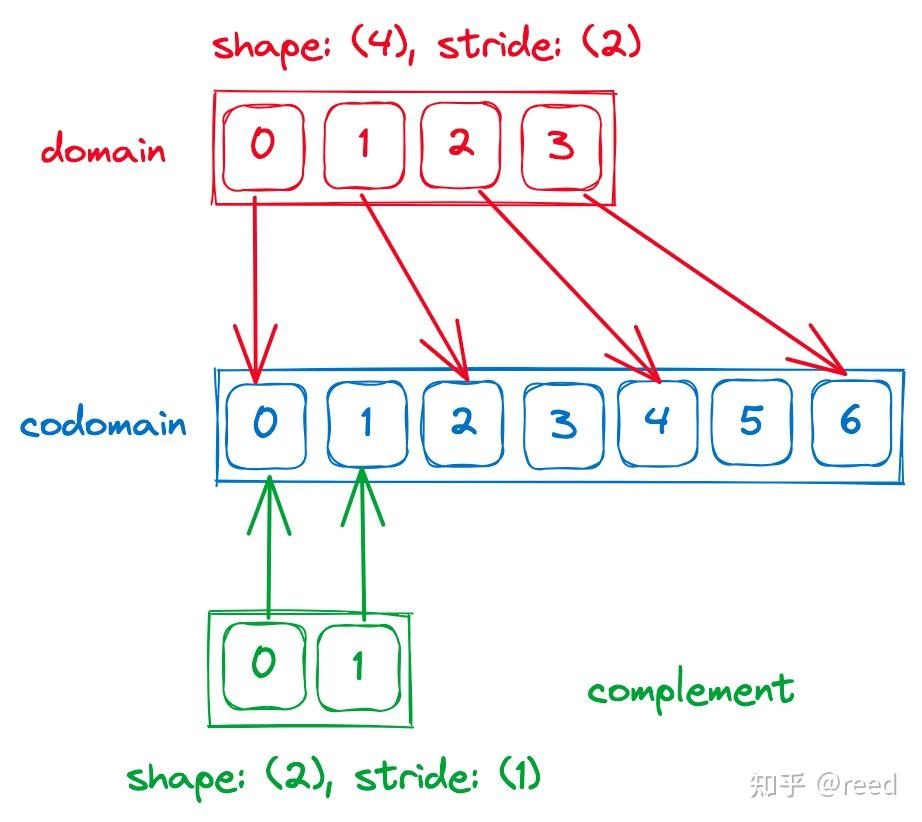
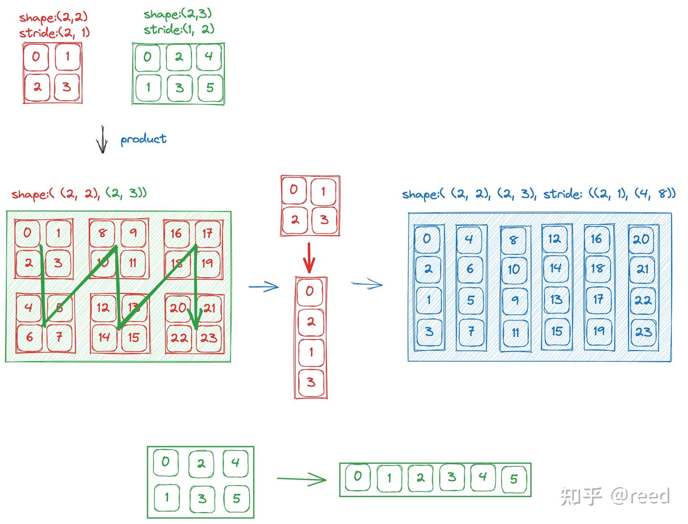
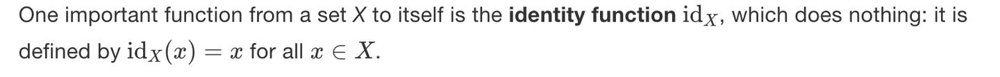
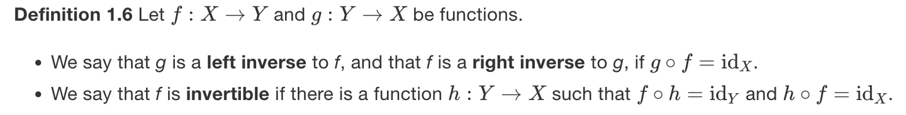

# CuTe Layout 的代数和几何解释

**Author:** [reed](https://www.zhihu.com/people/reed)

**Link:** [https://zhuanlan.zhihu.com/p/662089556](https://zhuanlan.zhihu.com/p/662089556)

---

前面文章"[CuTe 之 Layout](https://zhuanlan.zhihu.com/p/661182311)"通过回顾shape和stride描述体系介绍了有层次的Layout的基础概念。本文将围绕Layout进行更全面的介绍，包含：Layout的基本属性和Layout的运算。这些运算是定义在以shape和stride为参数之上的代数运算，同时为了更直观和形象的展示这些操作，本文会通过几何的形式呈现这些运算。几何是设计和思考模型，代数是实现和计算形式。

## 基本属性

Layout的本质是函数，其数学描述可以参考


如图1，展示了一个有层次的Layout，可以看到它的组成分为两个层级，其中小的Tensor采用同样的颜色表示，图中的左上角0到5展示了一个内层的Tensor，然后沿着纵向和横向重复该Tensor，其中行方向重复4次，列方向重复5次。得到的Hierarchical Tensor的shape: ((2, 4), (3, 5))，同样我们可以得到其stride: ((3, 6), (1, 24))。


*Figure 1. shape为((2, 4), (3, 5)), stride为((3, 6), (1, 24))的Layout示意图*

针对图1的Layout，其有如下基本属性，列举为如下表格


| shape         | stride         | size | rank | depth | coshape | cosize |
| --------------- | ---------------- | ------ | ------ | ------- | --------- | -------- |
| ((2,4),(3,5)) | ((3,6),(1,24)) | 120  | 2    | 2     | 120     | 120    |

- shape，stride表示Layout的逻辑形状和每一个维度上在地址空间上步长。
- size 表示该逻辑空间的大小，其数值上等于 shape 维度的积，即 $\text{size} = \prod_{i=0}^{n_{\text{shape}}-1} \text{shape}_i$。size 对应的概念是 **domain**（定义域），即 Layout 函数的输入空间，包含所有合法的逻辑坐标。
- rank 表示该 Layout 有几个独立的维度（mode），即"这个 Tensor 是几维的"。如 shape:(2) → rank=1，shape:(2，4) → rank=2，shape:((2, 4), (3, 5)) → rank=2（还是二维），shape:(M, N, K) → rank=3（三维）。
- depth表示嵌套的深度，常规的非嵌套Tensor的 depth 为 1，此处图示的Tensor的 depth 为2。
- coshape，cosize表示 **codomain**（值域/陪域）的空间大小和占用的空间大小。codomain 是 Layout 函数的输出空间，即物理地址（offset）的范围。此处 cosize 为120。如果 stride 存在不紧凑的情形（如 `Shape: (8), Stride: (2)` 时物理地址有空洞），则 cosize 会大于 domain 的 size。简单地说：domain/size 描述"有多少个逻辑位置"，codomain/cosize 描述"物理存储覆盖了多大的范围"。

## 坐标（coordinate）

Layout是有层次的，访问这种有层次的Layout所需的坐标自然也是有层次的。对于只有一层的Tensor的访问，可以通过指定行坐标和列坐标来实现，如 `auto coord1 = make_coord(0, 1);`，其表示构建一个一层的坐标，其中行坐标为0，列坐标为1。如需构建有层次的坐标，则可以通对make_coord进行嵌套。例如如下格式

```cpp
auto row_coord = make_coord(1, 3);
auto col_coord = make_coord(2, 4);
auto coord = make_coord(row_coord, col_coord);
```

其实现了对Layout(实际为Tensor)的有层次访问，其中的row_coord中的1，3分别表示在内层和外层Tensor的行方向的坐标，col_coord中的2，4表示在内层和外层Tensor的列方向的坐标，该坐标可以简记为 `coord: ((1, 3), (2, 4))`。如图2，其表示了对该坐标的访问。


*Figure 2. coord: ((1, 3), (2, 4))所表示的位置和访问层次*

> **补充：坐标的一维化表示。** 对于 shape(M, N) 的 Layout，坐标既可以用二维形式 (i, j) 表示，也可以用一维形式 i + j\*M 表示（CuTe 默认按列优先/colexicographic order 展开，即先遍历 mode-0 再遍历 mode-1）。注意这个一维坐标**不等于 offset**——offset 是根据坐标和 stride 点积计算出的内存偏移地址，而坐标的一维化只涉及 shape，不涉及 stride。例如 shape(3, 4) 的坐标 (1, 2) 一维化为 1 + 2\*3 = 7，但 offset = 1\*stride\_0 + 2\*stride\_1，取决于具体的 stride 值。只有当 Layout 也是列优先存储（如 `(M,N):(1,M)`）时，一维 coord 才恰好等于 offset。

## 切片（slice）

通过坐标可以访问到某一个具体坐标上的数值，很多时候我们除了需要访问单个位置，还需要Tensor的切片操作（slice）。CuTe提供了用于对某个维度全选的Underscore类型和对应的变量 `_`，该变量类似于python或fortran语言中的冒号(`:`)，可以用来表示某个维度的全部选定。

具体地，我们可以slice一列数据，或者一行数据，或者其中的某一层Tensor。调用形式如代码片段所示，图3展示了不同的slice的效果。

```cpp
auto layout_out = slice(coord, layout_in);
```


*Figure 3. Layout的切片运算示意图*

## 补集（complement）

Layout的本质是函数，函数的本质是集合，Layout定义了从domain到codomain的投影，当codomain存在不连续时，则存在空洞的位置。这时候我们可以构造一个Layout2能够填充上codomain的空洞位置，此时我们构造的Layout则为原Layout的补集，同时为了表示的简洁性，补集会被压缩为最小表示，周期性重复的部分会被约掉。

如图4所示，对于`shape: (4), stride: (2)`，补集是 `shape: (2), stride: (1)`，它描述的映射是coord 0 -> 0, coord 1 -> 1，这看起来只有 2 个位置，根本没覆盖 {1, 3, 5} 三个空洞。你可能在想以"`shape: (3), stride: (2)` 映射到 {0, 2, 4}"这样的形式来描述空洞，但CuTe 的 complement 不采用"偏移+stride"的方式，而是用"周期模板"的方式。观察原始 Layout 在 codomain 上的占用模式，是以 2 为周期重复：`占 空 | 占 空 | 占 空 | 占`。在一个周期（长度 2）内，位置 0 被原始 Layout 占用，位置 1 是空洞，补集 `shape: (2), stride: (1)` 描述的就是**这一个周期的完整结构**。CuTe 把补集看作一个"模板"，配合原始 Layout 使用时，这个模板会在每个周期上重复，自然地覆盖所有空洞。

complement 的 shape=(2), stride=(1) 不是直接描述空洞位置列表。它描述的是一个 2 元素的小 Layout，当与原始 Layout 做 product（乘法）时，两者组合起来恰好完整铺满 codomain。当做 blocked_product 或 logical_product 时，complement 的每个元素会和原始 Layout 的每个元素配对，从而覆盖完整的 {0, 1, 2, 3, 4, 5, 6, 7} 空间。这就是为什么 complement 和后面的乘法（product）运算是配合使用的，单看 complement 的映射 {0, 1} 似乎"不对"，但它是被设计为与原始 Layout 组合使用的。


*Figure 4. Layout的补集*

> **补充：complement 的严格定义（参考 CUTLASS 官方文档）。** Layout `A` 相对于目标大小 `M` 的补集 `R` = `complement(A, M)` 满足三个性质：(1) `R` 的 size/cosize 以 `M` 为上界; (2) `R` 有序（stride 为正且递增），因此 `R` 是唯一的; (3) **A 与 R 的值域不相交**，R 试图"补全"A 的值域。
>
> **关于图4的说明**：图中绿色补集 `(2,1)` 的箭头指向了 codomain 的位置 0 和 1，但位置 0 已被原始 Layout 占用，看起来违反了"值域不相交"的性质。实际上图4展示的补集 `(2):(1)` 是不指定 cotarget 时的最小周期模板（默认 `cotarget=1`），它描述的是 stride 间隔内的结构模式，不应直接解读为具体的 codomain 占用位置。补集需要和原始 Layout 通过 product 组合使用时，才会产生真正不相交的映射。
>
> 以图4的 `shape: (4), stride: (2)` 为例，指定不同的 cotarget 会得到不同的补集：
>
> - `complement(4:2, 8)` = `(2,1):(1,8)` → coalesce 后为 `2:1`，即图中的结果
> - `complement(4:2, 24)` = `(2,3):(1,8)`，其中 `2:1` 填充每个周期内的空洞，`3:8` 将整体重复 3 次
>
> 补集设计为与 product（乘法）运算配合使用：`make_layout(A, complement(A, M))` 可以完整覆盖 `[0, M)` 的 codomain。这也是为什么除法（divide）和乘积（product）的实现中都调用了 complement。
>
> 更多示例见 CUTLASS 官方文档 `02_layout_algebra.md` 的"补的例子"章节。

## 乘法（product）

实数域乘法的语义是将某个量重复若干次，Layout 乘法遵循同样的语义：把一个 Layout（tile）按另一个 Layout 的排列方式重复多次。CuTe 定义了 5 种 product：logical_product、blocked_product、raked_product、zipped_product、tiled_product。它们的底层映射逻辑相同，区别仅在于结果 shape 中各维度的分组方式和排列顺序。

假设 Layout A 的 shape 为 `(x, y)`，Layout B 的 shape 为 `(z, w)`，乘积结果包含 x, y, z, w 四个维度（共 `x*y*z*w` 个元素）。五种 product 对这四个维度的分组约定如下：


| 乘法模式 | 乘积的 shape     | 分组逻辑                                          |
| ---------- | ------------------ | --------------------------------------------------- |
| logical  | ((x, y), (z, w)) | A、B 各自保持原样，作为两个独立 mode              |
| zipped   | ((x, y), (z, w)) | 同 logical（一维场景相同，多维场景 zip 同类模式） |
| tiled    | ((x, y), z, w)   | A 保持为一个 mode，B 的各维度打散为独立 mode      |
| blocked  | ((x, z), (y, w)) | A、B 的同位维度配对，A 在内 B 在外（块分布）      |
| raked    | ((z, x), (w, y)) | A、B 的同位维度配对，B 在内 A 在外（循环分布）    |

blocked 和 raked 是**秩敏感**的——它们把 A 和 B "同一方向"的维度重新组合到同一个 mode 里。两者的区别在于谁在内层：blocked 让 tile 内部维度（A）在内、tile 间维度（B）在外，产生连续的块分布; raked 则相反，B 在内、A 在外，产生交错的循环分布。

如图5所示，以 `logical_product` 为例：Layout A（红色，shape `(2,2)`, stride `(2,1)`）和 Layout B（绿色，shape `(2,3)`, stride `(1,2)`）做乘积后，得到 shape `((2,2), (2,3))`，stride `((2,1), (4,8))` 的结果。整个过程可以分三步理解：

1. **复制**：将 A 按 B 的 6 个位置（`size(B)=6`）复制 6 份，B 中每个位置被一份 A 的副本替代，形成左下角的 4x6 矩阵（shape `(2,2), (2,3))`，即 4 行 6 列）。
2. **内层展开**：每份 A 的副本（2x2 矩阵）按列优先展开为一维序列（如图中间红色箭头所示：0→2→1→3），这决定了结果矩阵中每一列内部的元素顺序。
3. **外层展开**：B 的 2x3 矩阵按列优先展开为一维序列 0→1→2→3→4→5（如图底部绿色部分所示），这决定了结果矩阵各列的排列顺序——第 0 列对应 B 的位置 0 的 A 副本，第 1 列对应位置 1 的副本，以此类推。

最终右侧的结果矩阵中：mode-0（行方向，4 个元素）对应 A 的内部结构，mode-1（列方向，6 列）对应 B 的重复排列。


*Figure 5. logical_product 的几何解释*

> **补充：product 中 complement 的作用。** 乘法的实现中会先用 complement 将 Layout A 补充为"紧密 Layout"（覆盖连续的 codomain），再用 Layout B 从中取数。可以想象先把 A 扩展到一个无限大的紧密 Layout，然后 B 的值域决定了实际需要取到多远——最多取到 B 的 cosize 对应的位置就够了。所以这个"紧密 Layout"是有边界的（`complement(A, size(A)*cosize(B))`），但在直觉上可以认为 A 被补充到了无限大，不影响对乘法语义的理解。`logical_product` 的源码实现为：`make_layout(layout, composition(complement(layout, size(layout)*cosize(tiler)), tiler))`。

## 除法（divide）

除法是乘法的逆运算，实数域上的除法表示被除数能被除数分多少份，如 $10 \div 5 = 2$。Layout 除法也做类似的事，但结果不是一个数，而是一种**划分结构**，同时保留了"每份长什么样"和"一共分了几份"。用实数域的类比来写就是 $10 \div 5 = (5, 2)$，其中 5 是每块的大小，2 是块的数量。

`logical_divide(A, B)` 表示将 Layout A 拆成两个 mode：mode-0 是 B 指向的元素（即一个 tile），mode-1 是 B 未指向的元素（即 tile 的排列方式/剩余部分）。

如图6所示，以 Layout A（`shape (4,6), stride (6,1)`）除以 Layout B（`shape (2,2), stride (2,1)`）为例，过程如下：

1. **一维化**：将 A 按列优先展开为 24 个元素的一维序列：`0, 6, 12, 18, 1, 7, 13, 19, ...`，B 按列优先展开为一维序列，其映射为 `0→0, 1→2, 2→1, 3→3`。
2. **tile 内取值并重复**：B 的 4 个位置按照 B 自身的映射顺序，从 A 的一维序列中取出对应的元素。例如 A 中以位置 0 起始的一组 `(0, 6, 12, 18)`，按 B 的映射顺序 `(0, 2, 1, 3)` 重排后得到 `(0, 12, 6, 18)`，这就是第一个 tile 的内容。之后对 A 中每一组连续的 4 个位置做同样的操作，得到 6 个 tile。每个 tile 内有 4 个元素（`size(B)=4`），一共 6 个 tile（`size(A)/size(B)=24/4=6`）。
3. **组装结果**：将每个 tile 排成一列、各 tile 排成多列，得到右侧的结果矩阵`shape((2,2), 6)，stride((12,6), 1)`。其中 mode-0 的 shape `(2,2)`对应 tile 内部结构（每个 tile 长什么样），mode-1 的 shape`6` 对应 tile 的数量和排列。
   mode-0 的 shape 是 `(2,2)` 而非展平后的 `4`, 这是因为 `logical_divide` 保留了 tiler B 的层次结构（B 本身就是 shape `(2,2)` 的 Layout）。


*Figure 6. logical_divide 的几何解释*

CuTe 提供了三种除法函数：logical_divide、zipped_divide、tiled_divide。它们的分块逻辑一致，区别在于结果 mode 的组织方式：

```text
Layout Shape : (M, N, L, ...)
Tiler Shape  : <TileM, TileN>

logical_divide : ((TileM, RestM), (TileN, RestN), L, ...)
zipped_divide  : ((TileM, TileN), (RestM, RestN, L, ...))
tiled_divide   : ((TileM, TileN), RestM, RestN, L, ...)
```

`zipped_divide` 把所有 tile 维度 zip 到 mode-0、所有 rest 维度 zip 到 mode-1，这样 `zd(_, i)` 可以方便地取出第 i 个 tile。`tiled_divide` 类似，但把 rest 维度打散为独立 mode 而不是合并到一起。

## 复合函数和逆（composition & inverse）

Layout 的本质是函数（从坐标到 offset 的映射），因此可以定义函数复合和逆运算。

复合的定义（图中 Definition 1.5）：设 $f: X \to Y$，$g: Y \to Z$，则 $g \circ f: X \to Z$ 满足 $(g \circ f)(x) = g(f(x))$。对应到 CuTe 中的代码表示`composition(A, B)`，就是 $A \circ B$。复合函数是 CuTe 中几乎所有高层运算的基础，乘法、除法的实现都依赖它。


逆的前提是**单位函数**（identity function），其公式表示为 $\text{id}_X(x) = x$，即输入什么输出就是什么。对应到 Layout，就是 `N:1`（如 `6:1`），每个坐标直接映射到相同数值的 offset。定义逆需要它作为参照，"两个函数复合后等于单位函数"意味着两个操作互相抵消。



有了复合和单位函数的定义，可以定义左逆和右逆（图中 Definition 1.6）：



- **左逆**：$g$ 是 $f$ 的左逆，当 $g \circ f = \text{id}_X$，即 $g(f(x)) = x$。直觉上，$g$ 能从 $f$ 的输出"还原"回输入。
- **右逆**：$f$ 是 $g$ 的右逆，当 $g \circ f = \text{id}_X$。等价地说，$f$ 的右逆 $f^{-R}$ 满足 $f(f^{-R}(y)) = y$，即先走逆映射再走正映射，回到原值。

接下来对 right_inverse 进行几何解释，Layout 是坐标→value 的映射（此处 value 即 CuTe 官方文档中的 index，与数据指针结合时对应内存偏移量）。有时我们需要反过来，即已知一个 value（偏移量），想知道它对应哪个坐标，这就是**右逆**的用途：构造一个 value→coord 的反向映射。

如图7所示，以 Layout `(2,3):(3,1)` 为例，CuTe 将二维坐标按列优先展开为一维 coord（先遍历 mode-0/行维度），得到正向映射为 `coord → value: 0→0, 1→3, 2→1, 3→4, 4→2, 5→5`，这对应了图中右上部分使用 two-line notation 的形式将 coord（绿色）和 value（蓝色）上下排列。

右逆 $R$ 需要满足 $L(R(v)) = v$：$R$ 接收 value 作为输入、返回对应的 coord，再通过原 Layout 从 coord 算回 value，结果要等于输入，即两步操作互相抵消。

**计算方法**：把正向映射按 value 从小到大排序，目的是让 value 变成 `0,1,2,3,4,5`（identity函数），因为原本的蓝色矩阵就是`0,1,2,3,4,5`，排序后的映射如图右下橙色块 two-line notation所示（上行 coord、下行 value）。橙色上行 `0,2,4,1,3,5` 就是右逆 $R$，即 $R(0)=0, R(1)=2, R(2)=4$。

**还原为 shape+stride**：将映射序列 `{0,2,4,1,3,5}` 转换为 Layout 的 shape+stride 形式，就是寻找序列中的步长规律。前 3 个值 `0,2,4` 每次 +2，后 3 个值 `1,3,5` 也每次 +2，而从第一组起点 0 到第二组起点 1 的间距是 +1。所以可以把这 6 个值排成一个 3×2 的矩阵（列优先）：

```
0  1
2  3
4  5
```

沿第一个维度（3 个元素）步长为 2，沿第二个维度（2 个元素）步长为 1，得到 shape `(3,2)`、stride `(2,1)`。验证：一维坐标 $c$ 按列优先展开为 $(c \bmod 3, c / 3)$，代入公式 $R(c) = (c \bmod 3) \times 2 + (c / 3) \times 1$，$R(0)=0, R(1)=2, R(2)=4, R(3)=1, R(4)=3, R(5)=5$，与橙色序列完全一致。

代入原 Layout 验证右逆性质 $L(R(v))=v$：$R(0)=0 \to L(0)=0$，$R(1)=2 \to L(2)=1$，$R(2)=4 \to L(4)=2$，确实得到 identity。

注意原始 Layout `(2,3):(3,1)` 和右逆 `(3,2):(2,1)` 并不等价——它们产生不同的映射（如 $L(1)=3$ 但 $R(1)=2$）。原始 Layout 是 coord→value 的正向映射，右逆是 value→coord 的反向映射，两者互为逆关系。shape 的两个维度发生了交换（`(2,3)` → `(3,2)`），stride 也相应改变，这正是"反向走"时维度顺序和步长都会变化的体现。


*Figure 7. right_inverse 的几何解释*

> **补充：逆的实际用途。** 右逆在 CuTe 中用于确定两个 Layout 之间的公共连续元素，是**自动向量化拷贝**（AutoVectorization）的基础。例如，要判断两个 Tensor 之间最多能同时拷贝多少个连续元素，CuTe 会计算 $A \circ B^{-R}$，结果中 stride-1 部分的 size 就是可以向量化的最大元素数。

## 总结

我们介绍了Layout的基本属性和常用代数方法，并通过几何图形的形式对Layout常用的运算进行了相应的解释，通过该文章，我们可以对Layout有基本的认识，并且能用Layout计算完简单的Layout变换。更详细的差异和结果可以直接通过CuTe进行实验来得到。

## 参考

[https://zhuanlan.zhihu.com/p/661182311](https://zhuanlan.zhihu.com/p/661182311)

[https://www.ucl.ac.uk/~ucahmto/0007_2021/1-2-functions.html](https://www.ucl.ac.uk/~ucahmto/0007_2021/1-2-functions.html)
