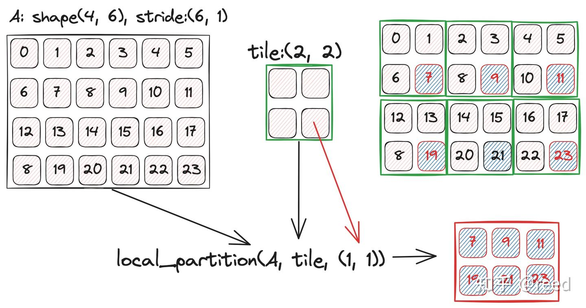

# CuTe 之 Tensor

**Author:** [reed](https://www.zhihu.com/people/reed)

**Link:** [https://zhuanlan.zhihu.com/p/663093816](https://zhuanlan.zhihu.com/p/663093816)

---

前面的章节介绍了[CuTe Layout](https://zhuanlan.zhihu.com/p/661182311)以及[Layout的代数和几何解释](https://zhuanlan.zhihu.com/p/662089556)。Layout 描述了数据的逻辑排列和索引规则，但它本身不持有数据。Tensor 在 Layout 的基础上关联了实际的数据存储，即 **Tensor = Layout + Storage**。Storage 有两种形式：一种是通过指针引用的堆上数据（如 global memory、shared memory 中的数据），另一种是栈上分配的数据（在 GPU kernel 中表现为寄存器）。CUTLASS 官方文档中将 Storage 部分称为 **Engine**，它是对迭代器或数据数组的封装（`ViewEngine` 对应指针引用，`ArrayEngine` 对应栈上数组），Tensor 的模板参数为 `Tensor<Engine, Layout>`。

CuTe 中的 Tensor 和深度学习框架（PyTorch、TensorFlow）中的 Tensor 有本质区别。深度学习框架中，Tensor 是数据实体，每次运算都会产生新的数据实体。CuTe 中，对 Tensor 的大部分操作（如 `local_tile`、`logical_divide`）只是对 Layout 的变换，改变的是数据的逻辑组织方式，底层数据本身并不移动或复制。只有显式调用 `copy` 时才会发生真正的数据搬运。换句话说，深度学习框架的 Tensor 侧重于"数据实体"，CuTe 的 Tensor 侧重于"数据描述"——通过 Layout 变换来表达对同一份数据的不同视角。

本文介绍了CuTe中Tensor的常用方法和语义，首先介绍CuTe中Tensor的常用函数，然后以一个向量求和的例子展示如何使用CuTe Tensor工具，最后对Tensor的特性和使用进行总结。

## Tensor的生成

Tensor 分为两类：**非持有型**（non-owning，类似指针，不管理数据生命周期）和**持有型**（owning，类似 `std::array`，数据存在栈上/寄存器中）。

```cpp
// 非持有型：通过指针 + Layout 创建，是对已有内存的视图
// pointer 可通过 make_gmem_ptr / make_smem_ptr 标记内存空间，Layout 可以是静态或动态的
Tensor make_tensor(Pointer pointer, Layout layout);

// 持有型：通过类型 T + 静态 Layout 创建，T 为元素类型（如 float、half），数据分配在栈上（寄存器）
// Layout 必须是编译时静态的（CuTe 不做动态内存分配）
Tensor make_tensor<T>(Layout layout);

// 持有型：创建一个与输入 Tensor 相同 type 和 shape 的栈上副本
Tensor make_tensor_like(Tensor tensor);
Tensor make_fragment_like(Tensor tensor);
```

|  | Static Layout | Dynamic Layout |
| --- | --- | --- |
| 非持有型（堆上视图） | `make_tensor(ptr, make_shape(Int<M>{}, Int<N>{}))` | `make_tensor(ptr, make_shape(M, N))` |
| 持有型（栈上数组） | `make_tensor<T>(make_shape(Int<M>{}, Int<N>{}))` | 不支持 |


## Tensor维度信息查询

全局`size`函数可以获取tensor的元素的个数。其重载了比较运算，可以直接和整数类型进行比较。同时Tensor也提供了面向对象的方式来获取各个属性信息，其成员函数和全局函数如下：

```cpp
// 成员函数
Tensor::layout();
Tensor::shape();
Tensor::stride();
Tensor::size();

// 全局函数, 可以获取完整信息，或者通过<>获取某一个维度
auto cute::layout<>(Tensor tensor);
auto cute::shape<>(Tensor tensor);
auto cute::stride<>(Tensor tensor);
auto cute::size<>(Tensor tensor);
auto cute::rank<>(Tensor tensor); // (1, (2, 3)) => rank 2
auto cute::depth<>(Tensor tensor);
```

## Tensor的访问operator()/operator[]

Tensor可以通过**括号运算符**来实现对数据的访问（可读+可写）, 坐标可以使用一维的，也可以使用有层次的表示形式，具体的如下：

```cpp
Tensor tensor = make_tensor(ptr, layout);
auto coord = make_coord(irow, icol);

tensor(0) = 1;
tensor(1, 2) = 100;
tensor(coord) = 200;
```

也可以通过`data`函数直接获取数据存储空间的地址

```text
Tensor::data();
```

## Tensor的Slice

可以通过`_`来筛选（slice）特定轴，和Layout的表达形式一致，具体的代码如下：

```cpp
Tensor tensor = make_tensor(ptr, make_shape(M, N, K)); // MxNxK
Tensor tensor1 = tensor(_, _, 3); // MxN, k=3
```

## Tensor的Take

`take<B, E>(tensor)` 从 Tensor 中提取第 B 到第 E-1 个模式（左闭右开区间 [B, E)），返回一个只包含这些模式的子 Tensor。

```cpp
Tensor tensor = make_tensor(ptr, make_shape(M, N, K)); // shape: (M, N, K)
Tensor tensor1 = take<0, 1>(tensor);                   // shape: (M), 只取 mode-0
Tensor tensor2 = take<0, 2>(tensor);                   // shape: (M, N), 取 mode-0 和 mode-1
Tensor tensor3 = take<1, 3>(tensor);                   // shape: (N, K), 取 mode-1 和 mode-2
```

## Tensor的flatten

将层次的layout展开为一层（不是将M，N，K 展开为 MNK）

```cpp
Tensor tensor = ...; // M, N, K
Tensor tensor1 = flatten(tensor); // M, N, K
```

## Tensor的层级合并coalesce

`coalesce` 将 Layout 中可以合并的相邻模式合并为更简单的形式。当两个相邻模式在 stride 上是连续的（即后一个模式的 stride 等于前一个模式的 size × stride，中间没有空隙），就可以合并为单个模式。如 (2,4):(1,2) 可以合并为 8:1。

```text
(2,4):(1,2), 列优先

| 0 | 2 | 4 | 6 |
| 1 | 3 | 5 | 7 |

coalesce → 8:1 :  0  1  2  3  4  5  6  7
```

```cpp
Tensor tensor = make_tensor(ptr, make_shape(M, N));
Tensor tensor1 = coalesce(tensor);
```

## Tensor的主轴层级化group_modes

`group_modes<B, E>(tensor)` 将第 B 到第 E-1 个模式（区间 [B, E)）合并为一个嵌套的子层级，其余模式保持不变。

```cpp
Tensor tensor = ...;                        // shape: (M, N, K, L)
Tensor tensor1 = group_modes<1, 3>(tensor); // shape: (M, (N, K), L)
```

mode-1 (N) 和 mode-2 (K) 被合并为一个子 mode `(N, K)`，原来的 4 个独立 mode 变成了 3 个（其中一个是嵌套的）。

## Tensor的划分logical_divide/tiled_divide/zipped_divide

divide是将tensor进行按照tile参数的大小进行划分，具体的可以参考前序文章"CuTe Layout代数和几何解释"中的除法的解释：

```cpp
Tensor tensor = ...;
Tensor tensor1 = logical_divide(tensor, tile);
Tensor tensor2 = zipped_divide(tensor, tile);
Tensor tensor3 = tiled_divide(tensor, tile);
```

## Layout的乘积logical/zipped/tiled/blocked/raked

Tensor上没有定义乘法，只有Layout上有乘法，其表达了**重复**的语义：

```cpp
Layout = ..;
Tile tile = ...;
Layout tensor1 = logical_product(layout, tile);
Layout tensor2 = zipped_product(layout, tile);
Layout tensor3 = tiled_product(layout, tile);
Layout tensor4 = blocked_product(layout, tile);
Layout tensor5 = raked_product(layout, tile);
```

## Tensor的局部化切块local_tile

这是 Tensor 的常用操作，每个线程块通常通过 `local_tile` 定位自己负责处理的数据区域。`local_tile(tensor, tile_shape, coord)` 先按 `tile_shape` 将 Tensor 沿各维度划分为若干块，再通过 `coord` 选取其中一块返回。

```cpp
Tensor tensor = make_tensor(ptr, make_shape(M, N, K));
// 按 2x3x4 分块, 取第 (1,2,3) 块
Tensor tensor1 = local_tile(tensor, make_shape(2, 3, 4), make_coord(1, 2, 3));
```

如图1所示，A Tensor 是一个 4×6 的矩阵，tile 大小为 2×2。`local_tile` 先将 A 划分为 2×3 个 tile（行方向 4/2=2 块，列方向 6/2=3 块），再根据 coord `(1,1)` 选取第 1 行第 1 列的 tile，得到右下角的 2×2 结果。


*Figure 1. local_tile 的几何解释*

## Tensor的局部数据提取local_partition

`local_partition(tensor, tile, coord)` 和 `local_tile` 类似，也是先按 `tile` 大小将 Tensor 划分为若干块。区别在于`local_tile` 返回某一整块 tile，而 `local_partition` 从每个 tile 中取出 coord 指定位置的元素，将这些元素组合成一个新的 Tensor。

这在多线程场景中很常用，tile 大小等于线程块的大小，coord 是当前线程在 tile 内的位置，`local_partition` 就能取出当前线程在所有 tile 中负责的元素。

```cpp
Tensor tensor = make_tensor(ptr, ...);
Tensor tensor1 = local_partition(tensor, tile, coord);
```

如图2所示，同样是 4×6 矩阵按 2×2 分块。tile 中 coord `(1,1)` 对应每个 tile 的右下角元素（红色标记），`local_partition` 从所有 6 个 tile 中各取出这个位置的元素，组合成右下角的 2×3 结果矩阵。


*Figure 2. local_partition 的几何解释*

## Tensor数据类型转换recast

Tensor表达了特定的数据类型的数据，可以对其进行数据类型的重新解释，然后形成新的tensor，类似于C++中的reinterpret_cast语义，代码形式如下：

```cpp
Tensor tensor = make_tensor<float>(make_shape(...));
Tensor tensor1 = recast<NewType>(tensor);
```

## Tensor内容的填充fill和清除clear

`clear()`, `fill()` 可以对tensor进行元素级别的清除和填充操作

```cpp
Tensor tensor = make_tensor(...);

clear(tensor); // 将所有元素置零, 等价于使用T{}元素类型的默认构造函数进行赋值，如 float{} 为 0.0f
fill(tensor, value); // 将所有元素填充为 value
```

## Tensor的线性组合axpby

`axpby(a, x, b, y)` 对两个同形状 Tensor 做逐元素线性组合，结果就地写入 `y`。常见用法：`axpby(1, x, 0, y)` 等价于 copy（将 x 复制到 y），`axpby(alpha, x, 1, y)` 等价于 y += alpha * x。

```cpp
Tensor x = make_tensor(...);
Tensor y = make_tensor_like(x);

// y[i] = a * x[i] + b * y[i], 对所有 i
axpby(a, x, b, y);
```

## Tensor的打印print

CuTe 提供两个打印函数，调试时配合使用。

- `print(tensor)` 打印 Tensor 的元信息：存储位置（指针地址或栈上标记）、shape、stride
- `print_tensor(tensor)` 在元信息基础上，额外打印每个元素的值，按 Layout 排列输出

```cpp
Tensor tensor = make_tensor(...);
print(tensor);       // 输出: ptr[0x...] o (M,N):(s0,s1)
print_tensor(tensor); // 输出: 元信息 + 所有元素值
```

## 坐标Tensor make_identity_tensor

`make_identity_tensor(shape)` 创建一个**坐标 Tensor**（identity tensor）：每个位置的"值"就是该位置自身的坐标。对 shape `(M,N)` 的 identity tensor，位置 `(i,j)` 存储的是坐标 `(i,j)`，而非普通数据。

坐标 Tensor 本身不持有实际数据，常见用途是**边界检查**（predication）：对坐标 Tensor 做与数据 Tensor 相同的分块和分区操作后，比较坐标是否越界，生成谓词 Tensor 来控制访存。

```cpp
Tensor cC = make_identity_tensor(shape(mC));        // 坐标 Tensor
Tensor P = transform(cC, [&](auto c) {
  return elem_less(c, shape(mC));                   // 坐标是否在有效范围内
});
```

## 使用 Tensor 实现 Vector Add 示例

下面用一个完整的例子把前面介绍的 Tensor 操作串起来，实现 half 类型的向量化的 z = ax + by + c 运算。

对于该向量类问题，如果有丰富的 CUDA 开发经验，我们可以使用如下优化手段：

- 单个线程处理多个数据，通过数据预取和指令并行，提升数据读取效率、提升执行单元的流水线效率; 
- 对 global memory 进行大字长读写，减少数据IO所需要的指令数目，减少调度开销，提升程序运行效率; 
- 使用 Half2 类型，减少 half 类型引入的 PRMT 指令的转换和开销; 
- 使用 FMA（fused multiply accumulate）指令完成计算，减少 FMUL、FADD 指令数，提升计算精度; 

下面的代码用 CuTe Tensor 来实现 `z = ax + by + c` 。

```cpp
// 模板参数 `kNumElemPerThread` 是编译时常量, 指定每个线程处理 8 个 half 数据，数据量 8 × 2 = 16 字节，刚好对应一条 LDG.128 指令。
// 这个值必须是编译时常量，原因是 GPU 寄存器是不可寻址的，SASS 指令中的寄存器编号在编译期就写死了。
// 比如编译器知道数组有 8 个元素，展开循环后可以生成 `HFMA2 R4, R0, R8, R12` 这样的指令，每条指令操作哪个寄存器是确定的。
// 但如果数组大小是运行时变量 `n`，编译器不知道要展开几次，也无法把 `arr[0]` 固定分配给 R0、`arr[1]` 固定分配给 R1，
// 它需要根据循环变量 `i` 在运行时决定访问"第 i 个位置"，而寄存器不支持这种间接访问，就只能把数组放到可寻址的 local memory 里。
// local memory 实质是线程私有的 global memory 区域（经过 L1/L2 cache），延迟比寄存器高两个数量级，向量化加载的优势也就不存在了。
template <int kNumElemPerThread = 8>
__global__ void vector_add_local_tile_multi_elem_per_thread_half(
    half *z, int num, const half *x, const half *y, const half a, const half b, const half c) {
  using namespace cute;

  int idx = threadIdx.x + blockIdx.x * blockDim.x;
  if (idx >= num / kNumElemPerThread) {  // 未处理非对齐问题
    return;
  }

  // 把裸指针 x, y, z 包装成 Tensor, 这里只是建立了一个视图, make_tensor 不会触发任何内存读写。
  Tensor tz = make_tensor(make_gmem_ptr(z), make_shape(num));
  Tensor tx = make_tensor(make_gmem_ptr(x), make_shape(num));
  Tensor ty = make_tensor(make_gmem_ptr(y), make_shape(num));

  // 使用 local_tile 按 kNumElemPerThread 分块，用 idx 选出当前线程负责的块，属于 Layout 变换，没有数据搬运。
  // 用 Int<8>{} 这种编译时常量确保编译器把整个数组分配到寄存器上，配合后面的 #pragma unroll 让循环完全展开, 每个元素都对应固定的寄存器。
  Tensor tzr = local_tile(tz, make_shape(Int<kNumElemPerThread>{}), make_coord(idx));
  Tensor txr = local_tile(tx, make_shape(Int<kNumElemPerThread>{}), make_coord(idx));
  Tensor tyr = local_tile(ty, make_shape(Int<kNumElemPerThread>{}), make_coord(idx));

  // 在寄存器上分配同形状的 Tensor
  Tensor txR = make_tensor_like(txr);
  Tensor tyR = make_tensor_like(tyr);
  Tensor tzR = make_tensor_like(tzr);

  // 从 global memory 加载到寄存器, 编译器会生成 LDG.128 指令
  copy(txr, txR);
  copy(tyr, tyR);

  // 把标量系数 a 复制两份打包成 half2，这样后面 txR2(i) * a2 一条指令就同时完成了对两个相邻元素的乘法。
  // GPU 的 FP16 单元支持 half2 packed 模式, 一条 HFMA2 同时对两个 half 做 fused multiply-add, 吞吐量是单个 HFMA 的两倍.
  // 此外寄存器 32-bit, half2 天然紧排在一个寄存器中, 也省掉了单个 half 需要的 PRMT 位域提取/拼接指令.
  half2 a2 = {a, a};
  half2 b2 = {b, b};
  half2 c2 = {c, c};
  // 用 recast<half2> 把 8 个 half 重新解释为 4 个 half2 类型
  auto tzR2 = recast<half2>(tzR);
  auto txR2 = recast<half2>(txR);
  auto tyR2 = recast<half2>(tyR);

// 然后用 half2 算术做计算。表达式中的括号有讲究：`x * a + (y * b + c)` 会

// 循环展开，size(tzR2) 是 4（8 个 half recast 成 half2 后有 4 个元素） 
#pragma unroll
  for (int i = 0; i < size(tzR2); ++i) {
    // 生成两条 HFMA2 指令（先 y*b+c，再 x*a+前一步结果）。
    // 如果不加括号直接写成 x*a + y*b + c，编译器无法合并，会退化为 HMUL2 + HMUL2 + HADD2 + HADD2 四条指令。
    tzR2(i) = txR2(i) * a2 + (tyR2(i) * b2 + c2);
  }

  // 把 half2 结果 recast 回 half, 写回 global memory（STG.128）
  auto tzRx = recast<half>(tzR2);

  // STG.128
  copy(tzRx, tzr);
}
```

完整的可运行测试代码见同目录下的 [test_vector_add.cu](test_vector_add.cu)，编译和运行：

```bash
# 需要 CUTLASS 源码（用到 cute/tensor.hpp）
nvcc -I/path/to/cutlass/include test_vector_add.cu -o test_vector_add

./test_vector_add
# N = 1024, a = 2.0, b = 3.0, c = 1.0
# Max absolute diff: 0.0234
# PASSED (all 1024 elements correct within tolerance)
```

逐段来看这段代码在做什么。

模板参数 `kNumElemPerThread` 是编译时常量，默认 8。每个线程处理 8 个 half 元素，数据量 8 × 2 = 16 字节，刚好对应一条 LDG.128 指令。

在整个 kernel 中，`make_tensor`、`local_tile`、`recast` 这些操作都只是在变换 Layout，没有移动数据。真正触发数据搬运的只有两处 `copy` 调用（一读一写）。这和深度学习框架中的 Tensor 截然不同，PyTorch 里每次运算都产生新的数据实体，CuTe 的 Tensor 操作绝大多数时候只是换了一种看同一份数据的视角。CuTe Tensor 让我们可以更清晰地表达数据分块、类型转换、线程映射这些逻辑，但底层的优化思路（宽字长访存、half2 向量化、FMA 合并）仍然需要开发者自己去构思。

## 总结与讨论

本文梳理了 CuTe 中 Tensor 的常用操作，并通过 `z = ax + by + c` 的向量 kernel 把它们串联起来。回顾整个过程，有一点值得反复强调：CuTe 中对 Tensor 的大部分操作都只是 Layout 变换，不搬运数据。`local_tile` 只是换了一种看全局向量的视角，`recast<half2>` 只是换了一种解读同一块寄存器的方式。真正的数据搬运只发生在 `copy` 调用处。

这种"描述优先"的设计让我们可以用 Tensor 语义自然地表达分块、线程映射、类型转换等逻辑，代码的意图比裸指针算术清晰得多。但 Tensor 抽象本身不会让优化变简单，宽字长访存、half2 向量化、FMA 合并这些技巧仍然需要开发者自己去构思，CuTe 只是让这些想法更容易写出来。

伽罗瓦没有群论的语言，就难以触及多项式根式可解性的本质; 杨振宁没有纤维丛和规范对称性的数学框架，就难以构建杨-米尔斯理论。好的抽象工具不会替代思考，但让我们可以在更高的层面上思考。后续文章将在 Tensor（Layout）的基础上继续介绍 MMA（matrix multiply accumulate）和 COPY 的抽象。