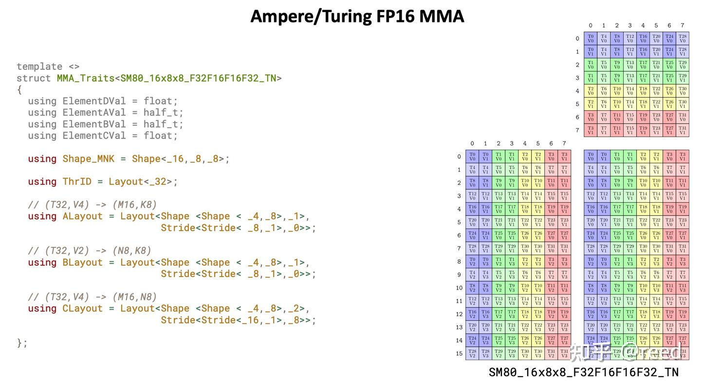

# CuTe 之 MMA抽象

**Author:** [reed](https://www.zhihu.com/people/reed)

**Link:** [https://zhuanlan.zhihu.com/p/663092747](https://zhuanlan.zhihu.com/p/663092747)

---

前序文章分别介绍了 [Layout](https://zhuanlan.zhihu.com/p/661182311) 及其[代数解释](https://zhuanlan.zhihu.com/p/662089556)和 [Tensor](https://zhuanlan.zhihu.com/p/663093816)，它们是 CuTe 中描述数据逻辑排列与数据本身的抽象工具。有了 Tensor 抽象，我们就可以在此之上完成矩阵乘法。本文将介绍 CuTe 中利用 Tensor Core 完成矩阵乘法（MMA = Matrix Multiply Accumulate）所需的数据结构抽象。在展开这些抽象之前，先对 NVIDIA GPU 上的 Tensor Core 做简要介绍。

## NVIDIA Tensor Core 简介

深度学习的兴起带来了巨大的矩阵算力需求。2017 年，NVIDIA 推出搭载 Tensor Core 的 Volta 架构，用专用硬件单元取代此前依赖 CUDA Core（SIMT）和 CPU（SIMD）完成矩阵计算的方式。Tensor Core 能够高效地执行小块矩阵乘加运算 `D = A x B + C`，例如 Ampere 架构（A100）的 Tensor Core 可以在单周期内完成 8x4x8（MNK 描述，即 A 为 8x8、B 为 8x4、C 为 8x4）的半精度矩阵乘法，效率远高于传统的 CUDA Core。因此，卷积、矩阵乘法、注意力等对算力要求极高的深度学习计算，大多依赖 Tensor Core 来完成。


*Figure 2. 不同架构支持的计算精度（引用参考1）*

在数据存储方面，Volta、Turing、Ampere 架构的 Tensor Core 与 CUDA Core 共享寄存器作为输入输出; Hopper 架构为了获得更高带宽，允许输入数据直接存放在共享内存中; Blackwell 架构则在此基础上进一步扩展，增加了 Tensor Memory。各代架构对不同计算精度的支持如图 2 所示，更详细的讨论可参考[关于 Tensor Core 数据存储空间的讨论](https://www.zhihu.com/question/587780273/answer/2929756314)。

使用 Tensor Core 有两种途径。第一种是通过 NVIDIA 提供的高层库（cuBLAS、cuDNN），以 SDK 形式直接调用封装好的矩阵计算和深度学习函数。第二种是通过 CUDA 编程提供的特定的接口和 PTX 汇编实现。对于第二种形式，CUDA 编译器 NVCC 提供了 wmma（warp matrix multiply accumulate）和mma（matrix multiply accumulate）两种形式:

- **wmma（Warp Matrix Multiply Accumulate）**：提供 `fragment` 数据类型以及 `load_matrix_sync()`、`store_matrix_sync()`、`mma_sync()` 等 API，编程相对简单，但对指令的控制粒度较粗。
- **mma（PTX 汇编）**：直接面向寄存器表示，通过 `mma.sync` 等 PTX 指令实现计算，编程难度更大、更易出错，但可以进行精细控制从而达到更高的计算效率。

## CuTe 的 MMA 核心数据结构及其相互关系

CuTe 直接面向 mma 指令实现矩阵计算，在对数据和计算进行良好抽象的同时保留了精细控制能力。MMA 抽象主要包含`MMAOperation`、`MMA_Traits`、`MMA_Atom`、`TiledMMA`、`ThrMMA`，它们是实现矩阵计算的基础。

* **MMAOperation** 封装了不同 GPU 架构下操作 Tensor Core 的硬件指令，并提供统一的 `fma` 方法供上层调用，用户只需根据目标架构选择对应的 Operation 即可。
* **MMA_Traits** 是 MMAOperation 与 MMA_Atom 之间的桥梁。C++ 中的 traits 可以理解为一种"类型级函数"：输入是一个类型，输出是该类型使用者所需、但类型本身不包含的附加信息（如逻辑形状、数据布局等）。MMA_Atom 所需的信息比 MMAOperation 本身提供的更多，MMA_Traits 正是用来填补这个空隙的。
* **MMA_Atom** 如其名所示，是硬件能执行的最小矩阵乘法单元，对应一次特定规格（MNK）的 `D = A x B + C` 运算。
* **TiledMMA** 在 MMA_Atom 之上进行扩展，形成更大规模的矩阵乘法能力。扩展方式有两种：增加参与计算的执行单元（需要更多线程），或让同一 Atom 重复执行多次。TiledMMA 的规模始终是 Atom 的整数倍。
* **ThrMMA** 将 TiledMMA 的逻辑表达映射到线程级别。在 CUDA 编程中，我们只能编写单个线程执行的指令（即使底层操作是 warp 级的），因此需要将逻辑矩阵块按线程号（`threadIdx.x`）拆分，得到每个线程负责的计算任务，ThrMMA 完成的就是这个拆分工作。

各线程通过 ThrMMA 获得自己的任务后，调用 **cute::gemm** 函数下发计算，所有线程协同完成整个 `D = A x B + C` 的块状矩阵乘法。以上核心结构的关系如图 3 所示，整体分为三个抽象层：硬件与指令抽象、逻辑抽象、CUDA 编程级接口。


*Figure 3. CuTe MMA核心结构和其相互关系*

## MMAOperation

MMAOperation 通过硬件指令实现 `D = A x B + C` 计算，需要指定 A/B/C/D 各操作数的类型。每个 Operation 内部用 `DRegisters`、`ARegisters`、`BRegisters`、`CRegisters` 定义各操作数所占的寄存器类型和数量，并提供一个 `fma`（Fused Multiply-Add）方法作为计算入口。`fma` 的参数列表按 D、A、B、C 的顺序排列，每组参数的个数和类型与对应的 `Registers` 定义一致。

以下面的 `SM75_16x8x8_F32F16F16F32_TN` 为例，`SM75` 表示 Turing 架构，`16x8x8` 是 MNK 维度，`F32F16F16F32` 分别对应 D、A、B、C 的数据类型，`TN` 表示 A 为行优先（Transpose）、B 为列优先（Normal，BLAS 约定列优先为默认）。其中 `DRegisters = float[4]`，因此 `fma` 的前 4 个参数是 4 个 `float` 引用，对应 D 的 4 个输出寄存器; `ARegisters = uint32_t[2]` 对应接下来的 2 个 `uint32_t` 参数，以此类推。

```cpp
struct SM75_16x8x8_F32F16F16F32_TN {
  using DRegisters = float[4];
  using ARegisters = uint32_t[2];
  using BRegisters = uint32_t[1];
  using CRegisters = float[4];

  // Register asm fma
  CUTE_HOST_DEVICE static void
  fma(float & d0, float & d1, float & d2, float & d3,
      uint32_t const& a0, uint32_t const& a1,
      uint32_t const& b0,
      float const& c0, float const& c1, float const& c2, float const& c3)
  {
    asm volatile("mma.sync.aligned.m16n8k8.row.col.f32.f16.f16.f32" ...);
  }
};
```

## MMA_Traits

MMA_Traits 针对特定的 MMAOperation 类型，定义其所需的辅助**类型**和**值**供 MMA_Atom 使用，以完成块状矩阵乘法。需要提供的类型信息如下：

```cpp
using ElementDVal = // Logical D-value type
using ElementAVal = // Logical A-value type
using ElementBVal = // Logical B-value type
using ElementCVal = // Logical C-value type

using ElementAFrg = // A-type consumed by MMA (if ommitted, same as ElementAVal)
using ElementBFrg = // B_type consumed by MMA (if ommitted, same as ElementBVal)
using ElementCFrg = // C_type consumed by MMA (if ommitted, same as ElementCVal)

using Shape_MNK = // Logical MxNxK shape of the MMA

using ThrID = // Logical thread id (tid) -> tidx
using ALayout = // (Logical thread id (tid), Logical value id (vid)) -> Flat MK-coord
using BLayout = // (Logical thread id (tid), Logical value id (vid)) -> Flat NK-coord
using CLayout = // (Logical thread id (tid), Logical value id (vid)) -> Flat MN-coord
```


*Figure 4. MMA_Traits 提供给 TiledMMA 的信息（引用自参考3）*

## MMA_Atom

MMA_Atom 将 MMAOperation 和 MMA_Traits 组合在一起，形成硬件能执行的最小矩阵乘法单元。它继承了 Operation 的计算能力和 Traits 提供的类型、形状、Layout 信息，对应一次特定规格（MNK）的 `D = A x B + C` 运算。用户在构建 TiledMMA 时需要选择合适的 MMA_Atom 作为模板参数，TiledMMA 再在此基础上进行扩展。

## TiledMMA

TiledMMA 描述了矩阵在 MNK 空间维度上如何由多个 Atom 组合而成。其内部定义了许多划分函数，但初期只需关注两方面：模板参数和 `get_thread_slice` 函数。

模板参数表达了 TiledMMA 在 MMA_Atom 上的扩展逻辑：`AtomLayoutMNK` 指定 M、N、K 方向各重复几次 Atom（需要更多线程参与），`ValLayoutMNK` 指定对 Atom 在各方向上重复计算几次（通过同一线程多次执行实现）。`get_slice` / `get_thread_slice` 函数根据给定的线程 ID 返回对应的 ThrMMA 结构。接口形式如下：

```cpp
template <class MMA_Atom,
          class AtomLayoutMNK = Layout<Shape<_1,_1,_1>>,
          class ValLayoutMNK = Layout<Shape<_1,_1,_1>>,
          class PermutationsMNK = Tile<Underscore,Underscore,Underscore>>
struct TiledMMA : MMA_Atom {
  ...;
  ThrMMA get_slice(ThrIdx thr_idx); 
  ThrMMA get_thread_slice(ThrIdx thr_idx);
  ...;
}
```

CUTLASS 3.4 版本更新了该接口，去掉了 `ValLayoutMNK` 参数，具体变化可以参考 CuTe 核心作者 [Cecka 的解释](https://github.com/NVIDIA/cutlass/discussions/1345)。

## ThrMMA

ThrMMA（Thread MMA）由 TiledMMA 根据具体的线程 ID 分解而来，描述了线程级 `D = A x B + C` 任务的功能抽象。它提供两类函数：

`partition` 类函数将逻辑 Tensor 按当前线程进行划分。例如，输入 Tensor C 的维度为 `BLK_M x BLK_N`，`partition_C` 返回维度为 `(MMA, MMA_M, MMA_N)` 的 Tensor，其中 `MMA` 是 TiledMMA 一次能计算的单元，`MMA_M` 和 `MMA_N` 是 M 方向和 N 方向的分块数量。

`partition_fragment` 类函数则根据 `partition` 返回的 Tensor 形状，生成对应的寄存器级 Tensor 表示。

```cpp
ThrMMA {
  Tensor partition_C(Tensor C);
  Tensor partition_A(Tensor A);
  Tensor partition_B(Tensor B);
  Tensor partition_fragment_C(Tensor C);
  Tensor partition_fragment_A(Tensor A);
  Tensor partition_fragment_B(Tensor B);
}
```

## cute::gemm

`cute::gemm` 是线程完成 MMA 计算的入口函数，参数中的 D、A、B、C 即为 ThrMMA 划分出的线程级 Tensor。接口如下：

```cpp
void gemm(TiledMMA &mma, Tensor& D, Tensor const& A, Tensor const& B, Tensor const& C); 
```

`cute::gemm` 与其他组件的对应关系如下表所示：


| 功能            | 对应结构/函数                       |
| :---------------- | :------------------------------------ |
| 指令 + 存储类型 | `MMAOperation`                      |
| 逻辑类型和形状  | `MMA_Traits`                        |
| 原子能力        | `MMA_Atom`                          |
| 块状能力        | `TiledMMA`（多个 Atom 组合）        |
| 线程级能力      | `ThrMMA`                            |
| 数据拆分        | `ThrMMA::partition_A/B/C()`         |
| 触发计算        | `cute::gemm(tiled_mma, thr_d, ...)` |

## 总结

CuTe 的 MMA 抽象将矩阵乘法从硬件指令到线程级执行进行了分层设计，形成了 `MMAOperation` → `MMA_Traits` → `MMA_Atom` → `TiledMMA` → `ThrMMA` → `cute::gemm` 的调用链。这种分层使得各层次相互独立，用户只需在顶层组合所需的模块，无需关注底层指令细节。

后续文章将介绍 `Copy` 类结构抽象，用于实现不同存储层级之间的数据搬运。在介绍 `Copy` 之后，我们会结合 MMA 和 Copy 完成一个简单的矩阵乘法实现，再在此基础上逐步优化，最终达到 SOTA 水平的矩阵计算性能。

## 参考

1. [NVIDIA Tensor Cores: Versatility for HPC & AI](https://www.nvidia.com/en-us/data-center/tensor-cores/)
2. [关于 Tensor Core 数据存储空间的讨论](https://www.zhihu.com/question/587780273/answer/2929756314)
3. [Thakkar - BLIS Retreat 2023 Slides](https://www.cs.utexas.edu/users/flame/BLISRetreat2023/slides/Thakkar_BLISRetreat2023.pdf)
4. [What is PermutationMNK in TiledMMA in CUTLASS 3.4 changes? - NVIDIA/cutlass Discussion #1345](https://github.com/NVIDIA/cutlass/discussions/1345)
