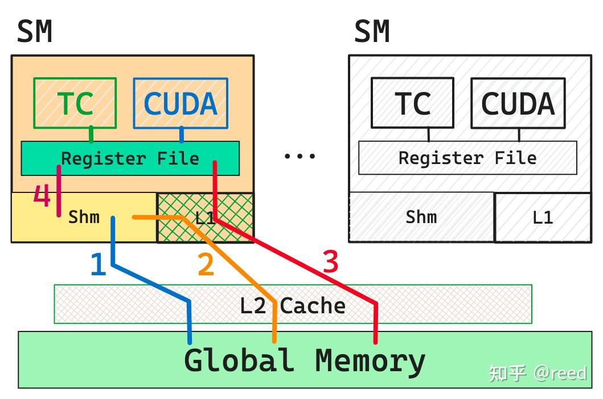
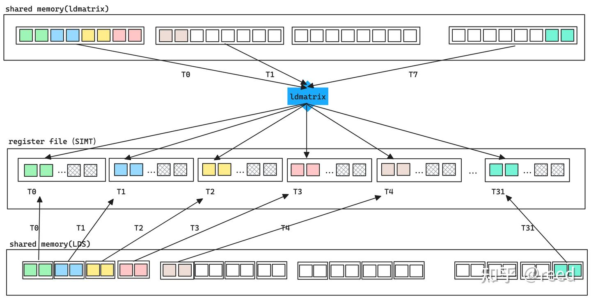

# CuTe 之 Copy抽象

**Author:** [reed](https://www.zhihu.com/people/reed)

**Link:** [https://zhuanlan.zhihu.com/p/666232173](https://zhuanlan.zhihu.com/p/666232173)

---

前文介绍了 [CuTe 中的 MMA 抽象](https://zhuanlan.zhihu.com/p/663092747)，通过 MMA 我们可以利用 Tensor Core 完成寄存器上的 `D = A x B + C` 计算。然而对于 GPU 编程而言，输入数据通常存储在全局内存中，需要高效地搬运到 Tensor Core 计算所需的寄存器上。数据搬运可以抽象为 `D = S`，其中 D 和 S 是前文介绍的 [Tensor 结构](https://zhuanlan.zhihu.com/p/663093816)，分别表示目标（Destination）和源（Source），它们一般位于不同的存储层次，各自有独立的 [Layout 描述](https://zhuanlan.zhihu.com/p/661182311)。

本文围绕这一问题，介绍 CuTe 在数据搬运方面的抽象。文章首先介绍 GPU 的存储层次和矩阵计算相关的 ldmatrix 指令，然后总体介绍 Copy 相关的数据结构及其相互关系，接着逐一说明各结构的核心成员和函数。

## CUDA 的存储层次和数据加载路径


*Figure 1. GPU 的存储层次和数据搬运路径*

GPU 的存储层次如图 1 所示，由外到内依次为：

- **全局内存（Global Memory）**：容量最大的片外存储，A100-80GB 采用 HBM2e 实现，容量 80GB，峰值带宽约 2TB/s。
- **L2 Cache**：位于全局内存与 SM 之间，A100-80GB 上为 40MB，带宽可达约 20TB/s。
- **Shared Memory / L1 Data Cache**：片上存储，位于 SM 内部，两者共享 192KB 空间（可配置比例，shared memory 最大可配为 164KB）。
- **寄存器堆（Register File）**：离计算单元（Tensor Core / CUDA Core）最近的存储，也是最快的。计算所需数据必须来自寄存器（Ampere 及之前架构; Hopper 架构的 Tensor Core 可直接读取 shared memory），单个线程最多使用 255 个 32-bit 寄存器。

数据从全局内存到达计算单元有三条路径。路径 1：Global Memory → L2 → Shared Memory（bypass L1）→ Register; 路径 2：Global Memory → L2 → L1 → Shared Memory → Register; 路径 3：Global Memory → L2 → L1 → Register。路径 1 和 2 仅 Ampere 及之后的架构支持。更早的架构只能走路径 3 到达寄存器，从全局内存到共享内存则需要先经路径 3 加载到寄存器，再通过路径 4 写入共享内存。

在编程层面，我们可以直接控制全局内存、共享内存和寄存器的读写。L1 和 L2 Cache 属于硬件缓存，我们只能控制是否 bypass，以及通过 PTX 指令 modifier 控制 L2 的数据预取行为。

## 高效的 ldmatrix 指令

矩阵计算优化中的一项重要技术是通过数据分块实现数据复用，减少对低层级存储器的访问量，从而提升整体计算效率。在 GPU 中，可编程的数据复用主要发生在共享内存：用户将部分数据加载到共享内存后反复使用，再由共享内存搬运到寄存器供 Tensor Core 计算。

在 MMA 章节中我们已经了解到，Tensor Core 计算时 warp 内的每个线程只持有矩阵的部分数据，这些数据保存在线程的私有寄存器中（SIMT 架构下寄存器为线程私有），warp 内所有线程的寄存器共同组成完整的矩阵。如图 2 所示，每个线程持有两个 float16 数据（打包在一个 32-bit 寄存器中），32 个线程共同构成 64 个数据，形成 8x8 的 warp 级小矩阵。


*Figure 2. SIMT 寄存器协作构成 warp level 矩阵*

从共享内存到寄存器的加载，可以通过常规的 LDS（Load Shared）指令完成。但问题在于，mma 指令要求数据按特定的 fragment 布局分布到各线程的寄存器中，而 LDS 只能将数据加载到执行该指令的线程自己的寄存器。要将共享内存中行连续存储的矩阵数据搬运到符合 mma fragment 布局的寄存器分布上，需要多条 LDS 加上 warp shuffle 指令做跨线程数据重排，指令数多且效率不高。为此，NVIDIA 从 Turing 架构（sm_75）开始提供了 `ldmatrix` 指令，专门优化共享内存到寄存器的矩阵加载。

**ldmatrix 的工作原理。** 如图 3 上半部分所示，以 8x8 FP16 矩阵的加载为例（`ldmatrix.sync.aligned.m8n8.x1.b16`）。ldmatrix 是 warp 级指令，32 个线程必须同步执行。一个 8x8 矩阵有 8 行，每行 8 个 FP16 元素 = 8 * 2 = 16 Byte，其中 T0-T7 这 8 个线程各提供一个共享内存地址，分别指向矩阵 8 行的起始位置，硬件从这 8 个地址处各读取 16 Byte，总计 128 Byte，完成整个矩阵的读取。读取后数据按 mma 要求的 fragment 布局分配到所有 32 个线程的寄存器中，回顾图 2：每行由 4 个线程覆盖，每线程持有 2 个 FP16（一个 32-bit 寄存器），8 行 x 4 线程 = 32 个线程。T0 提供的地址所读出的一行 16 Byte 数据，并不是全部写入 T0 的寄存器，而是被拆分后分配给 T0、T1、T2、T3 四个线程（每个线程分到 4 Byte，即 2 个 FP16，填入一个 32-bit 寄存器）。

线程只是"提交地址"，真正执行读取的是共享内存控制器。T0-T7 提供 8 个地址后，共享内存硬件从对应的 bank 中取出 8x16 = 128 字节的数据。这 128 字节数据从共享内存 bank 出来后，通过 SM 内部的 operand collector / crossbar 网络 直接路由到 32 个线程的目标寄存器中。没有经过中间缓冲区，也不需要线程自己去"取"，数据直接从共享内存 bank 输出端口走线到寄存器堆的写端口。

这种跨线程的寄存器写入在普通 LDS 加载中是不可能的（LDS 只能写入执行线程自己的寄存器），ldmatrix 通过硬件内部的 warp 级数据交换网络实现了这一点。使用 `.x4` 时（`ldmatrix.sync.aligned.m8n8.x4.b16`），32 个线程分成 4 组，每组 8 个线程各自提供一个矩阵的行地址，一条指令同时加载 4 个 8x8 矩阵共 512 Byte，每个线程获得 4 个 32-bit 寄存器的 fragment 数据。


*Figure 3. SIMT 形式加载矩阵数据（下）和 ldmatrix 协作式加载（上）的对比*

ldmatrix 有以下优点：

- **跨越 SIMT 寄存器边界**：数据可以直接写入 warp 内任意线程的寄存器，省去了 LDS + shuffle 的组合操作。
- **减少指令数**：一条 ldmatrix 指令完成原本需要多条 load + shuffle 指令的工作，降低了指令调度开销。
- **支持加载时转置**：通过 `.trans` 修饰符，ldmatrix 可以在写入寄存器时自动完成矩阵转置，适用于 mma 的 B 矩阵（需要列主序输入）的场景。

CuTe 对 ldmatrix 这类 warp 级共享内存到寄存器的搬运提供了对应的 Copy Atom 抽象（如 `SM75_U32x1_LDSM_N`），用户无需手动管理线程与地址的映射关系和 fragment 布局。更多细节可参考 [ldmatrix 指令的优势分析](https://www.zhihu.com/question/600927104/answer/3029266372)。

## CuTe Copy 抽象及其相互关系

与 MMA 类似，CuTe 对数据搬运提供了一套结构化的抽象，包括 `CopyOperation`、`Copy_Traits`、`Copy_Atom`、`TiledCopy`、`ThrCopy` 和拷贝函数 `cute::copy`，共同完成 GPU 各存储层级之间的数据搬运。

* **CopyOperation** 封装了指令级的数据搬运能力。NVIDIA 在不同架构和存储层次间提供了不同的搬运指令（如 `LDS`、`ldmatrix`、Ampere 的 `cp.async`、Hopper 的 TMA 等），用户根据硬件支持和搬运需求选择对应的 Operation 即可。
* **Copy_Traits** 与 MMA_Traits 类似，补充了 CopyOperation 类型本身没有提供、但 Copy_Atom 使用时所需的桥梁信息。
* **Copy_Atom** 封装了指令级别不可分割的原子拷贝能力。
* **TiledCopy** 在 Copy_Atom 之上进行扩展，通过增加执行线程数或让 Atom 重复执行来获得更大块的拷贝能力。
* **ThrCopy** 将 TiledCopy 的逻辑拷贝能力映射到线程级别，通过当前线程的 `threadIdx.x` 对大块 Tensor 进行划分，得到该线程完成 `D = S` 拷贝所需的具体任务。
* **cute::copy** 在 ThrCopy 确定了线程任务后，触发实际的数据搬运指令。


*Figure 4. CuTe Copy核心结构和其相互关系*

如图 4 所示，最底层是基于硬件指令的 CopyOperation 抽象，向上形成 `D = S` 的拷贝逻辑抽象（Copy_Atom → TiledCopy），再向上按线程划分出具体任务（ThrCopy），最终通过 `cute::copy` 触发执行，所有线程协同完成 Tensor 到 Tensor 的拷贝。下面逐层介绍各结构的细节。

## CopyOperation

CopyOperation 封装了特定硬件支持的拷贝能力，通常通过 PTX 汇编指令（或 CUDA 内建函数）实现。它定义了源和目标的数据类型及数量，并提供 `copy` 函数供上层调用。以下示例中，源寄存器为一个 `uint128_t`（128-bit），目标寄存器为一个 `uint32_t`：

```cpp
struct SM75_U32x1_LDSM_N {
  using SRegisters = uint128_t[1];
  using DRegisters = uint32_t[1];
  void copy(uint128_t const& smem_src, uint32_t& dst) {
    asm volatile ("ldmatrix.sync. ...\n");
  }
};
```

## Copy_Traits

Copy_Traits 补充了 CopyOperation 的信息，包括执行所需的线程数、源数据和目标数据的 Layout 排布。Layout 描述了线程与数据的对应关系：通过线程号（thr）和寄存器号（val）可以定位数据的逻辑位置。此外还提供 `RefLayout`，供线程级数据拆分时的 retile 操作使用。定义如下：

```cpp
struct Copy_Traits<SM75_U32x1_LDSM_N> {
  // Logical thread id to thread idx (warp)
  using ThrID = Layout<_32>;
  // Map from (src-thr,src-val) to bit
  using SrcLayout = Layout<Shape <Shape < _8,_4>,_128>,
                          Stride<Stride<_128,_0>, _1>>;
  // Map from (dst-thr,dst-val) to bit
  using DstLayout = Layout<Shape <_32,_32>,
                           Stride<_32, _1>>;
  // Reference map from (thr,val) to bit
  using RefLayout = DstLayout;
};
```

## Copy_Atom

Copy_Atom 将 Operation 和 Traits 封装为统一的抽象，继承了 Traits 中的线程和 Layout 信息，同时定义了值类型 `ValType`，供后续 TiledCopy 和 ThrCopy 分解任务时提取。`call` 方法是对底层指令的调用入口：

```cpp
struct Copy_Atom<Copy_Traits<Args...>, T>
  : Copy_Traits<Args...>
{
  using Traits = Copy_Traits<Args...>;
  // Bit and Thr layouts from the Copy_Traits
  using ThrID = typename Traits::ThrID;
  using BitLayoutSrc = typename Traits::SrcLayout;
  using BitLayoutDst = typename Traits::DstLayout;
  using BitLayoutRef = typename Traits::RefLayout;
  using ValType = T;
  void call(Tensor<TS,SLayout> const& src, Tensor<TD,DLayout>& dst);
};
```

## TiledCopy

TiledCopy 通过对 Atom 的重复来获得更大块的拷贝能力。重复方式有两种：一是提供线程-存储的 Layout 描述，二是结合 MMA 中的 `tiled_mma` 通过 `make_tiled_copy_A/B/C` 函数构造（因为 MMA 已经提供了 `D = A x B + C` 计算所需的数据划分信息）。TiledCopy 的核心函数是 `get_slice` / `get_thread_slice`，根据线程 ID 返回对应的 ThrCopy 对象。模板参数和形参如下：

```cpp
template <class Copy_Atom,
          class LayoutCopy_TV,   // (tid,vid) -> coord [Need not be 2D...]
          class ShapeTile_MN>   // coord space
struct TiledCopy : Copy_Atom {
  ThrCopy get_slice(ThrIdx const& thr_idx); 
  ThrCopy get_thread_slice(ThrIdx const& thr_idx));
};
CUTE_HOST_DEVICE
auto make_tiled_copy_A(Copy_Atom<Args...> const& copy_atom,
                       TiledMMA const& tiled_mma)
```

## ThrCopy

ThrCopy 是线程级别的拷贝抽象，通过 TiledCopy 的 `get_slice` 方法获得。它提供两类函数：`partition_S/D` 和 `retile_S/D`（S = Source，D = Destination）。`partition` 将大块逻辑 Tensor 划分为当前线程负责的源/目标 Tensor; `retile` 则用于已属于当前线程的私有数据，但形状不满足拷贝指令要求的情况，将其变换为拷贝所支持的形状：

```cpp
template <class TiledCopy, class ThrIdx>
struct ThrCopy {
  auto partition_S(Tensor&& stensor);
  auto partition_D(Tensor&& dtensor);
  auto retile_S(Tensor&& stensor);
  auto retile_D(Tensor&& dtensor);
};
```

## cute::copy

`cute::copy` 是拷贝的实际执行函数，调用后触发线程级别的搬运指令，完成逻辑上的 `D = S`。对于块状拷贝中可能遇到的边界情况，可以使用 `copy_if` 通过 predicate 对部分数据进行 mask，避免越界的非法访问。函数原型如下：

```cpp
void copy(TiledCopy const& copy, Tensor const& src, Tensor& dst);
void copy_if(TiledCopy const& copy, PrdTensor const& pred, Tensor const& src, Tensor& dst);
```

`cute::copy` 与其他组件的对应关系如下表所示：


| 功能            | 对应结构/函数                                       |
| :---------------- | :---------------------------------------------------- |
| 指令 + 存储类型 | `CopyOperation`                                     |
| 逻辑类型和形状  | `Copy_Traits`                                       |
| 原子能力        | `Copy_Atom`                                         |
| 块状能力        | `TiledCopy`（多个 Atom 组合）                       |
| 线程级能力      | `ThrCopy`                                           |
| 数据拆分        | `ThrCopy::partition_S/D()`、`ThrCopy::retile_S/D()` |
| 触发拷贝        | `cute::copy(tiled_copy, thr_s, thr_d)`              |

## 总结

CuTe 的 Copy 抽象将 Tensor 搬运 `D = S` 从硬件指令到线程级执行进行了分层设计，形成了 `CopyOperation` → `Copy_Traits` → `Copy_Atom` → `TiledCopy` → `ThrCopy` → `cute::copy` 的调用链。借助这些抽象，我们可以在逻辑层面完成不同存储层级之间的 Tensor 拷贝，无需关注底层指令细节。Copy 和 MMA 共同构成了 CuTe 矩阵乘法的基础。

至此，我们已经介绍了 CuTe 中的 Layout、Tensor、MMA、Copy 四大抽象，具备了实现一个完整 GEMM（GEneral Matrix Multiplication）的条件：通过 Layout 和 Tensor 对计算矩阵进行分块，通过 Copy 将矩阵 A、B 的数据从全局内存加载到寄存器，通过 MMA 利用 Tensor Core 完成寄存器上的小块矩阵乘法，最后再通过 Copy 将结果写回全局内存。下一篇文章将利用这四个抽象完成一个简单的矩阵乘法实现。

## 参考

1. [PTX ISA - Warp Level Matrix Instructions for MMA](https://docs.nvidia.com/cuda/parallel-thread-execution/index.html#warp-level-matrix-instructions-for-mma)
2. [CUTLASS - cute/algorithm/copy.hpp](https://github.com/NVIDIA/cutlass/blob/main/include/cute/algorithm/copy.hpp)
3. [ldmatrix 指令的优势分析](https://www.zhihu.com/question/600927104/answer/3029266372)
