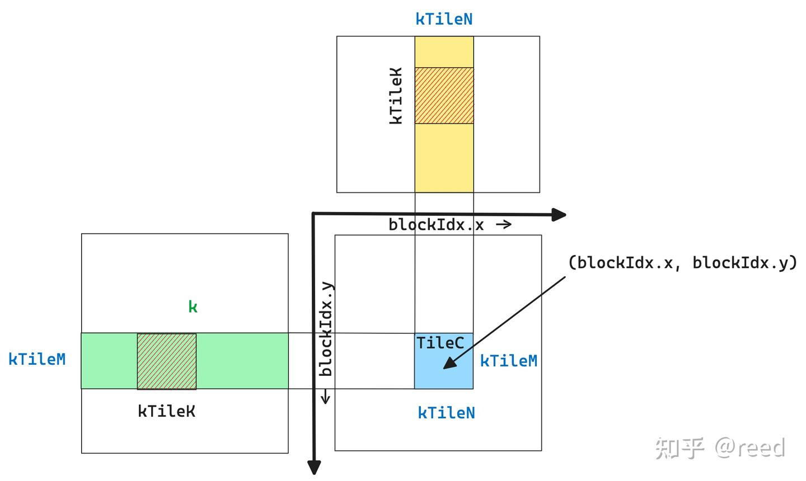

# cute 之 简单GEMM实现

**Author:** [reed](https://www.zhihu.com/people/reed)

**Link:** [https://zhuanlan.zhihu.com/p/667521327](https://zhuanlan.zhihu.com/p/667521327)

---

前面的文章我们对CuTe提供的核心数据结构和抽象进行了一系列的介绍，包括[Layout](https://zhuanlan.zhihu.com/p/661182311)、[Tensor](https://zhuanlan.zhihu.com/p/663093816)、[MMA](https://zhuanlan.zhihu.com/p/663092747)和[Copy](https://zhuanlan.zhihu.com/p/666232173)。本文将利用这些抽象实现一个简单版本的矩阵乘法。文章首先介绍BLAS约定和深度学习对矩阵乘法的需求差异，然后介绍CUDA上的矩阵库cuBLAS和矩阵乘法任务到硬件执行单元的划分策略，最后从Tensor构建、切块、划分、执行、拷贝等方面结合代码介绍具体实现，并在实际问题规模上与cuBLAS进行了性能对比。

## BLAS约定和深度学习约定

在科学计算和数值分析领域，经常需要解决矩阵特征值、线性方程等问题，形成了EISPACK、LINPACK、LAPACK等数学求解库。这些库共同依赖更底层的基础数学库BLAS（**B**asic **L**inear **A**lgebra **S**ubprograms）。BLAS分为三个层次：

* 第一层是向量操作，如 $\bm{y} = \alpha \bm{x} + \bm{y}$ 计算问题; 
* 第二层向量-矩阵操作，如 $\bm{y} = \alpha \bm{A} \bm{x} + \beta \bm{y}$ 计算问题; 
* 第三层矩阵-矩阵操作，如 $\bm{C} = \alpha \bm{A} \bm{B} + \beta \bm{C}$。

$\bm{C} = \alpha \bm{A} \bm{B} + \beta \bm{C}$ 就是我们常说的GEMM（**GE**neral **M**atrix **M**ultiplication）问题，也是BLAS第三层次要求解的问题。其中的"广义"来自于 $\alpha$、$\beta$ 可以是任意数值，$\bm{A}$ 和 $\bm{B}$ 可以是转置的也可以是非转置的，数值精度方面可以是单精度浮点数、双精度浮点数等。BLAS早期实现采用的是数值计算领域的Fortran语言，在Fortran中二维数组是列主序的（列优先），所以在BLAS的API中针对AB矩阵的转置情况描述而言，列优先称为Normal（简写为N），行优先则称为Transpose（简写为T）。值得注意的是转置与否是针对A、B矩阵而言的，$\bm{C}$、$\bm{D}$ 矩阵必须是列优先的。同时为了区分不同的数值精度，BLAS规定了不同的简写，如单精度浮点为s（缩写自single precision）, 双精度浮点为d（缩写自double precision），单精度复数为c（缩写自complex），双精度浮点复数记为z。所以在附加上数据类型（如单精度浮点）之后函数名字就由gemm变为了sgemm（single precision general matrix multiplication）。同时BLAS约定了矩阵的维度，表示为 $\bm{D_{m,n}} = \alpha \bm{A_{m, k}} \bm{B_{k, n}} + \beta \bm{C_{m,n}}$，其中m、n表示行列数目，k为reduce轴上的数据维度。

深度学习中也有矩阵乘法所表达的网络层（如Pytorch中Linear层、Tensorflow中的Dense层），但是神经网络中该层的公式可以表达为 $y = x \bm{A} + b$，其中x为input，维度一般为（N, Cin），y为output维度为（N, Cout），b为bias（一般是broadcast语义，此处我们忽略掉）。忽略掉bias同时采用BLAS的矩阵形式描述，则其公式可以变更为 $\bm{D} = \bm{A}\bm{B}$。可以发现深度学习中需要的也是矩阵乘法的语义，和BLAS类似但又不完全相同：其一，深度学习中的公式没有BLAS公式中的 $\alpha$; 其二，没有BLAS中的加法右侧项; 其三，输出的D是行优先的而非BLAS中的列优先。除了公式层面的差异外，深度学习中的层为了计算效率会选用比传统BLAS中更低的精度，如半精度和整数量化精度。

由于深度学习的输出要求是行优先的，而BLAS约定中输出矩阵D是列优先的，因此当我们借助BLAS类函数完成深度学习的矩阵乘法时，需要对BLAS的公式进行转置变换，即 $\bm{D^{T}} = \alpha \bm{B^TA^T} + \beta \bm{C^{T}}$，同时设置 $\alpha$ 为1，$\beta$ 为0。由于转置，矩阵AB的顺序也发生了变化。使用BLAS实现深度学习矩阵乘法的伪代码调用如下

```cpp
// blas_gemm(D, A, B, trans_a, trans_b, m, n, k, alpha, beta) API specifaction;
//  D = alpha op(A) op(B) + beta C;
// op can be 'N'ormal or 'T'ranspose
// output:
//    D(m, n) column major
// input: 
//    A(m, k) column major
//    B(k, n) column major
//    C(m, n) column major

// D(m, n) row major
// A(m, k) row major
// B(k, n) column major
void linear_layer(T *D, const T *A, const *B, int m, int n, int k) {
  T alpha = 1;
  T beta = 0;
  blas_gemm(D, B, A, 'T', 'N', n, m, k, alpha, beta);
}
```

## NVIDIA cuBLAS

NVIDIA使用GPU实现了BLAS加速，形成了cuBLAS加速库。cuBLAS除了实现标准BLAS API，还扩展了多Batch支持、多GPU支持和针对深度学习的混合精度、低精度实现。深度学习中常用的半精度gemm在cuBLAS中对应hgemm（half precision general matrix multiplication）。cuBLAS本质上是一个高度优化的kernel仓库，针对不同数据类型、计算精度、矩阵维度、地址对齐等进行了综合优化。用户调用时，cuBLAS会从中选择针对当前问题规模性能较好的实现版本。此外NVIDIA还提供了cuBLASLt库，如图1所示，其对比了NVIDIA提供的BLAS类库的API复杂度和融合后处理能力。


*Figure 1. NVIDIA提供的BLAS类库对比（引用自参考5）*

cuBLASLt在cuBLAS基础上提供了更灵活的接口，允许用户指定更复杂的输入输出类型和计算类型（解决混合精度的多类型指定问题），同时提供启发式算法让用户选择性能更好的kernel。后续文章的实验会利用cuBLASLt的kernel选择能力，选取最优的候选kernel作为baseline。本文实验中使用cuBLAS选定的kernel作为baseline。

## Tensor表示


*Figure 2. 矩阵乘法问题的Tensor表示及其属性*

如图2所示，本文研究深度学习中常用的 `C = AB` 矩阵乘法问题。矩阵A、B存储在GPU全局内存中，输出C矩阵也存储在全局内存中。维度方面A为m行k列，B为k行n列，输出C为m行n列。Layout方面A为行优先，B为列优先，C为行优先。数据类型均为16-bit半精度浮点数，在CUDA中表示为half类型（CuTe封装为cute::half_t类型）。矩阵信息汇总如下，其中将row/column major表示为stride形式


| ·矩阵 | 指针变量 | 存储位置      | shape  | stride | 数据类型 |
| -------- | ---------- | --------------- | -------- | -------- | ---------- |
| A      | Aptr     | global memory | (m, k) | (k, 1) | half     |
| B      | Bptr     | global memory | (k, n) | (1, k) | half     |
| C      | Cptr     | global memory | (m, n) | (n, 1) | half     |

我们将ABC表示为Tensor形式，则可以写出如下kernel代码

```cpp
template <typename T>
__global__ void gemm_simple(T *Cptr, const T *Aptr, const T *Bptr, int m, int n, int k) {
  Tensor A = make_tensor(make_gmem_ptr(Aptr), make_shape(m, k), make_stride(k, Int<1>{}));
  Tensor B = make_tensor(make_gmem_ptr(Bptr), make_shape(n, k), make_stride(k, Int<1>{}));
  Tensor C = make_tensor(make_gmem_ptr(Cptr), make_shape(m, n), make_stride(n, Int<1>{})); 
}
```

其中 `make_gmem_ptr()` 函数用于标识指针的存储层次，CuTe 后续的很多操作（`cute.copy`、TMA 构建、`partition` 等）需要根据数据所在的存储层次选择不同的硬件指令。我们将Tensor B的形状表示为(n, k)而非(k, n)，对应stride为(k, 1)，这样后续沿k轴循环时可以写成reduce的形式。为了编译时优化，stride中的连续维度1表示为编译时常量 `Int<1>{}`，编译器可以在编译阶段完成路径决策，避免运行时的stride乘法开销。

## 以C矩阵为中心的任务划分策略

GPU中有多个SM（Stream Multiprocessor），我们通过grid、block的软件层级来利用这些SM。在矩阵计算中，以输出矩阵C作为划分thread block的单元进行任务拆分：一个thread block完成C矩阵中一个小块（TileC）的计算任务。如图3所示，定义TileC的大小为kTileM x kTileN，完成TileC的计算需要A矩阵中的绿色高亮部分和B矩阵的黄色高亮部分，形状分别为(kTileM, k)和(kTileN, k)。对AB矩阵的k轴按kTileK的大小分块，可以将TileC表达为AB矩阵块的点积累加

$TileC = \sum_{itile = 0}^{num\_tile}{TileA_{itile} \cdot TileB_{itile}}$


*Figure 3. sliced-k模式的C矩阵为中心的任务划分方法*

在k轴上以kTileK为步长移动，每步取出 $TileA_{itile}$ 和 $TileB_{itile}$，将乘积累加到TileC上，即可得到TileC的最终结果。这种沿k轴移动的策略称为sliced-k方法。一个block（坐标为blockIdx.x, blockIdx.y）完成C矩阵中一个小块的计算，通过在M轴（blockIdx.y）和N轴（blockIdx.x）方向扩展block，即可完成整个C矩阵的计算。grid维度为：grid.x = N / kTileN, grid.y = M / kTileM（此处暂不考虑不可整除的情形）。代码如下

```cpp
template <typename T, int kTileM, int kTileN, int kTileK>
__global__ void gemm_simple(T *Cptr, const T *Aptr, const T *Bptr, int m, int n, int k) {
  Tensor A = make_tensor(make_gmem_ptr(Aptr), make_shape(m, k), make_stride(k, Int<1>{}));
  Tensor B = make_tensor(make_gmem_ptr(Bptr), make_shape(n, k), make_stride(k, Int<1>{}));
  Tensor C = make_tensor(make_gmem_ptr(Cptr), make_shape(m, n), make_stride(n, Int<1>{}));

  int ix = blockIdx.x;
  int iy = blockIdx.y;

  Tensor gA = local_tile(A, make_tile(Int<kTileM>{}, Int<kTileK>{}), make_coord(iy, _));
  Tensor gB = local_tile(B, make_tile(Int<kTileN>{}, Int<kTileK>{}), make_coord(ix, _));
  Tensor gC = local_tile(C, make_tile(Int<kTileM>{}, Int<kTileN>{}), make_coord(iy, ix));
}

int main() {
  ...
  dim3 grid(n / kTileN, m / kTileM);
  ...
}
```

模板参数中给定分块的超参kTileM、kTileN、kTileK，使用 `local_tile` 方法对矩阵进行固定大小的分块。通过指定坐标的全slice方法，得到当前thread block要处理的Tensor gA、gB、gC。分块时同样将编译时能确定的量用 `Int<>` 表示为编译时常量。经过 `local_tile` 后gA、gB、gC的维度信息如下


| Tensor | shape                        |
| -------- | ------------------------------ |
| gA     | (kTileM, kTileK, num_tile_k) |
| gB     | (kTileN, kTileK, num_tile_k) |
| gC     | (kTileM, kTileN)             |

sliced-k策略对m、n维度较大的场景比较有效（分块产生的block数目足以填充所有SM）。但当k较大而m、n较小时，根据C来划分的thread block数目不足以填充所有SM，导致部分SM空闲，而有任务的SM需要循环多次。此时可以考虑将k轴拆分成多段，每段各自计算一个TileC结果，最后通过额外的累加将多段结果求和，这种方法称为split-k。如图4，把k拆分成两段，由不同的计算单元分别完成，得到多份C后累加求和得到最终结果。该方法在特殊场景下有用且实现不复杂，本文暂不实现。


*Figure 4. split-k策略的计算逻辑*

除了sliced-k和split-k，还有stream-k方法。stream-k指出前两种方法都是静态划分任务，当任务数目和SM数量不能整除时，总存在某轮（wave）计算中SM空闲的问题。stream-k抛弃以任务为中心的划分逻辑，转而以计算资源为核心分配任务，使得各SM的工作量基本均等。如图5所示，假设只有4个SM，stream-k对计算资源的利用效果最好，具体可参考发表在PPoPP'23上的poster。目前cuBLAS中的kernel仍以sliced-k和split-k为主，本文暂不实现stream-k。


*Figure 5. stream-k策略任务划分逻辑（引用自PPoPP23: Stream-K）*

## TiledMMA：主机端选择指令，设备端将分块划分到线程

前面经过把C++ pointer封装成Tensor，再用 `local_tile` 将Tensor划分成小块，便可以得到一个thread block需要处理的任务。此时借助MMA章节构造的TiledMMA，通过ThrMMA的 `partition_A/B/C` 方法实现对TileA、TileB、TileC的线程级划分，通过 `partition_fragment_A/B/C` 构造矩阵乘所需的寄存器表示，最后通过 `cute::gemm` 完成线程级别的矩阵乘法。具体的kernel代码为

```cpp
template <typename T, int kTileM, int kTileN, int kTileK, typename TiledMMA>
__global__ void gemm_simple(T *Cptr, const T *Aptr, const T *Bptr, int m, int n, int k) {
  Tensor A = make_tensor(make_gmem_ptr(Aptr), make_shape(m, k), make_stride(k, Int<1>{}));
  Tensor B = make_tensor(make_gmem_ptr(Bptr), make_shape(n, k), make_stride(k, Int<1>{}));
  Tensor C = make_tensor(make_gmem_ptr(Cptr), make_shape(m, n), make_stride(n, Int<1>{}));

  int ix = blockIdx.x;
  int iy = blockIdx.y;

  Tensor gA = local_tile(A, make_tile(Int<kTileM>{}, Int<kTileK>{}), make_coord(iy, _));
  Tensor gB = local_tile(B, make_tile(Int<kTileN>{}, Int<kTileK>{}), make_coord(ix, _));
  Tensor gC = local_tile(C, make_tile(Int<kTileM>{}, Int<kTileN>{}), make_coord(iy, ix));
  //  gA(kTileM, kTileK, num_tile_k)
  //  gB(kTileN, kTileK, num_tile_k)
  //  gC(kTileM, kTileN) 

  TiledMMA tiled_mma;
  auto thr_mma = tiled_mma.get_slice(threadIdx.x);
  auto tAgA = thr_mma.partition_A(gA);  // (MMA, MMA_M, MMA_K, num_tile_k)
  auto tBgB = thr_mma.partition_B(gB);  // (MMA, MMA_N, MMA_K, num_tile_k)
  auto tCgC = thr_mma.partition_C(gC);  // (MMA, MMA_M, MMA_N)

  auto tArA = thr_mma.partition_fragment_A(gA(_, _, 0));  // (MMA, MMA_M, MMA_K)
  auto tBrB = thr_mma.partition_fragment_B(gB(_, _, 0));  // (MMA, MMA_N, MMA_K)
  auto tCrC = thr_mma.partition_fragment_C(gC(_, _));     // (MMA, MMA_M, MMA_N)
 
  clear(tCrC); 
}

int main() {
  ...
  using mma_op = SM80_16x8x16_F16F16F16F16_TN;
  using mma_traits = MMA_Traits<mma_op>;
  using mma_atom = MMA_Atom<mma_traits>;

  auto MMA = decltype(make_tiled_mma(mma_atom{}, 
                      make_layout(Shape<_2, _2, _1>{}), 
                      make_layout(Shape<_1, _2, _1>{})));
  dim3 block(size(MMA{}));
  dim3 grid(n / kTileN, m / kTileM);
  ...
}
```

`get_slice` 函数根据线程id从TiledMMA中提取每个线程所需的layout信息。`partition` 函数将gA、gB、gC在线程级别进行分解，partition后维度信息为 (MMA, MMA_M, MMA_K, num_tile_k)，其中MMA表示TiledMMA单次运算所需的数据，MMA_M和MMA_K表示在M方向和K方向需要重复多少次TiledMMA才能覆盖整个Tile，num_tile_k则是gA原有的第三维度自然继承下来。也就是说 `partition_A` 的逻辑是将Tensor的前两维按TiledMMA能力划分为三维（单次数据 + 两个方向的重复次数），后续维度原样保留。`partition_fragment` 类函数类似，但返回的是寄存器声明。对于 `partition_fragment_A/B`，输入的gA保留了前两个维度，第三个维度取位置0，等价于传入形状为(kTileM, kTileK)和(kTileN, kTileK)的Tensor。得到TileC的寄存器表示后，用 `clear` 方法初始化为0，为后续累加做准备。

在main函数中，选择Ampere架构提供的16x8x16 Tensor Core指令，数据精度和计算精度均为FP16。通过 `MMA_Traits` 和 `MMA_Atom` 封装指令能力。SM80的Tensor Core执行是warp level的，即MMA_Atom需要32个线程。通过增加线程的方式在M、N方向重复，同时让B、C矩阵使用更多寄存器在N方向扩展2次，得到最终的TiledMMA类型。TiledMMA需要 32 x 2 x 2 = 128 线程，能处理的矩阵大小为 M = 16 x 2 x 1 = 32, N = 8 x 2 x 2 = 32, K = 16 x 1 x 1 = 16，即TiledMMA的MNK为32x32x16。

## Loop Over K

有了TiledMMA的数据划分后，调用 `cute::gemm` 即可完成 `C[kTileM, kTileN] = A[kTileM, kTileK] * B[kTileN, kTileK]` 的Tensor Core矩阵乘法。沿k方向循环这个块即可得到最终的计算结果，实现如下

```cpp
template <typename T, int kTileM, int kTileN, int kTileK, typename TiledMMA>
__global__ void gemm_simple(T *Cptr, const T *Aptr, const T *Bptr, int m, int n, int k) {
  Tensor A = make_tensor(make_gmem_ptr(Aptr), make_shape(m, k), make_stride(k, Int<1>{}));
  Tensor B = make_tensor(make_gmem_ptr(Bptr), make_shape(n, k), make_stride(k, Int<1>{}));
  Tensor C = make_tensor(make_gmem_ptr(Cptr), make_shape(m, n), make_stride(n, Int<1>{}));

  int ix = blockIdx.x;
  int iy = blockIdx.y;

  Tensor gA = local_tile(A, make_tile(Int<kTileM>{}, Int<kTileK>{}), make_coord(iy, _));
  Tensor gB = local_tile(B, make_tile(Int<kTileN>{}, Int<kTileK>{}), make_coord(ix, _));
  Tensor gC = local_tile(C, make_tile(Int<kTileM>{}, Int<kTileN>{}), make_coord(iy, ix));
  //  gA(kTileM, kTileK, num_tile_k)
  //  gB(kTileN, kTileK, num_tile_k)
  //  gC(kTileM, kTileN) 

  TiledMMA tiled_mma;
  auto thr_mma = tiled_mma.get_slice(threadIdx.x);
  auto tAgA = thr_mma.partition_A(gA);  // (MMA, MMA_M, MMA_K, num_tile_k)
  auto tBgB = thr_mma.partition_B(gB);  // (MMA, MMA_N, MMA_K, num_tile_k)
  auto tCgC = thr_mma.partition_C(gC);  // (MMA, MMA_M, MMA_N)

  auto tArA = thr_mma.partition_fragment_A(gA(_, _, 0));  // (MMA, MMA_M, MMA_K)
  auto tBrB = thr_mma.partition_fragment_B(gB(_, _, 0));  // (MMA, MMA_N, MMA_K)
  auto tCrC = thr_mma.partition_fragment_C(gC(_, _));     // (MMA, MMA_M, MMA_N)
 
  clear(tCrC);
  
  int num_tile_k = size<2>(gA);
#pragma unroll 1
  for(int itile = 0; itile < num_tile_k; ++itle) {
    cute::copy(tAgA(_, _, _, itile), tArA);
    cute::copy(tBgB(_, _, _, itile), tBrB);

    cute::gemm(tiled_mma, tCrC, tArA, tBrB, tCrC);
  }

  cute::copy(tCrC, tCgC); 
}

int main() {
  ...
  using mma_op = SM80_16x8x16_F16F16F16F16_TN;
  using mma_traits = MMA_Traits<mma_op>;
  using mma_atom = MMA_Atom<mma_traits>;

  auto MMA = decltype(make_tiled_mma(mma_atom{}, 
                      make_layout(Shape<_2, _2, _1>{}), 
                      make_layout(Shape<_1, _2, _1>{})));
  dim3 block(size(MMA{}));
  dim3 grid(n / kTileN, m / kTileM);
  gemm_simple<T, kTileM, kTileN, kTileK, MMA>(Cptr, Aptr, Bptr, m, n, k);
  ...
}
```

通过gA可以获取k方向需要循环的次数 num_tile_k，然后利用sliced-k模式循环k方向的tile。`cute::copy` 实现全局内存到寄存器的直接拷贝，数据到寄存器后通过 `cute::gemm` 完成Tile块的矩阵乘法。循环结束后再次用 `cute::copy` 将结果从寄存器写回全局内存。`cute::copy` 在不指定Copy_Atom时采用 `UniversalCopy` 实现，即CUDA语言层面的 `T d = s` 赋值形式。到此，我们已经可以使用TiledMMA和cute::copy实现简单的矩阵乘法。

## 实验性能对比

选定一个实际深度学习推理中常见的矩阵规模 (M, N, K) = (81920, 256, 256)，分块参数 (kTileM, kTileN, kTileK) = (128, 128, 32)，在RTX 3090上进行实验（Ubuntu 20.04.6 LTS, CUDA驱动535.113.01, NVCC V11.7.64）。kernel各调用100次取平均耗时，结果如下表。实现及测试代码见[https://github.com/reed-lau/cute-gemm](https://github.com/reed-lau/cute-gemm)。

完整可编译代码见同目录下 [cute-gemm/gemm-simple.cu](cute-gemm/gemm-simple.cu)，编译命令：

```bash
cd cute-gemm
# CUTLASS 源码需放在 3rd/cutlass 下，或修改 Makefile 中的 -I 路径
# sm_86 替换为目标 GPU 架构（如 sm_80/sm_89/sm_90）
nvcc -o gemm-simple gemm-simple.cu -O2 -arch=sm_86 -std=c++17 \
     -I3rd/cutlass/include --expt-relaxed-constexpr \
     -cudart shared --cudadevrt none -lcublasLt -lcublas

./gemm-simple
```


| 方法                                          | 平均耗时(us)（实验100次取平均） |
| ----------------------------------------------- | --------------------------------- |
| gemm_simple                                   | 218                             |
| ampere_h16816gemm_256x128_ldg8_stages_32x3_tn | 138                             |

cuBLAS选择的kernel为Ampere架构的实现，简单版本与cuBLAS仍有较大差距。后续文章会在此基础上逐步优化，最终达到甚至超越cuBLAS的效率。

## 总结

本文介绍了BLAS和深度学习中矩阵乘法约定的差异，介绍了矩阵任务向硬件划分的常用方法（sliced-k、split-k、stream-k），最后通过CuTe的Layout、Tensor、TiledMMA和Copy实现了简单的GEMM。性能对比实验显示该简单实现可以达到cuBLAS约60%的效率。后续文章会在此基础上进一步优化，最终实现SOTA的GEMM。

## 参考

[http://history.siam.org/pdfs2/Dongarra_%20returned_SIAM_copy.pdf](http://history.siam.org/pdfs2/Dongarra_%20returned_SIAM_copy.pdf)

[https://pytorch.org/docs/stable/generated/torch.nn.Linear.html](https://pytorch.org/docs/stable/generated/torch.nn.Linear.html)

[https://www.tensorflow.org/api_docs/python/tf/keras/layers/Dense](https://www.tensorflow.org/api_docs/python/tf/keras/layers/Dense)

[https://developer.nvidia.com/cublas](https://developer.nvidia.com/cublas)

[https://developer.nvidia.com/blog/new-cublas-12-0-features-and-matrix-multiplication-performance-on-nvidia-hopper-gpus](https://developer.nvidia.com/blog/new-cublas-12-0-features-and-matrix-multiplication-performance-on-nvidia-hopper-gpus)

[https://dl.acm.org/doi/10.1145/3572848.3577479](https://dl.acm.org/doi/10.1145/3572848.3577479)
