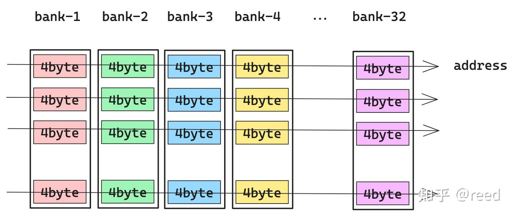

# cute 之 Swizzle

**Author:** [reed](https://www.zhihu.com/people/reed)

**Link:** [https://zhuanlan.zhihu.com/p/671419093](https://zhuanlan.zhihu.com/p/671419093)

---

前面的文章我们介绍了[GEMM中的流水线技术](https://zhuanlan.zhihu.com/p/665082713)，流水线的核心是将[拷贝](https://zhuanlan.zhihu.com/p/666232173)和[计算](https://zhuanlan.zhihu.com/p/663092747)并行或者说是将数据加载隐藏在计算过程中。矩阵计算中的数据加载是从全局内存到共享内存然后到寄存器，共享内存作为中间的媒介可以减少矩阵计算时对全局内存的访问数据量，从而提升计算访存比。共享内存为了提升访问的并行性采用多bank结构，这也造成了编程时的困难，CuTe通过提供swizzle抽象简化了逻辑空间和多bank存储空间的映射的复杂度。本文首先介绍shared memory的多bank存储结构，之后介绍矩阵计算中ldmatrix指令对逻辑空间和存储空间的要求，接着介绍异或运算的特性和Swizzle抽象，最后简单介绍Thread Block Swizzle并进行总结。

## 局部性原理和Shared Memory

局部性原理（Principle of Locality）是计算机科学的基石之一，它包括空间局部性和时间局部性，其中空间局部性（也叫数据局部性）是指对数据的使用会限制在一个相对临近的存储空间中。Cache是针对空间局部性的很好的解决方案，但是Cache的数据更新和替换逻辑一般会实现在硬件中，表现为不可编程。在SIMT（single Instruction Multiple Thread）编程模式下，线程私有的寄存器提供了线程级别的存储能力，有时线程间需要交换一些数据来协同地完成特定任务，为了追求更好的数据局部性和实现线程间的数据共享，提供可编程的、线程间可共享的Cache就显得尤其重要。CUDA在硬件SM（Stream Multiprocessor）上提供了Shared Memory存储机构，同时软件上提供了相应的读写接口和同步原语来实现其读写、同步和可见性，这样线程块内的线程便可以通过共享内存完成数据共享，同时对于线程块公共使用的数据便可以存储在其中达到线程块级别的可编程的数据局部性。

由于Shared Memory是为线程块服务的，所以其必须能支持线程块内的线程并行地对其进行访问（包含数据读取和写入）。为了保障Shared Memory在多线程并发读写下的效率（更低的Latency和更高的Throughput），其硬件被实现为多bank模式，每个bank都是可以独立寻址的存储空间，bank之间可以并行地读写数据，相互不会影响。在NVIDIA的架构中，shared memory包含32个bank，bank中可寻址的基本单元为4byte，如图1所示，每个bank为黑框所包含的单元，用户看到的地址空间为箭头所示的方向，即相邻的4byte占用不同的bank。

*Figure 1. 共享内存bank结构和地址连续方向*

如图2，当32个线程同时访问32个不同的bank时，各个bank是并行执行的，其效率是最高的，即32个线程并发的访问32个bank中不同颜色的单元，是可以并行的，值得注意的是其中的线程编号（如图2中的T0所示）和bank中的行位置并没有连续性要求。

*Figure 2. 无bank conflict的共享内存访问模式*

如图3，如果某两个线程T0、T2要同时访问相同bank-2的不同地址，则这两次访问会被排队执行，即先访问该bank的一个地址，然后再访问第二个地址，这样两次访问虽然在发射任务维度上（产生访问请求指令）时间维度上是并行的，但是在真正bank读写数据在时间维度上是串行的。这就是所谓的bank conflict。图中一个bank上有两次冲突，这种情况称为二路冲突（two-way conflict）。

*Figure 3. 两路冲突的共享内存访问模式*

为了减少指令数，我们在进行kernel优化时会采用向量化的读写指令（也叫大字长读写），如以128bit的形式读写共享内存。此时每个线程一次访问16byte的数据，而一个bank的寻址单元为4byte，因此一次16byte的访问横跨4个连续bank。32个线程共需 16byte x 32 = 512byte，但32个线程同时各占4个bank会产生冲突，硬件将32个线程分成4个phase（批次）依次执行：

| Phase   | 线程    | 每线程访问        | 覆盖 bank |
| --------- | --------- | ------------------- | ----------- |
| Phase 0 | T0-T7   | 各16byte (4 bank) | 32 bank   |
| Phase 1 | T8-T15  | 各16byte (4 bank) | 同上      |
| Phase 2 | T16-T23 | 各16byte (4 bank) | 同上      |
| Phase 3 | T24-T31 | 各16byte (4 bank) | 同上      |

每个phase内8个线程各占4个bank，刚好覆盖全部32个bank，无conflict。这里有一种等价的简化视角：如果把16byte看作不可分割的基本单元（而非原始的4byte），那么128byte的一行只有 128 / 16 = 8 个"逻辑bank"，每个phase内的8个线程各访问一个逻辑bank。conflict分析就简化为：同一phase内的8个线程是否访问了同一个逻辑bank。

同理，如果采用64bit（8byte）的访问形式，一次访问横跨2个bank，32个线程分成2个phase（每phase 16线程），等价地可以看作基本单元为8byte、逻辑bank数为16，conflict分析变成同一phase内16个线程是否冲突。

整体上shared memory空间可以看作二维存储空间，其中列方向表示bank情况，行方向表示自由定义的大小。值得注意的是，冲突与否是通过内存访问事务级别来判定的，具体的可以参考[NVIDIA开发者论坛的讨论](https://forums.developer.nvidia.com/t/how-to-understand-the-bank-conflict-of-shared-mem/260900)。

## 共享内存读取（ldmatrix指令）

在GEMM流水线中，利用Tensor Core可以完成特定规格的矩阵乘法计算（如 $D_{16\times8} = A_{16\times16} B_{16\times8} + C_{16\times8}$）。Tensor Core执行MMA指令时，矩阵数据并非存储在某一个线程中，而是由warp内32个线程各贡献一部分寄存器共同表示。如图4中右侧的register file所示，矩阵数据在warp内按线程（T0-T31）和每个线程持有的寄存器片段（V0, V1, ...）两个维度分布。以最小的8x8 half矩阵块为例，该块共64个元素、128byte数据，由32个线程分摊，每个线程贡献 128 / 32 = 4byte，即一个32bit寄存器（图中的V0）。当MMA指令处理更大的矩阵时（如16x16 = 4个8x8块），每个线程需要持有多个寄存器（V0, V1, V2, V3），多个8x8块拼成更大的16x16、16x8块。

*Figure 4. ldmatrix输入和输出数据*

**ldmatrix的作用**：将共享内存中的矩阵数据加载到warp内各线程的寄存器中（warp级数据分发）。以一个8x8-half的矩阵块为例（与第5章相同），ldmatrix需要8个shared memory地址作为输入，每个地址指向16byte的数据（即矩阵的一行，8个half = 16byte）。指令执行后数据被分发到各线程的寄存器中：T0提供的Addr0指向的16byte数据被分派到T0-T3的V0寄存器，T1提供的Addr1的数据被分派到T4-T7的V0寄存器，以此类推。

**对共享内存布局的约束**：ldmatrix按16byte粒度读取共享内存。按前一节的分析，以16byte为基本单元时逻辑bank数为8，T0-T7这8个线程构成一个phase。这意味着ldmatrix一次读取的8行数据（8个16byte地址）必须分布在不同的逻辑bank中，否则同一phase内的线程会产生bank conflict。

以8x8 half矩阵为例，ldmatrix读取8行，每行16byte。如果这个8x8块独立存储（stride = 16byte，行紧密排列），8行的逻辑bank编号为0, 1, 2, ..., 7，恰好覆盖全部8个逻辑bank，不会冲突。

但在实际GEMM中，共享内存存放的是更大的tile（如16x32 half矩阵，stride = 64byte），8x8块只是其中一部分。ldmatrix读取该块时，相邻行地址的间隔等于tile的行宽而非16byte。以stride = 64byte为例：

| 行    | 地址偏移 | 逻辑bank（地址 / 16 mod 8） |
| :------ | :--------- | :---------------------------- |
| Row 0 | 0        | 0                           |
| Row 1 | 64       | 4                           |
| Row 2 | 128      | 0                           |
| Row 3 | 192      | 4                           |
| Row 4 | 256      | 0                           |
| Row 5 | 320      | 4                           |
| Row 6 | 384      | 0                           |
| Row 7 | 448      | 4                           |

8行只用到了2个逻辑bank，产生4路冲突。一般来说，stride每增大一倍，冲突程度就翻倍，直到stride = 128byte时8行全部落在同一个bank，达到最严重的8路冲突。图5展示了经过swizzle后ldmatrix无bank conflict的布局形式。

*Figure 5. ldmatrix指令无bank conflict时的bank占用情况*

这里存在逻辑空间和物理空间的矛盾：数学上，8x8 half矩阵是连续的二维块; 但在共享内存中，它的各行被嵌入更大tile的行中，行间距由tile宽度决定，导致bank分布不再均匀。因此物理布局不能简单按逻辑顺序向下排列各行，而需要在bank方向（横向）上将行错开排布，使ldmatrix每次读取的8行落在不同bank中。这就是后续Swizzle抽象要解决的问题。

## Shared Memory写入

前面讨论了共享内存的读取端（ldmatrix）对布局的要求，写入端同样有约束。如图6上半部分所示，GEMM数据路径为全局内存 → 共享内存 → 寄存器，逻辑上寄存器中的矩阵片段与全局内存中的数据位置一一对应，但共享内存作为中间层，其物理布局需要同时满足读写两端的要求：

- **写入端**：从全局内存加载数据时，为了实现合并访存和充分利用L2 cache line，线程需要沿地址连续方向排列（如图6中左上角T0→Tn所示）。
- **读取端**：如前所述，ldmatrix要求同一phase的8行落在不同逻辑bank，共享内存中的数据需要做行的横向错开，不能按简单的行列顺序存储。

因此全局内存到共享内存的搬运需要协调两件事：全局内存侧按线性地址顺序读取以保证合并访存，**共享内存侧按错开后的地址写入以满足后续ldmatrix的无冲突读取**。编程时思考的是逻辑空间（矩阵的行列结构），实际存储时需要映射到物理空间（bank-aware的布局）。

*Figure 6. 数据加载的逻辑空间和物理空间*

## 异或运算的封闭性和双射性

异或（XOR，符号 ^）对两个输入按位运算：相同位输出 0，不同位输出 1。例如 5 ^ 3 = b0101 ^ b0011 = b0110 = 6。异或满足交换律和结合律，但对 swizzle 来说最重要的性质是**双射性**（bijectivity）：在集合 $S = \{x \mid x \in [0, 2^n-1]\}$ 中，固定一个值 $k$，映射 $f(x) = x$ ^ $k$ 是双射，即不同的输入一定产生不同的输出。这保证了异或变换不会让两个不同的行映射到同一个 bank。

如图7所示，利用这个性质可以消除 bank 冲突。假设矩阵的逻辑位置为 $(irow, icol)$，其中 icol 决定数据落在哪个 bank，不做变换时，同一列（相同 icol）的所有行都落在同一个 bank，产生冲突。通过 ibank = irow ^ icol 将行号异或到列号中，同一列的不同行就被分散到了不同 bank。图7左侧展示了 icol = 1 的列（8 行数据原本都在 bank 1），右侧的表格是完整的异或映射 irow ^ icol。以 icol = 1 列（黑框标注）为例，各行的 ibank 计算为：0^1=1, 1^1=0, 2^1=3, 3^1=2, 4^1=5, 5^1=4, 6^1=7, 7^1=6，8 个 bank 全部不同，避免了冲突。

*Figure 7. 使用异或避免共享内存bank冲突*

## Swizzle抽象

CuTe 通过 Swizzle 抽象将逻辑空间映射到无 bank 冲突的物理空间。回顾之前的介绍，[Layout（本质是函数）](https://zhuanlan.zhihu.com/p/661182311)将逻辑坐标映射为一维 offset：$offset = Layout(coord)$。Swizzle 在此基础上对 offset 再做一次变换： $offset_{safe} = Swizzle(Layout(coord))$，两者的组合本质上是函数的复合。Swizzle 由三个参数 **B、M、S** 定义，它们控制如何将一维 offset 解读为二维结构，然后对行列做异或。三个参数的含义为：$2^M$是基本单元的大小，一维中连续 $2^M$ 个元素打包为二维空间的一个格子; $2^S$是二维空间的列数; $2^B$是二维空间的行数

如图8所示，以 B=1, M=1, S=2 为例，一维 offset 序列被分三步变换为无冲突的布局：

1. **分组**：每 $2^M = 2$ 个连续元素打包为一个基本单元（对应图中一个色块）。
2. **折叠为二维**：每 $2^S = 4$ 个基本单元组成一行，共 $2^B = 2$ 行，形成 2-D(a)。此时 irow=0 的 4 个单元和 irow=1 的 4 个单元分别占据相同的 4 列（icol = 0,1,2,3），如果直接映射到 bank，两行的同列数据会产生两路冲突。
3. **异或重排**：对每个单元执行 icol_new = irow ^ icol，得到 2-D(b)。irow=0 时列号不变（0^0=0, 0^1=1, 0^2=2, 0^3=3），irow=1 时列号被打乱（1^0=1, 1^1=0, 1^2=3, 1^3=2），两行不再有同列的单元。

如果一维数据长度超过一个周期（$2^{B+M+S} = 16$ 个元素），超出部分的行号从 0 重新开始，但 offset 累加前面的总量，相当于新一轮 swizzle 周期。

*Figure 8. Swizzle的计算逻辑*

**实际示例**：共享内存中有一块 half 类型数据，shape (8, 32)、stride (32, 1)，定义 `Swizzle<3, 3, 3>` 作用于该 Layout，即 `A = Composition(Swizzle<3, 3, 3>{}, Layout<Shape<8, 32>, Stride<32, 1>>{})` 。B、M、S 不是任意选的，需要匹配访存粒度和 bank 结构：

- **M = 3（由访问宽度决定）**：ldmatrix 以 16byte 为粒度读取，half 类型下 16byte = 8 个元素 = $2^3$，所以 M = 3。$2^M$ 个元素构成二维空间中一个基本单元，对应一个逻辑 bank 的宽度。如果是 float 类型，16byte = 4 个元素，M = 2。
- **S = 3（由逻辑 bank 数决定）**：共享内存 32 个物理 bank x 4byte = 128byte 为一个 bank 周期，以 16byte 粒度划分有 128 / 16 = 8 = $2^3$ 个逻辑 bank，所以 S = 3。由于 ldmatrix 始终以 16byte 为粒度读取，bank 周期也固定为 128byte，因此 S 在 ldmatrix 场景下总是 3（CUTLASS 源码中 sm80 和 sm90 的 Swizzle 也均使用 S=3）。
- **B = 3（swizzle 周期）**：$2^B$ = 8 行为一个异或周期。约束为 B $\le$ S，因为行号的 B 位要与列号的 S 位做异或，行号位数不能超过列号位数。B 越大，能无冲突覆盖的行数越多。

行列异或后，每行的列号被重排，使同一列上不同行的数据散布到不同 bank，消除 ldmatrix 读取时的冲突。

## Thread Block Swizzle

除了共享内存层面的 swizzle，CuTe（CUTLASS）中还有 thread block swizzle，用于优化 L2 cache 命中率。

在以 C 矩阵为中心的任务划分中，thread block 默认按行优先或列优先线性分配给各 SM（如图9左侧，SM0-3 按列顺序排列）。这种分配下，相邻 SM 处理的 C 块在 A、B 矩阵方向上的数据复用率较低。Thread Block Swizzle 重排了 thread block 到 SM 的映射关系（如图9右侧），使相邻 SM 处理的 C 块在 A 或 B 方向上有更多重叠，这些重叠数据更容易被 L2 cache 命中。具体实现可参考 CUTLASS 中的 [thread block swizzle](https://github.com/NVIDIA/cutlass/blob/main/include/cutlass/gemm/threadblock/threadblock_swizzle.h)。

**为什么重排能提升 L2 cache 命中率？** 矩阵乘 C = A x B 中，C 的每个 tile C[i][j] 需要读取 A 的第 i 行和 B 的第 j 列（沿 K 方向的一系列块），因此 C 矩阵中同行的块复用 A，同列的块复用 B。GPU 上多个 SM 并发执行，L2 cache 由所有 SM 共享。

默认行优先映射下（如图9左侧），SM0-SM3 分别处理 C[0][0]、C[0][1]、C[0][2]、C[0][3]，全部在第 0 行。它们共享 A 的第 0 行数据，但各自需要 B 的不同列，B 方向没有复用。每个 SM 独立从 DRAM 加载自己需要的 B 数据，L2 容量有限时先加载的数据很快被驱逐。

Swizzle 后 SM0 和 SM1 同处第 0 行（共享 A 第 0 行），SM0 和 SM2 同处第 0 列（共享 B 第 0 列），A 和 B 两个方向都产生了复用。当 SM0 将 B 第 0 列加载到 L2 后，SM2 直接从 L2 命中，无需再访问 DRAM。这就是 swizzle 利用 GEMM 天然的二维数据复用结构，通过调整 thread block 的空间分布使 L2 cache 的时间/空间局部性最大化的原理。

*Figure 9. Thread Block Swizzle*

## 总结

本文从共享内存的 bank 结构出发，分析了 ldmatrix 读取和全局内存写入对共享内存布局的约束，引入异或运算的双射性来消除 bank 冲突，并介绍了 CuTe 的 Swizzle<B, M, S> 抽象和 Thread Block Swizzle。至此矩阵乘法优化的理论部分已全部介绍完毕，下一篇文章将利用这些方法完成一个高效的矩阵乘法实现。

## 参考

1. [Locality of reference - Wikipedia](https://en.wikipedia.org/wiki/Locality_of_reference)
2. [Volta Architecture and Performance Optimization - GTC 2018](https://on-demand.gputechconf.com/gtc/2018/presentation/s81006-volta-architecture-and-performance-optimization.pdf)
3. [US Patent 8108625 - Shared Memory Bank Structure](https://patentimages.storage.googleapis.com/44/ed/9d/7b0c401348f57b/US8108625.pdf)
4. [US Patent 7680988 - Memory Access Conflict Resolution](https://patentimages.storage.googleapis.com/e7/27/98/de3cbfc7ab3b8c/US7680988.pdf)
5. [CUTLASS threadblock_swizzle.h - GitHub](https://github.com/NVIDIA/cutlass/blob/main/include/cutlass/gemm/threadblock/threadblock_swizzle.h)
6. [How to understand the bank conflict of shared_mem - NVIDIA Developer Forums](https://forums.developer.nvidia.com/t/how-to-understand-the-bank-conflict-of-shared-mem/260900)
