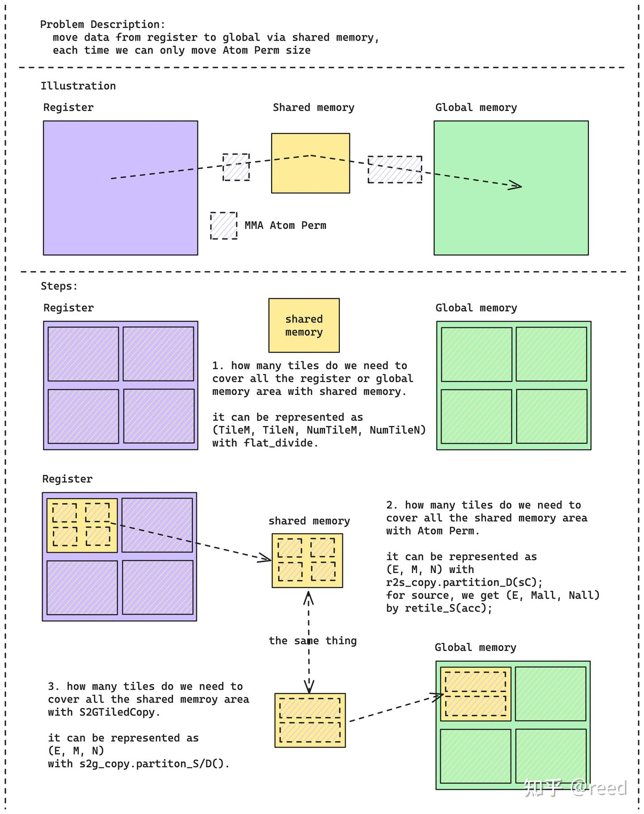

# cute 之 高效GEMM实现

**Author:** [reed](https://www.zhihu.com/people/reed)

**Link:** [https://zhuanlan.zhihu.com/p/675308830](https://zhuanlan.zhihu.com/p/675308830)

---

前面的文章介绍了 CuTe 中的 [Layout](https://zhuanlan.zhihu.com/p/661182311)、[Tensor](https://zhuanlan.zhihu.com/p/663093816)、[MMA](https://zhuanlan.zhihu.com/p/663092747)、[Copy](https://zhuanlan.zhihu.com/p/666232173)、[Swizzle](https://zhuanlan.zhihu.com/p/671419093) 抽象和[流水线技术](https://zhuanlan.zhihu.com/p/665082713)。本文将这些抽象组合起来，从计算、访存、算法、尾阶段（Epilogue）四个维度实现高效的矩阵乘法，并与 cuBLAS/cuBLASLt 进行性能对比。

## 计算高效

GEMM 的核心是块状矩阵乘法。针对 half 精度输入、half 精度 Accumulator 的计算任务，Ampere 架构在 Tensor Core 上提供了两条 MMA 指令：

* `mma.sync.aligned.m16n8k8.row.col.f16.f16.f16.f16`
* `mma.sync.aligned.m16n8k16.row.col.f16.f16.f16.f16`

CuTe 将它们抽象为 `SM80_16x8x8_F16F16F16F16_TN` 和 `SM80_16x8x16_F16F16F16F16_TN` 两个 MMA_Operation。问题规格较大时应优先选用 k 维更大的指令（m16n8k16），单条指令计算量更大，可以减少指令数、提升调度效率。

如图1所示，选定指令后，通过 MMA_Traits 补充计算形状、协作线程数（32 线程/warp）、A/B 矩阵的寄存器 Layout 等信息，封装为 MMA_Atom（单条指令的原子计算能力）。在 Atom 基础上，通过增加线程数和每线程重复次数扩展为 TiledMMA（块状计算能力），TiledMMA 按线程号拆分为 ThrMMA（线程级计算能力），最终调用 `cute::gemm` 完成矩阵乘法。


*Figure 1. MMA能力层次和各层的主要功能*

此时，我们便可以得到如下主机端代码

```cpp
using mma_op = SM80_16x8x16_F16F16F16F16_TN;
using mma_traits = MMA_Traits<mma_op>;
using mma_atom = MMA_Atom<mma_traits>;
static constexpr int kMmaEURepeatM = 2;
static constexpr int kMmaEURepeatN = 2;
static constexpr int kMmaEURepeatK = 1;
static constexpr int kMmaVRepeatM = 1;
static constexpr int kMmaVRepeatN = 2;
static constexpr int kMmaVRepeatK = 1;
using MMA_EU_RepeatT = decltype(make_layout(make_shape(
    Int<kMmaEURepeatM>{}, Int<kMmaEURepeatN>{}, Int<kMmaEURepeatK>{})));
using MMA_V_RepeatT = decltype(make_layout(make_shape(
    Int<kMmaVRepeatM>{}, Int<kMmaVRepeatN>{}, Int<kMmaVRepeatK>{})));
using MMA =
    decltype(make_tiled_mma(mma_atom{}, MMA_EU_RepeatT{}, MMA_V_RepeatT{}));
```

前三行选择 MMA 指令并构建 Atom。`kMmaEURepeat` 控制线程维度的重复（EU = Execution Unit），`kMmaVRepeat` 控制寄存器维度的重复（V = Value），两者组合后通过 `make_tiled_mma` 构建块状 MMA 描述。设备端代码如下：

```cpp
TiledMMA tiled_mma;
auto thr_mma = tiled_mma.get_slice(idx);
auto tCrA = thr_mma.partition_fragment_A(gA(_, _, 0)); // (MMA, MMA_M, MMA_K)
auto tCrB = thr_mma.partition_fragment_B(gB(_, _, 0)); // (MMA, MMA_N, MMA_K)
auto tCrD = thr_mma.partition_fragment_C(gD); // (MMA, MMA_M, MMA_N)
```

通过 `get_slice(idx)` 将 TiledMMA 按线程号拆分为 ThrMMA，再用 `partition_fragment_A/B/C` 对数据块进行划分，得到线程级的寄存器描述。如图2所示，其展示了`partition_A/B/C` 和 `partition_fragment_A/B/C` 的划分逻辑，以 TiledMMA 描述的矩阵大小对目标 Tensor 做周期性平铺，选取当前线程对应的部分，形成三维结果 `(MMA, MMA_M, MMA_K)`。第一维是单线程持有的数据，第二、三维是行列方向的重复次数。如果输入 Tensor 超过两维，多出的维度附加在后面。A/B/C 的划分逻辑相同。


*Figure 2. partition_A/B/C逻辑示意图*

## 访存高效

数据到达 Tensor Core 之前需要经过两段搬运：全局内存 → 共享内存（cp.async），共享内存 → 寄存器（ldmatrix）。与 MMA 类似，CuTe 为每段搬运提供了现成的 Copy_Operation 抽象。

**全局内存 → 共享内存**：选择 `SM80_CP_ASYNC_CACHEGLOBAL` 作为 Copy_Operation，该指令实现异步拷贝，同时 `CACHEGLOBAL` 指示数据只在 L2 做 cache，bypass L1。主机端代码如下：

```cpp
  using g2s_copy_op = SM80_CP_ASYNC_CACHEGLOBAL<cute::uint128_t>;
  using g2s_copy_traits = Copy_Traits<g2s_copy_op>;
  using g2s_copy_atom = Copy_Atom<g2s_copy_traits, T>;

  using G2SCopyA =
      decltype(make_tiled_copy(g2s_copy_atom{},
                               make_layout(make_shape(Int<32>{}, Int<4>{}),
                                           make_stride(Int<4>{}, Int<1>{})),
                               make_layout(make_shape(Int<1>{}, Int<8>{}))));
  using G2SCopyB = G2SCopyA;
```

与 `make_tiled_mma` 类似，`make_tiled_copy` 通过指定线程和数据的重复方式将 Atom 扩展为块状拷贝。A/B 可以使用不同的 Copy 策略，此处选用相同的配置。设备端代码如下：

```cpp
G2SCopyA g2s_tiled_copy_a;
auto g2s_thr_copy_a = g2s_tiled_copy_a.get_slice(idx);
auto tAgA_copy = g2s_thr_copy_a.partition_S(gA); // (CPY, CPY_M, CPY_K, k)
auto tAsA_copy =
    g2s_thr_copy_a.partition_D(sA); // (CPY, CPY_M, CPY_K, kStage)
```

与 MMA 划分类似，ThrCopy 的 `partition_S/D` 将大块 Tensor 按线程划分，结果维度为 `(CPY, CPY_M, CPY_K)`：CPY 是该线程单次拷贝的数据量，CPY_M/CPY_K 是行列方向的重复次数。超过两维的输入，多出维度附加在后面。

**共享内存 → 寄存器**：CuTe 封装了 ldmatrix 指令，主机端和设备端代码如下：

```cpp
// shared memory to register copy
using s2r_copy_op = SM75_U32x4_LDSM_N;
using s2r_copy_traits = Copy_Traits<s2r_copy_op>;
using s2r_copy_atom = Copy_Atom<s2r_copy_traits, T>;
using S2RCopyAtomA = s2r_copy_atom;
using S2RCopyAtomB = s2r_copy_atom;
```

设备端代码：

```cpp
auto s2r_tiled_copy_a = make_tiled_copy_A(S2RCopyAtomA{}, tiled_mma);
auto s2r_thr_copy_a = s2r_tiled_copy_a.get_slice(idx);
auto tAsA = s2r_thr_copy_a.partition_S(sA); // (CPY, CPY_M, CPY_K, kStage)
auto tCrA_view = s2r_thr_copy_a.retile_D(tCrA); // (CPY, CPY_M, CPY_K)
```

主机端选择 ldmatrix 的 `.x4` 模式形成 Atom。设备端通过 `make_tiled_copy_A` 直接利用 `tiled_mma` 的信息构建 TiledCopy，而不是像全局内存拷贝那样手动指定线程和数据重复方式。这样做的原因是 TiledMMA 已经包含了计算所需的数据分布信息，用它来驱动 Copy 可以避免独立设置导致的不一致。由于 MMA 阶段已分配了寄存器空间（`tCrA`），这里用 `retile_D` 将其变换为拷贝指令要求的形状，而非重新 partition。

## 算法高效

前面两个章节介绍了计算的高效和访存的高效，如何将这两个步骤组合起来也是GEMM性能的关键要素，这部分我们成为算法的高效，主要涉及分块和流水线两部分（详见前序的简单 GEMM 和流水线文章）。分块部分的主机端和设备端代码如下：

```cpp
static constexpr int kTileM = kTileM_;
static constexpr int kTileN = kTileN_;
static constexpr int kTileK = kTileK_;
static constexpr int kStage = kStage_;
```

设备端：

```cpp
  // slice the tensor to small one which is used for current thread block.
  Tensor gA = local_tile(A, make_tile(Int<kTileM>{}, Int<kTileK>{}),
                         make_coord(iy, _));  // (kTileM, kTileK, k)
  Tensor gB = local_tile(B, make_tile(Int<kTileN>{}, Int<kTileK>{}),
                         make_coord(ix, _));  // (kTileN, kTileK, k)
  Tensor gD = local_tile(D, make_tile(Int<kTileM>{}, Int<kTileN>{}),
                         make_coord(iy, ix));  // (kTileM, kTileN)

  // shared memory
  auto sA = make_tensor(make_smem_ptr(Ashm),
                        SmemLayoutA{});  // (kTileM, kTileK, kStage)
  auto sB = make_tensor(make_smem_ptr(Bshm),
                        SmemLayoutB{});  // (kTileN, kTileK, kStage)
```

主机端定义了 Tile 大小，设备端通过 `local_tile` 将全局矩阵按 Tile 切分。

流水线方面，multi-stage 流水线需要在共享内存分配时预留多个 stage 的空间，同时设备端做数据加载和计算的重叠。主机端的共享内存 Layout 定义如下：

```cpp
  static constexpr int kShmLoadSwizzleM = 3;
  static constexpr int kShmLoadSwizzleS = 3;
  static constexpr int kShmLoadSwizzleB = 3;

  using SmemLayoutAtom = decltype(composition(
      Swizzle<kShmLoadSwizzleB, kShmLoadSwizzleM, kShmLoadSwizzleS>{},
      make_layout(make_shape(Int<8>{}, Int<kTileK>{}),
                  make_stride(Int<kTileK>{}, Int<1>{}))));
  using SmemLayoutA = decltype(
      tile_to_shape(SmemLayoutAtom{},
                    make_shape(Int<kTileM>{}, Int<kTileK>{}, Int<kStage>{})));
  using SmemLayoutB = decltype(
      tile_to_shape(SmemLayoutAtom{},
                    make_shape(Int<kTileN>{}, Int<kTileK>{}, Int<kStage>{})));
```

其中 Swizzle 用于避免 bank conflict（详见前序 Swizzle 文章），`kStage` 为流水线级数。

核心设备端代码由外层 Tile 循环和内层 k 循环组成：

```cpp
  // loop over k: i. load tile, ii. mma
  int ntile = k / kTileK;
#pragma unroll 1
  for (int itile = 0; itile < ntile; ++itile) {
    int nk = size<2>(tCrA);

#pragma unroll
    for (int ik = 0; ik < nk; ++ik) {
      int ik_next = (ik + 1) % nk;

      if (ik == nk - 1) {
        cp_async_wait<kStage - 2>();
        __syncthreads();

        ismem_read = (ismem_read + 1) % kStage;
      }

      // shm -> reg s[itile][ik + 1] -> r[ik + 1]
      cute::copy(s2r_tiled_copy_a, tAsA(_, _, ik_next, ismem_read),
                 tCrA_view(_, _, ik_next));
      cute::copy(s2r_tiled_copy_b, tBsB(_, _, ik_next, ismem_read),
                 tCrB_view(_, _, ik_next));

      if (ik == 0) {
        if (itile_to_read < ntile) {
          cute::copy(g2s_tiled_copy_a, tAgA_copy(_, _, _, itile_to_read), tAsA_copy(_, _, _, ismem_write));
          cute::copy(g2s_tiled_copy_b, tBgB_copy(_, _, _, itile_to_read), tBsB_copy(_, _, _, ismem_write));

          ++itile_to_read;
          ismem_write = (ismem_write + 1) % kStage;
        }

        cp_async_fence();
      }

      cute::gemm(tiled_mma, tCrD, tCrA(_, _, ik), tCrB(_, _, ik), tCrD);
    }  // for ik
  }    // itile
```

外层循环遍历 K 方向的 Tile，内层循环在 Tile 内沿 k 方向迭代。流水线调度的逻辑分布在两个位置：`ik == nk - 1` 时等待前序 cp.async 完成并切换读取 stage（`cp_async_wait` + `__syncthreads`）; `ik == 0` 时发射下一个 Tile 的全局内存到共享内存拷贝（`cp_async_fence` 标记异步边界）。

## 尾阶段高效（Epilogue）

经过前面的计算流水线，矩阵乘结果以 fragment 形式分布在各线程的寄存器中。如图3所示，如果将寄存器数据直接写回全局内存，由于 MMA fragment 的布局与全局内存的行连续布局不一致，会导致地址不连续，无法使用向量化存储指令（STG.128），这将导致存储时需要更多的内存事务。


*Figure 3. 寄存器堆直接存储至全局内存引入的不连续*

针对这个问题，cute中（实质为cutlass中），专门提供了Epilogue来通过共享内存作为中间媒介。先将寄存器数据存储到共享内存，然后再从共享内存中以更连续、更高位宽的形式存储到全局内存中去。PACT'20 Fireiron文章有对该问题的详细探讨，可以参考之。

本文通过共享内存实现高效的TileC的存储，具体代码可以参考github上的实现，整体过程如图4所示。


*Figure 4. Epilogue中Accumulator寄存器通过共享内存实现到全局内存的数据搬运*


## 试验设置和结果

基于上述优化方法，我们用 CuTe 实现了 Multi-Stage GEMM（代码：[cute-gemm](https://github.com/reed-lau/cute-gemm)）。

**问题规格**：M=81920, N=256, K=256，A 行优先、B 列优先、C 行优先，数据类型均为 half。

**测试环境**：RTX 3090，Ubuntu 20.04.6 LTS，驱动 535.113.01，NVCC V11.7.64，cuBLAS/cuBLASLt 版本 111001。

**测量方法**：使用 Nsight Compute 精确计时，设置 `--cache-control=all` 清空 L2 cache、`--clock-control=base` 锁定 GPU 频率，避免缓存和调频对测量的干扰。每个 kernel 运行 11 次，统计均值、方差和中位数。cuBLASLt 通过启发式算法选出 5 个 kernel 参与对比：

| 所属库 | kernel名称 | 均值(us) | 方差(us) | 中位数(us) |
| --- | --- | --- | --- | --- |
| our-impl | gemm_multi_stage | 130.1 | 0.4 | 130.1 |
| cuBLAS | ampere_h1688gemm_128x128_ldg8_stages_32x1_tn | 153.4 | 2 | 154.1 |
| cuBLASLt | ampere_h16816gemm_128x64_ldg8_tn | 154.0 | 0.5 | 154.1 |
| cuBLASLt | ampere_h16816gemm_256x128_ldg8_stages_32x3_tn | 154.2 | 0.6 | 154.2 |
| cuBLASLt | ampere_h1688gemm_128x128_ldg8_stages_32x1_tn | 153.4 | 2 | 154.1 |
| cuBLASLt | ampere_h1688gemm_128x128_ldg8_tn | 136.5 | 0.7 | 136.5 |
| cuBLASLt | cutlass_80_tensorop_h16816gemm_128x256_32x3_tn_align2 | 183.4 | 0.7 | 183.4 |

均值和中位数基本一致，测量结果稳定。我们的实现为 130.1 us，cuBLAS/cuBLASLt 最优为 136.5 us，在该问题规格下达到 SOTA。

## 总结和讨论

### 启发式算法

代码中有多个可调参数（kTileM、kTileN、kTileK、kStage 等），不同问题规格需要不同的参数组合。参数选择可以通过理论建模推导，也可以通过离线穷举不同配置的性能，归纳出启发式规则。本文只针对单一规格做了优化，未涉及参数搜索，实际中可以参考 cuBLAS 选中的 kernel 配置作为起点。

### 参数相容性

MMA 和 Copy 都需要设置大量参数（Layout、线程数、寄存器重复、Tile 大小等），这些参数之间并非完全独立，受共享内存容量、寄存器数量、线程块大小、数据划分方式等约束。调优时需要确保参数组合的一致性。

### 其它方面

本文还有一些未涉及的优化手段：Thread Block Swizzle（本例 N 较小，收益不明显）、`__launch_bounds__` 编译器提示、地址非对齐和 Tile 非整除的边界处理。此外 CUTLASS 已基于 CuTe 封装了 Collective Mainloop 和 Epilogue 抽象，通用性更好，实际项目中可以直接使用。

### 总结

本文从计算、访存、算法、Epilogue 四个维度介绍了 GEMM 的高效实现，并对核心代码进行了解读。在特定规格下，基于 CuTe 的实现性能超过了 cuBLAS/cuBLASLt。

掌握 CuTe 的 Layout、Tensor、MMA、Copy 抽象后，可以快速构建矩阵计算能力，并将其应用到更复杂的场景（如 Flash Attention）。本文是 CuTe 系列的最后一篇，希望系列文章能帮助大家快速上手 CuTe。

## 参考

[PACT'20 Fireiron](https://dl.acm.org/doi/10.1145/3410463.3414632)

[NVIDIA CUTLASS Epilogue](https://github.com/NVIDIA/cutlass/blob/main/include/cutlass/epilogue/collective/sm70_epilogue_vectorized.hpp)
