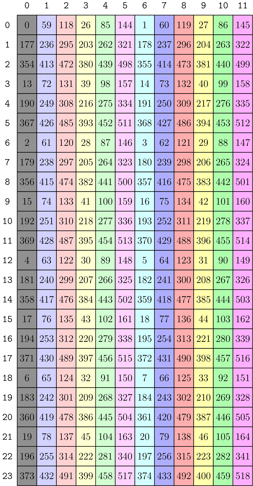

# CuTe Layout（布局）代数

CuTe 提供了一套「Layout 的代数」用于以不同方式组合 Layout。这套代数包含如下运算：

* Layout 的泛函复合 (composition)，
* Layout「乘积 (product)」的概念：按另一个 Layout 复制一个 Layout，
* Layout「除法 (divide)」的概念：按另一个 Layout 切分一个 Layout。

从简单 Layout 构建复杂 Layout 的通用工具主要依赖 Layout 乘积。将 Layout（例如数据）沿另一个 Layout（例如线程）进行分区 (partition) 的通用工具则依赖 Layout 除法。这些都建立在 Layout 的泛函复合之上。

本节中，我们将逐步搭建 Layout 代数的工具，并详细说明其中的核心运算。

## 合并 (Coalesce)

上一节中，我们将 Layout 总结为：
> Layout 是从整数到整数的映射。

`coalesce` 运算是对这种映射的一种「化简」。若我们只关心输入整数，则可以调整 Layout 的 Shape 和模式 (mode) 数量，而不改变其作为映射的性质。`coalesce` 唯一不能改变的是 Layout 的 `size`。

更具体地说，你可以在 [coalesce 单元测试](https://github.com/NVIDIA/cutlass/tree/main/test/unit/cute/core/coalesce.cpp) 中找到校验后的后置条件，这里复述如下：
```cpp
// @post size(@a result) == size(@a layout)
// @post depth(@a result) <= 1
// @post for all i, 0 <= i < size(@a layout), @a result(i) == @a layout(i)
Layout coalesce(Layout const& layout)
```

例如，

```cpp
auto layout = Layout<Shape <_2,Shape <_1,_6>>,
                     Stride<_1,Stride<_6,_2>>>{};
auto result = coalesce(layout);    // _12:_1
```

可以看到结果的模式更少，结构更「简单」。在实际计算中，这可以在坐标映射和索引 (index) 映射时节省若干运算（若它们是动态执行的）。

那么，这一化简是如何得到的？

* 我们已经见过，像 `(_2,_4):(_1,_2)` 这样的列优先 Layout 对一维坐标而言，与 `_8:_1` 作用相同。
* 大小为静态 1 的模式总是产生静态 0 的自然坐标。无论步幅 (stride) 为何，均可忽略这些模式。

推广到一般情形，考虑仅有两个整数模式 s0:d0 和 s1:d1 的 Layout。将合并后的结果记为 s0:d0 ++ s1:d1，则有四种情况：

1. `s0:d0  ++  _1:d1  =>  s0:d0`。忽略大小为静态 1 的模式。
2. `_1:d0  ++  s1:d1  =>  s1:d1`。忽略大小为静态 1 的模式。
3. `s0:d0  ++  s1:s0*d0  =>  s0*s1:d0`。若第二模式的步幅等于第一模式大小与步幅的乘积，则二者可以合并。
4. `s0:d0  ++  s1:d1  =>  (s0,s1):(d0,d1)`。否则无法合并，必须分开处理。

合并过程就是：对任意 Layout 做扁平化，然后按顺序对相邻模式两两应用上述二元运算，即可完成模式合并。

### 按模式合并 (By-mode Coalesce)

显然，有时我们确实关心 Layout 的 Shape，但仍希望做合并。例如，有一个二维 Layout，希望结果仍为二维。

为此，`coalesce` 提供了一个额外参数的重载：
```cpp
// Apply coalesce at the terminals of trg_profile
Layout coalesce(Layout const& layout, IntTuple const& trg_profile)
```

用法如下：

```cpp
auto a = Layout<Shape <_2,Shape <_1,_6>>,
                Stride<_1,Stride<_6,_2>>>{};
auto result = coalesce(a, Step<_1,_1>{});   // (_2,_6):(_1,_2)
// Identical to
auto same_r = make_layout(coalesce(layout<0>(a)),
                          coalesce(layout<1>(a)));
```

该函数会递归处理 `Step<_1,_1>{}`，在遇到整数（数值仅作标志）而非元组时，对相应的子 Layout 应用 `coalesce`。

> 这种先定义一个把 Layout 视为「一维」整数到整数映射的运算，再推广到任意形状 Layout 的模式，是 CuTe 中常用的设计方式。

## 复合 (Composition)

Layout 的泛函复合是 CuTe 的核心，几乎在所有高层运算中都会用到。

再次从「Layout 是从整数到整数的映射」出发，可以定义泛函复合，其结果仍是 Layout。先看一个例子。

```text
Functional composition, R := A o B
R(c) := (A o B)(c) := A(B(c))

Example
A = (6,2):(8,2)
B = (4,3):(3,1)

R( 0) = A(B( 0)) = A(B(0,0)) = A( 0) = A(0,0) =  0
R( 1) = A(B( 1)) = A(B(1,0)) = A( 3) = A(3,0) = 24
R( 2) = A(B( 2)) = A(B(2,0)) = A( 6) = A(0,1) =  2
R( 3) = A(B( 3)) = A(B(3,0)) = A( 9) = A(3,1) = 26
R( 4) = A(B( 4)) = A(B(0,1)) = A( 1) = A(1,0) =  8
R( 5) = A(B( 5)) = A(B(1,1)) = A( 4) = A(4,0) = 32
R( 6) = A(B( 6)) = A(B(2,1)) = A( 7) = A(1,1) = 10
R( 7) = A(B( 7)) = A(B(3,1)) = A(10) = A(4,1) = 34
R( 8) = A(B( 8)) = A(B(0,2)) = A( 2) = A(2,0) = 16
R( 9) = A(B( 9)) = A(B(1,2)) = A( 5) = A(5,0) = 40
R(10) = A(B(10)) = A(B(2,2)) = A( 8) = A(2,1) = 18
R(11) = A(B(11)) = A(B(3,2)) = A(11) = A(5,1) = 42
```

一个重要的结论是：上述定义的函数 `R(c) = k` 可以写成另一个 Layout：

```
R = ((2,2),3):((24,2),8)
```

且

```
compatible(B, R)
```

也就是说，`B` 的每个坐标 (coordinate) 也可以作为 `R` 的坐标。这正是泛函复合的应有性质，因为 `B` 定义了 `R` 的*定义域*。

你可以在 [composition 单元测试](https://github.com/NVIDIA/cutlass/tree/main/test/unit/cute/core/composition.cpp) 中找到大量示例及校验后的后置条件。后置条件与上面所述一致：
```cpp
// @post compatible(@a layout_b, @a result)
// @post for all i, 0 <= i < size(@a layout_b), @a result(i) == @a layout_a(@a layout_b(i)))
Layout composition(LayoutA const& layout_a, LayoutB const& layout_b)
```

### 复合的计算

首先有如下观察：

* `B = (B_0, B_1, ...)`。Layout 可以表示为子 Layout 的拼接 (concatenation)。

* `A o B = A o (B_0, B_1, ...) = (A o B_0, A o B_1, ...)`。当 `B` 为单射 (injective) 时，复合对拼接满足左分配律 (left-distributive)。

基于此，不妨设 `B = s:d` 是形状和步幅均为整数的 Layout，并设 `A` 为扁平化且合并后的 Layout。

当 `A` 为整数型 `A = a:b` 时，结果很简单：`R = A o B = a:b o s:d = s:(b*d)`。此时复合结果 `R` 是 `A` 的前 `s` 个元素，步幅为 `d`。

当 `A` 为多模式时，需要更仔细分析。用文字表述：`A o B = A o s:d`（其中 `s`、`d` 为整数）表示要：

1. 确定一个产生 `A` 中每隔 `d` 个元素的 Layout。

该中间 Layout 的 Shape 可由左起逐步对 `A` 的 Shape「除以」前 `d` 个元素得到。

例如，
* `(6,2) /  2 => (3,2)`
* `(6,2) /  3 => (2,2)`
* `(6,2) /  6 => (1,2)`
* `(6,2) / 12 => (1,1)`
* `(3,6,2,8) /  3 => (1,6,2,8)`
* `(3,6,2,8) /  6 => (1,3,2,8)`
* `(3,6,2,8) /  9 => (1,2,2,8)`
* `(3,6,2,8) / 72 => (1,1,1,4)`

计算步幅 Layout 的步幅时，上述运算的余数用来缩放 `A` 的步幅。例如，最后一个例子 `(3,6,2,8):(w,x,y,z) / 72` 产生步幅 `(72*w,24*x,4*x,2*z)`。

你可能已经注意到，Shape 只有在除以某些值时才能得到有意义的结果。这称为**步幅可除条件 (stride divisibility condition)**，CuTe 在可能时会做静态检查。

2. 保留新步幅 Layout 中 `A` 的前 `s` 个元素，使结果的 Shape 与 `B` 兼容。这可以通过对 `A` 的 Shape 从左起对前 `s` 个元素做「取模」得到。

例如，
* `(6,2) %  2 => (2,1)`
* `(6,2) %  3 => (3,1)`
* `(6,2) %  6 => (6,1)`
* `(6,2) % 12 => (6,2)`
* `(3,6,2,8) %  6 => (3,2,1,1)`
* `(3,6,2,8) %  9 => (3,3,1,1)`
* `(1,2,2,8) %  2 => (1,2,1,1)`
* `(1,2,2,8) % 16 => (1,2,2,4)`

该运算使结果的 Shape 与 `B` 兼容。

同样，该运算必须满足 **Shape 可除条件 (shape divisibility condition)** 才能得到有意义的结论，CuTe 在可能时会做静态检查。

由上述例子，可以构造复合 `(3,6,2,8):(w,x,y,z) o 16:9 = (1,2,2,4):(9*w,3*x,y,z)`。

---
#### 例 1 —— 复合计算的详细推导

下面给出一个更复杂的复合例子，两个操作数均为多模式，以说明前面引入的概念。
```
Functional composition, R := A o B
R(c) := (A o B)(c) := A(B(c))

Example
A = (6,2):(8,2)
B = (4,3):(3,1)

1. 利用 Layout 的左分配律与拼接性质，将复合写成：

R = A o B
  = (6,2):(8,2) o (4,3):(3,1)
  = ((6,2):(8,2) o 4:3, (6,2):(8,2) o 3:1)

---
1. 计算 `(6,2):(8,2) o 4:3`

- 首先计算步幅 Layout，

(6,2):(8,2) / 3 = (6/3,2):(8*3,2) = (2,2):(24,2)

- 然后保持 Shape 兼容，

(2,2):(24,2) % 4 = (2,2):(24,2)

---
2. 计算 `(6,2):(8,2) o 3:1`

- 首先计算步幅 Layout

(6,2):(8,2) / 1 = (6,2):(8,2)

- 然后保持 Shape 兼容，

(6,2):(8,2) % 3 = (3,1):(8,2)

---

将以上结果组合并对各模式做合并，得到

R = A o B
  = ((2, 2), 3): ((24, 2), 8)
```
#### 例 2 —— 将 Layout 重塑为矩阵

`20:2  o  (5,4):(4,1)`。复合公式。

这表示将 Layout `20:2` 按行优先解释为一个 5x4 矩阵。

1. ` = 20:2 o (5:4,4:1)`。将 Layout `(5,4):(4,1)` 写成子 Layout 的拼接。

2. ` = (20:2 o 5:4, 20:2 o 4:1)`。左分配律。

    * `20:2 o 5:4  =>  5:8`。平凡情形。
    * `20:2 o 4:1  =>  4:2`。平凡情形。

3. ` = (5:8, 4:2)`。复合 Layout 作为子 Layout 的拼接。

4. ` = (5,4):(8,2)`。最终复合 Layout。

#### 例 3 —— 将 Layout 重塑为矩阵

`(10,2):(16,4)  o  (5,4):(1,5)`

这表示将 Layout `(10,2):(16,4)` 按列优先解释为一个 5x4 矩阵。

1. ` = (10,2):(16,4) o (5:1,4:5)`。将 Layout `(5,4):(1,5)` 写成子 Layout 的拼接。

2. ` = ((10,2):(16,4) o 5:1, (10,2):(16,4) o 4:5)`。左分配律。

    * `(10,2):(16,4) o 5:1 => (5,1):(16,4)`。对 Shape 取模 5。
    * `(10,2):(16,4) o 4:5 => (2,2):(80,4)`。对步幅除法 5。

3. ` = ((5,1):(16,4), (2,2):(80,4))`。复合 Layout 作为子 Layout 的拼接。

4. ` = (5:16, (2,2):(80,4))`。按模式合并。

5. ` = (5,(2,2))):(16,(80,4))`。最终复合 Layout。

在 CuTe 中，若使用编译期 Shape 和 Stride，会得到完全相同的结果。
下面的 C++ 代码会输出 `(_5,(_2,_2)):(_16,(_80,_4))`。

```cpp
Layout a = make_layout(make_shape (Int<10>{}, Int<2>{}),
                       make_stride(Int<16>{}, Int<4>{}));
Layout b = make_layout(make_shape (Int< 5>{}, Int<4>{}),
                       make_stride(Int< 1>{}, Int<5>{}));
Layout c = composition(a, b);
print(c);
```

若使用动态整数，下面的 C++ 代码会输出 `((5,1),(2,2)):((16,4),(80,4))`。

```cpp
Layout a = make_layout(make_shape (10, 2),
                       make_stride(16, 4));
Layout b = make_layout(make_shape ( 5, 4),
                       make_stride( 1, 5));
Layout c = composition(a, b);
print(c);
```

两种结果在*形式上*可能不同，但数学上等价。Shape 中的 1 不会影响 Layout 作为从一维坐标到整数的映射，或从二维坐标到整数的映射。在动态情形下，由于包含它们的元组的静态秩和类型限制，CuTe 无法对动态大小 1 的模式做合并以「简化」Layout。

### 按模式复合 (By-mode Composition)

与按模式 coalesce 类似，并为通用的分块运算做铺垫，有时我们确实关心 `A` 的 Shape，但仍希望对各模式分别做 `composition`。例如，我有一个二维 Layout，希望对列方向上的元素取一个子 Layout，对行方向上的元素取另一个子 Layout。

因此，当 `composition` 的第二个参数——`B`——是 Tiler 时也可工作。一般地，tiler 是一个 Layout 或 Layout 的元组（注意对 IntTuple 的推广），用法如下：
```cpp
// (12,(4,8)):(59,(13,1))
auto a = make_layout(make_shape (12,make_shape ( 4,8)),
                     make_stride(59,make_stride(13,1)));
// <3:4, 8:2>
auto tiler = make_tile(Layout<_3,_4>{},  // Apply 3:4 to mode-0
                       Layout<_8,_2>{}); // Apply 8:2 to mode-1

// (_3,(2,4)):(236,(26,1))
auto result = composition(a, tiler);
// Identical to
auto same_r = make_layout(composition(layout<0>(a), get<0>(tiler)),
                          composition(layout<1>(a), get<1>(tiler)));
```
我们常用 `<LayoutA, LayoutB, ...>` 表示 Tiler，以区别于之前使用的子 Layout 拼接表示 `(LayoutA, LayoutB, ...)`。

上例代码中的 `result` 可以理解为原 Layout 的一个 3x8 子 Layout，如下图所示高亮部分。


为方便起见，CuTe 也把 Shape 当作 tiler 使用。Shape 会被解释为步幅为 1 的 Layout 元组：
```cpp
// (12,(4,8)):(59,(13,1))
auto a = make_layout(make_shape (12,make_shape ( 4,8)),
                     make_stride(59,make_stride(13,1)));
// (3, 8)
auto tiler = make_shape(Int<3>{}, Int<8>{});
// Equivalent to <3:1, 8:1>
// auto tiler = make_tile(Layout<_3,_1>{},  // Apply 3:1 to mode-0
//                        Layout<_8,_1>{}); // Apply 8:1 to mode-1

// (_3,(4,2)):(59,(13,1))
auto result = composition(a, tiler);
```
其中 `result` 可理解为原 Layout 的 3x8 子 Layout，如下图所示高亮部分。


## 复合 Tiler

综上，Tiler 可以是以下之一：
1. 一个 Layout。
2. Tiler 的元组。
3. 一个 Shape，会被解释为步幅为 1 的 Layout tiler。

以上任一形式都可作为 `composition` 的第二个参数。对于 (1)，我们将 `composition` 视为两个整数到整数映射之间的复合，不论 Layout 的秩 (rank)。对于 (2) 和 (3)，`composition` 在 `A` 与 `B` 的对应模式对上逐对执行，直至回到情况 (1)。

这样既可以按模式应用复合，取张量指定模式的任意子 Layout（例如「给我这个 MxNxL 张量的 3x5x8 子块」），也可以把整块数据当作一维向量进行重塑和重排（例如「把这个 8x16 的数据块按某种奇怪顺序重排成 32x4 块」）。后续示例中，按模式分块会频繁出现在线程块分块中; 一维重塑和重排则出现在 MMA 中为线程和值应用任意分区模式时。

## 补集 (Complement)

在讨论「乘积」和「除法」之前，还需要一个运算。可以把 `composition` 理解为 Layout `B` 在从另一个 Layout `A` 中「选取」某些坐标。但未被「选取」的坐标呢？为实现通用的分块，我们需要既能选取任意元素——即 tile——也能描述这些 tile 的 Layout，即剩余部分或「其余」。

Layout 的 `complement` 试图找到另一个 Layout，表示「其余」——即未被该 Layout 触及的元素。

你可以在 [complement 单元测试](https://github.com/NVIDIA/cutlass/tree/main/test/unit/cute/core/complement.cpp) 中找到大量示例及校验后的后置条件，其中包括：
```cpp
// @post cosize(make_layout(@a layout_a, @a result))) >= size(@a cotarget)
// @post cosize(@a result) >= round_up(size(@a cotarget), cosize(@a layout_a))
// @post for all i, 1 <= i < size(@a result),
//         @a result(i-1) < @a result(i)
// @post for all i, 1 <= i < size(@a result),
//         for all j, 0 <= j < size(@a layout_a),
//           @a result(i) != @a layout_a(j)
Layout complement(LayoutA const& layout_a, Shape const& cotarget)
```
即，Layout `A` 相对于 Shape（IntTuple）`M` 的补 `R` 满足以下性质。
1. `R` 的 size（及 cosize）以 `size(M)` 为*上界*。
2. `R` *有序*，即 `R` 的步幅为正且递增，这意味着 `R` 是唯一的。
3. `A` 与 `R` 的*值域 (codomain)* 不相交。`R` 试图「补全」`A` 的值域。

上述 `cotarget` 参数通常是一个整数——可以看出上面只使用了 `size(cotarget)`。但有时指定具有静态性质的整数更有用。例如，`28` 是动态整数，而 `(_4,7)` 是大小为 `28` 的 Shape，且静态可知其可被 `_4` 整除。二者在数学上会产生相同的 `complement`，但额外信息可被 `complement` 用来尽可能保持结果的静态性。

### 补集的例子

`complement` 在静态 Shape 和 Stride 上效果最佳，以下例子假设所有整数均为静态。动态 Shape 和 Stride 以及 IntTuple `cotarget` 的类似例子可在 [单元测试](https://github.com/NVIDIA/cutlass/tree/main/test/unit/cute/core/complement.cpp) 中找到。

* `complement(4:1, 24)` 为 `6:4`。注意 `(4,6):(1,4)` 的 cosize 为 24。Layout `4:1` 以 `6:4` 的形式 effectively 重复 6 次。

* `complement(6:4, 24)` 为 `4:1`。注意 `(6,4):(4,1)` 的 cosize 为 24。`6:4` 中的「空洞」由 `4:1` 填充。

* `complement((4,6):(1,4), 24)` 为 `1:0`。无需追加任何内容。

* `complement(4:2, 24)` 为 `(2,3):(1,8)`。注意 `(4,(2,3)):(2,(1,8))` 的 cosize 为 24。`4:2` 中的「空洞」先由 `2:1` 填充，再以 `3:8` 的形式整体重复 3 次。

* `complement((2,4):(1,6), 24)` 为 `3:2`。注意 `((2,4),3):((1,6),2)` 的 cosize 为 24，并产生唯一的索引。

* `complement((2,2):(1,6), 24)` 为 `(3,2):(2,12)`。注意 `((2,2),(3,2)):((1,6),(2,12))` 的 cosize 为 24，并产生唯一的索引。


上图可视化了最后一个例子的值域。原 Layout `(2,2):(1,6)` 的像用灰色表示。补 effectively 将原 Layout「重复」（其他颜色所示），使结果的值域大小为 24。补 `(3,2):(2,12)` 可理解为「重复的 Layout」。

## 除法 (Division)（分块）

最后，可以定义 Layout 对另一个 Layout 的除法。将 Layout 分解为若干分量的函数是分块和分区 Layout 的基础。

本节定义 `logical_divide(Layout, Layout)`，同样将所有 Layout 视为一维的整数到整数映射，再据此构造多维 Layout 除法。

非正式地说，`logical_divide(A, B)` 将 Layout `A` 拆成两个模式——第一模式是 `B` 指向的所有元素，第二模式是 `B` 未指向的所有元素。

形式化地可写成

$$A \oslash B := A \circ (B,B^*)$$

并实现为
```cpp
template <class LShape, class LStride,
          class TShape, class TStride>
auto logical_divide(Layout<LShape,LStride> const& layout,
                    Layout<TShape,TStride> const& tiler)
{
  return composition(layout, make_layout(tiler, complement(tiler, size(layout))));
}
```
注意该定义仅用到了拼接、复合和补。

这表示什么？

> 第一模式是 `B` 指向的所有元素

显然是复合，`A o B`。

> 第二模式是 `B` 未指向的所有元素

`B` 未指向的元素即 `B` 的补，`B*`，以 `A` 的 size 为界。如前文 complement 部分所述，可理解为「`B` 重复的 Layout」。若 `B` 是「tiler」，则 `B*` 就是 tile 的 Layout。

### 一维逻辑除法例子

考虑用 tiler `B = 4:2` 对一维 Layout `A = (4,2,3):(2,1,8)` 做分块。非正式地说，即有一个 24 个元素的一维向量，其存储顺序由 `A` 定义，要提取步幅为 2、大小为 4 的 tile。

按上述实现中的三步计算：
* `B = 4:2` 在 `size(A) = 24` 下的补为 `B* = (2,3):(1,8)`。
* `(B,B*)` 的拼接为 `(4,(2,3)):(2,(1,8))`。
* `A = (4,2,3):(2,1,8)` 与 `(B,B*)` 的复合为 `((2,2),(2,3)):((4,1),(2,8))`。


上图将 `A` 画为一维 Layout，`B` 指向的元素用灰色高亮。Layout `B` 描述我们的数据「tile」，`A` 中共有 6 个这样的 tile，用不同颜色表示。除法之后，结果的第一模式是数据 tile，第二模式遍历各 tile。

### 二维逻辑除法例子

利用前面定义的 Tiler 概念，可立即推广到多维分块。下例用 Tiler 对二维 Layout 的列和行按模式应用 `layout_divide`。

与前面的二维复合例子类似，考虑二维 Layout `A = (9,(4,8)):(59,(13,1))`，在列方向（模式 0）应用 `3:3`，在行方向（模式 1）应用 `(2,4):(1,8)`。即 tiler 可写成 `B = <3:3, (2,4):(1,8)>`。


上图将 `A` 画为二维 Layout，`B` 指向的元素用灰色高亮。Layout `B` 描述我们的数据「tile」，`A` 中共有 12 个这样的 tile，用不同颜色表示。除法之后，结果各模式的第一模式是数据 tile，第二模式遍历各 tile。从这个意义上，该运算可视为一种 `gather` 运算，或行列上的简单置换。

注意结果各模式的第一模式是子 Layout `(3,(2,4)):(177,(13,2))`，正好与若使用 `composition` 而非 `logical_divide` 会得到的结果一致。

### Zipped、Tiled、Flat 除法

从上面的图可以清楚看到 tile 的划分，但操作上仍可能不便。如何切片 (slice) 出第 3 个 tile、第 7 个 tile 或第 (1,2) 个 tile 以便继续处理？

于是有了 `logical_divide` 的几种便捷形式。假设有一个 Layout 和某种形状的 Tiler，下列运算都会执行 `logical_divide`，但可能将模式重排为更便于使用的形式。
```text
Layout Shape : (M, N, L, ...)
Tiler Shape  : <TileM, TileN>

logical_divide : ((TileM,RestM), (TileN,RestN), L, ...)
zipped_divide  : ((TileM,TileN), (RestM,RestN,L,...))
tiled_divide   : ((TileM,TileN), RestM, RestN, L, ...)
flat_divide    : (TileM, TileN, RestM, RestN, L, ...)
```

例如，`zipped_divide` 先应用 `logical_divide`，再将「子 tile」收集到单一模式，「其余」收集到单一模式。
```cpp
// A: shape is (9,32)
auto layout_a = make_layout(make_shape (Int< 9>{}, make_shape (Int< 4>{}, Int<8>{})),
                            make_stride(Int<59>{}, make_stride(Int<13>{}, Int<1>{})));
// B: shape is (3,8)
auto tiler = make_tile(Layout<_3,_3>{},           // Apply     3:3     to mode-0
                       Layout<Shape <_2,_4>,      // Apply (2,4):(1,8) to mode-1
                              Stride<_1,_8>>{});

// ((TileM,RestM), (TileN,RestN)) with shape ((3,3), (8,4))
auto ld = logical_divide(layout_a, tiler);
// ((TileM,TileN), (RestM,RestN)) with shape ((3,8), (3,4))
auto zd = zipped_divide(layout_a, tiler);
```
于是，第 3 个 tile 的偏移为 `zd(0,3)`，第 7 个 tile 的偏移为 `zd(0,7)`，第 (1,2) 个 tile 的偏移为 `zd(0,make_coord(1,2))`。tile 本身的 Layout 始终为 `layout<0>(zd)`。事实上恒有

`layout<0>(zipped_divide(a, b)) == composition(a, b)`。

注意，`logical_divide` 保持模式的*语义*，只置换模式内的元素——Layout `A` 的 M 模式仍是结果的 M 模式，N 模式仍是结果的 N 模式。

`zipped_divide` 则不同。`zipped_divide` 结果中的模式 0 是 tile 本身（秩等于 Tiler 的秩），模式 1 是这些 tile 的 Layout。将这些结果画成二维 Layout 并不总是有意义，因为 M 模式更像是「tile 模式」，N 模式更像是「其余模式」。尽管如此，我们仍可如下将其画成二维。



为清晰起见，每个 tile 沿用前图的颜色。显然，遍历 tile 现在等价于沿该 Layout 的一行遍历，遍历 tile 内元素等价于沿一列遍历。在 Tensor 部分我们会看到，这在 tile 内或 tile 间的分区中很有用。

## 乘积 (Product)（分块）

最后，可以定义 Layout 对另一个 Layout 的乘积。本节定义 `logical_product(Layout, Layout)`，同样将所有 Layout 视为一维的整数到整数映射，再据此构造多维 Layout 乘积。

非正式地说，`logical_product(A, B)` 产生一个两模式 Layout：第一模式是 Layout `A`，第二模式是 Layout `B`，但 `B` 的每个元素被 Layout `A` 的「唯一复制」替换。

形式化地可写成

$A \otimes B := (A, A^* \circ B)$

在 CuTe 中实现为
```cpp
template <class LShape, class LStride,
          class TShape, class TStride>
auto logical_product(Layout<LShape,LStride> const& layout,
                     Layout<TShape,TStride> const& tiler)
{
  return make_layout(layout, composition(complement(layout, size(layout)*cosize(tiler)), tiler));
}
```
注意该定义仅用到了拼接、复合和补。

这表示什么？

> 第一模式是 Layout `A`

显然就是 `A` 本身。

> 第二模式是 Layout `B`，但每个元素被 Layout `A` 的「唯一复制」替换

Layout `A` 的「唯一复制」即 `B` 的 cosize 下的 complement `A*`。如 complement 部分所述，可理解为「`A` 重复的 Layout」。若 `A` 是「tile」，则 `A*` 是 `B` 可用的重复的 Layout。

### 一维逻辑乘积例子

考虑按 `B = 6:1` 复制一维 Layout `A = (2,2):(4,1)`。非正式地说，即有一个由 `A` 定义的 4 个元素的一维 Layout，要复制 6 次。

按上述实现中的三步计算：
* `A = (2,2):(4,1)` 在 `6*4 = 24` 下的补为 `A* = (2,3):(2,8)`。
* `A* = (2,3):(2,8)` 与 `B = 6:1` 的复合为 `(2,3):(2,8)`。
* `(A,A* o B)` 的拼接为 `((2,2),(2,3)):((4,1),(2,8))`。


上图将 `A` 和 `B` 画为一维 Layout。Layout `B` 描述 `A` 的重复次数和顺序，用颜色区分。乘积之后，结果的第一模式是数据 tile，第二模式遍历各 tile。

注意该结果与一维逻辑除法例子的结果相同。

当然，可以通过改变 `B` 来改变乘积中 tile 的数量和顺序。


例如，上图中 `B = (4,2):(2,1)` 时有 8 个重复 tile 而非 6 个，且 tile 顺序不同。

### 二维逻辑乘积例子

可以使用前面建立的按模式 tiler 策略写出多维乘积。


上图演示了用 `tiler` 按模式应用 `logical_product`。尽管**不推荐这种写法**，结果是一个秩为 2 的 Layout，由 2x5 行优先块组成，分布在 3x4 列优先排列中。

**不推荐**的原因是上述表达式中的 tiler `B` 非常不直观。事实上，构造它需要完全了解 `A` 的 Shape 和 Stride。我们更希望用一种使 `A` 和 `B` 独立且更直观的方式表达「按 Layout `B` 对 Layout `A` 分块」。

#### Blocked 和 Raked 乘积

`blocked_product(LayoutA, LayoutB)` 和 `raked_product(LayoutA, LayoutB)` 是一维 `logical_product` 上的秩敏感变换，用于表达我们最常用的、更直观的 Layout 乘积。

这两个函数实现中的关键观察是 `logical_product` 的兼容性后置条件：
```
// @post rank(result) == 2
// @post compatible(layout_a, layout<0>(result))
// @post compatible(layout_b, layout<1>(result))
```

因为 `A` 与结果模式 0 总是兼容，`B` 与结果模式 1 总是兼容，若使 `A` 和 `B` 秩相同，则可以在乘积后「重结合」同类型模式。即，`A` 的「列」模式可与 `B` 的「列」模式结合，`A` 的「行」模式可与 `B` 的「行」模式结合，等等。

这正是 `blocked_product` 和 `raked_product` 的做法，也是它们被称为秩敏感的原因。与其它接受 Layout 参数的 CuTe 函数不同，这些函数关注参数的顶层秩，以便在 `logical_product` 之后能对各模式进行重结合。


上图展示的结果与 tiler 方法相同，但参数更直观。一个 2x5 行优先 Layout 作为 tile，按 3x4 列优先排列。注意 `blocked_product` 还为我们对模式 0 做了 coalesce。

类似地，`raked_product` 以略有不同的方式组合模式。结果的「列」模式不是由 `A` 的「列」模式再加 `B` 的「列」模式构成，而是由 `B` 的「列」模式再加 `A` 的「列」模式构成。


这使得 tile `A` 与「tile 的 Layout」`B` 交错或「raking」，而不是以块的形式出现。其它资料称之为「循环分布 (cyclic distribution)」。

### Zipped 和 Tiled 乘积

与 `zipped_divide` 和 `tiled_divide` 类似，`zipped_product` 和 `tiled_product` 只是重排按模式 `logical_product` 得到的模式。

```text
Layout Shape : (M, N, L, ...)
Tiler Shape  : <TileM, TileN>

logical_product : ((M,TileM), (N,TileN), L, ...)
zipped_product  : ((M,N), (TileM,TileN,L,...))
tiled_product   : ((M,N), TileM, TileN, L, ...)
flat_product    : (M, N, TileM, TileN, L, ...)
```

## Copyright

Copyright (c) 2017 - 2026 NVIDIA CORPORATION & AFFILIATES. All rights reserved.
SPDX-License-Identifier: BSD-3-Clause

```
  Redistribution and use in source and binary forms, with or without
  modification, are permitted provided that the following conditions are met:

  1. Redistributions of source code must retain the above copyright notice, this
  list of conditions and the following disclaimer.

  2. Redistributions in binary form must reproduce the above copyright notice,
  this list of conditions and the following disclaimer in the documentation
  and/or other materials provided with the distribution.

  3. Neither the name of the copyright holder nor the names of its
  contributors may be used to endorse or promote products derived from
  this software without specific prior written permission.

  THIS SOFTWARE IS PROVIDED BY THE COPYRIGHT HOLDERS AND CONTRIBUTORS "AS IS"
  AND ANY EXPRESS OR IMPLIED WARRANTIES, INCLUDING, BUT NOT LIMITED TO, THE
  IMPLIED WARRANTIES OF MERCHANTABILITY AND FITNESS FOR A PARTICULAR PURPOSE ARE
  DISCLAIMED. IN NO EVENT SHALL THE COPYRIGHT HOLDER OR CONTRIBUTORS BE LIABLE
  FOR ANY DIRECT, INDIRECT, INCIDENTAL, SPECIAL, EXEMPLARY, OR CONSEQUENTIAL
  DAMAGES (INCLUDING, BUT NOT LIMITED TO, PROCUREMENT OF SUBSTITUTE GOODS OR
  SERVICES; LOSS OF USE, DATA, OR PROFITS; OR BUSINESS INTERRUPTION) HOWEVER
  CAUSED AND ON ANY THEORY OF LIABILITY, WHETHER IN CONTRACT, STRICT LIABILITY,
  OR TORT (INCLUDING NEGLIGENCE OR OTHERWISE) ARISING IN ANY WAY OUT OF THE USE
  OF THIS SOFTWARE, EVEN IF ADVISED OF THE POSSIBILITY OF SUCH DAMAGE.
```
