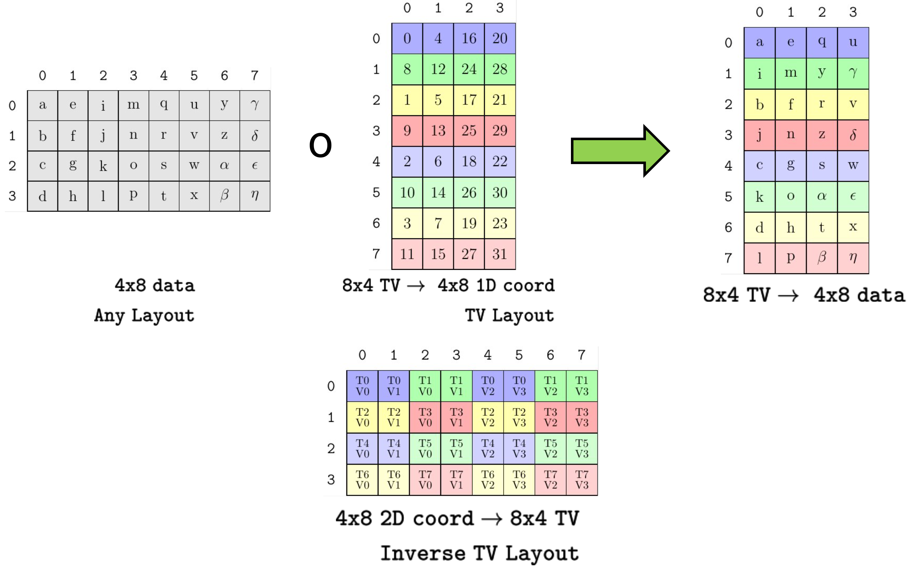

# CuTe Tensor（张量）

本文描述 CuTe 的核心容器 `Tensor`，它建立在先前介绍的 Layout（布局）概念之上。

本质上，`Tensor` 表示一个多维数组。它抽象了数组元素如何组织、如何存储的细节，使得用户可以编写对多维数组进行通用访问的算法，并能根据 `Tensor` 的特性对算法做 specialization。例如，可以根据 Tensor 的秩 (rank) 做分发，可以检查数据的 Layout，也可以验证数据类型。

`Tensor` 由两个模板参数表示：`Engine`（引擎）和 Layout。关于 Layout 的说明请参阅 [Layout 章节](./01_layout.md)。`Tensor` 提供与 Layout 相同的 shape 和访问运算符，并用 Layout 计算的结果来偏移和解引用 Engine 持有的随机访问迭代器。也就是说，数据的布局由 Layout 提供，实际数据由迭代器提供。这些数据可以位于任意内存中——全局内存、共享内存、寄存器——也可以即时转换或生成。

## 基本操作

CuTe `Tensor` 提供类似容器的元素访问操作。

* `.data()`。该 Tensor 持有的迭代器。

* `.size()`。该 Tensor 的逻辑总大小。

* `.operator[](Coord)`。访问逻辑坐标 `Coord` 对应的元素。

* `.operator()(Coord)`。访问逻辑坐标 `Coord` 对应的元素。

* `.operator()(Coords...)`。访问 `make_coord(Coords...)` 对应的元素。

CuTe `Tensor` 提供与 Layout 相似的层级操作核心：

* `rank<I...>(Tensor)`。Tensor 第 `I...` 个模式的秩 (rank)。

* `depth<I...>(Tensor)`。Tensor 第 `I...` 个模式的深度。

* `shape<I...>(Tensor)`。Tensor 第 `I...` 个模式的 Shape（形状）。

* `size<I...>(Tensor)`。Tensor 第 `I...` 个模式的大小。

* `layout<I...>(Tensor)`。Tensor 第 `I...` 个模式的 Layout。

* `tensor<I...>(Tensor)`。Tensor 第 `I...` 个模式对应的子张量。

## Tensor Engine

Engine 概念是对迭代器或数据数组的封装。它使用精简版的 `std::array` 接口来暴露迭代器。

```c++
using iterator     =  // The iterator type
using value_type   =  // The iterator value-type
using reference    =  // The iterator reference-type
iterator begin()      // The iterator
```

一般来说，用户不需要自行构造 Engine。构造 Tensor 时，会自动构造合适的 engine——通常是 `ArrayEngine<T,N>`、`ViewEngine<Iter>` 或 `ConstViewEngine<Iter>`。

### 带标签的迭代器

任何随机访问迭代器都可以用来构造 Tensor，但用户也可以为迭代器“打标签”以标明其内存空间——例如表示该迭代器访问的是全局内存或共享内存。调用 `make_gmem_ptr(g)` 或 `make_gmem_ptr<T>(g)` 可将 `g` 标记为全局内存迭代器，调用 `make_smem_ptr(s)` 或 `make_smem_ptr<T>(s)` 可将 `s` 标记为共享内存迭代器。

对内存打标签使得 CuTe 的 Tensor 算法可以为特定内存类型选用最快实现。在对 Tensor 调用非常具体的操作时，也允许这些操作根据预期验证标签。例如，某些优化拷贝操作要求拷贝源在全局内存、拷贝目标在共享内存，打标签使 CuTe 可以分发到这些拷贝操作或据此进行验证。

## Tensor 创建

Tensor 可以构造为持有型 (owning) 或非持有型 (nonowning)。

持有型 Tensor 行为类似 `std::array`。复制 Tensor 时会深拷贝其元素，其析构函数会释放元素数组。

非持有型 Tensor 行为类似（裸）指针。复制 Tensor 不会复制元素，销毁 Tensor 也不会释放元素数组。

这对编写通用 Tensor 算法的开发者有影响。例如，函数的输入 Tensor 参数应通过引用或 const 引用传递，因为按值传递 Tensor 可能深拷贝其元素，也可能不会。

### 非持有型 Tensor

Tensor 通常是对已有内存的非持有型视图。调用 `make_tensor` 并传入两个参数——一个随机访问迭代器，以及 Layout 或用于构造 Layout 的参数——即可创建非持有型 Tensor。

以下是一些创建非持有型内存视图 Tensor 的例子。

```cpp
float* A = ...;

// Untagged pointers
Tensor tensor_8   = make_tensor(A, make_layout(Int<8>{}));  // Construct with Layout
Tensor tensor_8s  = make_tensor(A, Int<8>{});               // Construct with Shape
Tensor tensor_8d2 = make_tensor(A, 8, 2);                   // Construct with Shape and Stride

// Global memory (static or dynamic layouts)
Tensor gmem_8s     = make_tensor(make_gmem_ptr(A), Int<8>{});
Tensor gmem_8d     = make_tensor(make_gmem_ptr(A), 8);
Tensor gmem_8sx16d = make_tensor(make_gmem_ptr(A), make_shape(Int<8>{},16));
Tensor gmem_8dx16s = make_tensor(make_gmem_ptr(A), make_shape (      8  ,Int<16>{}),
                                                   make_stride(Int<16>{},Int< 1>{}));

// Shared memory (static or dynamic layouts)
Layout smem_layout = make_layout(make_shape(Int<4>{},Int<8>{}));
__shared__ float smem[decltype(cosize(smem_layout))::value];   // (static-only allocation)
Tensor smem_4x8_col = make_tensor(make_smem_ptr(smem), smem_layout);
Tensor smem_4x8_row = make_tensor(make_smem_ptr(smem), shape(smem_layout), LayoutRight{});
```

如上所示，用户通过标明内存空间来包装指针：例如全局内存（通过 `make_gmem_ptr` 或 `make_gmem_ptr<T>`）或共享内存（通过 `make_smem_ptr` 或 `make_smem_ptr<T>`）。对已有内存的视图 Tensor 可以使用静态或动态 Layout。

对所有上述 tensor 调用 `print` 会显示：
```
tensor_8     : ptr[32b](0x7f42efc00000) o _8:_1
tensor_8s    : ptr[32b](0x7f42efc00000) o _8:_1
tensor_8d2   : ptr[32b](0x7f42efc00000) o 8:2
gmem_8s      : gmem_ptr[32b](0x7f42efc00000) o _8:_1
gmem_8d      : gmem_ptr[32b](0x7f42efc00000) o 8:_1
gmem_8sx16d  : gmem_ptr[32b](0x7f42efc00000) o (_8,16):(_1,_8)
gmem_8dx16s  : gmem_ptr[32b](0x7f42efc00000) o (8,_16):(_16,_1)
smem_4x8_col : smem_ptr[32b](0x7f4316000000) o (_4,_8):(_1,_4)
smem_4x8_row : smem_ptr[32b](0x7f4316000000) o (_4,_8):(_8,_1)
```

其中展示指针类型及内存空间标签、指针的 `value_type` 宽度、原始指针地址以及关联的 Layout。

### 持有型 Tensor

Tensor 也可以是持有型内存数组。通过调用 `make_tensor<T>` 创建持有型 Tensor，其中 `T` 为数组元素类型，再传入 Layout 或用于构造 Layout 的参数。数组按类似 `std::array<T,N>` 的方式分配，因此持有型 Tensor 必须用具有静态 shape 和静态 stride 的 Layout 构造。CuTe 不在 Tensor 中进行动态内存分配，因为这在 CUDA kernel 中并不常用且不利于性能。

以下是一些创建持有型 Tensor 的例子。

```c++
// Register memory (static layouts only)
Tensor rmem_4x8_col = make_tensor<float>(Shape<_4,_8>{});
Tensor rmem_4x8_row = make_tensor<float>(Shape<_4,_8>{},
                                         LayoutRight{});
Tensor rmem_4x8_pad = make_tensor<float>(Shape <_4, _8>{},
                                         Stride<_32,_2>{});
Tensor rmem_4x8_like = make_tensor_like(rmem_4x8_pad);
```

函数 `make_tensor_like` 创建一个与输入 Tensor 参数相同 value type 和 shape 的寄存器持有型 Tensor，并尽量采用相同的 stride 顺序。

对上述 tensor 调用 `print` 会产生类似的输出：

```
rmem_4x8_col  : ptr[32b](0x7fff48929460) o (_4,_8):(_1,_4)
rmem_4x8_row  : ptr[32b](0x7fff489294e0) o (_4,_8):(_8,_1)
rmem_4x8_pad  : ptr[32b](0x7fff489295e0) o (_4,_8):(_32,_2)
rmem_4x8_like : ptr[32b](0x7fff48929560) o (_4,_8):(_8,_1)
```

可见每个指针地址唯一，表明每个 Tensor 都是独立分配的类数组对象。

## 访问 Tensor

用户可以通过 `operator()` 和 `operator[]` 访问 Tensor 的元素，两者接受逻辑坐标的 IntTuple。

访问 Tensor 时，Tensor 使用其 Layout 将逻辑坐标映射为迭代器可访问的偏移。这可以从 Tensor 的 `operator[]` 实现中看到。

```c++
template <class Coord>
decltype(auto) operator[](Coord const& coord) {
  return data()[layout()(coord)];
}
```

例如，可以使用自然坐标、可变参数 `operator()` 或类似容器的 `operator[]` 读写 Tensor。

```c++
Tensor A = make_tensor<float>(Shape <Shape < _4,_5>,Int<13>>{},
                              Stride<Stride<_12,_1>,    _64>{});
float* b_ptr = ...;
Tensor B = make_tensor(b_ptr, make_shape(13, 20));

// Fill A via natural coordinates op[]
for (int m0 = 0; m0 < size<0,0>(A); ++m0)
  for (int m1 = 0; m1 < size<0,1>(A); ++m1)
    for (int n = 0; n < size<1>(A); ++n)
      A[make_coord(make_coord(m0,m1),n)] = n + 2 * m0;

// Transpose A into B using variadic op()
for (int m = 0; m < size<0>(A); ++m)
  for (int n = 0; n < size<1>(A); ++n)
    B(n,m) = A(m,n);

// Copy B to A as if they are arrays
for (int i = 0; i < A.size(); ++i)
  A[i] = B[i];
```

## 对 Tensor 做分块

[Layout 代数操作](https://github.com/NVIDIA/cutlass/blob/main/media/docs/cpp/cute/02_layout_algebra.md) 中的许多也可以应用到 Tensor 上。
```cpp
   composition(Tensor, Tiler)
logical_divide(Tensor, Tiler)
 zipped_divide(Tensor, Tiler)
  tiled_divide(Tensor, Tiler)
   flat_divide(Tensor, Tiler)
```
上述操作可以从 Tensor 中“分解”出任意子张量。这在针对线程组分块、针对 MMA 分块以及按线程重排数据块时极为常见。

注意，`_product` 操作并未为 Tensor 实现，因为那些操作往往会产生值域 (codomain) 更大的 layout，意味着 Tensor 需要访问其原先边界之外不可预测的远处元素。Layout 可以参与 product，但 Tensor 不行。

## 对 Tensor 做切片

用坐标访问 Tensor 会返回该张量的一个元素，而对 Tensor 做切片则返回被切片模式中所有元素的子张量。

切片通过用于访问单个元素的同一 `operator()` 完成。传入 `_`（下划线字符，即 `cute::Underscore` 类型的实例）的效果与 Fortran 或 Matlab 中的 `:`（冒号）相同：保留该模式，就像没有使用坐标一样。

对 tensor 做切片会执行两个操作：Layout 在部分坐标上求值，得到的偏移累加到迭代器中，新迭代器指向新 tensor 的起始位置; 坐标中 `_` 元素对应的 Layout 模式用于构造新的 layout。新迭代器和新 layout 共同构造新的 tensor。

```cpp
// ((_3,2),(2,_5,_2)):((4,1),(_2,13,100))
Tensor A = make_tensor(ptr, make_shape (make_shape (Int<3>{},2), make_shape (       2,Int<5>{},Int<2>{})),
                            make_stride(make_stride(       4,1), make_stride(Int<2>{},      13,     100)));

// ((2,_5,_2)):((_2,13,100))
Tensor B = A(2,_);

// ((_3,_2)):((4,1))
Tensor C = A(_,5);

// (_3,2):(4,1)
Tensor D = A(make_coord(_,_),5);

// (_3,_5):(4,13)
Tensor E = A(make_coord(_,1),make_coord(0,_,1));

// (2,2,_2):(1,_2,100)
Tensor F = A(make_coord(2,_),make_coord(_,3,_));
```


上图中，Tensor 以多种方式被切片，由这些切片生成的子张量在原张量中被高亮显示。注意张量 `C` 和 `D` 包含相同元素，但因使用 `_` 与使用 `make_coord(_,_)` 的不同而具有不同的秩和 shape。在每种情况下，结果的秩等于切片坐标中 `Underscore` 的数量。

## 对 Tensor 做分区

为实现 Tensor 的通用分区，我们先做 composition 或分块，再做切片。有多种实现方式，其中三种特别有用：内分区、外分区和 TV-layout 分区。

### 内分区与外分区

以分块后的例子看看如何做有用的切片。

```cpp
Tensor A = make_tensor(ptr, make_shape(8,24));  // (8,24)
auto tiler = Shape<_4,_8>{};                    // (_4,_8)

Tensor tiled_a = zipped_divide(A, tiler);       // ((_4,_8),(2,3))
```

假设要给每个线程块一块这样的 4x8 数据 tile。可以用线程块坐标索引第二个模式。

```cpp
Tensor cta_a = tiled_a(make_coord(_,_), make_coord(blockIdx.x, blockIdx.y));  // (_4,_8)
```

我们称之为*内分区*，因为它保留内层“tile”模式。先应用 tiler 再在 remainder 模式上索引得到 tile，这种模式很常见，已被封装为 `inner_partition(Tensor, Tiler, Coord)`。你常会看到 `local_tile(Tensor, Tiler, Coord)`，它只是 `inner_partition` 的别名。`local_tile` 分区器常在线程块级别使用，用于将 tensor 按线程块分区成 tile。

反过来，假设有 32 个线程，要给每个线程分配这些 4x8 tile 中的一个元素。可以用线程在第一个模式上索引。

```cpp
Tensor thr_a = tiled_a(threadIdx.x, make_coord(_,_)); // (2,3)
```

我们称之为*外分区*，因为它保留外层“rest”模式。先应用 tiler 再在 tile 模式上索引得到 tile，这种模式也很常见，已被封装为 `outer_partition(Tensor, Tiler, Coord)`。有时会看到 `local_partition(Tensor, Layout, Idx)`，这是 `outer_partition` 的秩敏感封装，它用 Layout 的逆将 `Idx` 转换为 `Coord`，然后以 Layout 的顶层 shape 构造 Tiler。这样用户可以用给定的 row-major、column-major 或任意 Layout 的线程 shape 来对 tensor 做分区。

更多分区模式用法见 [GEMM 入门教程](./0x_gemm_tutorial.md)。

### Thread-Value 分区

另一种常用分区策略叫 thread-value 分区。在这种模式中，我们构造一个 Layout，表示所有线程（或任意并行 agent）及每个线程将接收的值到目标数据坐标的映射。用 composition 将目标数据 layout 按 TV-layout 变换后，只需用线程索引对结果的 thread-mode 做切片即可。

```cpp
// Construct a TV-layout that maps 8 thread indices and 4 value indices
//   to 1D coordinates within a 4x8 tensor
// (T8,V4) -> (M4,N8)
auto tv_layout = Layout<Shape <Shape <_2,_4>,Shape <_2, _2>>,
                        Stride<Stride<_8,_1>,Stride<_4,_16>>>{}; // (8,4)

// Construct a 4x8 tensor with any layout
Tensor A = make_tensor<float>(Shape<_4,_8>{}, LayoutRight{});    // (4,8)
// Compose A with the tv_layout to transform its shape and order
Tensor tv = composition(A, tv_layout);                           // (8,4)
// Slice so each thread has 4 values in the shape and order that the tv_layout prescribes
Tensor  v = tv(threadIdx.x, _);                                  // (4)
```



上图是上述代码的可视化。任意 4x8 数据 layout 与表示分区模式的 8x4 TV-layout 复合。复合结果在右侧，每个线程的值按行排列。底部 layout 为 TV layout 的逆，展示了 4x8 逻辑坐标到线程 id 和 value id 的映射。

更多分区模式的构造与用法见 [MMA Traits 构建教程](./0t_mma_atom.md)。

## 示例

### 将子 tile 从全局内存拷贝到寄存器

下面的例子将矩阵的行（任意 Layout）从全局内存拷贝到寄存器，然后对寄存器中的行执行某个算法 `do_something`。

```c++
Tensor gmem = make_tensor(ptr, make_shape(Int<8>{}, 16));  // (_8,16)
Tensor rmem = make_tensor_like(gmem(_, 0));                // (_8)
for (int j = 0; j < size<1>(gmem); ++j) {
  copy(gmem(_, j), rmem);
  do_something(rmem);
}
```

这段代码无需了解 `gmem` 的 Layout，只需知道它是秩为 2 且第一模式有静态大小。以下代码在编译时检查这两个条件。

```c++
CUTE_STATIC_ASSERT_V(rank(gmem) == Int<2>{});
CUTE_STATIC_ASSERT_V(is_static<decltype(shape<0>(gmem))>{});
```

结合 [Layout 代数章节](./02_layout_algebra.md) 中详述的分块工具扩展此例，可以用几乎相同的代码拷贝 tensor 的任意子 tile。

```c++
Tensor gmem = make_tensor(ptr, make_shape(24, 16));         // (24,16)

auto tiler         = Shape<_8,_4>{};                        // 8x4 tiler
//auto tiler       = Tile<Layout<_8,_3>, Layout<_4,_2>>{};  // 8x4 tiler with stride-3 and stride-2
Tensor gmem_tiled  = zipped_divide(gmem, tiler);            // ((_8,_4),Rest)
Tensor rmem        = make_tensor_like(gmem_tiled(_, 0));    // ((_8,_4))
for (int j = 0; j < size<1>(gmem_tiled); ++j) {
  copy(gmem_tiled(_, j), rmem);
  do_something(rmem);
}
```

以上对全局内存 Tensor 应用静态 shape 的 Tiler，创建与该 tile shape 兼容的寄存器 Tensor，然后遍历每个 tile 将其拷贝到内存并执行 `do_something`。

## 总结

* Tensor 定义为 Engine 和 Layout 的组合。
    * Engine 是可偏移和解引用的迭代器。
    * Layout 定义 tensor 的逻辑定义域 (domain)，并将坐标映射到偏移。

* 用与 Layout 分块相同的方式对 Tensor 做分块。

* 对 Tensor 做切片以获取子张量。

* 分区 = 分块和/或 composition + 切片。

## Copyright

Copyright (c) 2017 - 2026 NVIDIA CORPORATION & AFFILIATES. All rights reserved.
SPDX-License-Identifier: BSD-3-Clause

```
  Redistribution and use in source and binary forms, with or without
  modification, are permitted provided that the following conditions are met:

  1. Redistributions of source code must retain the above copyright notice, this
  list of conditions and the following disclaimer.

  2. Redistributions in binary form must reproduce the above copyright notice,
  this list of conditions and the following disclaimer in the documentation
  and/or other materials provided with the distribution.

  3. Neither the name of the copyright holder nor the names of its
  contributors may be used to endorse or promote products derived from
  this software without specific prior written permission.

  THIS SOFTWARE IS PROVIDED BY THE COPYRIGHT HOLDERS AND CONTRIBUTORS "AS IS"
  AND ANY EXPRESS OR IMPLIED WARRANTIES, INCLUDING, BUT NOT LIMITED TO, THE
  IMPLIED WARRANTIES OF MERCHANTABILITY AND FITNESS FOR A PARTICULAR PURPOSE ARE
  DISCLAIMED. IN NO EVENT SHALL THE COPYRIGHT HOLDER OR CONTRIBUTORS BE LIABLE
  FOR ANY DIRECT, INDIRECT, INCIDENTAL, SPECIAL, EXEMPLARY, OR CONSEQUENTIAL
  DAMAGES (INCLUDING, BUT NOT LIMITED TO, PROCUREMENT OF SUBSTITUTE GOODS OR
  SERVICES; LOSS OF USE, DATA, OR PROFITS; OR BUSINESS INTERRUPTION) HOWEVER
  CAUSED AND ON ANY THEORY OF LIABILITY, WHETHER IN CONTRACT, STRICT LIABILITY,
  OR TORT (INCLUDING NEGLIGENCE OR OTHERWISE) ARISING IN ANY WAY OUT OF THE
  USE OF THIS SOFTWARE, EVEN IF ADVISED OF THE POSSIBILITY OF SUCH DAMAGE.
```
