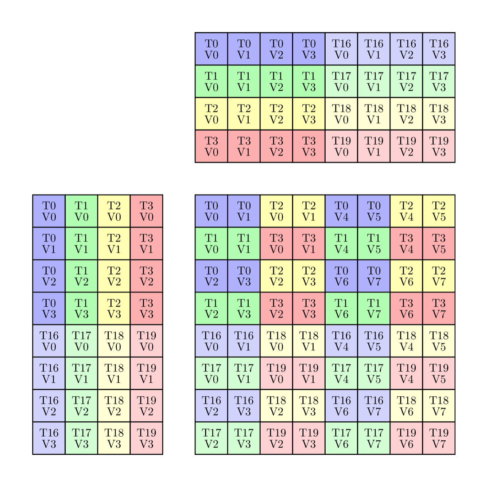
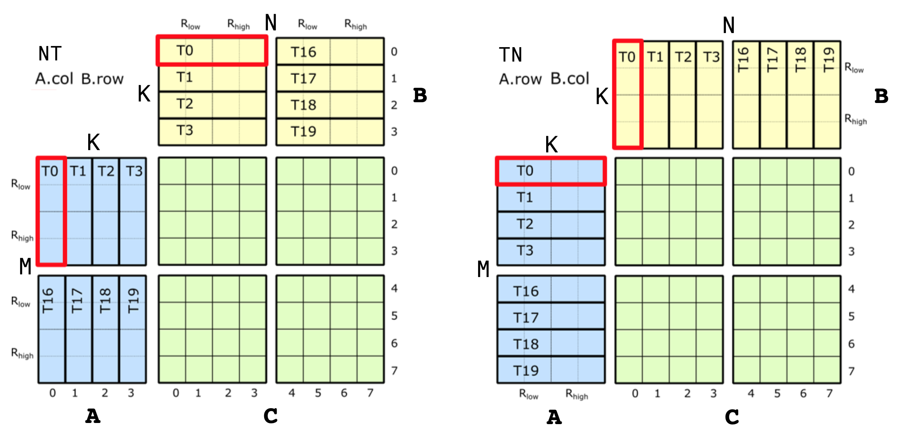
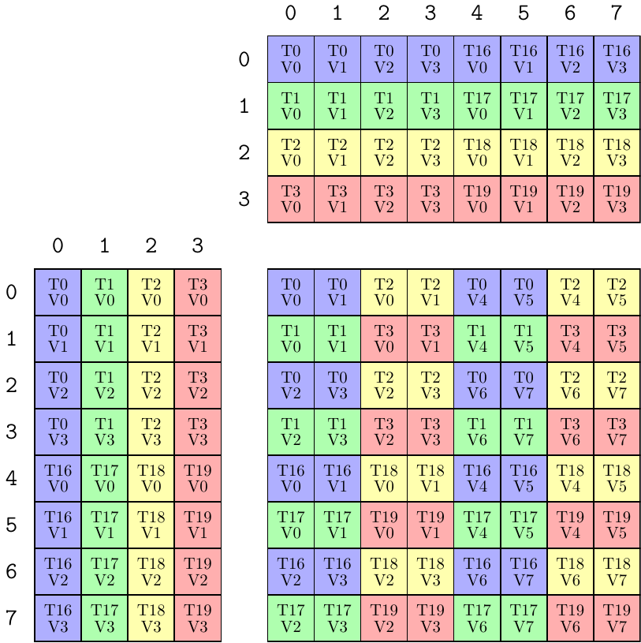
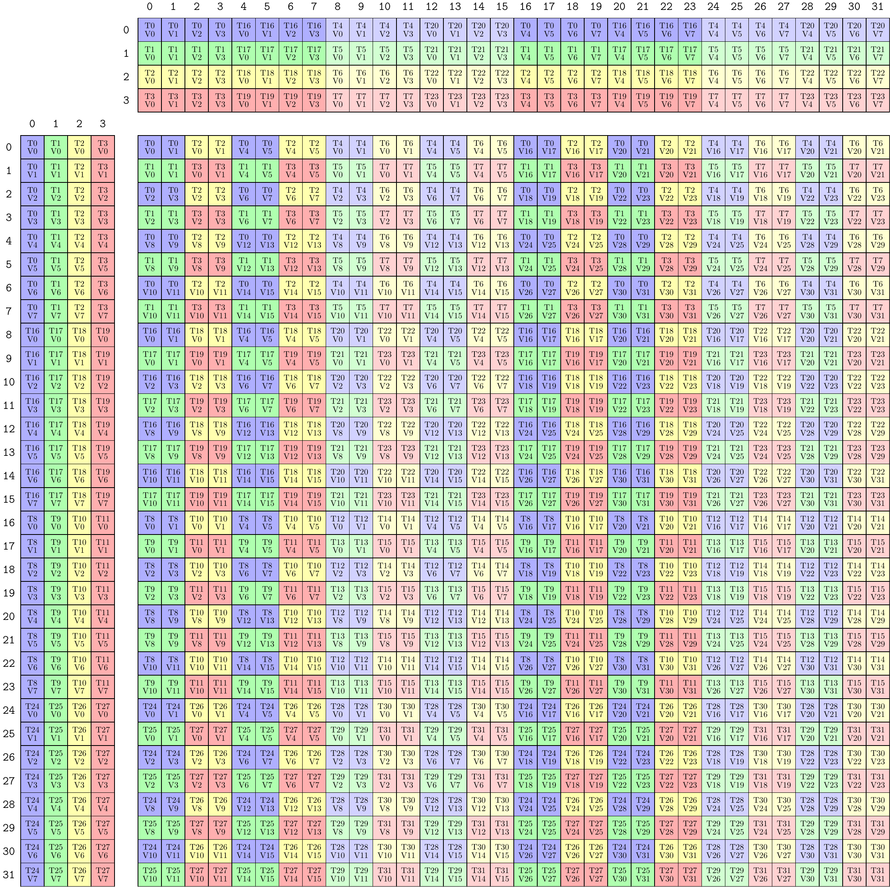

# CuTe 对矩阵乘累加指令的支持

本文档详细说明 CuTe 如何支持 GPU 的矩阵乘累加 (MMA) 硬件指令。

MMA 与架构相关。不同代 GPU 架构提供不同的 MMA 指令集合。不过，得益于 Layout（布局）等 CuTe 特性，可以将 MMA 暴露给通用 CUDA C++ 代码使用。实现分为以下几步。

1. 将每条 MMA 的 PTX 指令包装在一个 "Operation"（操作结构体）中。

2. 为每个 Operation 定义 "Traits"（特征结构体），其中包含使用该 Operation 所需的全部元信息。

3. 将上述二者组合后，"Atom"（原子操作）是 PTX Operation 与元信息 Traits 的组合，提供构造该 Operation 的 `cute::Tensor`（张量）fragment 的方法，以及在已有 `cute::Tensor` 上执行该 Operation 的方法。

4. 通过组合多个 Atom，TiledMMA 提供工具，用于通过创建 Atom 的 Layout 和交错来构建更复杂的分区模式。

## CuTe MMA Atoms

CuTe 将每个 MMA 以两个结构体形式暴露给通用 CUDA C++ 代码：一个 "Operation" 结构体，以及一个以 Operation 结构体类型为模板参数的 `MMA_Traits` 结构体。

"Operation" 结构体封装该操作的 PTX 指令，定义其参数与接口。Operation 结构体具有极少的软件依赖，不使用 layout、tensor 或非标准数值类型，仅描述指令的物理输入和输出。不同结构体有不同的名称，用于描述 MMA 指令的行为。下面会解释命名规则。

对应的 `MMA_Traits` 特化定义该 Operation 的元信息，例如逻辑计算类型、操作的逻辑形状 (Shape)，以及操作内线程和数据的 `Layout`。`MMA_Traits` 以 Operation 作为模板参数，CuTe 为其支持的每种 Operation 类型都提供了特化。

二者合在一起构成一个 "Atom"，将线程和数据布局的复杂性从 PTX 指令调用点中解耦。Atom 的 Traits 结构体暴露与单次 MMA 操作相关的信息，与其运行粒度无关。

CuTe MMA atom 暴露单次 MMA 操作的语义，无论在何种硬件层级执行。CuTe 支持多种硬件层级的 MMA atom，包括：

* 单线程（例如融合乘加 FMA 指令）; 

* quadpair（四线程对，Volta）; 

* 单 warp（Ampere）; 以及

* warpgroup（Hopper）。

### Operation 结构体

#### 文件位置

CuTe 在 [`include/cute/arch`](https://github.com/NVIDIA/cutlass/tree/main/include/cute/arch) 目录下提供 Operation 结构体，相关头文件以 `mma` 开头。

#### Operation 结构体命名

CuTe Operation 结构体的名称主要编码其封装的 PTX 指令，通常包括：

* 首次支持的架构，

* 接受的 M、N、K 维度，

* 接受的数据类型，以及

* 矩阵 A 和 B 的排列方式。

例如，下面 Volta 部分会提到 [`include/cute/arch/mma_sm70.hpp`](https://github.com/NVIDIA/cutlass/tree/main/include/cute/arch/mma_sm70.hpp) 中定义的 `SM70_8x8x4_F32F16F16F32_NT` Operation 结构体。

* "SM70" 指 Volta。

* "8x8x4" 指 M = 8、N = 8、K = 4，即 quadpair 所执行 MMA 的维度（见后文）。在 PTX 中对应 `.m8n8k4.`。

* "F32F16F16F32" 指四个矩阵操作数 A、B、C、D 的元素类型。MMA 计算 D = C + A * B，从左到右依次为：D 为 F32（`float`），A 为 F16（half），B 为 F16（half），C 为 F32（`float`）。PTX 指令名中对应 `.f32.f16.f16.f32`。

* "NT" 表示 PTX 指令针对 A 为 M 主序（未转置，列主序）、B 为 N 主序（已转置，行主序）设计。PTX 指令名中对应 `.col.row.`。

#### 内容

Operation 结构体包含以下成员。

##### 类型别名

Operation 结构体有四个公开类型别名：`DRegisters`、`ARegisters`、`BRegisters` 和 `CRegisters`。例如 [`include/cute/arch/mma_sm70.hpp`](https://github.com/NVIDIA/cutlass/tree/main/include/cute/arch/mma_sm70.hpp) 中定义的 `SM70_8x8x4_F32F16F16F32_NT` Operation 结构体定义如下。

```c++
using DRegisters = float[8];
using ARegisters = uint32_t[2];
using BRegisters = uint32_t[2];
using CRegisters = float[8];
```

这表示每个线程在 A、B、C、D 四个矩阵上分别传入 PTX 指令的值数量。对于该 Operation，每个线程为 C 和 D 各传 8 个 F32，为 A 和 B 各传 4 个 F16（即 `uint32_t[2]`; 两个 16 位 F16 被打包进两个 32 位 `uint32_t`）。

##### `fma` 静态成员设备函数

Operation 结构体定义公开的 `static void fma` 函数，并用 `CUTE_HOST_DEVICE` 宏标记（等价于添加 `__host__ __device__` 注解）。不同 Operation 根据 PTX MMA 指令定义不同数量的 `fma` 参数。实现通过宏保护 PTX 指令的使用，若宏未定义时调用 `fma` 会触发 `assert`。这样使用该 Operation 的 Atom 的测试和示例即使在 PTX 指令不可用时仍能编译。

### Traits

#### 文件位置

CuTe 在 [`include/cute/atom`](https://github.com/NVIDIA/cutlass/tree/main/include/cute/atom) 目录下提供 Traits 结构体，相关头文件以 `mma_traits` 开头。

#### 内容

`MMA_Traits` 特化定义以下公开类型别名。

* `ValTypeD`：D 矩阵的逻辑计算类型

* `ValTypeA`：A 矩阵的逻辑计算类型

* `ValTypeB`：B 矩阵的逻辑计算类型

* `ValTypeC`：C 矩阵的逻辑计算类型

* `Shape_MNK`：MMA 操作的逻辑 MxNxK 形状

* `ThrID`：单次 MMA 操作内的逻辑线程映射（指定线程、quadpair、warp 或 warpgroup 视图）

* `ALayout`：从 (thread,value) 对到 MxK 矩阵 A 坐标的映射

* `BLayout`：从 (thread,value) 对到 NxK 矩阵 B 坐标的映射

* `CLayout`：从 (thread,value) 对到 MxN 矩阵 C 坐标的映射

#### 示例

针对 `SM70_8x8x4_F32F16F16F32_NT` Operation 的 MMA_Traits 特化位于 [`include/cute/atom/mma_traits_sm70.hpp`](https://github.com/NVIDIA/cutlass/tree/main/include/cute/atom/mma_traits_sm70.hpp)，定义如下。

```c++
template <>
struct MMA_Traits<SM70_8x8x4_F32F16F16F32_NT>
{
  using ValTypeD = float;
  using ValTypeA = half_t;
  using ValTypeB = half_t;
  using ValTypeC = float;

  using Shape_MNK = Shape<_8,_8,_4>;
  using ThrID   = SM70_QuadPair;
  using ALayout = SM70_8x4_Col;
  using BLayout = SM70_8x4_Col;
  using CLayout = SM70_8x8_32b;
};
```

下一节会详细解释这些类型别名。

## Volta

本节及后续几节举例说明如何构造 MMA atom。我们不会覆盖所有 GPU 架构和 MMA，而是选取若干例子说明开发新 atom 的过程。

Volta 架构实现 HMMA 指令，由 8 个线程组成的 quadpair（QP）协作共享数据并执行 8x8x4（fp32 或 fp16）矩阵乘累加。（由于 warp 为 32 线程，4 个 QP 可完成 16x16x4 的 MMA。）

下面先看如何将 HMMA 指令的线程与数据分区 ISA 语义编码进 Traits 结构体。HMMA NT 指令的线程-数据布局如下。



### Types

上述 HMMA NT 使用以下类型：

```cpp
  using ValTypeD = float;
  using ValTypeA = half_t;
  using ValTypeB = half_t;
  using ValTypeC = float;
```

其余 `MMA_Traits` 将以上述类型为单位描述。

### Shape

上述 HMMA NT 的形状为 8x8x4：

```cpp
  // Logical shape of the MMA
  using Shape_MNK = Shape <_8,_8,_4>;
```

### Thread ID

若 warp 中的 32 个线程按 [0 ... 31] 逻辑索引，上图包含线程 [0,1,2,3]U[16,17,18,19]。这些线程构成第 0 个 quadpair。可以写一个线程映射，将 MMA 的 8 个逻辑线程 id [0,1,2,3,4,5,6,7] 映射到 warp 的 quadpair 线程索引 [0,1,2,3]U[16,17,18,19]。该 layout 函数有 4 个步幅为 1 的元素和 2 个步幅为 16 的元素，据此可写出表示 quadpair 的 layout：

```cpp
  // Mapping from (logical thread id) -> (thread idx)
  using ThrID = Layout<Shape <_4, _2>,
                       Stride<_1,_16>>;
```

该 layout 将 MMA 操作的逻辑线程 id [0,8) 映射到 warp 的 quadpair 线程索引 [0,4)U[16,20)。

### Accumulator Mapping

接下来看 QP 内 8 个线程如何映射到 A、B 和 C 矩阵。对于 C 和 D 矩阵，上图在下面进一步拆分。左侧为整个 QP 级视图，右侧仅为线程 0 拥有的值。


将这一单条指令级视图的元信息编码进 CuTe 正是我们的目标。图中 QP 级视图对应 [SM70_F32F16F16F32](https://github.com/NVIDIA/cutlass/tree/main/include/cute/arch/mma_sm70.hpp) 的四个 MMA traits，这些结构体包含 `Element` 类型、`Shape_MNK` 以及上文构造的 `ThrID` 映射。下面看累加器线程-数据布局 `CLayout` 的定义。`CLayout` 的作用是构造 `(logical_thr_id, logical_val_id)` 与 C 矩阵 `(m, n)` 坐标之间的映射，进而可用来构建更复杂的布局和操作，例如 16x16x4 WMMA。

可从上图开始构造 `CLayout`。与任意 CuTe layout 一样，它是 `Shape` 与对应 `Stride` 的二元组。先看 shape。HMMA 使用 8 个线程，每个拥有 8 个值，因此映射的 shape 必须在两个 mode 上大小均为 8。于是有：

```cpp
  // (T8,V8) -> (m,n)
  using CLayout = Layout<Shape <_8, _8>,
                         Stride<_?, _?>;  // Stride to be filled in below
```

注意不要与 C 矩阵的逻辑 8x8 shape 混淆，这里是 8 线程 x 8 值。现在需要将这些映射到 (m,n) 坐标。由于 CuTe layout 返回索引而不是坐标，我们选择 (m,n) 的列主序编码：

```
(logical_thr_id, logical_val_id) -> (m, n) == m + n * M
```

在此基础上可以开始构造 `CLayout` 的 stride。先看线程间的 stride。注意：
* `(T0,V0)` 位于 `(m,n) = (0,0) = 0`
* `(T1,V0)` 位于 `(m,n) = (1,0) = 1`
* `(T2,V0)` 位于 `(m,n) = (0,2) = 16`
* `(T3,V0)` 位于 `(m,n) = (1,2) = 17`
* `(T4,V0)` 位于 `(m,n) = (4,0) = 4`
* `(T5,V0)` 位于 `(m,n) = (5,0) = 5`
* `(T6,V0)` 位于 `(m,n) = (4,2) = 20`
* `(T7,V0)` 位于 `(m,n) = (5,2) = 21`

其中 `T4`、`T5`、`T6`、`T7` 是 MMA 的第 4、5、6、7 个逻辑线程 id，对应 warp 的线程索引 16、17、18、19（见 `ThrID` 映射）。

该模式可写成一个 layout。8 个线程的位置可由下式得到：

```cpp
  using CLayout = Layout<Shape <Shape <_2,  _2, _2>, _8>,
                         Stride<Stride<_1, _16, _4>, _?>;
```

用同样方式可构造沿 `logical value id` mode 的 stride。
* `(T0,V0)` 位于 `(m,n) = (0,0) = 0`
* `(T0,V1)` 位于 `(m,n) = (0,1) = 8`
* `(T0,V2)` 位于 `(m,n) = (2,0) = 2`
* `(T0,V3)` 位于 `(m,n) = (2,1) = 10`
* `(T0,V4)` 位于 `(m,n) = (0,4) = 32`
* `(T0,V5)` 位于 `(m,n) = (0,5) = 40`
* `(T0,V6)` 位于 `(m,n) = (2,4) = 34`
* `(T0,V7)` 位于 `(m,n) = (2,5) = 42`

该模式同样可写成 layout。8 个值的位置可由下式得到：

```cpp
  // (T8,V8) -> (m,n)
  using CLayout = Layout<Shape <Shape <_2, _2,_2>, Shape <_2,_2, _2>>,
                         Stride<Stride<_1,_16,_4>, Stride<_8,_2,_32>>>;
```

至此即可验证，该 layout 中每个 `(tid,vid)` 坐标都正确映射到对应的（编码后）`(m,n)` 坐标。

对于 F16 累加器，layout 要简单得多。每行累加器 `(m, :)` 由单个线程持有，因此 layout 为：

```cpp
  using CLayout = Layout<Shape <_8,_8>,
                         Stride<_1,_8>>;
```

### A 和 B Layout 映射

A 和 B 的 layout 取决于源矩阵是否转置。下图展示 NT 和 TN 情况下 A、B 矩阵的线程 ID 到数据归属映射。



先看 A 矩阵的 TN layout（图中右侧）。同样是 8 个逻辑线程，但每个线程只拥有 4 个元素。`ALayout` 的 shape 为 `Shape<_8, _4>`。stride 方面，需要建立 `(m, k) == m + k * M` 的类似映射。沿 M mode 看，从 `(T0, V0)` 到 `(T1, V0)`，8 个线程的 stride 均为 1。沿 K mode，从 `(T0, V0)` 到 `(T0, V1)`，4 个值的 stride 均为 8。因此 A 的 layout 为：

```cpp
  // (T8,V4) -> (m,k)
  using ALayout = Layout<Shape <_8,_4>,
                         Stride<_1,_8>>;
```

TN HMMA 的 B layout 构造方式类似，为方便起见写成 `(N,K)` 而非 `(K,N)`。沿 N mode，从 `(T0, V0)` 到 `(T1, V0)`，8 个线程的 stride 为 1。沿 K mode，从 `(T0, V0)` 到 `(T0, V1)`，4 个值的 stride 为 8。故 B 的 layout 与 A 相同：

```cpp
  // (T8,V4) -> (n,k)
  using BLayout = Layout<Shape <_8,_4>,
                         Stride<_1,_8>>;
```

NT 情形下的 layout 稍复杂（图中左侧）。沿 A 的 M mode，先看到 `T0` 的四个值，再看到 `T4` 的四个值，即 4 个值的 stride 为 1，然后从 `T0` 到 `T4` 的 stride 为 4，因此 M mode 上有两个子 stride。沿 K mode，`val_id` 不变，`thr_id` 递增，4 个线程的 stride 为 8。于是 A 的 layout 为：

```cpp
  // (T8,V4) -> (m,k)
  using ALayout = Layout<Shape <Shape <_4,_2>,_4>,
                         Stride<Stride<_8,_4>,_1>>;
```

B 在 `(N,K)` 顺序下 layout 相同。

```cpp
  // (T8,V4) -> (n,k)
  using BLayout = Layout<Shape <Shape <_4,_2>,_4>,
                         Stride<Stride<_8,_4>,_1>>;
```

NN 和 TT 转置情形下，layout 只是上述 A 和 B 两种 layout 的组合。

## Hopper

下面看 Hopper 架构首次引入的、规模更大的 GMMA（Group MMA）操作。这些 MMA 指令在 128 个线程（4 个 warp）的粒度上执行，统称为 warpgroup。

### Thread ID

Hopper GMMA 的线程 ID 按简单的一维连续 layout 分配，`ThrID` 因此很直接：

```cpp
using ThrID = Layout<_128, _1>;
```

### Accumulator Mapping

GMMA 中累加器是分层映射的，从 core matrix 概念出发，逐步构建整个 C 矩阵 tile 的 layout。先看 core matrix。此处只考虑 fp16 累加器，fp32 累加器的扩展方式类似，后文会说明。

每个 core matrix 的 layout 如下图所示。


与 Volta 示例一样，线程 ID 仅为逻辑上的，它们属于 warpgroup 中四个 warp 的哪一个无关紧要。

然后 GMMA 沿 M mode 先在垂直方向对 core matrix 进行 tile，再沿 N mode 将该列 core matrix 复制，以构建完整的 MxN tile。该 tiling 如下图。


有了该图，可以开始构建 `SM90_64x128x16_F16F16F16F16_TN` atom 的 `CLayout`。与之前相同，我们在 `(logical_thr_id, logical_val_id) -> (m, n)` 坐标空间之间建立映射。

先从少数几个线程和值开始追踪。可看到它们沿 N-mode 排列，值为成对、线程为 4 个一组。于是有：

```cpp
// (T128,V4) -> (M64,N8)
using CLayout = Layout<Shape <Shape <  _4, ...>, Shape < _2, ...>>,
                       Stride<Stride<_128, ...>, Stride<_64, ...>>>;
```

为完成第一个 8x8 core matrix，4 个线程沿 M-mode 向下重复 8 次：

```cpp
// (T128,V4) -> (M64,N8)
using CLayout = Layout<Shape <Shape <  _4, _8, ...>, Shape < _2, ...>>,
                       Stride<Stride<_128, _1, ...>, Stride<_64, ...>>>;
```

接着进入下一个 core matrix，回到 `T0`，但这次是 `(T0, V2)`：

```cpp
// (T128,V4) -> (M64,N8)
using CLayout = Layout<Shape <Shape <  _4, _8, ...>, Shape < _2, _2>>,
                       Stride<Stride<_128, _1, ...>, Stride<_64, _8>>>;
```

最终，该模式沿 M-mode 从 `(m,n) = (16,0) = 16` 开始重复 4 次，每次对应一个 warp，同一 warp 的四个 core matrix 垂直堆叠。因此 `thrID` 最后一个 sub-mode 的大小为 4（四个 warp），stride 为 `16`（到达坐标 `(16,0) = 16`）。

```cpp
// (T128,V4) -> (M64,N8)
using CLayout = Layout<Shape <Shape <  _4, _8,  _4>, Shape < _2, _2>>,
                       Stride<Stride<_128, _1, _16>, Stride<_64, _8>>>;
```

这就是 64x8 累加器的完整 `CLayout`。GMMA 指令包括 64xN 变体，其中 N = [16,32,64,128,256]，该 64x8 模式会重复，给每个线程更多值。由于从 `(m,n) = (0,8) = 512` 开始，在 `CLayout` 中容易处理。例如 64x128 的 `CLayout` 为：

```cpp
// (T128,V64) -> (M64,N128)
using CLayout = Layout<Shape <Shape <  _4, _8,  _4>, Shape < _2, _2,  _16>>,
                       Stride<Stride<_128, _1, _16>, Stride<_64, _8, _512>>>;
```

其中 64x8 tile 被复制 16 次。

### A 和 B Layout 映射

直接从共享内存读取 A 和 B 源的 GMMA atom 有一些特点。GMMA Descriptor（描述符）是在共享内存中整个 A 和/或 B tile 上构造的，而不是按线程划分。即每个线程看到整个 tile，且 tile 不会重排以便在其上构造 descriptor。用 `ALayout` 形式可表示为：

```cpp
// (T128,V64x16) -> (M64,K16)
using ALayout = Layout<Shape <_128, Shape <_64,_16>>,
                       Stride<  _0, Stride< _1,_64>>>;
```

也就是说，所有线程映射到 `(m,k) = (0,0) = 0` 元素，值（及其 shape）不变。GMMA Descriptor Constructor 可检查该数据的 `(M,K)` layout，创建合适的 GMMA Descriptor，或在数据 layout 与 GMMA 不兼容时产生错误信息。

## TiledMMA

通过组合和交错多个 atom，可以构建更复杂的模式。

从 `SM70_8x8x4_F32F16F16F32_NT` 开始。
```cpp
MMA_Atom mma = MMA_Atom<SM70_8x8x4_F32F16F16F32_NT>{};
print_latex(mma);
```


上述等价于
```cpp
    TiledMMA mma = make_tiled_mma(SM70_8x8x4_F32F16F16F32_NT{},
                                  Layout<Shape<_1,_1,_1>>{},   // Layout of Atoms
                                  Tile<_8,_8,_4>{});           // Tiler
    print_latex(mma);
```
因为只有一个 atom，其自然 tile 大小为 8x8x4。

使用四个 quadpair MMA 可构造类似 WMMA 的对象：
```cpp
    TiledMMA mma = make_tiled_mma(SM70_8x8x4_F32F16F16F32_NT{},
                                  Layout<Shape <_2,_2>,
                                         Stride<_2,_1>>{});   // 2x2 n-major layout of Atoms
    print_latex(mma);
```

该 TiledMMA 在线程上复制 MMA_Atom，可见 C 矩阵中此前未使用的 `T4`、`T8`、`T12` 等线程。C 矩阵的每个象限都是 atom 分区模式在新 quadpair 上的副本，该复制按 `(2,2):(2,1)` layout 进行。

以上表示 16x16x4 的 MMA，但可立即将 "tile size" 扩展到 32x32x4：
```cpp
    TiledMMA mma = make_tiled_mma(SM70_8x8x4_F32F16F16F32_NT{},
                                  Layout<Shape <_2,_2>,
                                         Stride<_2,_1>>{},  // 2x2 n-major layout of Atoms
                                  Tile<_32,_32,_4>{});      // 32x32x4 tiler
    print_latex(mma);
```

该 TiledMMA 在值而非线程上复制前一个 TiledMMA。可见 C 矩阵中此前未使用的 `T0V8`、`T16V8`、`T8V8` 等值。C 矩阵的每个象限都是前一 TiledMMA 分区模式在新值集合上的副本。

继续看，`T0` 从 A 矩阵接收 8 个值，这些读取位于坐标：
```
T0V0 => ( 0,0)
T0V1 => ( 1,0)
T0V2 => ( 2,0)
T0V3 => ( 3,0)
T0V4 => (16,0)
T0V5 => (17,0)
T0V6 => (18,0)
T0V7 => (19,0)
```
这些坐标是分散的，但可能更希望它们相邻。即对 M-mode 做置换，得到另一个合法的 TiledMMA。

```cpp
    TiledMMA mma = make_tiled_mma(SM70_8x8x4_F32F16F16F32_NT{},
                                  Layout<Shape <_2,_2>,
                                         Stride<_2,_1>>{},       // 2x2 n-major layout of Atoms
                                  Tile<Layout<Shape <_4,_4,_2>,
                                              Stride<_1,_8,_4>>, // Permutation on M, size 32
                                       _32,                      // Permutation on N, size 32 identity
                                       _4>{});                   // Permutation on K, size 4 identity
    print_latex(mma);
```


该 layout `(4,4,2):(1,8,4)` 类似 scatter 置换，表示原图中 m 坐标在新图中的位置。
```
old m-coord:  0  1  2  3  4  5  6  7  8  9 10 11 12 13 14 15 16 17 18 19 20 21 22 23 24 25 26 27 28 29 30 31
new m-coord:  0  1  2  3  8  9 10 11 16 17 18 19 24 25 26 27  4  5  6  7 12 13 14 15 20 21 22 23 28 29 30 31
```
这仅对 M-mode（以及相应地 A 和 C）做置换，使所有线程对 A 矩阵 m 坐标的访问连续，便于设计共享内存或寄存器的 layout。图中 MMA 指令在逻辑 m 坐标上 effectively 交错。当然，对 N-mode 和 K-mode 做置换同样合法。

关于这些 TiledMMA 如何用于划分数据 tensor，参见 [`0x_gemm_tutorial.md`](./0x_gemm_tutorial.md)。

## Copyright

Copyright (c) 2017 - 2026 NVIDIA CORPORATION & AFFILIATES. All rights reserved.
SPDX-License-Identifier: BSD-3-Clause

```
  Redistribution and use in source and binary forms, with or without
  modification, are permitted provided that the following conditions are met:

  1. Redistributions of source code must retain the above copyright notice, this
  list of conditions and the following disclaimer.

  2. Redistributions in binary form must reproduce the above copyright notice,
  this list of conditions and the following disclaimer in the documentation
  and/or other materials provided with the distribution.

  3. Neither the name of the copyright holder nor the names of its
  contributors may be used to endorse or promote products derived from
  this software without specific prior written permission.

  THIS SOFTWARE IS PROVIDED BY THE COPYRIGHT HOLDERS AND CONTRIBUTORS "AS IS"
  AND ANY EXPRESS OR IMPLIED WARRANTIES, INCLUDING, BUT NOT LIMITED TO, THE
  IMPLIED WARRANTIES OF MERCHANTABILITY AND FITNESS FOR A PARTICULAR PURPOSE ARE
  DISCLAIMED. IN NO EVENT SHALL THE COPYRIGHT HOLDER OR CONTRIBUTORS BE LIABLE
  FOR ANY DIRECT, INDIRECT, INCIDENTAL, SPECIAL, EXEMPLARY, OR CONSEQUENTIAL
  DAMAGES (INCLUDING, BUT NOT LIMITED TO, PROCUREMENT OF SUBSTITUTE GOODS OR
  SERVICES; LOSS OF USE, DATA, OR PROFITS; OR BUSINESS INTERRUPTION) HOWEVER
  CAUSED AND ON ANY THEORY OF LIABILITY, WHETHER IN CONTRACT, STRICT LIABILITY,
  OR TORT (INCLUDING NEGLIGENCE OR OTHERWISE) ARISING IN ANY WAY OUT OF THE USE
  OF THIS SOFTWARE, EVEN IF ADVISED OF THE POSSIBILITY OF SUCH DAMAGE.
```
